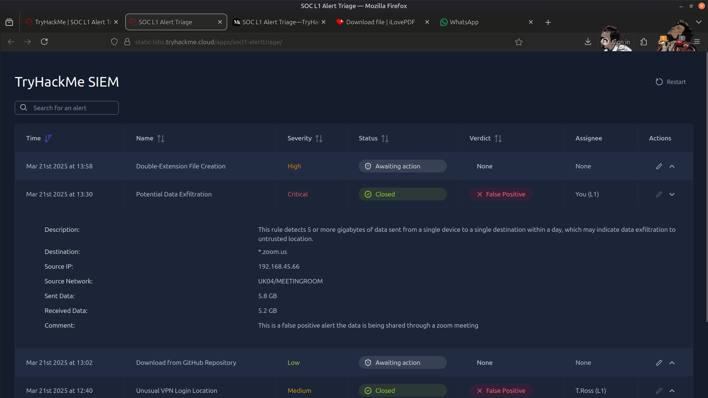
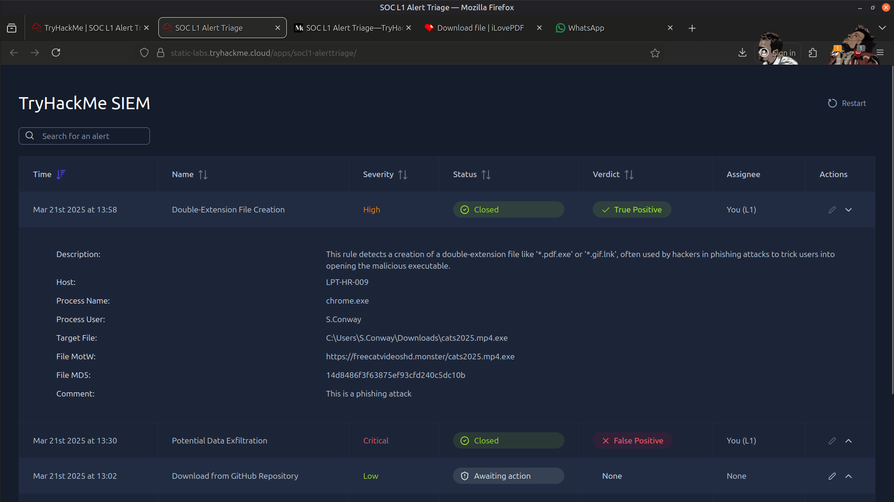
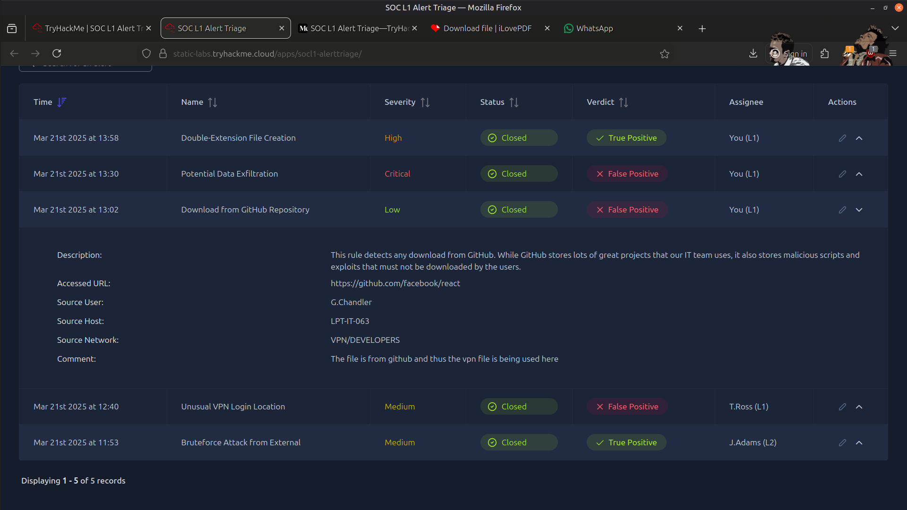
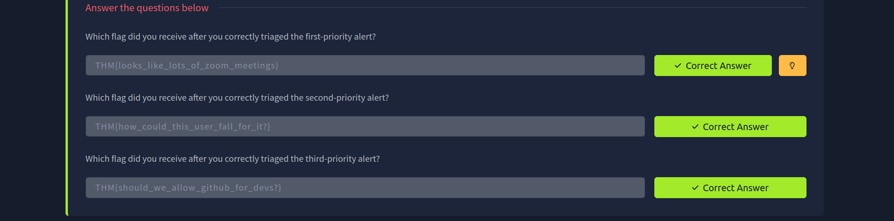

# 🚨 Alert Handling – SIEM Investigation

## 📖 Overview

In this lab, I investigated multiple security alerts within a SIEM environment to determine whether they represented genuine security threats or legitimate user activity. Each alert was analyzed using available evidence, supporting logs, and contextual information before assigning a final analyst verdict.

The exercise focused on developing practical SOC analyst skills in alert triage, evidence-based decision making, and security documentation.

---

## 🎯 Objectives

- Investigate security alerts within a SIEM platform.
- Differentiate between True Positive and False Positive alerts.
- Analyze supporting logs and contextual evidence.
- Document investigation findings using SOC best practices.
- Recommend response actions for confirmed threats.

---

## 🛠️ Tools Used

- 📊 SIEM Platform
- 📄 Security Logs
- 🔍 Alert Investigation Interface

---

## 🔬 Investigation Summary

### 🔍 1. Large Data Transfer Investigation

Investigated a large outbound data transfer alert by reviewing:

- Destination service
- Source device
- Network location
- Data transfer volume
- User context

**Analyst Verdict:** False Positive

The activity was consistent with legitimate Zoom video conferencing traffic generated from a meeting room environment.

---

### 📁 2. Double-Extension Executable Investigation

Analyzed a suspicious file download to determine:

- File naming conventions
- Download source
- User activity
- Process responsible for the download
- Malware delivery indicators

**Analyst Verdict:** True Positive

The investigation identified a malicious executable masquerading as a media file using a double-extension filename, a common phishing and malware delivery technique.

---

### 🌐 3. GitHub Download Investigation

Reviewed a GitHub download alert by examining:

- Repository accessed
- User role
- Device context
- Network location
- Business justification

**Analyst Verdict:** False Positive

The activity represented legitimate software development activity involving an official GitHub repository.

---

## 🚨 Findings

The investigation demonstrated the importance of combining technical evidence with organizational context during SOC alert triage.

Evidence collected during the investigation revealed:

- 📹 Legitimate business activity can generate alerts that require contextual analysis.
- 📁 Double-extension executables remain a common indicator of malware delivery.
- 💻 User role and business function are critical when validating suspicious activity.
- ⚖️ Accurate alert triage helps reduce false positives while ensuring genuine threats receive appropriate attention.

---

## 📸 Screenshots

### Alert 1 – Large Data Transfer

---

### Alert 2 – Double-Extension Executable

---

### Alert 3 – GitHub Download

---

### Result

---

## 📚 Key Learnings

- Effective SOC investigations rely on both technical evidence and business context.
- Not every security alert represents malicious activity, making accurate triage essential.
- File naming techniques such as double extensions remain common malware delivery methods.
- User roles and expected behavior help distinguish legitimate activity from potential threats.
- Clear documentation supports consistent decision-making and efficient incident response.

---

## 📚 Skills Gained

- 📊 SIEM Alert Investigation
- 🔍 Alert Triage
- 📄 Log Analysis
- 🛡️ Threat Detection
- ⚖️ True Positive & False Positive Classification
- 📁 Malware Delivery Analysis
- 📝 Security Documentation
- 🚨 Incident Investigation
- 🧠 Analytical Thinking
- 🛡️ SOC Operations

---

> QXV0aG9yOiBodHRwczovL2dpdGh1Yi5jb20vSEctNzU=

