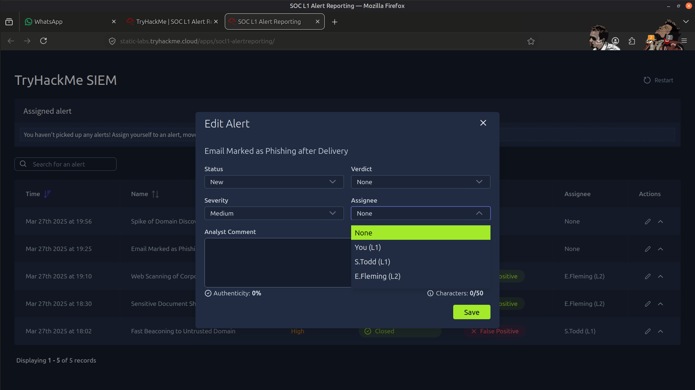
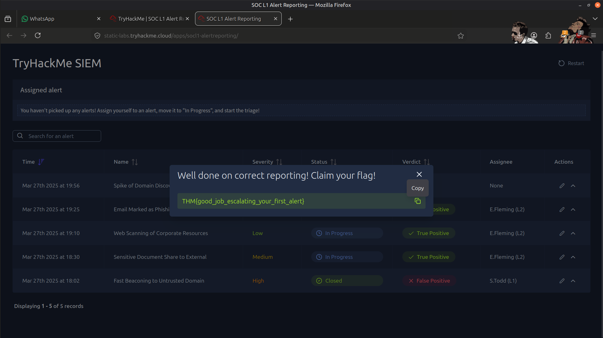
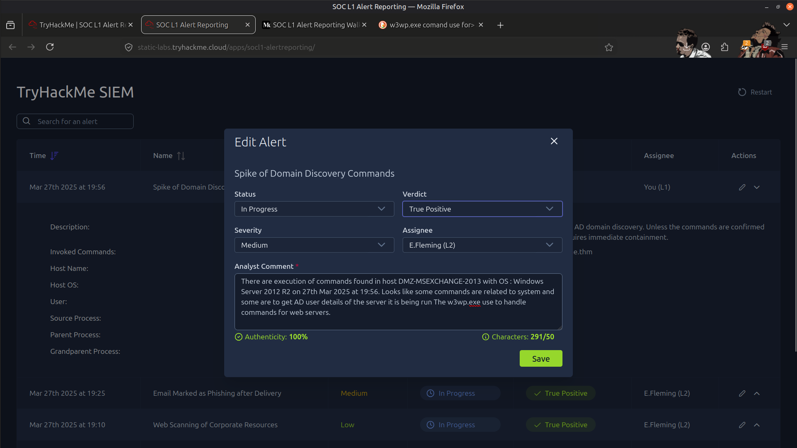
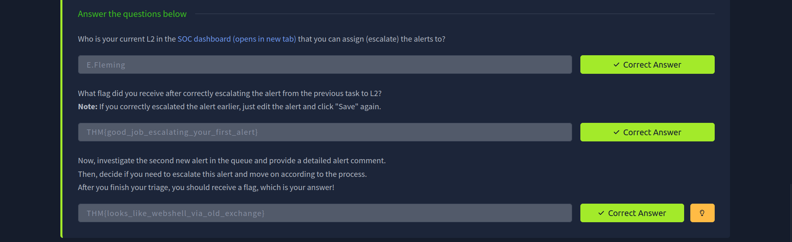

# 🚨 Escalation Guide (SOC L1 → L2 Process)

## 📖 Overview

In this lab, I followed the alert escalation workflow used in a Security Operations Center (SOC) to understand when and how an L1 SOC Analyst escalates security incidents to an L2 Analyst. The exercise focused on alert triage, documentation, escalation procedures, and communication between SOC teams while following standard incident handling practices.

---

## 🎯 Objectives

- Understand the responsibilities of an L1 SOC Analyst during alert triage.
- Determine when alerts require escalation to L2.
- Document investigation findings using clear, evidence-based reporting.
- Follow the standard SOC escalation workflow.
- Understand communication between L1, L2, and Incident Response teams.

---

## 🛠️ Tools Used

- 🚨 SOC Alert Management Platform
- 📝 Alert Documentation Interface
- 💬 Internal Communication Workflow

---

## 🔬 Investigation Summary

### 🔍 1. Alert Triage

Performed initial investigation by:

- Reviewing alert details
- Collecting supporting evidence
- Determining the alert severity
- Classifying alerts as True Positive or False Positive

---

### 📝 2. Investigation Documentation

Documented findings by:

- Recording evidence
- Explaining the investigation process
- Providing a clear analyst verdict
- Writing investigation comments for future reference

---

### 🔼 3. Escalation Decision

Evaluated whether the alert required escalation based on:

- Confirmed malicious activity
- Need for deeper technical investigation
- Required remediation actions
- Incident severity
- Analyst confidence and available evidence

---

### 🤝 4. Alert Escalation Workflow

When escalation was required, followed the SOC workflow by:

- Updating the alert status
- Assigning the case to an L2 Analyst
- Notifying the next response team
- Providing complete investigation notes
- Ensuring sufficient evidence was attached

---

### 🛡️ 5. SOC Response Process

Reviewed how L2 analysts continue investigations by:

- Validating L1 findings
- Performing advanced investigations
- Coordinating remediation activities
- Initiating incident response when necessary

---

## 🚨 Findings

The exercise demonstrated the importance of structured alert triage and proper escalation procedures within a Security Operations Center.

Key observations included:

- 🔍 Evidence-based alert validation
- 📝 Clear investigation documentation
- 🔼 Appropriate escalation decision-making
- 🤝 Effective communication between SOC analysts
- 🛡️ Structured incident handling workflows

---

## 📸 Evidence

### Current L2

---

### Flag 1

---

### Flag 2

---

### Result

---

## 📚 Key Learnings

- Effective SOC operations depend on consistent alert triage and thorough documentation.
- Escalation decisions should be based on evidence, investigation findings, and organizational procedures.
- Clear communication between L1 and L2 analysts improves investigation efficiency and incident response.
- Complete investigation notes enable higher-tier analysts to continue investigations without unnecessary delays.
- Asking for assistance when uncertain is an important part of maintaining accurate and effective SOC operations.

---

## 📚 Skills Gained

- 🚨 SOC Alert Triage
- 🔍 Security Alert Investigation
- 📝 Incident Documentation
- 🔼 Alert Escalation
- 🛡️ Incident Response Workflow
- 🤝 SOC Communication
- 📊 Security Operations
- ⚖️ Threat Validation
- 📄 Evidence Collection
- 🧠 Security Decision Making

---

> QXV0aG9yOiBodHRwczovL2dpdGh1Yi5jb20vSEctNzU=