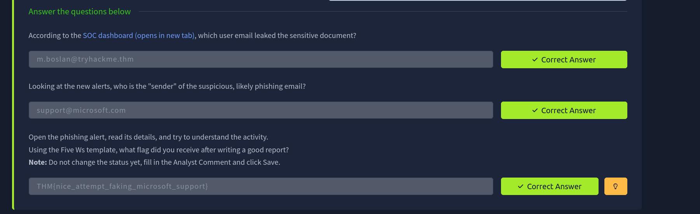

# 🛡️ SOC Alert Reporting Guide

## 📖 Overview

In this lab, I practiced documenting security alerts using the reporting workflow followed by SOC Level 1 (L1) Analysts. The exercise focused on creating structured, evidence-based incident reports that clearly communicate investigation findings and support efficient incident handling by higher-tier analysts.

---

## 🎯 Objectives

- Understand the importance of structured SOC alert reporting.
- Apply the Five Ws methodology to document security incidents.
- Investigate phishing-related alerts.
- Produce clear, evidence-based analyst reports.
- Improve technical communication and documentation skills.

---

## 🛠️ Tools Used

- 🛡️ TryHackMe SOC Simulator
- 📝 Alert Reporting Interface

---

## 🔬 Investigation Summary

### 📖 1. Understanding the Five Ws

Applied the Five Ws framework to structure investigation reports by documenting:

- **Who** – User involved in the activity
- **What** – Suspicious activity observed
- **When** – Timeline of events
- **Where** – Host, IP address, or domain involved
- **Why** – Investigation findings and final analyst verdict

---

### 📧 2. Phishing Investigation

Investigated phishing-related alerts to identify:

- Suspicious sender information
- Indicators of compromise (IOCs)
- Evidence supporting the investigation
- Overall legitimacy of the alert

---

### 📝 3. Security Report Creation

Documented investigation findings by:

- Recording relevant evidence
- Explaining the investigation process
- Supporting conclusions with observations
- Producing a structured analyst report

---

### ✅ 4. Investigation Validation

Validated the completed report by:

- Confirming investigation accuracy
- Reviewing supporting evidence
- Completing the reporting exercise
- Successfully resolving the simulated alert

---

## 🚨 Findings

The exercise demonstrated how structured reporting improves communication within a Security Operations Center.

Key observations included:

- 📧 Phishing indicators were successfully identified and documented.
- 📝 Structured reporting preserved the complete investigation context.
- 🔍 Evidence-based documentation supported the analyst's conclusions.
- 🤝 Clear reports enable faster review and escalation by higher-tier analysts.

---

## 📸 Screenshots

All steps of the investigation and reporting process are documented with screenshots in this repository.

- SOC dashboard analysis
- Alert investigation
- Report writing process
- Final flag confirmation

---

### Result

---

## 📚 Key Learnings

- Effective incident reporting is a critical responsibility of SOC analysts.
- Well-structured reports improve collaboration between L1 and L2 analysts.
- The Five Ws framework helps ensure investigations are complete and easy to understand.
- Evidence-based reporting provides clear justification for investigation outcomes.
- Strong technical communication is as important as identifying malicious activity during incident response.

---

## 📚 Skills Gained

- 🛡️ SOC Alert Reporting
- 📧 Phishing Investigation
- 📝 Incident Documentation
- 🔍 Evidence Collection
- 📊 Security Analysis
- 📄 Technical Communication
- ⚖️ Threat Validation
- 🧠 Analytical Thinking
- 🚨 SOC Operations

---

> QXV0aG9yOiBodHRwczovL2dpdGh1Yi5jb20vSEctNzU=