# 📂 File & Hash Intelligence

## 📝 Overview

In this lab, I investigated suspicious files using hash-based threat intelligence and sandbox analysis. The investigation focused on identifying malicious samples, enriching them with threat intelligence from multiple platforms, extracting behavioral indicators, and mapping observed techniques to the MITRE ATT&CK framework.

---

## 🎯 Objectives

- 🔍 Identify suspicious files using heuristic indicators
- 🔐 Generate and validate cryptographic hashes
- 🌐 Enrich samples using VirusTotal and MalwareBazaar
- 🧪 Analyze malware behavior through sandbox reports
- 🛡️ Map observed techniques to the MITRE ATT&CK framework

---

## 🛠️ Tools Used

- 🦠 VirusTotal
- 🗂️ MalwareBazaar
- 🔬 Hybrid Analysis
- 💻 TryDetectThis

---

## 🔬 Investigation Summary

### 📂 1. File Inspection

Examined suspicious files to identify:

- Double extensions
- High-entropy filenames
- Masquerading techniques
- Suspicious file paths

---

### 🔐 2. Hash Analysis

Generated SHA256 hashes for the collected samples and validated them against multiple threat intelligence platforms.

---

### 🌐 3. Threat Intelligence Investigation

Investigated the samples using:

- VirusTotal detection results
- MalwareBazaar family classification
- Threat labels
- First-seen timestamps
- Associated infrastructure

---

### 🔬 4. Sandbox Analysis

Reviewed Hybrid Analysis reports to identify:

- Process execution
- Child processes
- Behavioral indicators
- Command-line activity
- Runtime artifacts

---

### 🛡️ 5. ATT&CK Mapping

Mapped observed malware behavior to MITRE ATT&CK techniques and reviewed persistence and privilege escalation methods identified during analysis.

---

## 🚨 Findings

The investigation demonstrated how multiple threat intelligence sources can be combined to build context around suspicious files.

Evidence collected during the investigation revealed:

- 🔐 Unique SHA256 hashes identifying malicious samples
- 🦠 Malware family classifications and threat labels
- 🌐 Detection results from multiple security vendors
- 🔬 Sandbox-derived behavioral indicators
- 🧩 ATT&CK techniques associated with the observed malware
- ⚙️ Suspicious command-line execution and spawned child processes

---

# 📸 Refer to Screenshots for Reference

### Bl0gger.exe Analysis

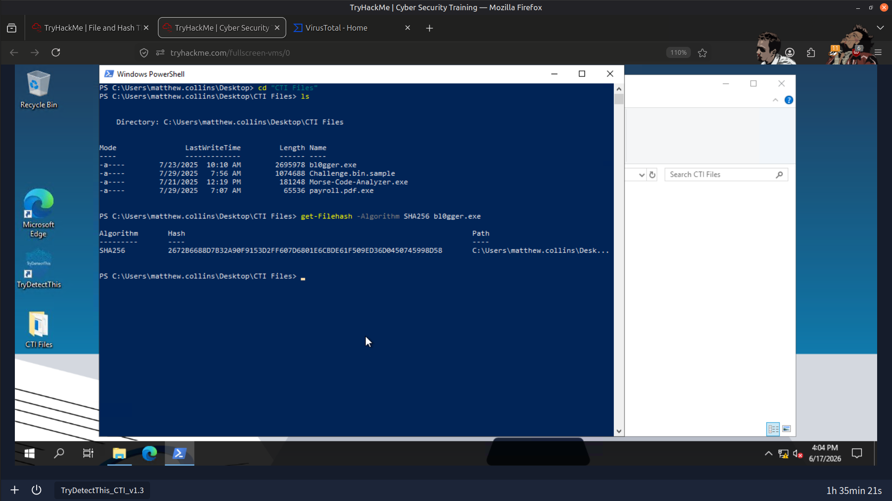

---

### Tags Identifying Bl0gger.exe

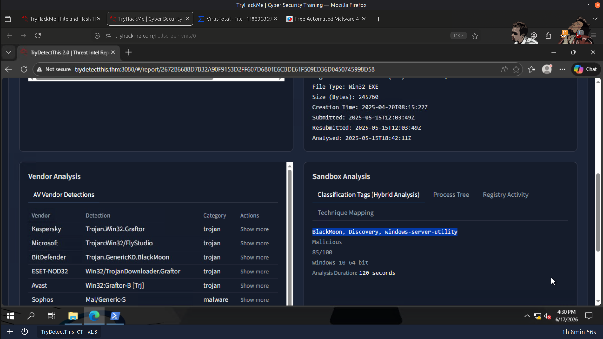

---

### Threat Classification Label (TCL)

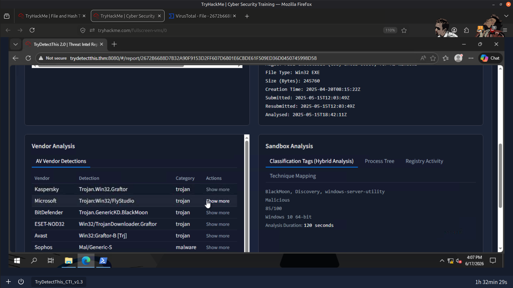

---

### MITRE ATT&CK Technique for Morse-Code-Analyzer

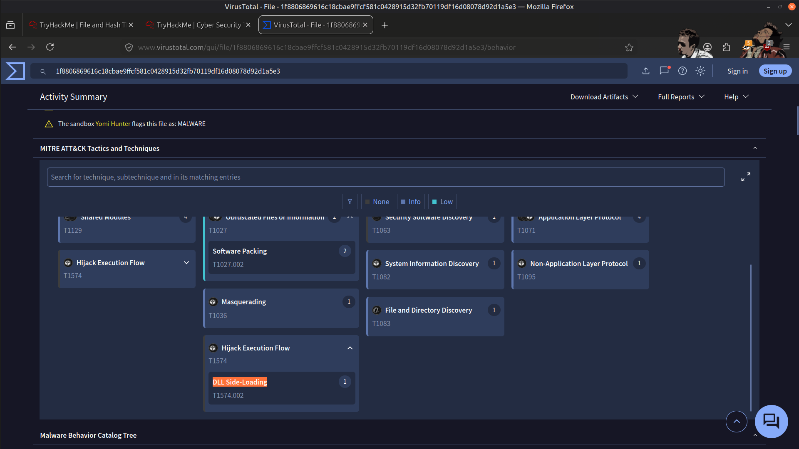

---

### Stealth Command-Line Execution

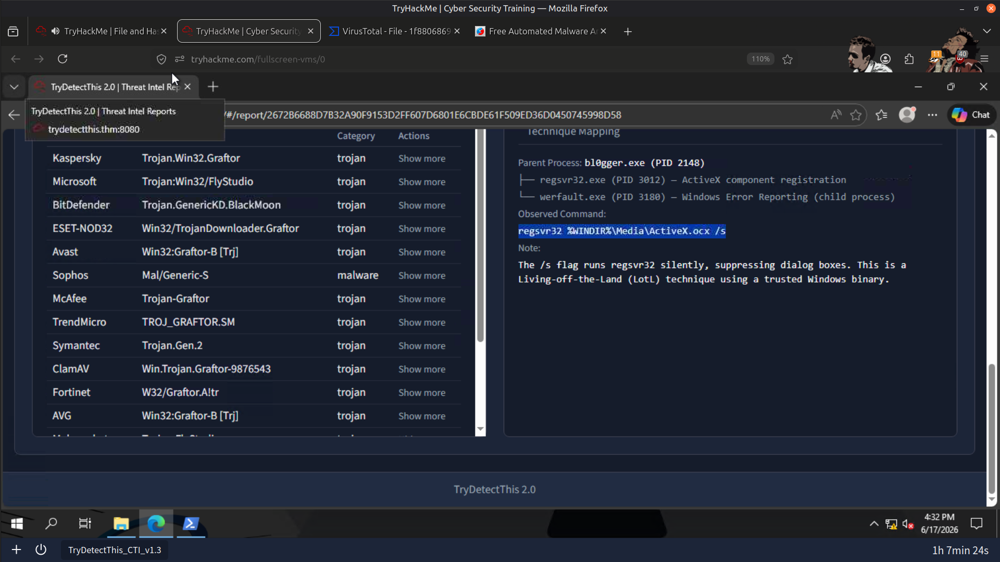

---

### Spawned Child Process

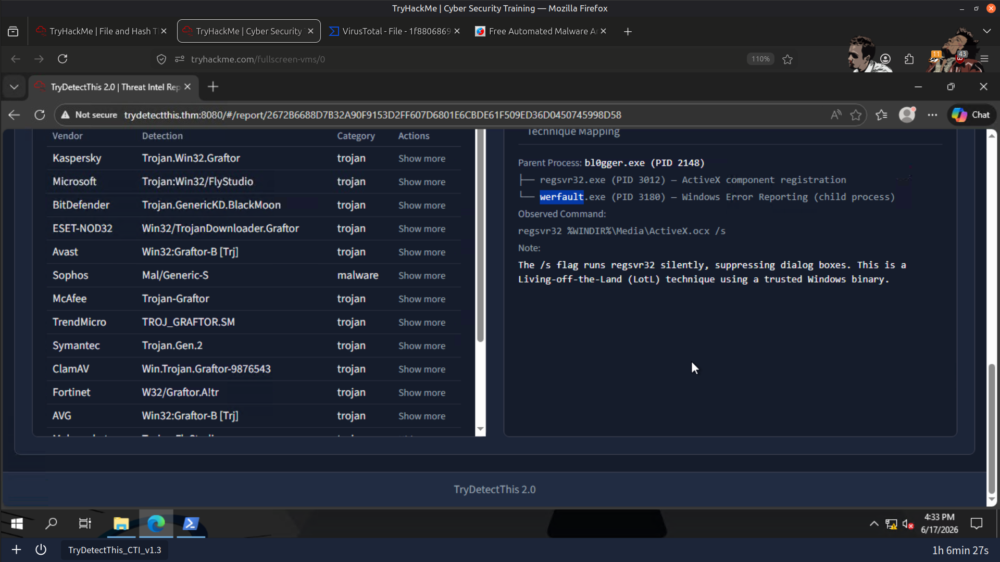

---

### Malware Masquerading as a Windows System File

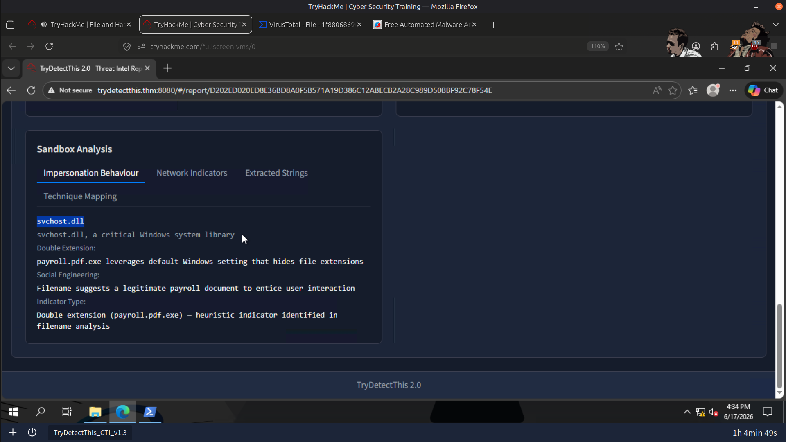

---

### SHA256 Hashes of Malicious Samples

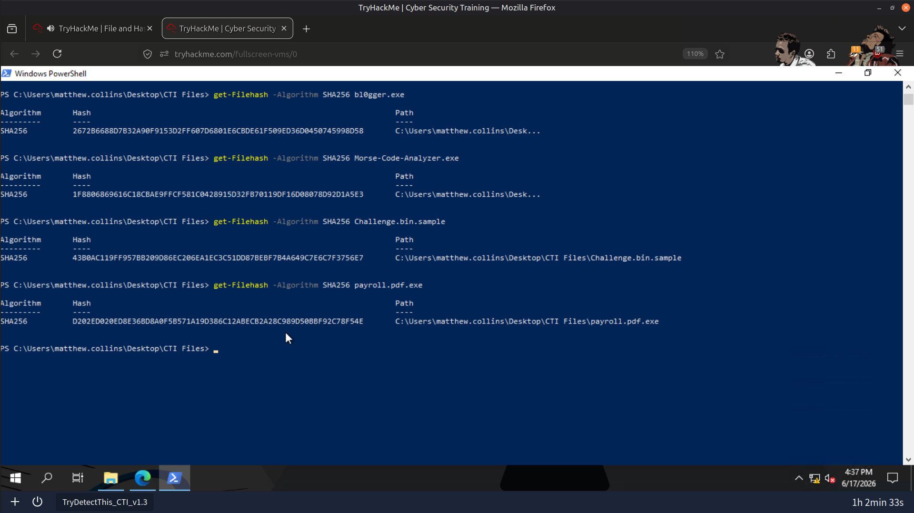

---

### Payload.exe Analysis

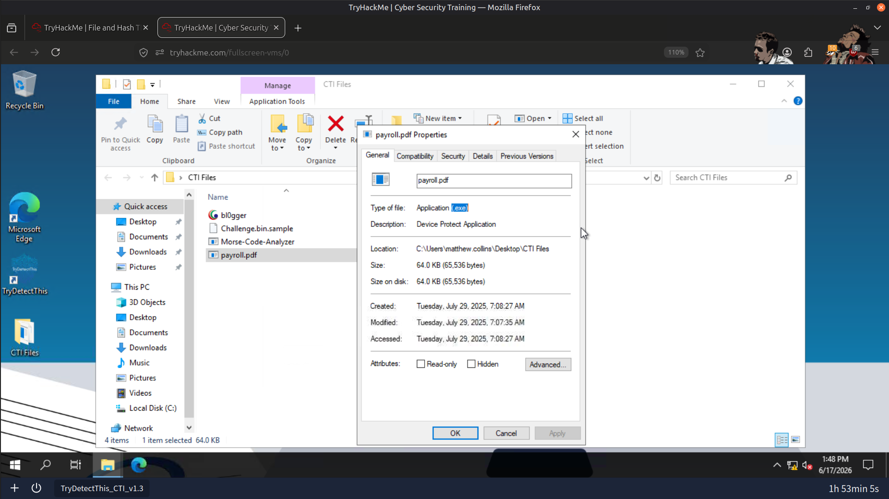

---

### Threat Label for Payload.exe

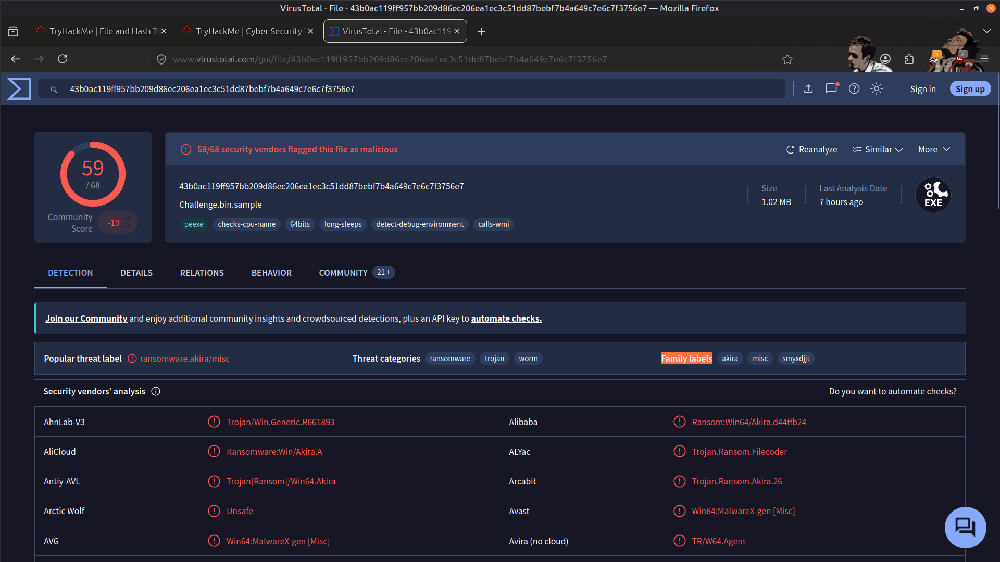

---

### Malicious File Execution

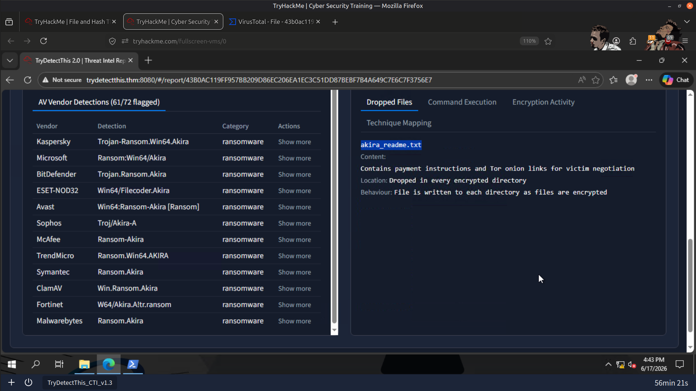

---

### Suspicious Command Execution

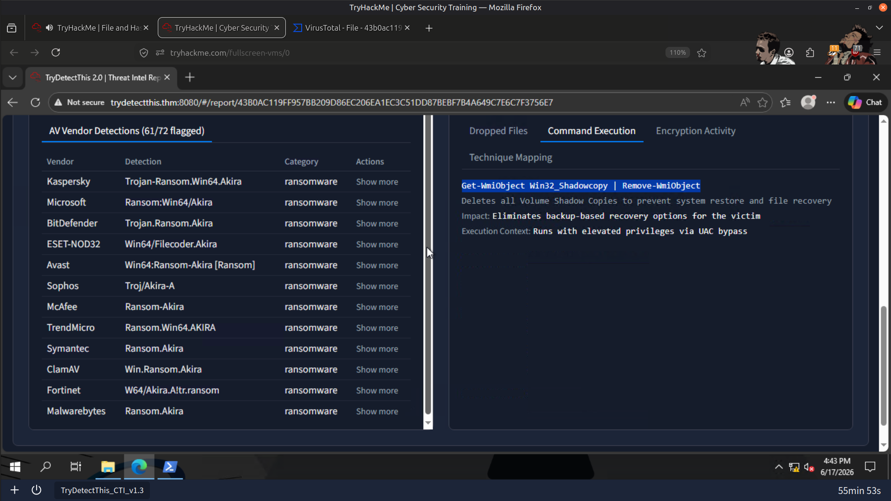

---

### Associated MITRE ATT&CK Technique

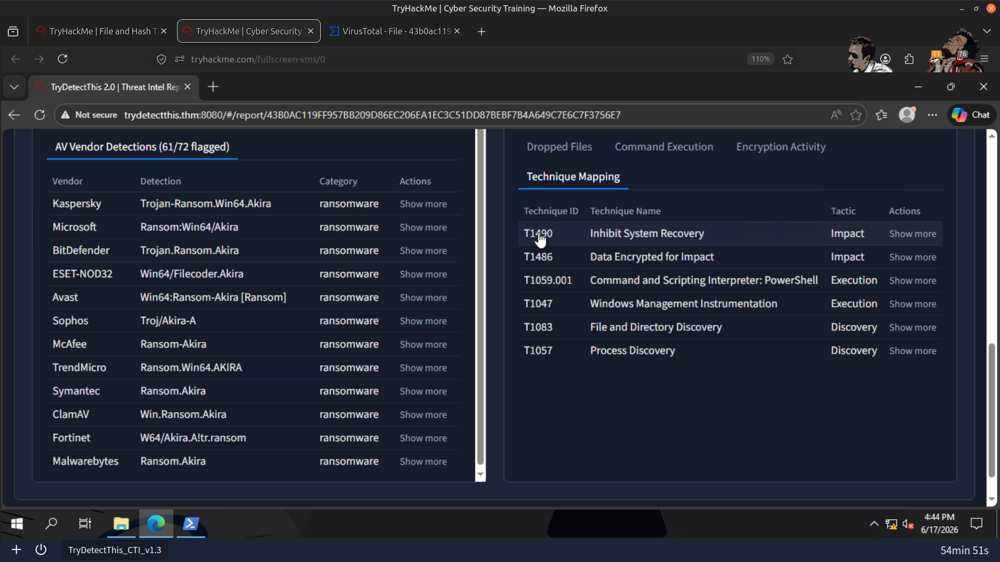

---

### Result

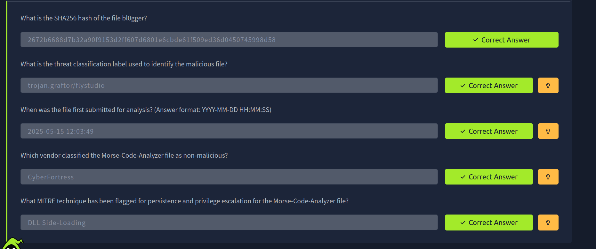

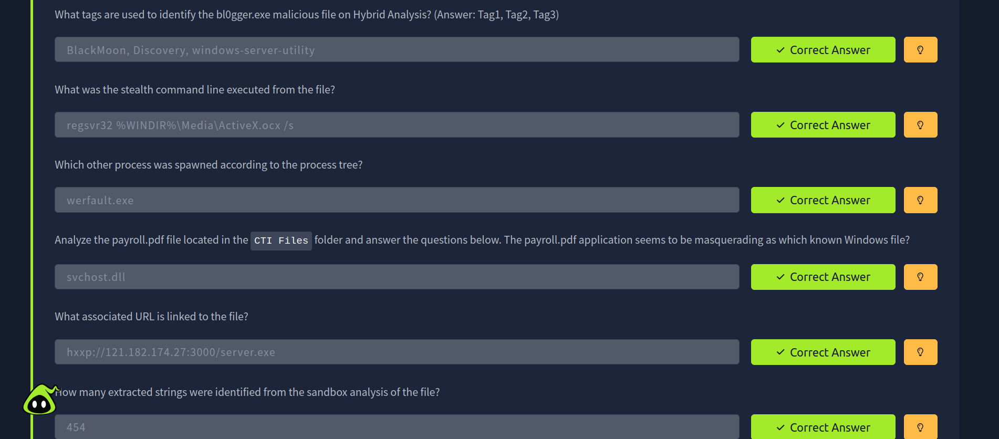

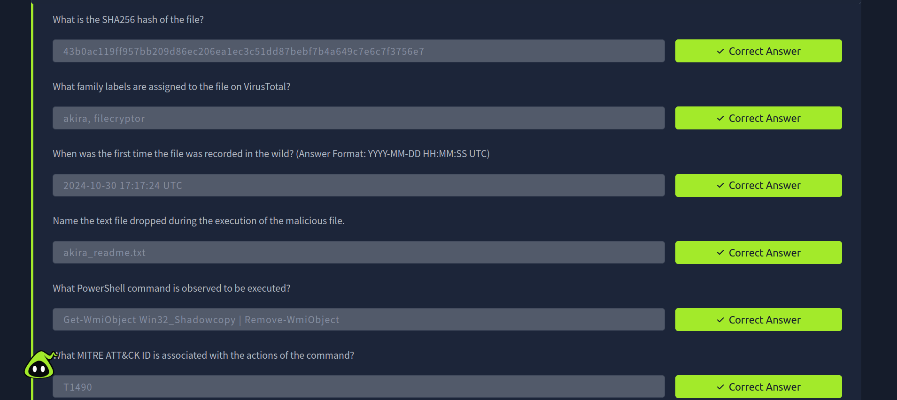

---

## 📚 Key Learnings

- Hash intelligence enables analysts to quickly identify known malicious files.
- Threat intelligence platforms enrich investigations with reputation, malware family, and campaign information.
- Sandbox analysis provides valuable insight into runtime behavior that static analysis cannot reveal.
- Mapping malware behavior to MITRE ATT&CK improves understanding of attacker techniques.
- Combining static analysis, threat intelligence, and behavioral analysis provides a comprehensive malware triage workflow.

---

## 📚 Skills Gained

- 🔐 File Hash Analysis
- 🦠 VirusTotal Investigation
- 🗂️ MalwareBazaar Intelligence
- 🔬 Hybrid Analysis
- 🕵️ Malware Triage
- 🧩 MITRE ATT&CK Mapping
- 📊 Threat Intelligence Analysis
- 🚨 SOC Investigation Workflow

---

> QXV0aG9yOiBodHRwczovL2dpdGh1Yi5jb20vSEctNzU=