# 🛡️ IP & Domain Threat Intelligence

## 📖 Overview

In this lab, I performed threat intelligence investigations focused on IP addresses and domains to enrich indicators of compromise (IOCs) and identify malicious infrastructure. Using multiple OSINT and threat intelligence platforms, I analyzed domain registrations, DNS records, Autonomous Systems (ASNs), exposed services, and network ownership to build additional context for SOC investigations.

---

## 🎯 Objectives

- Perform IP and domain enrichment.
- Investigate WHOIS records and DNS information.
- Analyze Autonomous System Numbers (ASNs) and geolocation data.
- Identify exposed internet-facing services.
- Detect VPN, proxy, and anonymity infrastructure.
- Correlate intelligence from multiple sources to support SOC investigations.

---

## 🛠️ Tools Used

- 🦠 VirusTotal
- 🌐 WHOIS
- 📡 NSLookup
- 🔎 Censys
- 🛣️ BGP.Tools

---

## 🔬 Investigation Summary

### 🌐 1. Domain Enrichment

Investigated suspicious domains to identify:

- Associated IP addresses
- Domain registration dates
- DNS records
- Hosting providers
- CDN usage
- Domain age during the investigation

---

### 🌍 2. IP Enrichment

Performed infrastructure enrichment to determine:

- IP geolocation
- Autonomous System Numbers (ASNs)
- Network ownership
- Hosting organizations
- Community intelligence and reputation

---

### 🚪 3. Service Exposure Analysis

Analyzed internet-facing infrastructure to identify:

- Open ports
- Exposed services
- Remote access protocols
- Command-and-Control (C2) infrastructure
- SSL/TLS certificates
- Operating systems of exposed servers

---

### 🔐 4. VPN & Proxy Investigation

Investigated network infrastructure to identify:

- VPN providers
- Proxy services
- Tor-related infrastructure
- Anonymous hosting services
- Reputation indicators

---

### 🔗 5. Threat Intelligence Correlation

Correlated findings across multiple intelligence sources to:

- Validate suspicious infrastructure
- Identify relationships between indicators
- Build additional investigative context
- Support evidence-based SOC triage

---

## 🚨 Findings

The investigation successfully enriched multiple IP addresses and domains by combining data from several OSINT and threat intelligence sources.

Evidence collected during the investigation revealed:

- 🌐 Domain ownership and DNS information
- 🌍 Network ownership through ASN analysis
- ☁️ Cloud providers hosting suspicious infrastructure
- 🚪 Internet-facing services and exposed ports
- 🖥️ Operating systems running on attacker infrastructure
- 🔐 VPN, proxy, and anonymous network indicators
- 🔗 Additional context supporting IOC validation

---

## 📸 Screenshots

## IP (2.58.56.60)

---

### Country it based in

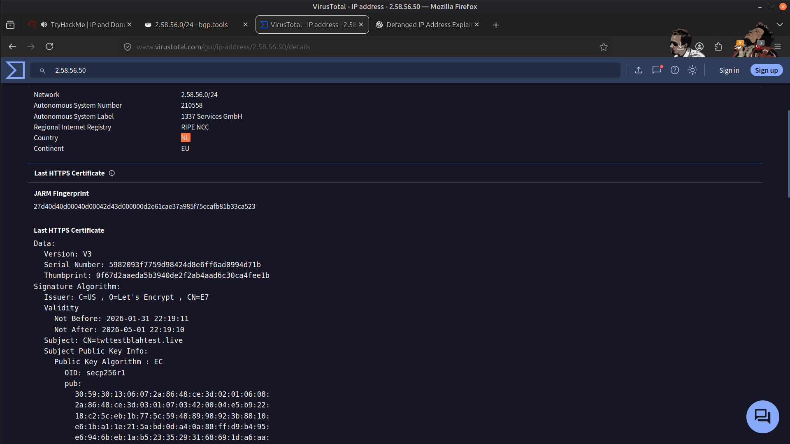

---

### C2 server hosting ip

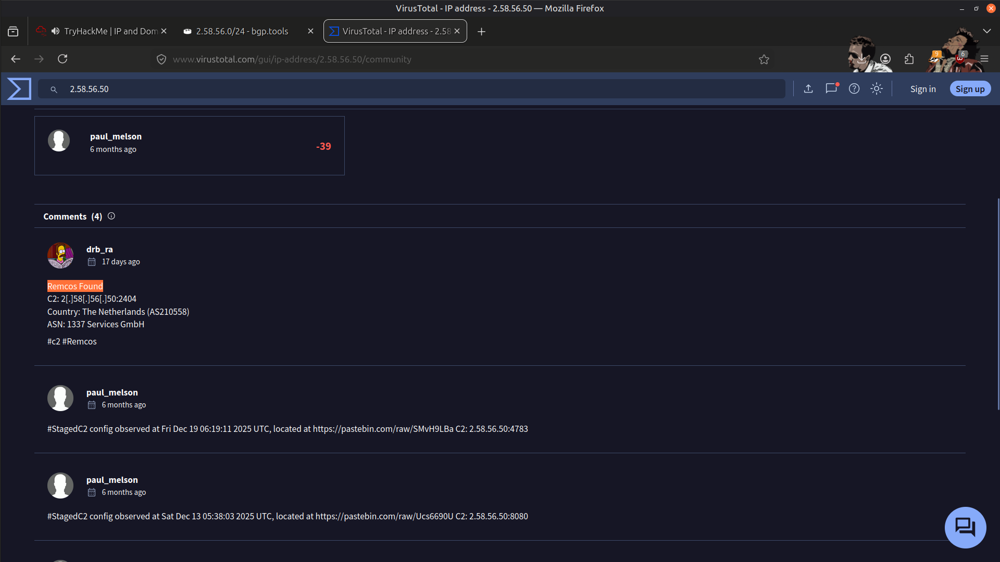

---

### Autonomous System it belongs

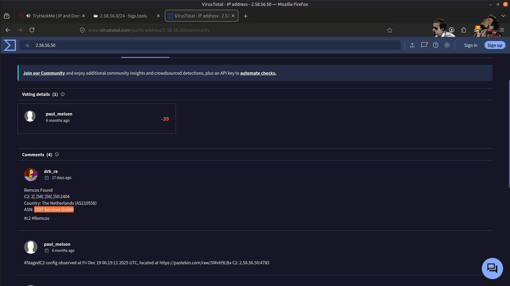

---

### Tags attributed to ASN

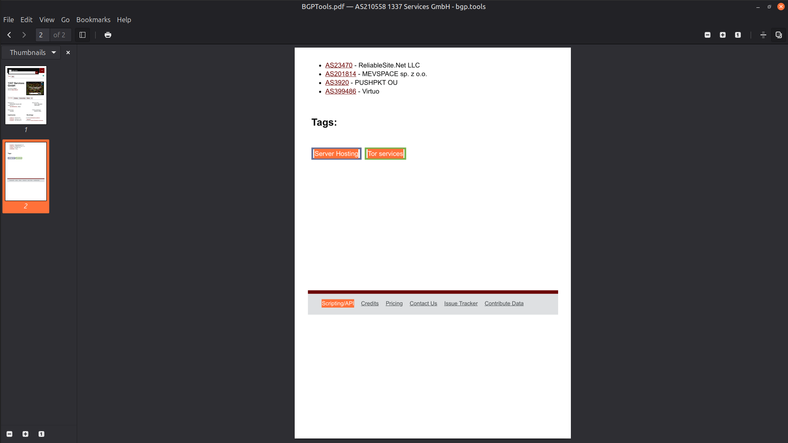

---

## IP (64.89.160.44)

---

### Service exposed

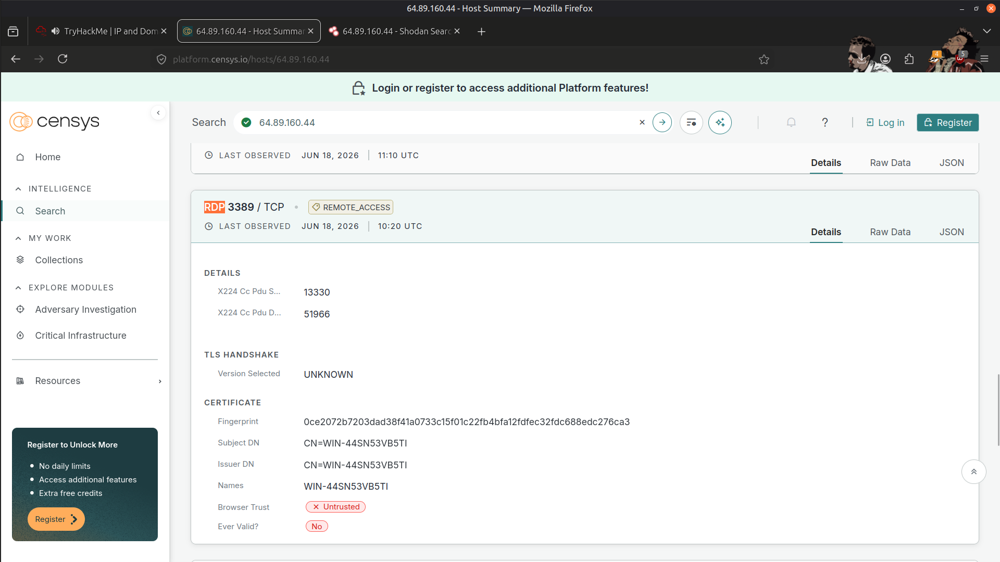

---

### Ports Open

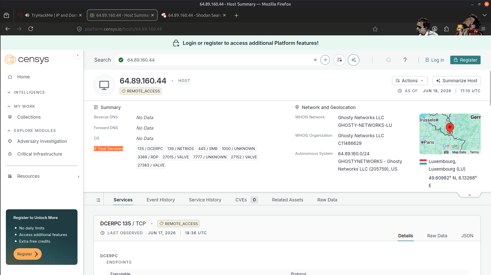

---

### port which leaks C2 server

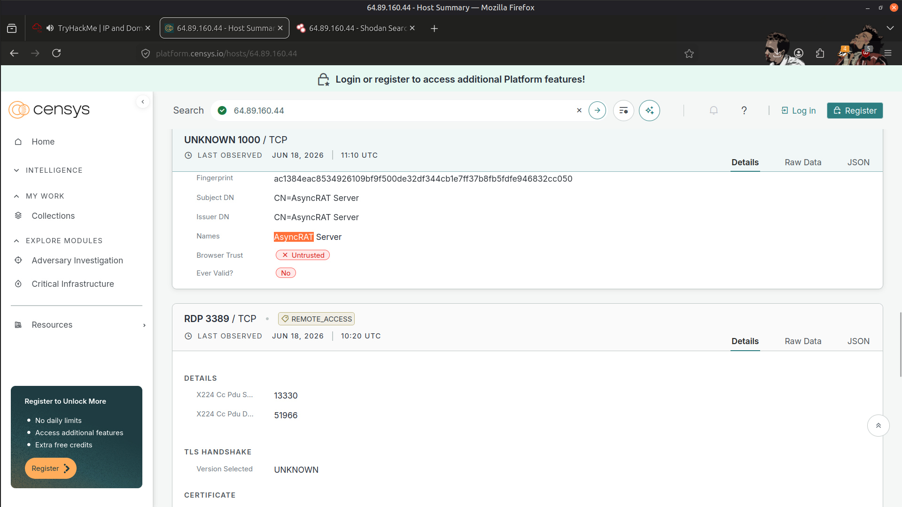

---

## IP (35.188.105.97)

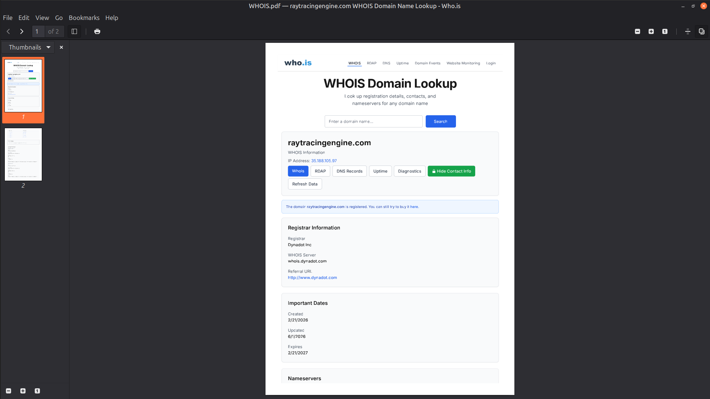

---

### Cloud Server

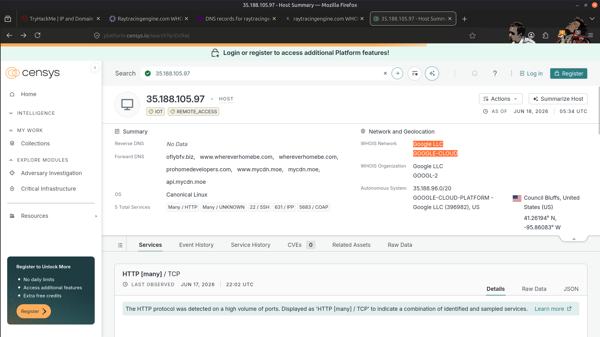

---

### Country hosting malicious server

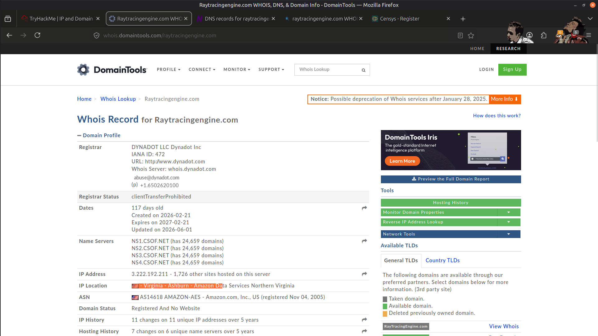

---

### Attacker's Server OS

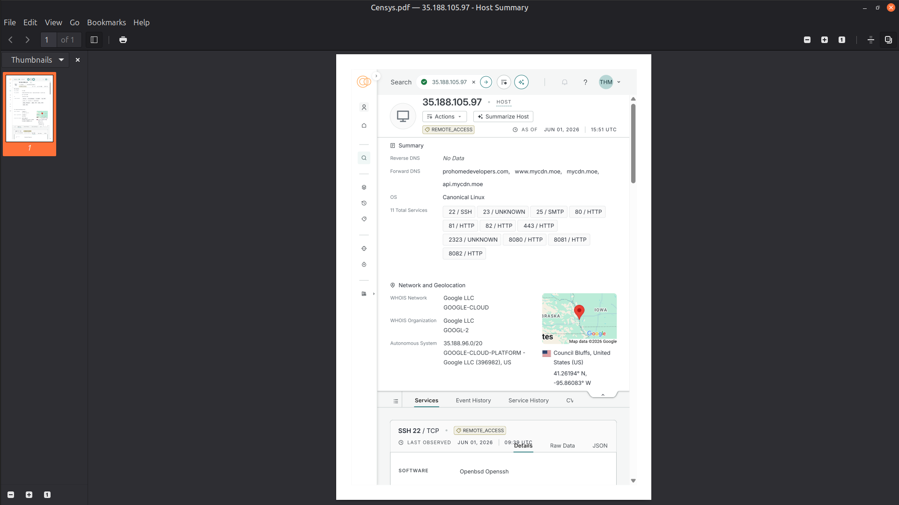

---

### Result

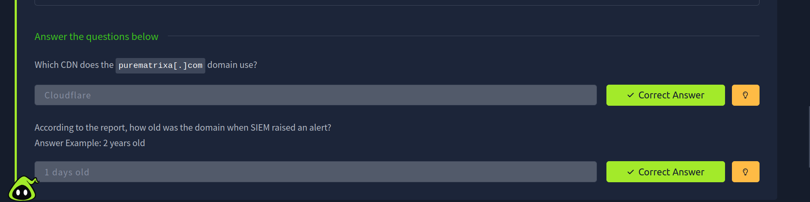

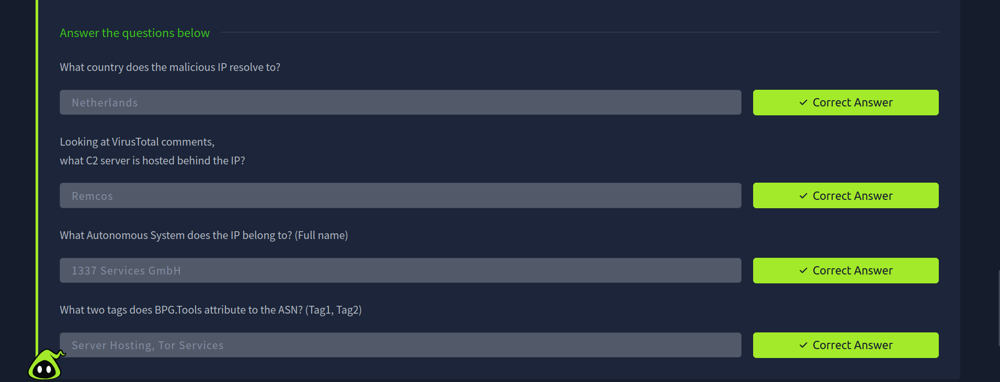

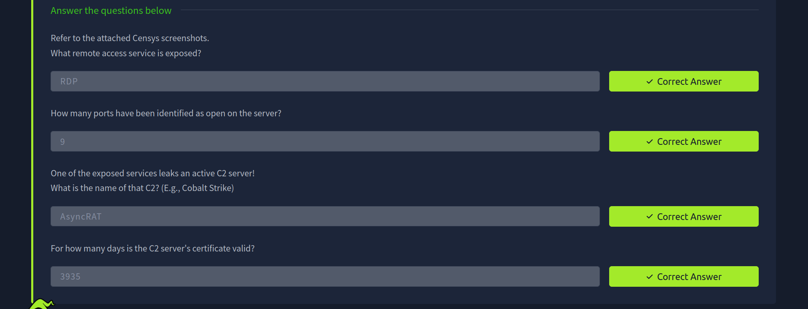

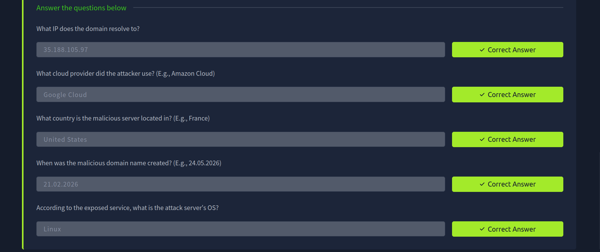

---

## 📚 Key Learnings

- Effective threat intelligence relies on correlating information from multiple OSINT sources rather than trusting a single reputation score.
- Domain enrichment provides valuable context about attacker infrastructure through DNS records, WHOIS data, and hosting information.
- ASN and geolocation analysis help identify infrastructure ownership and relationships between malicious assets.
- Internet-facing services can reveal valuable intelligence about attacker infrastructure, including exposed ports, operating systems, and C2 capabilities.
- Infrastructure enrichment strengthens SOC investigations by providing additional context for alert triage and incident response.

---

## 📚 Skills Gained

- 🌐 Domain Investigation
- 🌍 IP Address Enrichment
- 🔎 OSINT Analysis
- 🦠 Threat Intelligence
- 📡 DNS & WHOIS Analysis
- 🛣️ ASN Investigation
- 🚪 Service Enumeration
- ☁️ Infrastructure Attribution
- 🔐 VPN & Proxy Detection
- 🛡️ IOC Enrichment
- 🔗 Threat Correlation
- 📊 SOC Investigation Support

---

> QXV0aG9yOiBodHRwczovL2dpdGh1Yi5jb20vSEctNzU=