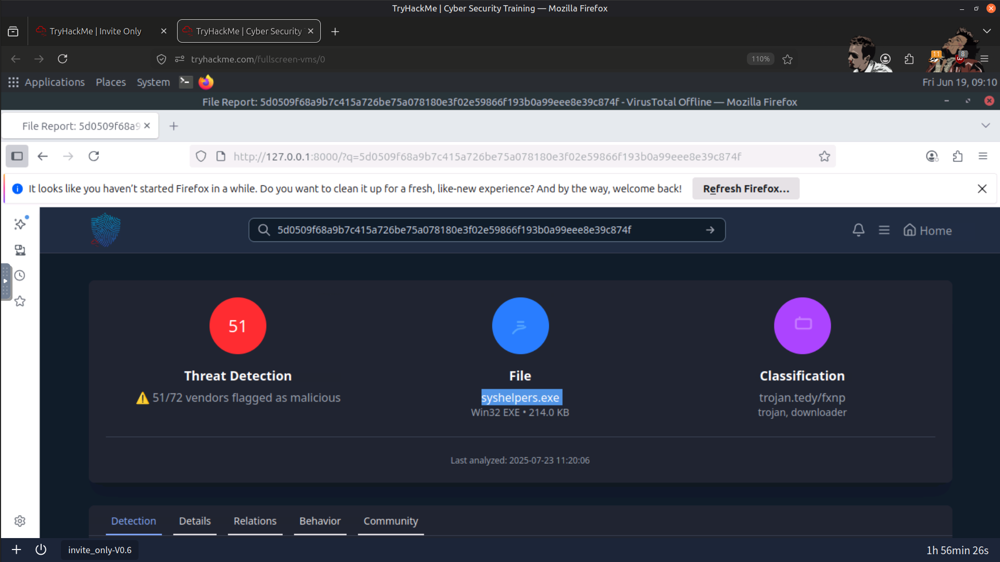
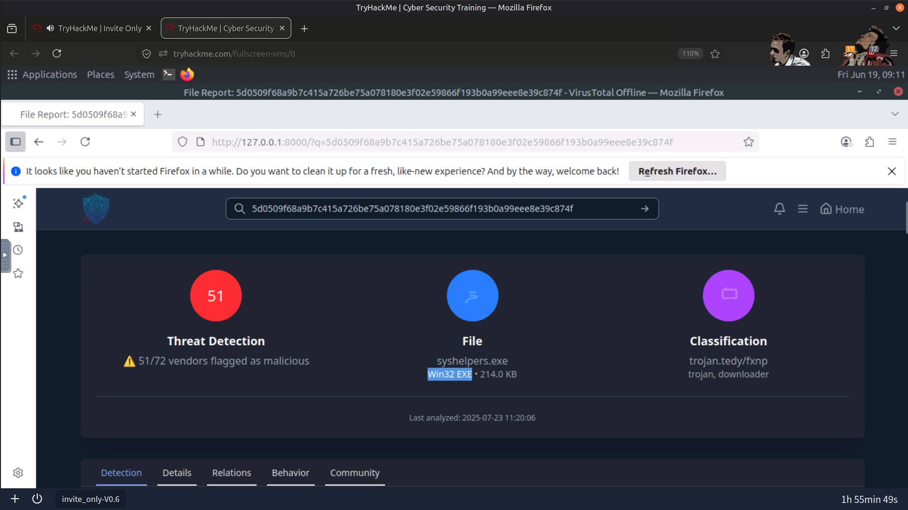
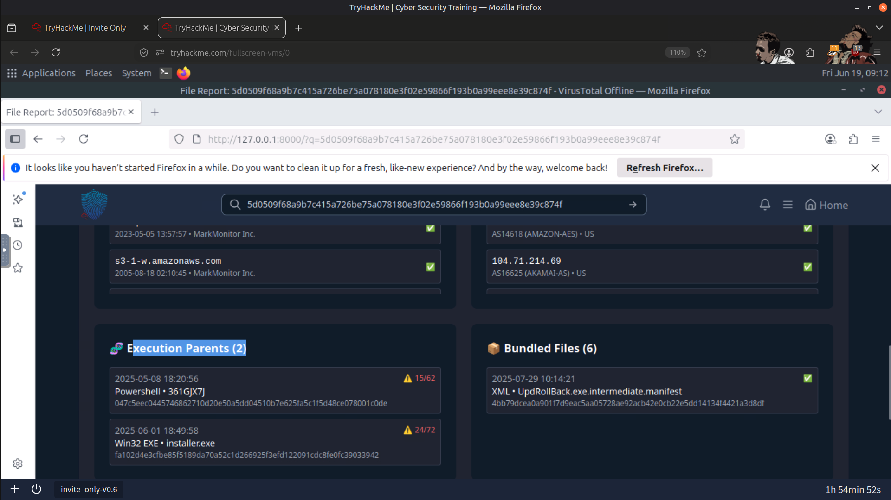
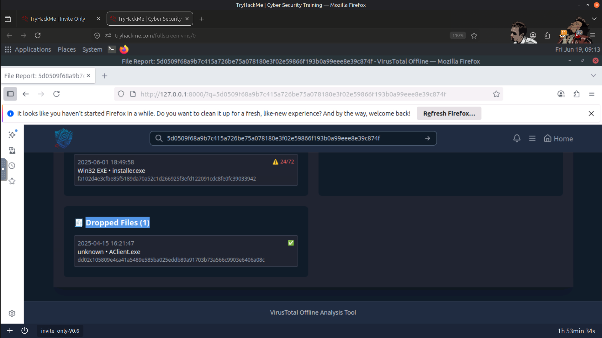
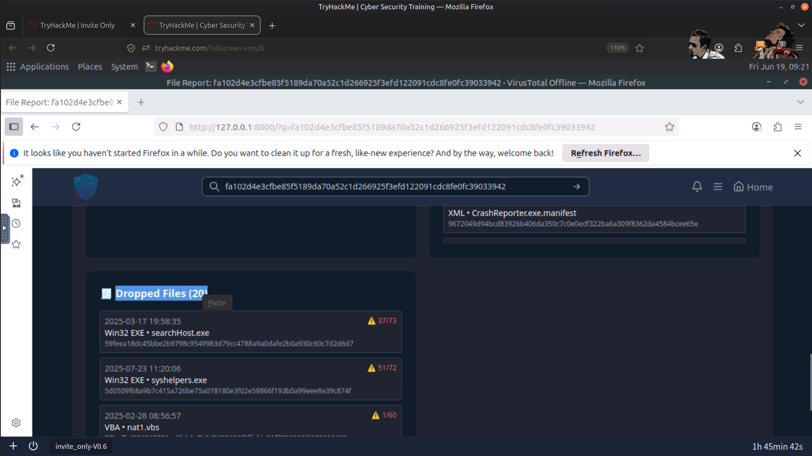
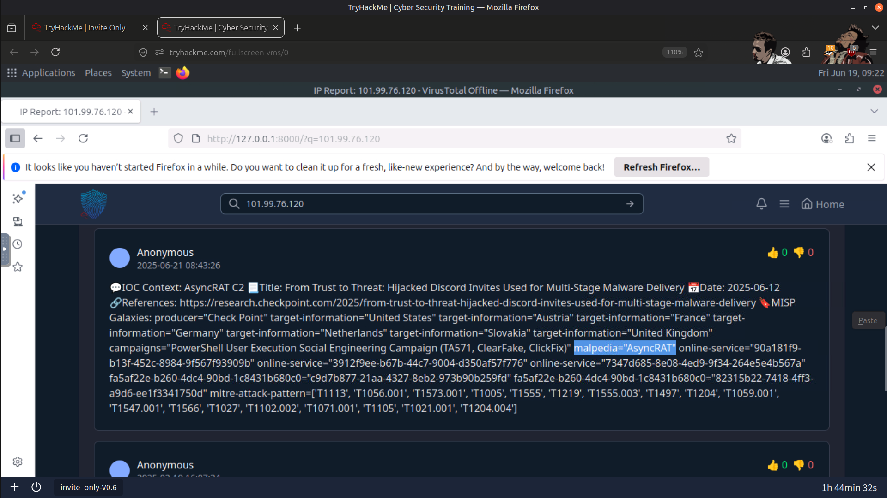
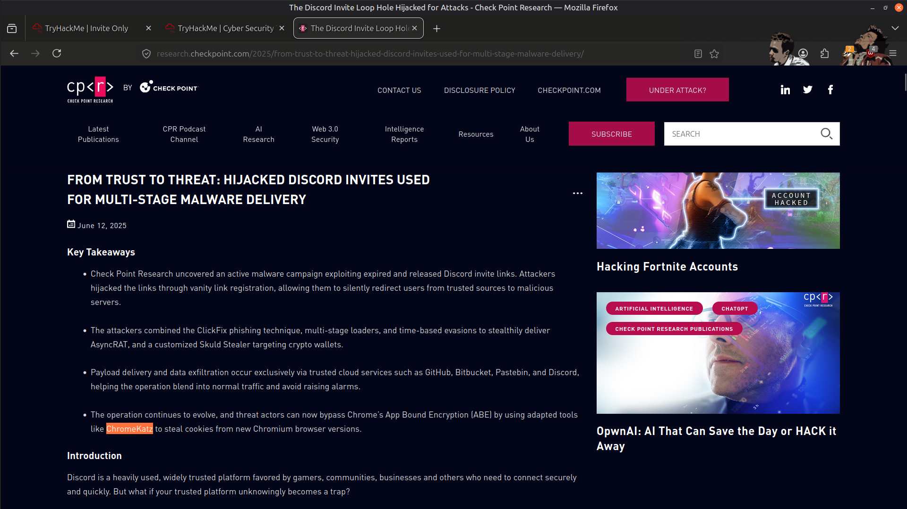
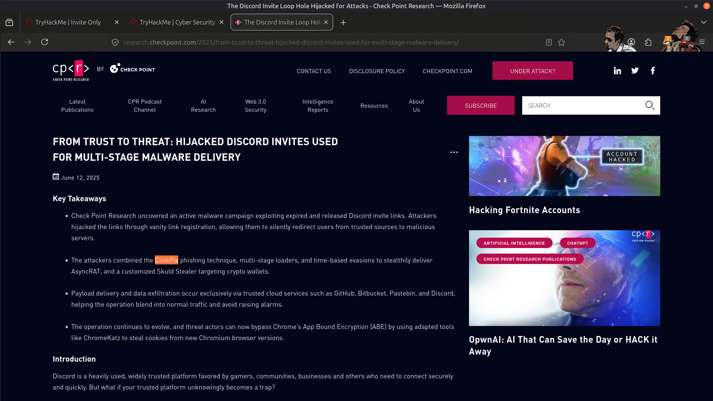
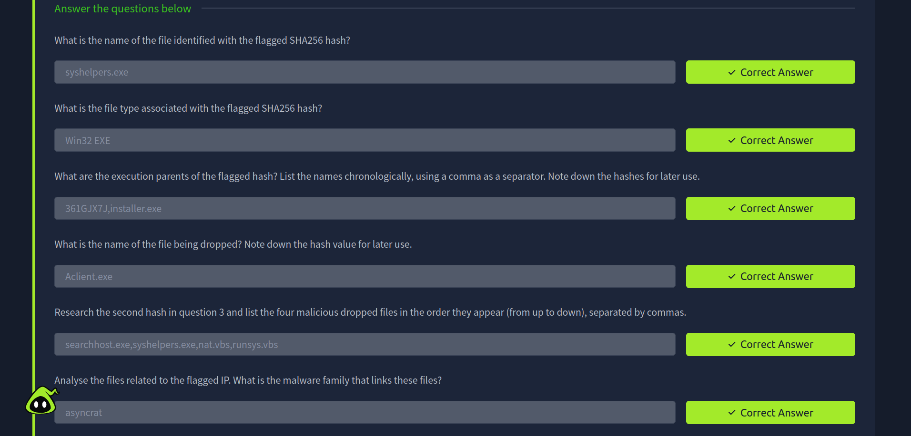
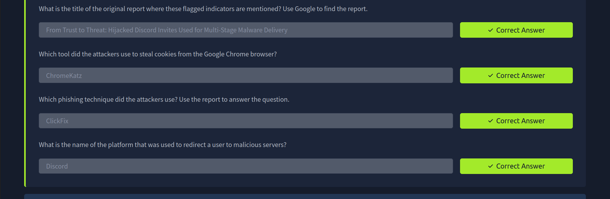

# 🕵️‍♂️ Invite Only — Threat Intelligence Challenge

## 📖 Overview

In this lab, I conducted a threat intelligence investigation by pivoting across multiple indicators of compromise (IOCs) to reconstruct a malware campaign. Starting with a flagged SHA256 hash, I traced execution lineage, analyzed dropped files, enriched indicators using threat intelligence platforms, and correlated findings with an original threat report to understand the complete attack chain.

---

## 🎯 Objectives

- Identify the file associated with a flagged SHA256 hash.
- Trace execution parent relationships to reconstruct malware execution.
- Investigate dropped files through hash pivoting.
- Enrich malicious IP addresses and related malware samples.
- Correlate indicators with public threat intelligence reports.
- Identify phishing techniques, credential theft tools, and attacker infrastructure.

---

## 🛠️ Tools Used

- 🧠 TryDetectThis 2.0
- 🦠 VirusTotal
- 🌐 Open-Source Intelligence (OSINT)

---

## 🔬 Investigation Summary

### 🔎 1. Hash Investigation

Analyzed the provided SHA256 hash to identify:

- File name
- File type
- Associated malware sample
- Initial threat context

---

### 🌳 2. Execution Lineage Analysis

Traced the malware execution chain by identifying:

- Parent processes
- Parent file hashes
- Execution relationships
- Malware delivery sequence

---

### 📦 3. Dropped File Investigation

Pivoted through execution artifacts to identify:

- Files dropped during execution
- Additional malicious payloads
- Related malware components

---

### 🌐 4. Infrastructure Enrichment

Investigated attacker infrastructure by:

- Enriching the flagged IP address
- Identifying associated malware samples
- Determining the linked malware family

---

### 📚 5. Threat Intelligence Correlation

Correlated recovered indicators with publicly available threat intelligence reports to identify:

- Campaign attribution
- Attacker techniques
- Malware behavior
- Infrastructure relationships

---

### 🍪 6. Campaign Analysis

Identified key elements of the attack including:

- Cookie-stealing malware
- Phishing technique
- Victim redirection platform
- Credential theft methodology

---

## 🚨 Findings

The investigation successfully reconstructed the malware campaign by correlating hashes, execution lineage, dropped files, infrastructure, and public threat intelligence.

Evidence collected during the investigation revealed:

- 🔍 Malware execution lineage through parent-child relationships
- 📦 Multiple dropped payloads used throughout the attack
- 🌐 Infrastructure associated with the malware campaign
- 🦠 Malware family attribution through threat intelligence enrichment
- 🍪 Cookie-stealing functionality targeting browser sessions
- 🎣 Phishing infrastructure used for credential theft

---

## 📸 Screenshots

### File Name, Type, Execution Parent, Dropped File

#### Name

#### Type

#### Execution Parent

#### Dropped File

---

### Malicious Dropped Files

---

### Files Related to Flagged IP

---

### Tool Used to Steal Cookies

---

### Phishing Technique Used by Attacker

---

### Platform Used

---

### Result

---

## 📚 Key Learnings

- Threat intelligence investigations rely on pivoting across hashes, IP addresses, and related artifacts to reconstruct attacker activity.
- Execution lineage analysis helps reveal malware delivery chains and relationships between malicious files.
- Threat intelligence platforms provide valuable context for malware attribution and infrastructure analysis.
- Correlating technical indicators with public intelligence reports improves understanding of attacker campaigns and techniques.
- Combining multiple intelligence sources enables more accurate and comprehensive incident investigations.

---

## 📚 Skills Gained

- 🧠 Threat Intelligence Analysis
- 🔎 IOC Enrichment
- 🌐 IP & Infrastructure Investigation
- 🔗 Hash Pivoting
- 📦 Malware Lineage Analysis
- 🦠 VirusTotal Investigation
- 📖 Open-Source Intelligence (OSINT)
- 🎣 Phishing Campaign Analysis
- 🍪 Malware & Credential Theft Investigation

---

> QXV0aG9yOiBodHRwczovL2dpdGh1Yi5jb20vSEctNzU=