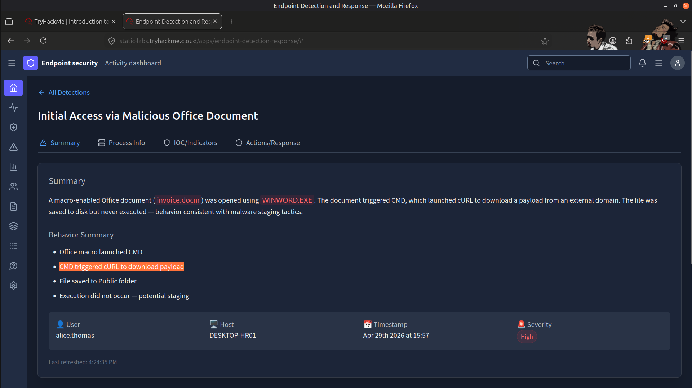
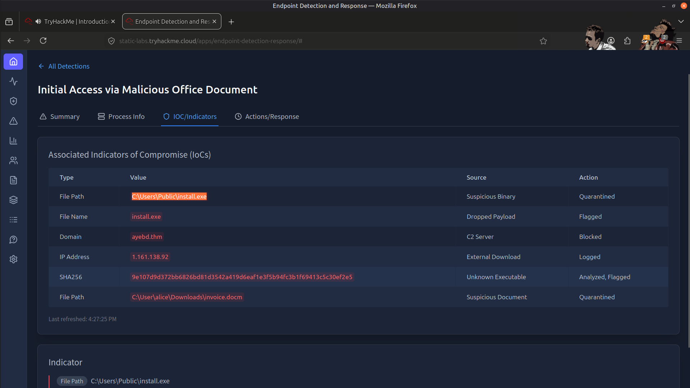
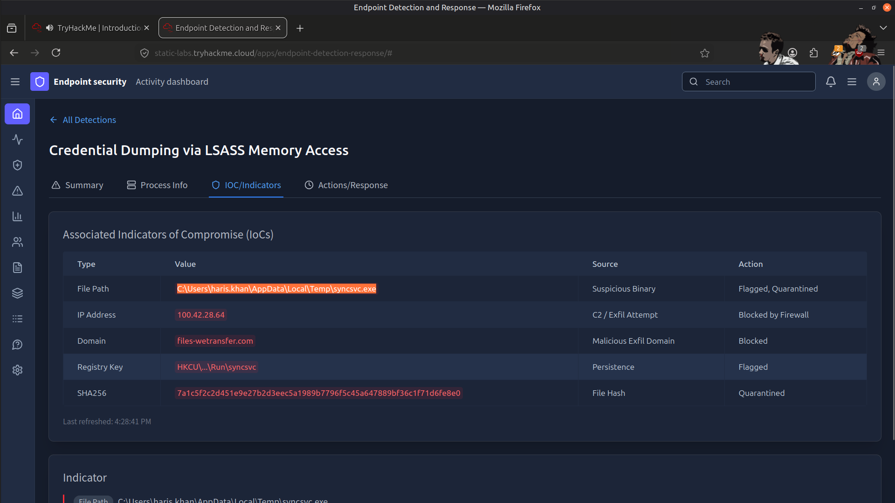
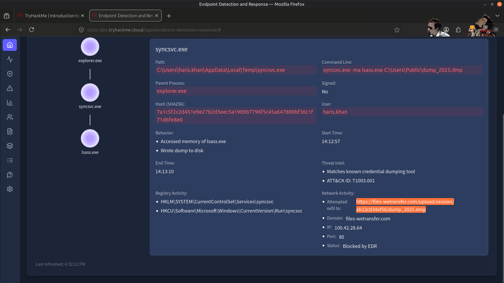
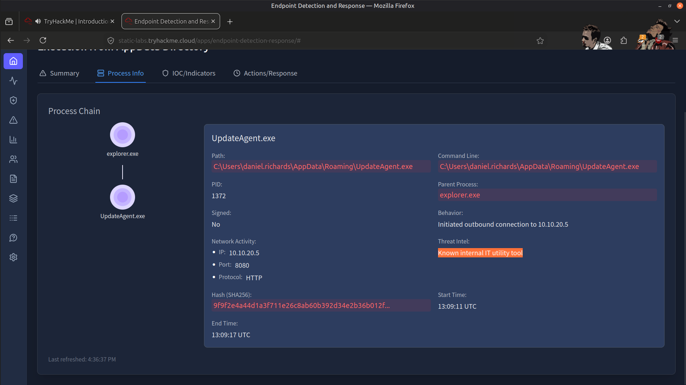
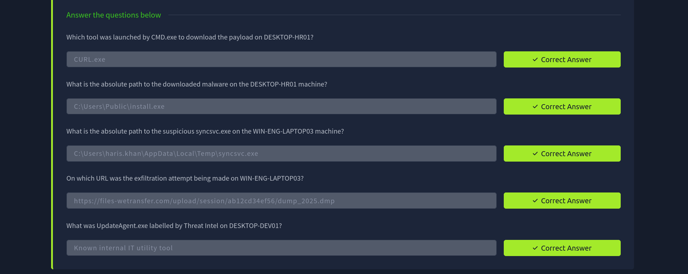

# 🔍 EDR Demo – SOC Analyst Workflow

## 📌 Overview
In this exercise, I worked with an Endpoint Detection and Response (EDR) system to understand how a SOC Analyst investigates security alerts.

---

## 🔎 What I Did

- Accessed the EDR dashboard  
- Reviewed multiple alerts and explored their details  
- Analyzed process activity and behavioral patterns shown by the system  
- Observed how alerts are investigated in a real SOC environment  

---

## 📸 Screenshots
### Tool For Payload Download

---
### Initial Access

---
### Credential Dumping

---
### Exfiltration Attempt 

---
### Threat Intelligence Lookup

---
### Result

---

## ✅ Conclusion
This is a basic demo demonstrating how I used an EDR system and how a SOC Analyst typically interacts with alerts during investigation.