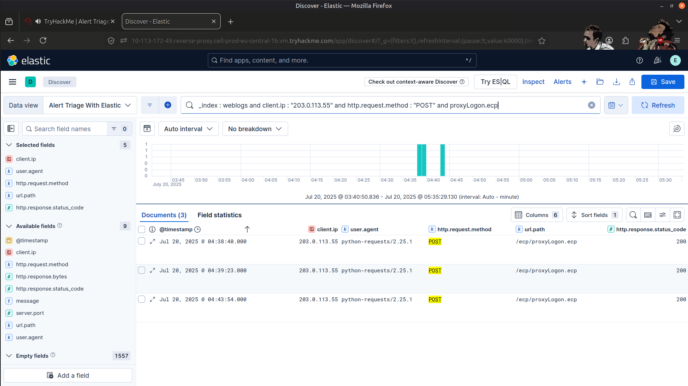
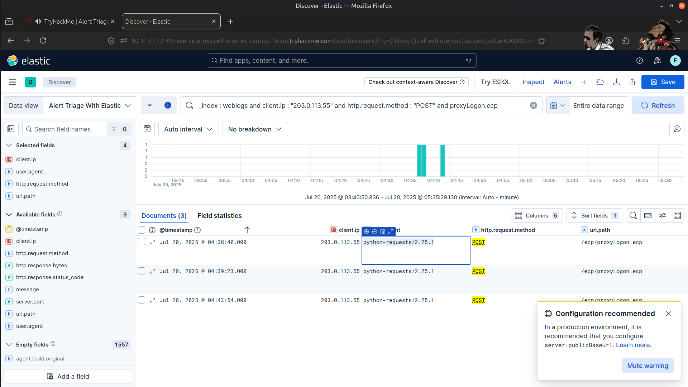
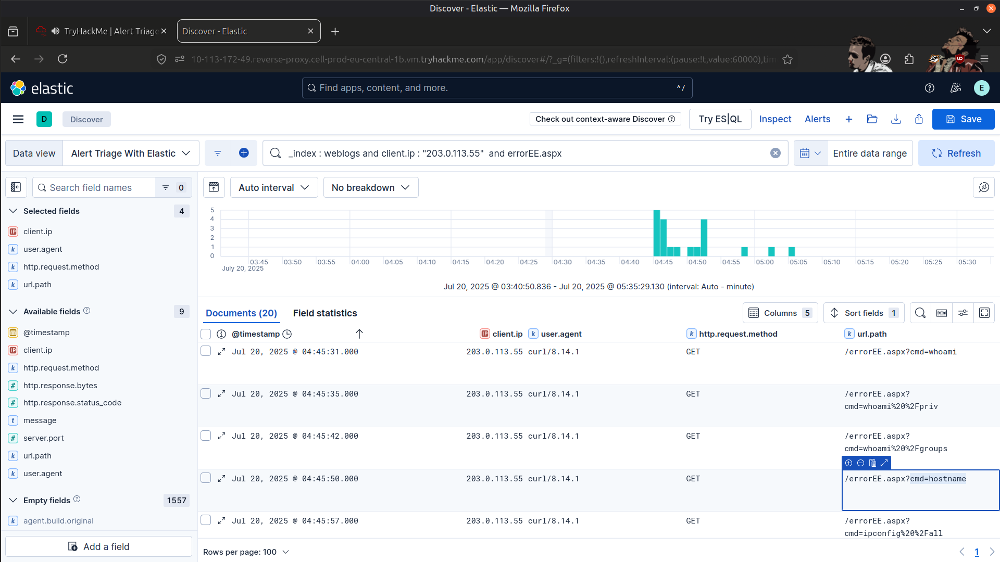
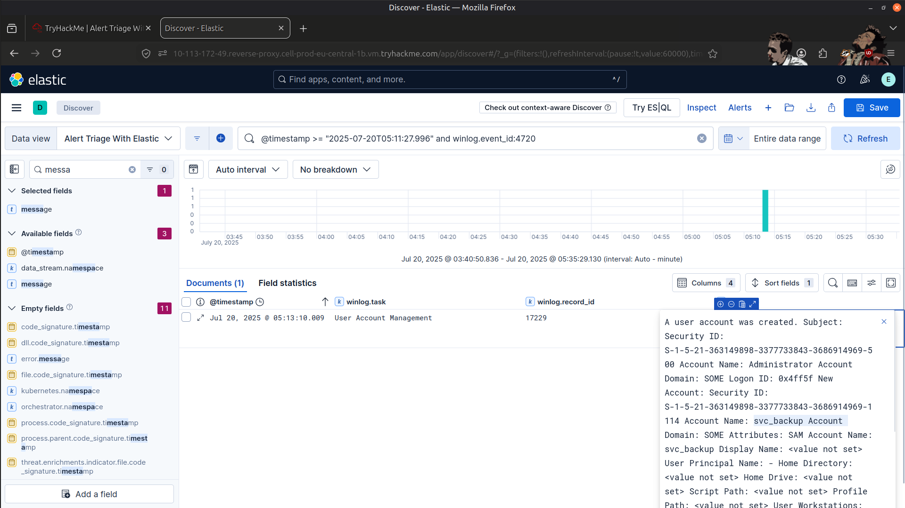
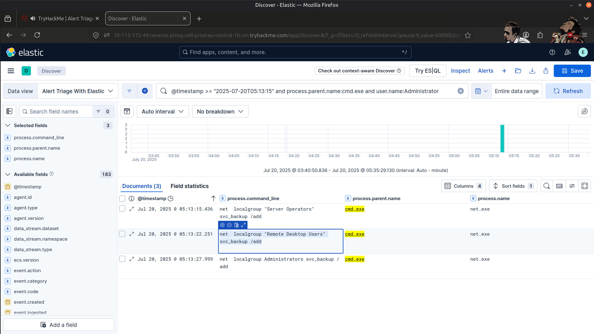
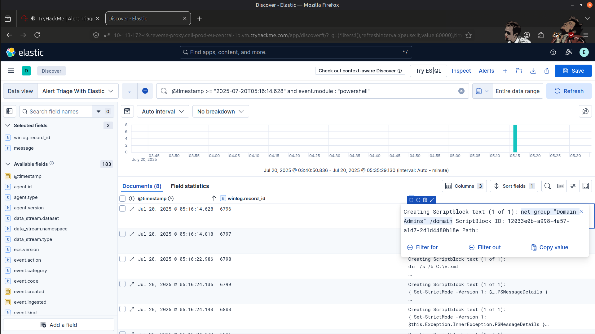
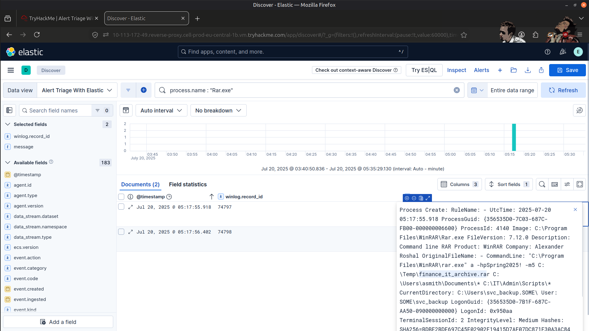
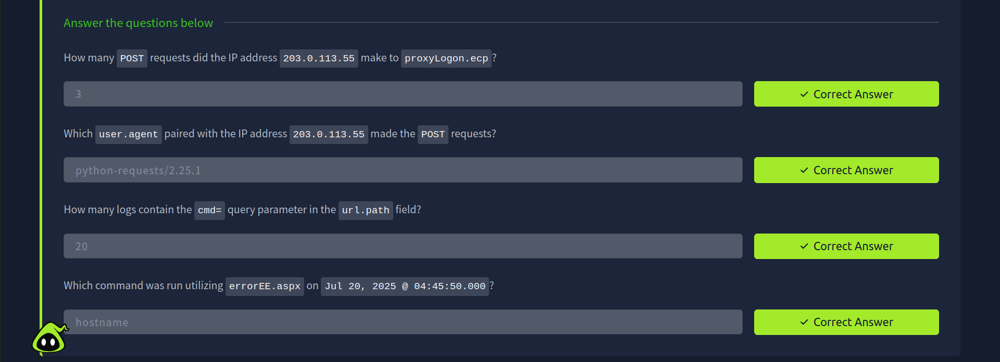
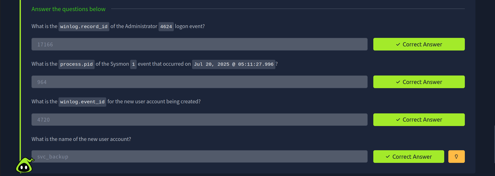
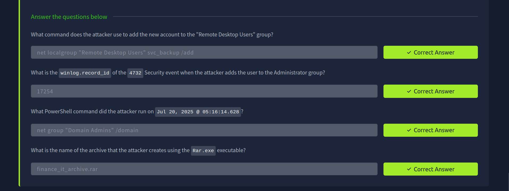

# 🛡️ SOC Alert Triage & Investigation with Kibana

## 📖 Overview

In this guided challenge, I stepped into the role of a Security Operations Center (SOC) Analyst and investigated suspicious activities targeting **SomeCorp's infrastructure**. Using **Elastic Stack (Kibana)** and the **Kibana Query Language (KQL)**, I analyzed logs, identified indicators of compromise (IOCs), and correlated events across multiple sources to understand the attacker's actions.

This room helped me strengthen my log analysis and alert triage skills while following the investigative process used in real SOC environments.

---

## 🎯 Objectives

- 🔍 Use Kibana to analyze common security logs
- 🚨 Identify key Indicators of Compromise (IOCs)
- 🔗 Correlate events across multiple log sources
- 🕵️ Investigate SOC alerts and uncover the breach
- 📈 Gather evidence and support findings with clear observations

---

## 🛠️ Tools Used

- ⚡ Elastic Stack
- 📊 Kibana
- 🔎 Kibana Query Language (KQL)

---

## 📂 Log Sources Investigated

### 🌐 Investigating Web Attack

- Analyzed IIS web server logs
- Identified suspicious web requests
- Investigated indicators associated with web-based attacks
- Correlated events to understand attacker activity

---

### 👤 Uncovering Account Activity

- Examined Windows authentication logs
- Investigated user account actions
- Identified suspicious login events
- Tracked account-related indicators of compromise

---

### 💻 Exposing Command Execution

- Investigated Windows event logs
- Identified suspicious command execution
- Traced attacker behavior on the compromised system
- Collected evidence to support incident escalation

---

## 🧠 Skills Gained

- 📌 Alert triage and investigation
- 📌 Searching and filtering logs with KQL
- 📌 Web log analysis
- 📌 Windows event log analysis
- 📌 IOC identification
- 📌 Event correlation
- 📌 Initial incident response techniques
- 📌 Evidence collection and escalation

---

## ✅ Conclusion

Throughout this investigation, I acted as a SOC analyst responsible for analyzing alerts and uncovering malicious activity within SomeCorp's environment. By leveraging Kibana and KQL, I successfully explored both web and Windows logs, identified suspicious behavior, and correlated multiple events to gain a deeper understanding of the breach.

This challenge provided valuable hands-on experience with real-world SOC workflows and strengthened my ability to perform effective alert triage and incident investigations.

---

# 📸 Screenshots

### POST Requests

---

### User-agent made POST req

---

### Command Running errorEE.aspx

---

### New user Account

---

### Command to Add new account to  RDP

---

### Powershell command Ran by attacker

---

### name of tha archieve created by the attacker

---

### Result

