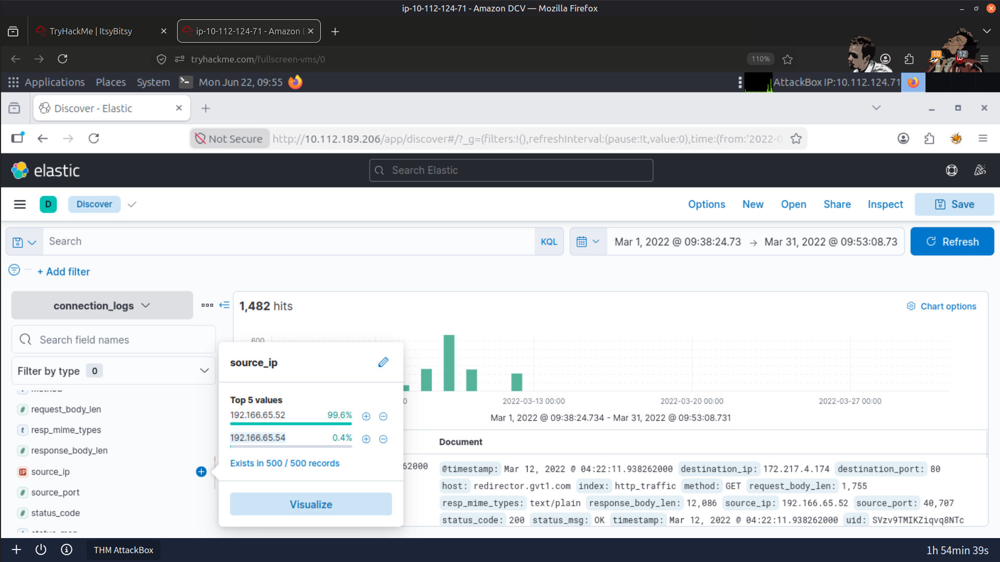
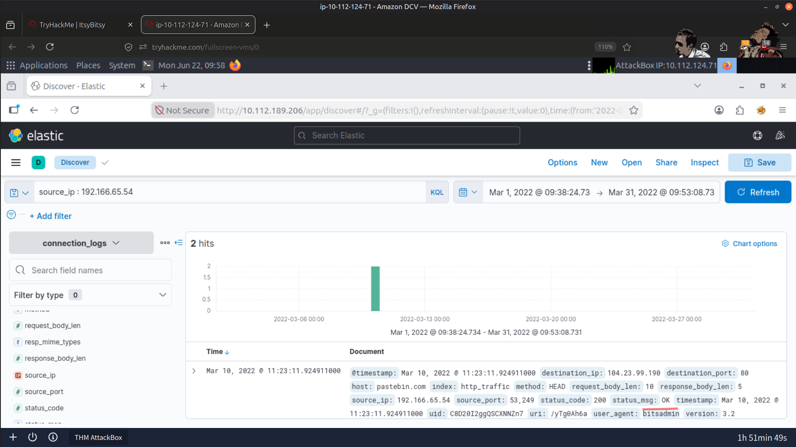
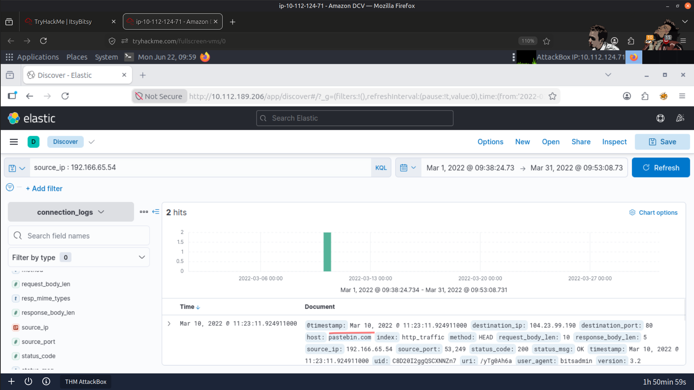
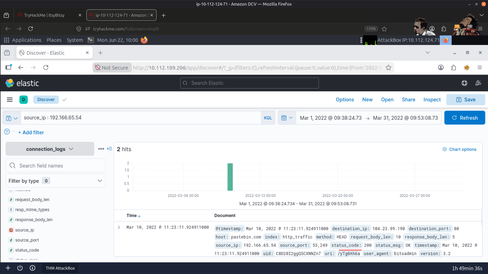
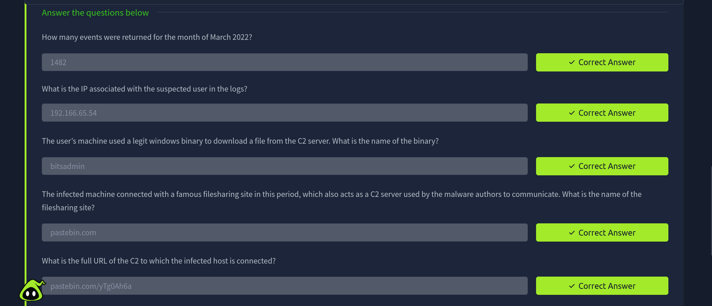

# 🚨 C2 Communication Detection - ELK

## 📖 Overview

In this lab, I investigated an IDS alert indicating potential Command-and-Control (C2) communication originating from an internal HR user. Using the Elastic Stack (Kibana), I analyzed HTTP connection logs, identified suspicious outbound activity, investigated the accessed resources, and confirmed the presence of malicious content associated with the alert.

---

## 🎯 Objectives

- 🔍 Investigate IDS alerts indicating potential Command-and-Control (C2) communication
- 📊 Analyze HTTP connection logs using Kibana
- 🌐 Identify suspicious outbound connections and accessed URLs
- 🧩 Extract and validate malicious content associated with the alert
- 🛡️ Strengthen log analysis, event correlation, and network investigation skills using Elastic Stack

---

## 🛠️ Tools Used

- 📈 Elastic Stack (Kibana)
- 🦠 VirusTotal
- 🌍 Browserling

---

## 🔬 Investigation Summary

### 🚨 1. IDS Alert Analysis

Reviewed the IDS alert to identify:

- Internal user associated with the alert
- Source IP address
- Nature of the suspicious activity

---

### 📊 2. Log Investigation

Queried Kibana logs to:

- Isolate traffic generated by the affected user
- Review outbound HTTP connections
- Identify suspicious communication patterns

---

### 🌐 3. C2 Infrastructure Investigation

Investigated suspicious outbound connections to identify:

- External C2 server
- File-sharing service involved
- Full URL used during the communication

---

### 🧩 4. Malicious File Analysis

Reviewed the accessed file to:

- Identify malicious content
- Confirm the embedded malicious pattern
- Validate findings using VirusTotal and Browserling

---

### 🔗 5. Event Correlation

Correlated IDS alerts with HTTP log activity to:

- Validate the malicious communication
- Confirm C2 beaconing behavior
- Reconstruct the sequence of attacker activity

---

## 🚨 Findings

The investigation confirmed outbound HTTP communication consistent with Command-and-Control (C2) activity.

Evidence collected during the investigation revealed:

- 🚨 IDS alerts identifying suspicious outbound traffic
- 🌐 Communication with an external C2 server
- 📁 Access to a malicious file hosted on a file-sharing service
- 🧩 Embedded malicious content within the downloaded file
- 🔗 HTTP communication patterns consistent with C2 beaconing

---

# 📸 Refer to Screenshots for Reference

### Suspected User IP

---

### C2 Server

---

### File-sharing Site

---

### Full URL of the C2 Server

---

### Malicious File Accessed from the File-sharing Site

---

### Result

---

## 📚 Key Learnings

- IDS alerts should always be validated through supporting log analysis.
- Kibana enables efficient investigation of network activity using structured log queries.
- Correlating IDS alerts with HTTP logs provides stronger evidence of malicious behavior.
- C2 communication often appears as seemingly legitimate outbound web traffic.
- Threat intelligence platforms help validate suspicious infrastructure and malicious artifacts.

---

## 📚 Skills Gained

- 📈 Elastic Stack (Kibana)
- 🔎 Kibana Query Language (KQL)
- 🚨 IDS Alert Investigation
- 🌐 HTTP Log Analysis
- 🛡️ Command-and-Control (C2) Detection
- 🔗 Event Correlation
- 🦠 Threat Intelligence Validation
- 🕵️ Network Security Investigation

---

> QXV0aG9yOiBodHRwczovL2dpdGh1Yi5jb20vSEctNzU=