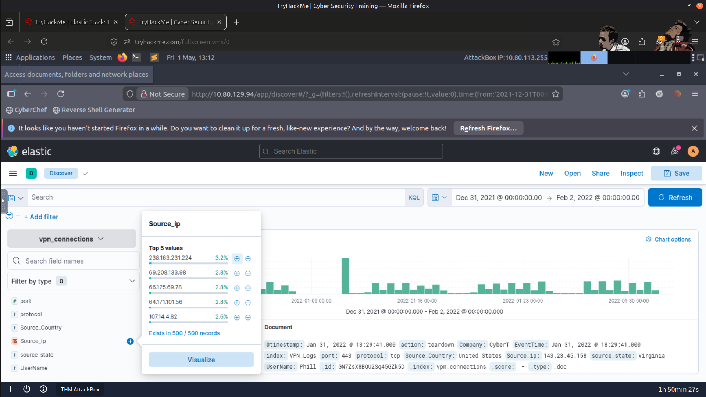
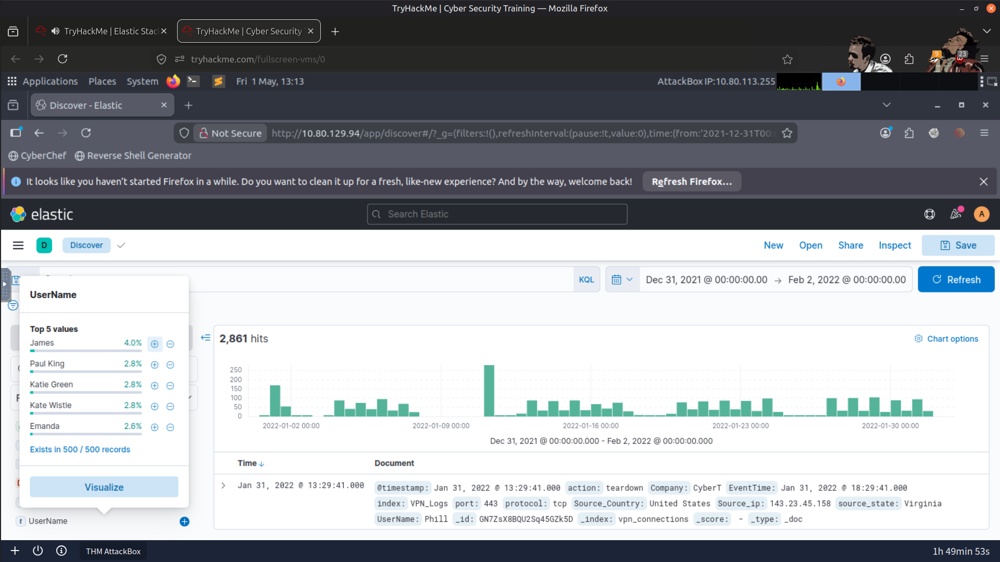
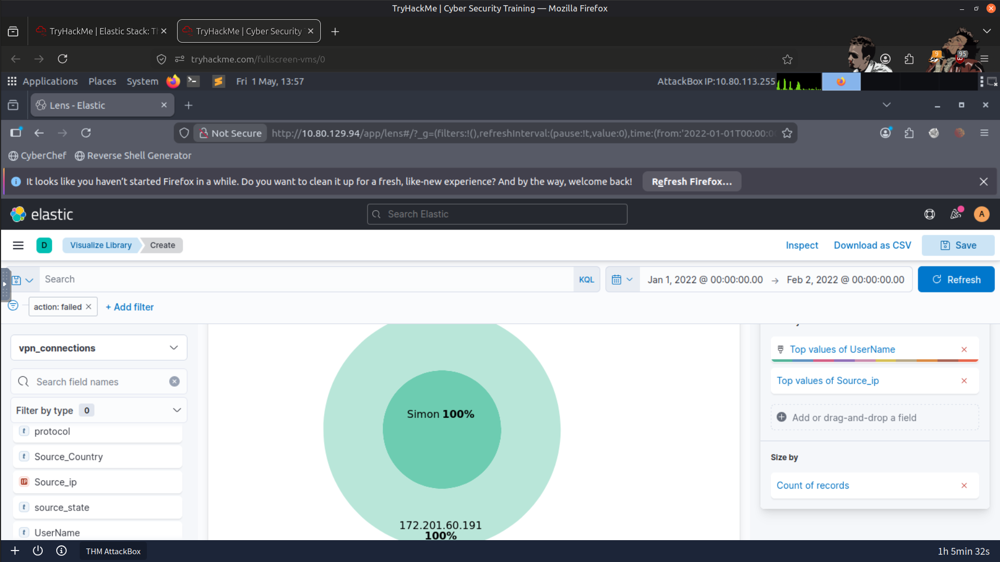
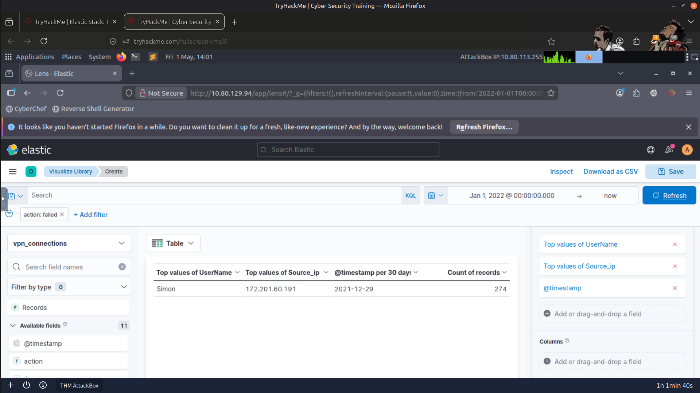
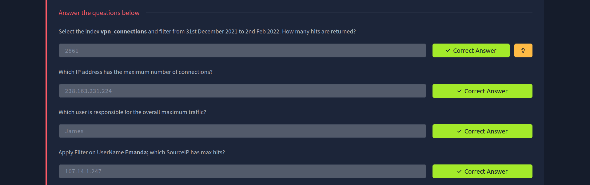
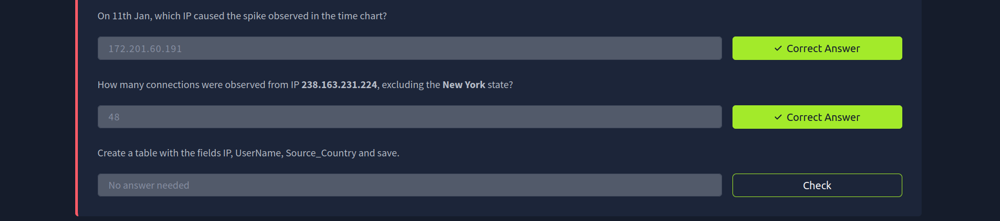
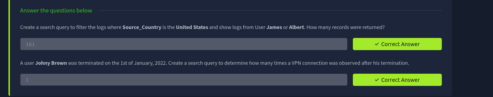
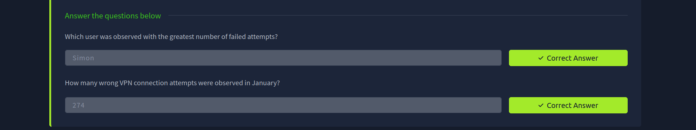

# 🚀 Elastic Stack SOC Lab

## 📝 Overview

In this lab, I explored the Elastic Stack (ELK) to understand how Security Operations Center (SOC) analysts collect, search, investigate, and visualize security logs. Using Kibana, I performed log analysis, investigated security events, and created dashboards to gain operational visibility into the monitored environment.

---

## 🎯 Objectives

- 📊 Understand the architecture and components of the Elastic Stack
- 🔍 Search and analyze log data using Kibana
- 🕵️ Investigate security events through log queries
- 📈 Build dashboards and visualizations for security monitoring
- 🛡️ Develop practical SOC log analysis skills

---

## 🛠️ Tools Used

- 📈 Elastic Stack (ELK)
- 📊 Kibana
- 🔎 Kibana Query Language (KQL)

---

## 🔬 Investigation Summary

### 📂 1. Log Exploration

Explored indexed log data within the Elastic environment to understand available log sources and event types.

---

### 🔍 2. Log Searching & Filtering

Performed searches using Kibana to:

- Filter specific events
- Query log data
- Identify suspicious patterns
- Narrow investigation scope

---

### 🕵️ 3. Event Investigation

Investigated security events by:

- Reviewing authentication activity
- Identifying unusual network behavior
- Examining failed login attempts
- Correlating related log events

---

### 📈 4. Dashboard & Visualization

Created dashboards and visualizations to:

- Display key security metrics
- Monitor user activity
- Visualize network traffic
- Improve operational visibility

---

## 🚨 Findings

The investigation demonstrated how Elastic Stack enables analysts to efficiently search, correlate, and visualize security events.

Evidence gathered during the lab included:

- 📊 High-volume network connections
- 👤 Users generating the most network traffic
- 🔐 Failed authentication attempts
- 🌐 Suspicious VPN connection activity
- 📈 Dashboard visualizations supporting security monitoring

---

# 📸 Refer to Screenshots for Reference

### IP with the Highest Number of Connections

---

### User Responsible for the Highest Network Traffic

---

### User with Failed Login Attempts

---

### Failed VPN Connection Attempts

---

### Result

---

## 📚 Key Learnings

- Elastic Stack provides centralized log collection, searching, and visualization capabilities.
- Kibana enables efficient investigation through powerful filtering and query features.
- Dashboards improve visibility into security events and operational metrics.
- Event correlation helps analysts identify suspicious activity more effectively.
- Log analysis forms a critical part of day-to-day SOC operations.

---

## 📚 Skills Gained

- 📈 Elastic Stack (ELK)
- 📊 Kibana
- 🔎 Kibana Query Language (KQL)
- 🕵️ Log Analysis
- 🚨 Security Event Investigation
- 📊 Dashboard Creation
- 🔗 Event Correlation
- 🛡️ SOC Monitoring

---

> QXV0aG9yOiBodHRwczovL2dpdGh1Yi5jb20vSEctNzU=