# 🔍 Linux Post-Access Attack Analysis

## 📖 Overview

In this lab, I investigated post-compromise attacker activity on a Linux system using authentication logs, Auditd telemetry, and Bash history. The investigation focused on identifying Discovery techniques, ingress tool transfer, SSH compromise, malware staging, and cryptominer deployment while reconstructing the complete attack lifecycle.

---

## 🎯 Objectives

- 🔍 Detect Discovery commands in Auditd logs and trace their origin using process tree analysis.
- 📥 Identify Ingress Tool Transfer activity through process execution and authentication logs.
- 🪙 Investigate a cryptominer infection chain from initial access through malware deployment.
- 🌳 Reconstruct attacker activity using authentication logs, Auditd telemetry, and Bash history.
- 🛡️ Analyze the Dota3 malware case from initial compromise through post-exploitation activities.

---

## 🛠️ Tools Used

### 📄 auth.log

Used to investigate:

- Successful SSH logins
- SSH brute-force attacks
- Authentication events from suspicious IP addresses

---

### 📊 Auditd

Used to analyze:

- Process creation
- Discovery commands
- Tool downloads
- Malware execution
- Process tree relationships

---

### 📜 Bash History

Used to recover:

- Attacker-executed commands
- Interactive shell activity
- Post-compromise actions

---

## 🔬 Investigation Summary

### 🔍 1. Discovery Activity Investigation

- Identified Discovery commands executed on the compromised system.
- Determined virtualization platform details.
- Investigated commands used to identify security and antimalware software.

---

### 🌳 2. Process Tree Reconstruction

- Investigated an alert generated by the `hostname` command.
- Traced execution through parent-child process relationships.
- Identified the malicious script responsible for executing Discovery commands.
- Retrieved the script author's email address.

---

### 📥 3. Ingress Tool Transfer Investigation

- Queried Auditd logs for file download activity.
- Identified the domain hosting the Elastic Agent installer.
- Located the downloaded `helper.sh` script on disk.

---

### 📂 4. Malicious File Assessment

- Compared downloaded files.
- Determined the most suspicious file based on execution context, download method, and associated attacker activity.

---

### 🔐 5. SSH Compromise Investigation

- Identified the IP address responsible for the successful SSH compromise.
- Determined the command used to enumerate recently logged-in users.
- Identified Endpoint Detection and Response (EDR) processes targeted by the attacker.

---

### 🦠 6. Malware Staging Investigation

- Traced the malicious archive transferred via SCP.
- Identified the hidden staging directory used to extract and deploy malware.

---

### 🪙 7. Cryptominer Investigation

- Retrieved the full command line used to execute the Dota3 cryptominer.
- Identified internal network ranges scanned by the bundled network scanning utility.

---

## 📚 Key Learnings

- Linux attackers typically progress through Discovery, tool transfer, malware staging, and impact.
- Process tree analysis is one of the most effective techniques for tracing malicious activity back to its origin.
- Auditd provides valuable runtime visibility that complements authentication logs and Bash history.
- Correlating multiple log sources enables accurate reconstruction of post-compromise attacker behavior.

---

## 📸 Screenshots

### Cloud Environment Detection

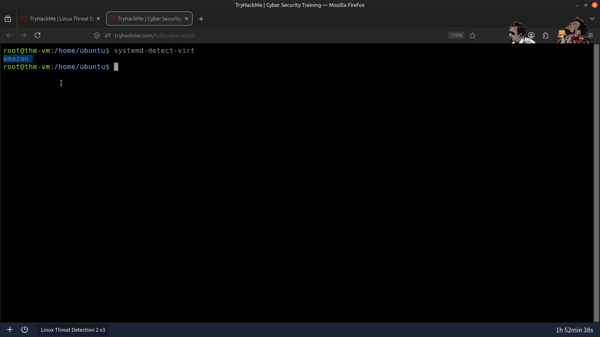

---

### Security & Antimalware Process Discovery

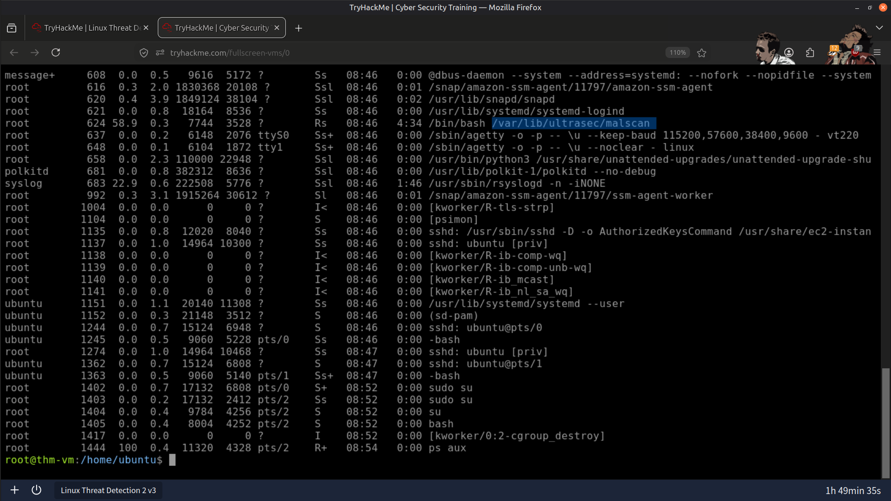

---

### Discovery Command Investigation

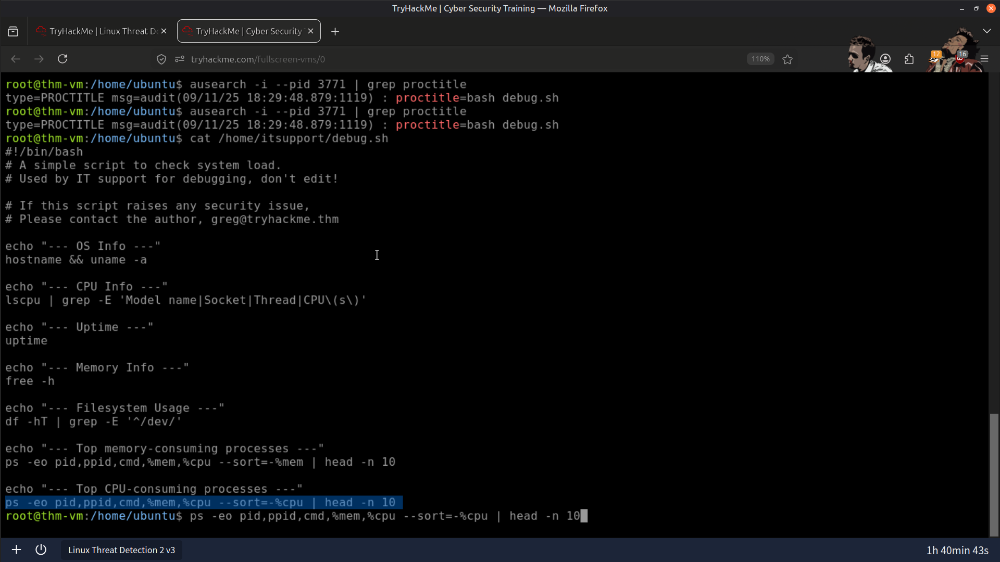

---

### Malicious Script Author Identification

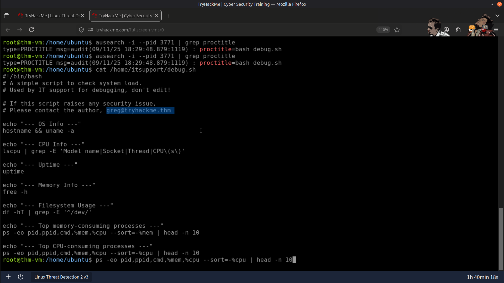

---

### Download Location of the Helper Script

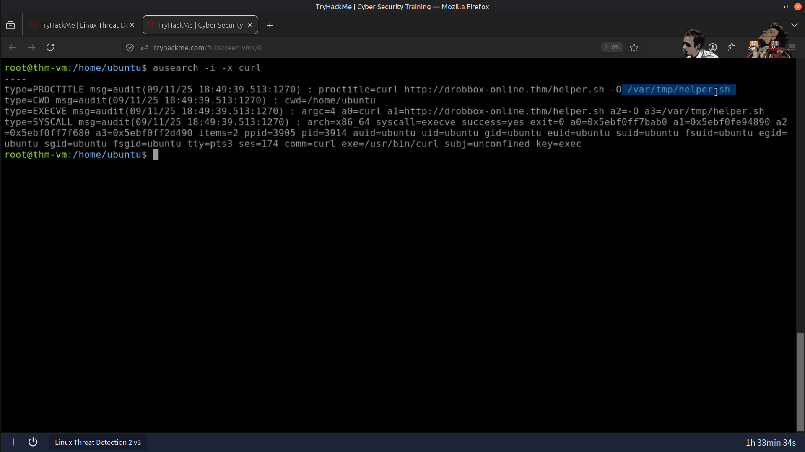

---

### Successful SSH Brute-Force Source IP

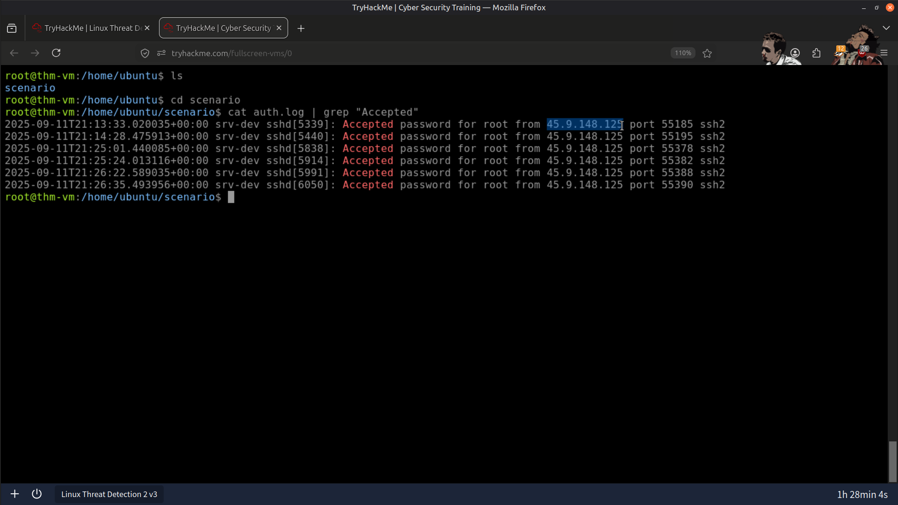

---

### Malicious Archive Transferred via SCP

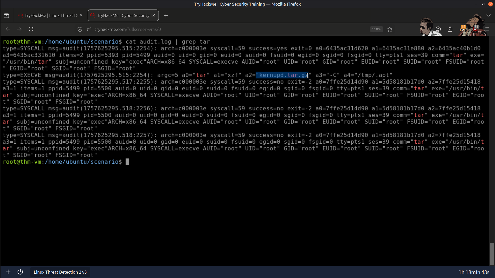

---

### Cryptominer Execution

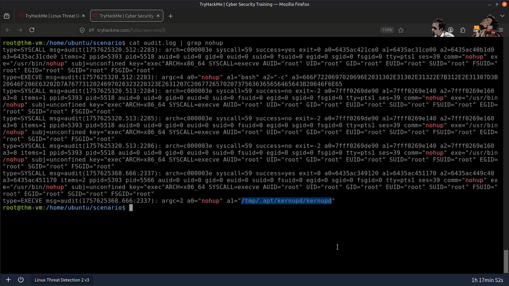

---

### Result

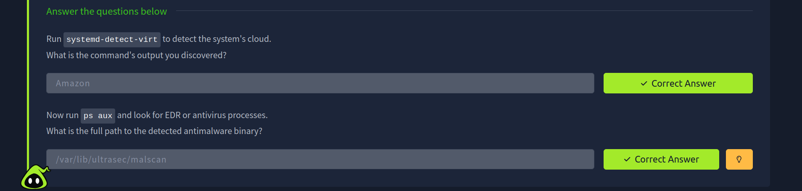

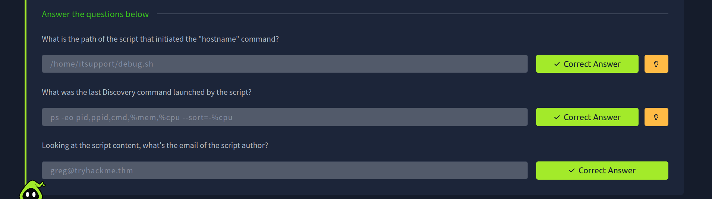

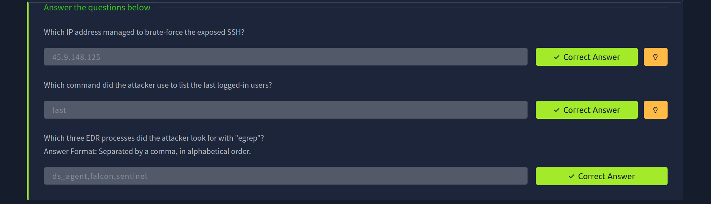

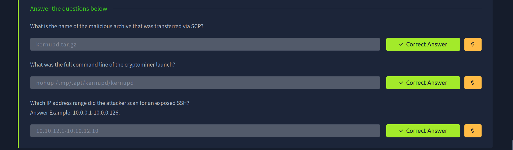

---

## 📚 Skills Gained

- 🐧 Linux Log Analysis
- 🔐 SSH Authentication Investigation
- 🌳 Process Tree Analysis
- 📊 Auditd Investigation
- 🔍 Discovery Technique Detection
- 📥 Ingress Tool Transfer Analysis
- 🦠 Malware Staging Investigation
- 🪙 Cryptominer Analysis
- 🚨 Incident Investigation
- 🛡️ Threat Hunting

---

## 🧩 Conclusion

This lab strengthened my understanding of Linux post-compromise investigations by demonstrating how attackers perform Discovery, transfer tools, stage malware, and deploy cryptominers after gaining initial access. By correlating authentication logs, Auditd telemetry, and Bash history, I reconstructed the complete attack chain using investigation techniques commonly employed by SOC analysts and incident responders.

---

> QXV0aG9yOiBodHRwczovL2dpdGh1Yi5jb20vSEctNzU=