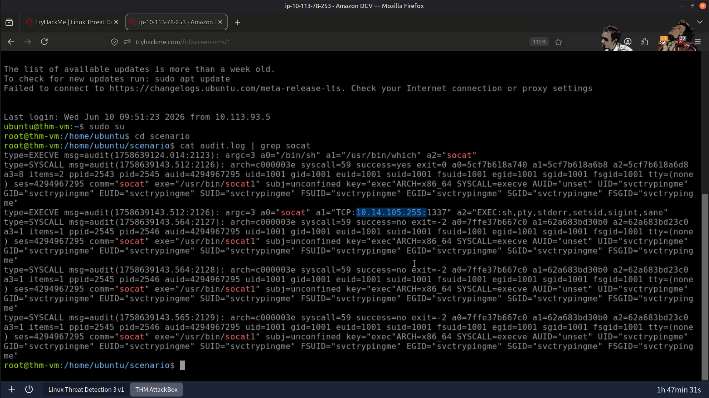
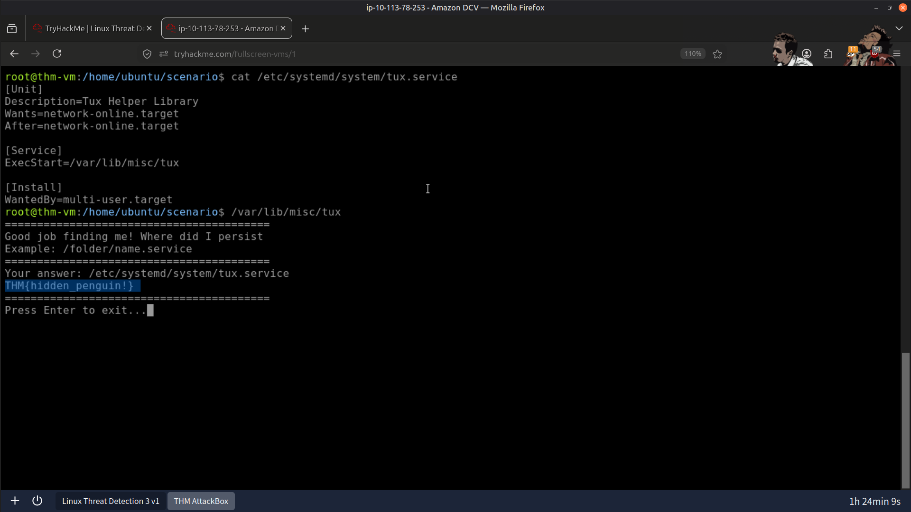
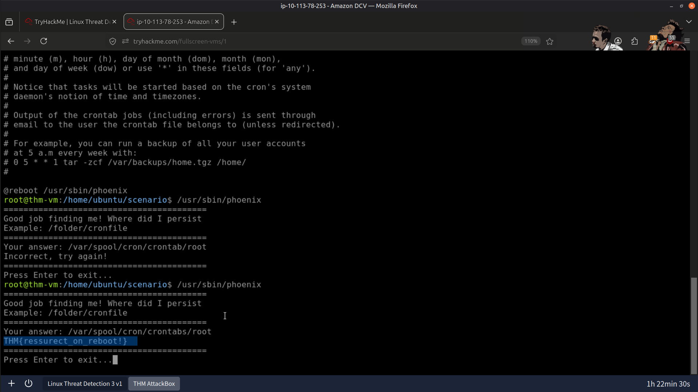
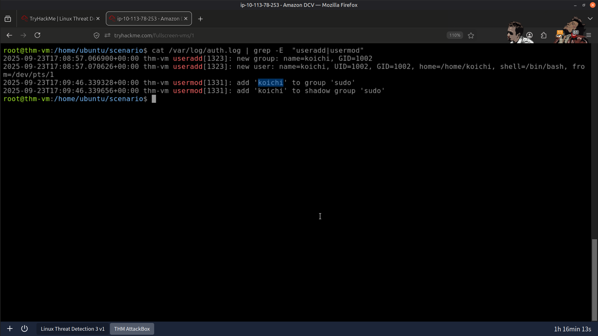
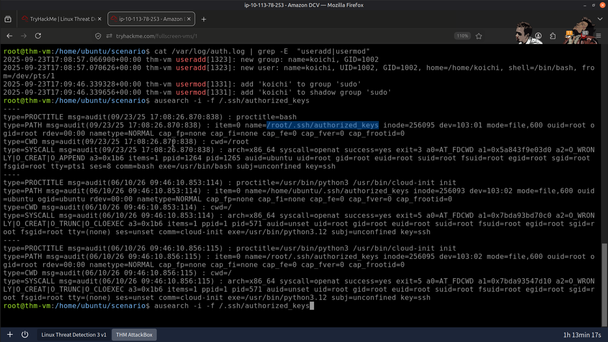
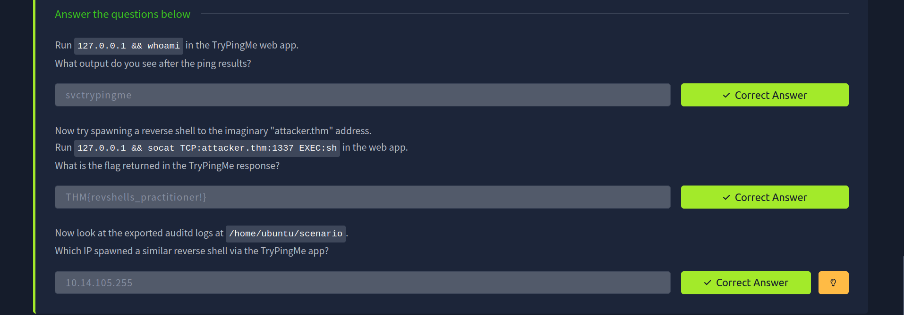
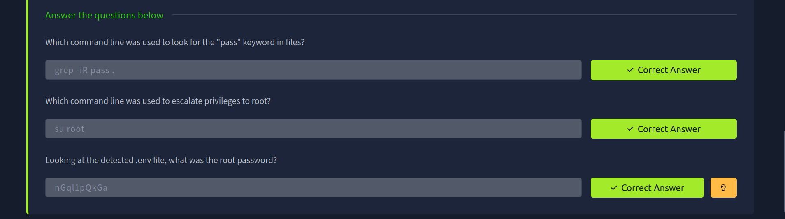
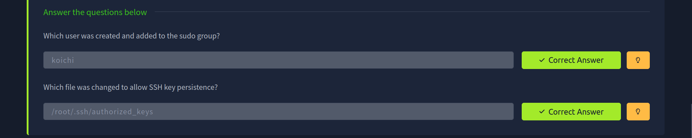

# 🛡️ Linux Intrusion Analysis Lab

## 📖 Overview

In this lab, I investigated multiple Linux intrusion techniques commonly used by attackers after gaining initial access. The investigation focused on identifying reverse shells, privilege escalation, persistence mechanisms, and unauthorized account creation through analysis of Linux system logs and audit records.

---

## 🎯 Objectives

- 🔌 Investigate reverse shell activity and identify attacker-controlled connections.
- ⬆️ Detect privilege escalation attempts through authentication and audit logs.
- 🔁 Identify persistence mechanisms used to maintain long-term access.
- 👤 Detect unauthorized user creation and SSH key persistence.
- 📊 Correlate multiple log sources to reconstruct the complete attack timeline.

---

## 🛠️ Tools Used

### 📜 ausearch

Used to query **auditd** logs for:

- Process execution
- File modifications
- Privilege escalation events

---

### 📄 Linux Command-Line Utilities

- `cat`
- `grep`
- `ausearch`

Used to examine:

- `auth.log`
- `authorized_keys`
- System configuration files
- Audit logs

---

### 📊 Linux Log Sources

#### 🔐 auth.log

Used to investigate:

- SSH authentication attempts
- Successful logins
- Privilege escalation events
- Suspicious authentication activity

#### 🔑 authorized_keys

Reviewed to identify:

- SSH key-based persistence
- Unauthorized public keys
- Backdoor access mechanisms

#### 🛡️ auditd Logs

Used to trace:

- Process execution
- Service creation
- Scheduled task execution
- File modifications

---

## 🔬 Investigation Summary

### 🔌 1. Reverse Shell Investigation

- Identified reverse shell activity initiated from the compromised host.
- Traced outbound connections established by the attacker.

---

### ⬆️ 2. Privilege Escalation Analysis

- Investigated privilege escalation activity.
- Identified suspicious command execution and elevated privileges through audit logs.

---

### 🔁 3. Persistence Investigation

Identified multiple persistence mechanisms including:

- Malicious systemd services
- Cron job persistence
- Startup modifications

---

### 👤 4. Account Persistence Analysis

Investigated authentication logs to identify:

- Unauthorized user creation
- SSH key injection into `authorized_keys`
- Backdoor account persistence

---

### 📊 5. Attack Timeline Reconstruction

Correlated authentication logs, audit records, and system artifacts to reconstruct the complete intrusion from initial compromise through persistence.

---

## 📚 Key Learnings

- Reverse shells provide attackers with remote command execution after compromise.
- Privilege escalation enables attackers to gain administrative control of Linux systems.
- Persistence mechanisms allow attackers to maintain long-term access across system reboots.
- Authentication logs and audit records provide complementary visibility into attacker activity.
- Correlating multiple evidence sources is essential for accurate incident reconstruction.

---

## 📸 Screenshots

### Reverse Shell Connection Established

---

### Malicious Systemd Service Persistence

---

### Malicious Cron Job Persistence

---

### Backdoor User Account Created by the Threat Actor

---

### SSH Authorized Keys File Modification

---

### Result

---

## 📚 Skills Gained

- 🐧 Linux Log Analysis
- 🔐 Authentication Log Investigation
- 🛡️ auditd Analysis
- 🔌 Reverse Shell Detection
- ⬆️ Privilege Escalation Investigation
- 🔁 Linux Persistence Detection
- 👤 Account Compromise Investigation
- 📊 Attack Timeline Reconstruction
- 🚨 Incident Investigation

---

## 🧩 Conclusion

This lab strengthened my understanding of Linux intrusion investigations by demonstrating how attackers establish remote access, escalate privileges, maintain persistence, and create backdoor accounts. By correlating authentication logs, audit records, and system artifacts, I reconstructed the complete attack lifecycle using techniques commonly employed in SOC and incident response investigations.

---

> QXV0aG9yOiBodHRwczovL2dpdGh1Yi5jb20vSEctNzU=