# 🔐 SSH Compromise & Reverse Shell Analysis

## 🎯 Objectives

- 🔎 Detect SSH brute-force attempts and successful authentication events using Linux authentication logs.
- 🌐 Analyze web server logs to identify command injection against a vulnerable Python web application.
- 🌳 Reconstruct process trees using `auditd` to trace suspicious processes back to their parent services.
- 🧠 Investigate attacker activity from initial access through reverse shell execution.
- 🔁 Demonstrate how process tree analysis supports incident investigation across different Initial Access techniques.

---

## 🛠️ Tools & Resources

- 📄 **auth.log** – Investigated SSH authentication attempts, successful logins, and attacker IP addresses.
- 🌍 **Nginx Access Log** – Identified malicious HTTP requests and command injection attempts.
- 🧩 **auditd** – Reconstructed process trees using PID and PPID relationships to trace attacker activity.

---

## 🧪 Investigation Summary

### 🔐 1. SSH Authentication Analysis

- Reviewed `auth.log` to identify the first successful SSH login for the `ubuntu` user.
- Determined the authentication method used during the login.

---

### 🚨 2. SSH Brute-Force Investigation

- Analyzed failed SSH authentication attempts.
- Identified:
  - ⏱️ Time the brute-force attack began
  - 👤 User accounts targeted
  - 🌐 IP address that successfully compromised the `root` account

---

### 🌐 3. Web Exploitation Investigation

- Examined Nginx access logs.
- Identified:
  - Attacker IP address
  - Vulnerable web endpoint
  - 💉 Command injection payload embedded within HTTP requests

---

### 📂 4. Vulnerable Application Investigation

- Identified the vulnerable Python application targeted by the attacker.
- Retrieved the flag stored within the vulnerable file.

---

### 🧩 5. Process Tree Reconstruction

- Used `auditd` process logs to trace execution of the `whoami` command back to its originating process using PPID relationships.

---

### 🕵️ 6. Reverse Shell Investigation

- Reconstructed the complete attack chain.
- Identified child processes spawned by the compromised web application.
- Determined the program responsible for establishing the reverse shell.

---

## 🌳 Example Process Tree

```text
1 (systemd)
└── 577 (Python web application)
    └── 1018 (Reverse shell)
        └── 1020 (Attacker command execution)
```

---

## 📚 Key Learnings

- Linux initial access can occur through multiple techniques, but investigation methodology remains consistent.
- Process tree reconstruction is an effective technique for tracing malicious activity back to the initial compromise.
- Application logs identify exploitation attempts, while `auditd` provides detailed visibility into process execution.
- Correlating authentication logs, web server logs, and process telemetry enables accurate reconstruction of attacker activity.

---

## 📸 Screenshots

### Successful SSH Login by the Ubuntu User

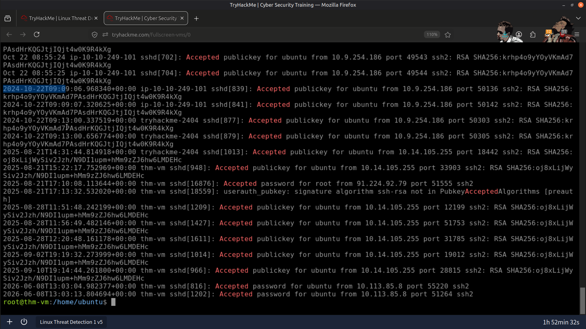

---

### SSH Password Brute-Force Activity

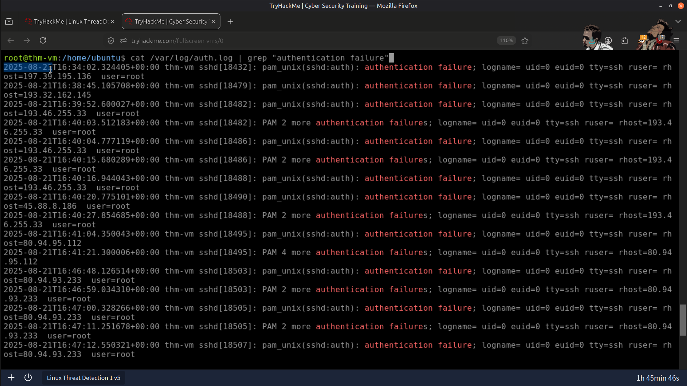

---

### Multiple Failed SSH Login Attempts Against User Accounts

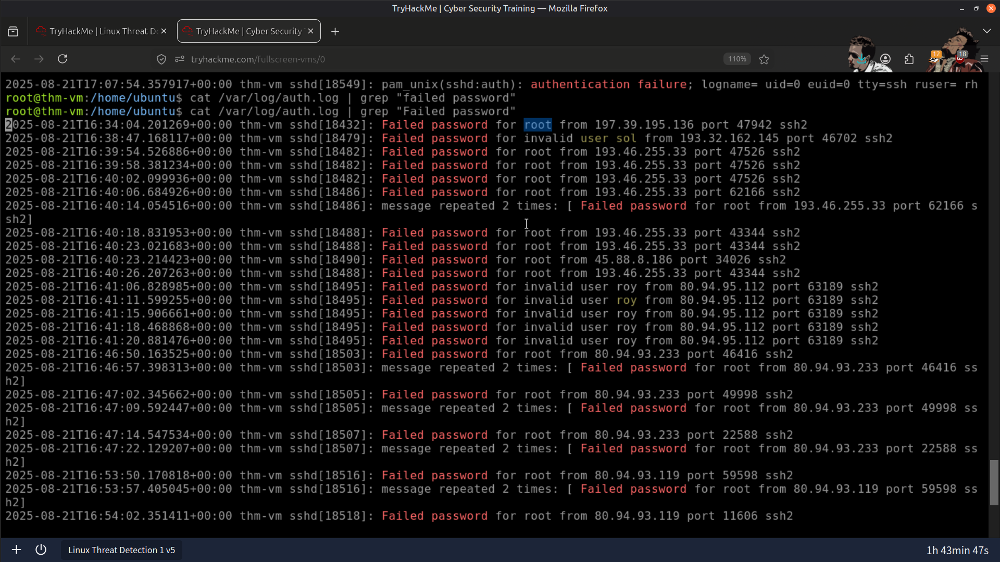

---

### Successful Root Account Compromise from a Suspicious IP Address

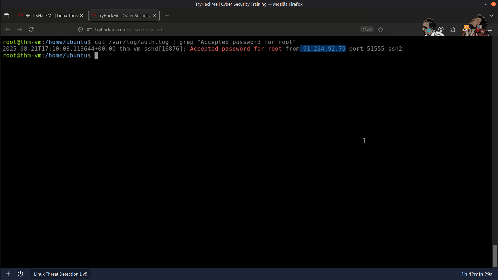

---

### Vulnerable Python Application

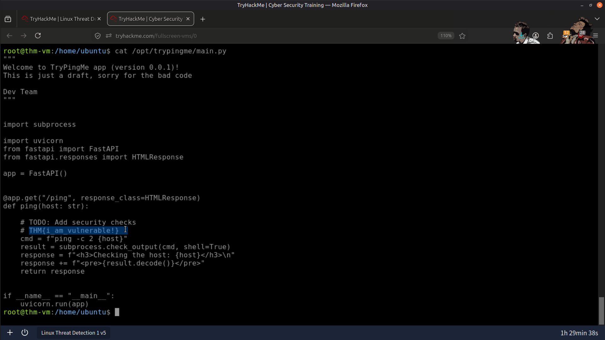

---

### Process Tree Reconstruction Using PPID Relationships

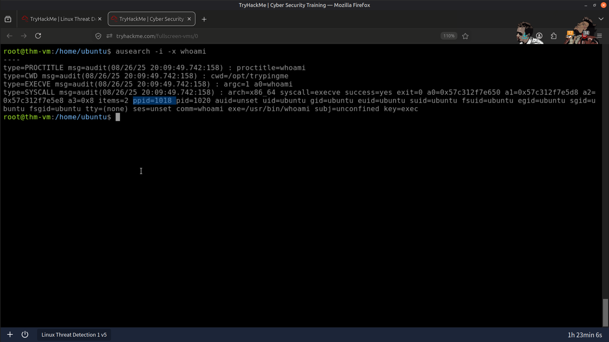

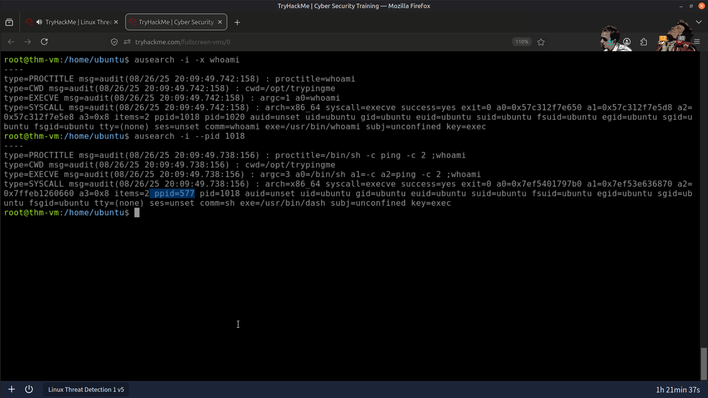

---

### Reverse Shell Executed via Python

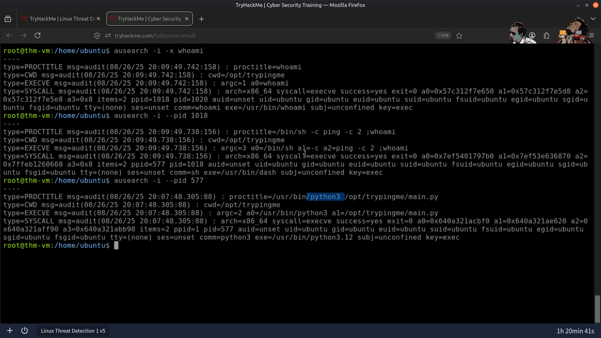

---

### Result

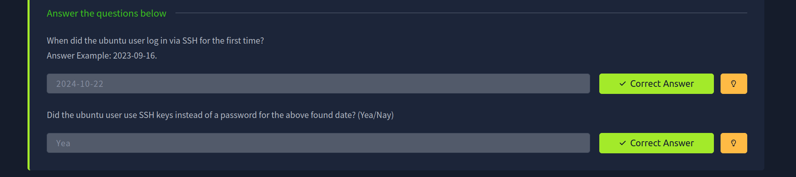

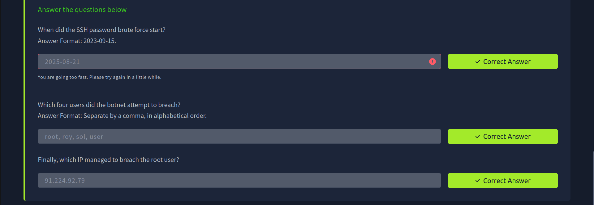

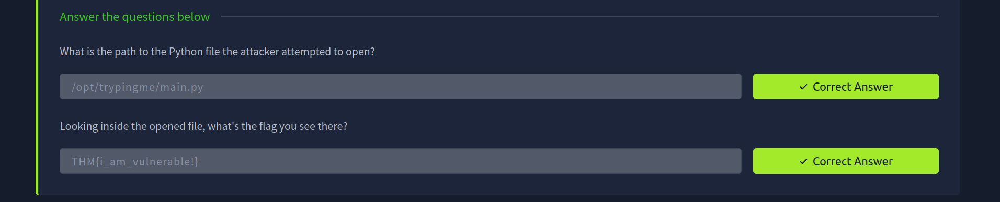

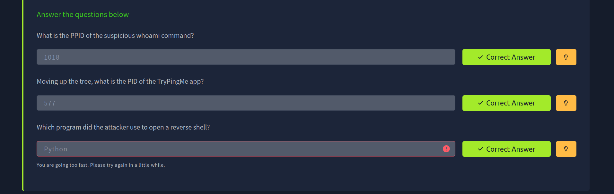

---

## 📚 Skills Gained

- 🔐 Linux Authentication Log Analysis
- 🌐 Web Server Log Analysis
- 💉 Command Injection Investigation
- 🌳 Process Tree Analysis
- 🧩 Linux Process Monitoring (`auditd`)
- 🛡️ Reverse Shell Detection
- 🚨 Incident Investigation
- 📊 Threat Hunting

---

> QXV0aG9yOiBodHRwczovL2dpdGh1Yi5jb20vSEctNzU=