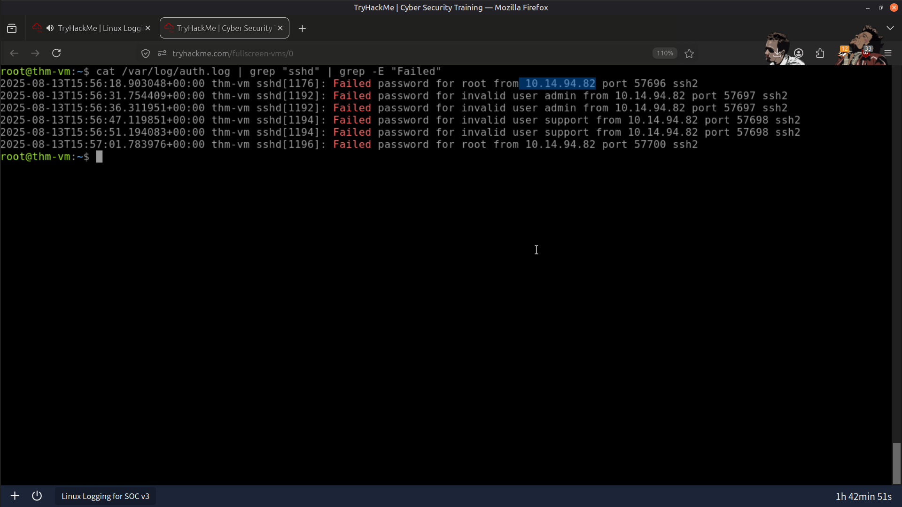
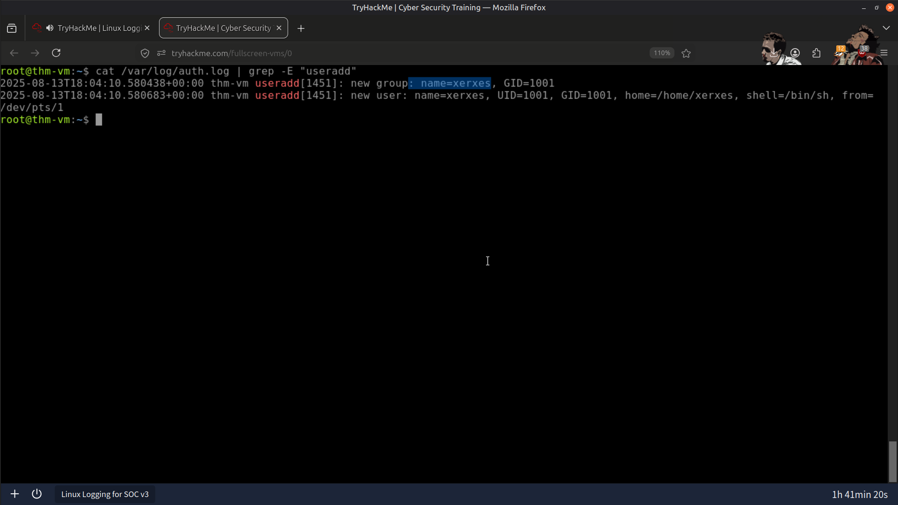
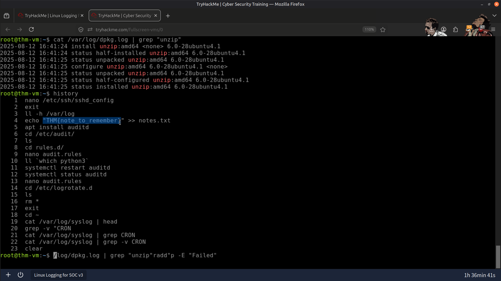

# 🐧 Linux System Logs Analysis

## 📖 Overview

In this lab, I investigated multiple Linux log sources to identify authentication attacks, unauthorized user creation, software installation activity, and runtime events associated with potential attacker behavior.

The investigation combined system logs, authentication logs, Bash history, and Auditd records to reconstruct attacker activity and demonstrate how multiple evidence sources can be correlated during a SOC investigation.

---

## 🎯 Objectives

- 🔍 Analyze Linux authentication, runtime, and system logs.
- 🚨 Investigate SSH brute-force attempts and unauthorized user creation.
- 📦 Examine package manager logs to identify installed software.
- 📜 Recover attacker commands from user Bash history files.
- 🛡️ Use Auditd to investigate process execution, file access, and network activity.

---

## 🛠️ Tools & Resources

### 📄 Linux Log Files

Analyzed the following log sources:

- `syslog` – General system activity and service events.
- `auth.log` – Authentication attempts and user management events.
- `kern.log` – Kernel-related messages.
- Package manager logs – Software installation and update history.

### 🖥️ Bash History

Investigated per-user `.bash_history` files to recover previously executed commands.

### 🔎 Auditd

Used the Linux Audit Framework to investigate:

- Process execution
- File access
- Network activity
- Custom audit rules and audit keys

---

## 🔍 Investigation Summary

### 🔹 System Log Review

- Reviewed `syslog` to identify the NTP server contacted for system time synchronization.
- Identified security-related kernel messages generated by **Yama**.

### 🔹 SSH Brute-Force Investigation

- Analyzed `auth.log`.
- Identified repeated failed SSH login attempts.
- Determined the source IP responsible for attacking multiple user accounts.

### 🔹 Unauthorized User Investigation

- Investigated user management events.
- Identified a suspicious user account created by the attacker.
- Confirmed the account's addition to the **sudo** group.

### 🔹 Package Analysis

- Reviewed package manager logs.
- Identified the installed version of the **unzip** package.

### 🔹 Bash History Investigation

- Examined user `.bash_history` files.
- Recovered attacker commands executed interactively.

### 🔹 Auditd File Access Investigation

- Queried Auditd logs using configured audit keys.
- Determined the first access timestamp of a monitored sensitive file.

### 🔹 Download Activity Investigation

- Used the `proc_wget` audit key.
- Identified a file downloaded from GitHub.
- Traced the originating process responsible for the download.

### 🔹 Network Scanning Investigation

- Investigated Auditd events related to network activity.
- Identified the network range scanned using the downloaded utility.

---

## 📚 Key Learnings

This investigation demonstrated the importance of correlating multiple Linux log sources during incident response.

Authentication logs, system logs, Bash history, and Auditd each provide different perspectives of attacker activity. When combined, they allow analysts to reconstruct attack timelines, identify persistence mechanisms, recover attacker commands, and investigate runtime behavior.

The exercise strengthened practical skills in Linux log analysis, Auditd investigations, and evidence correlation commonly performed by SOC analysts and incident responders.

---

## 📸 Screenshots

### Multiple Failed SSH Login Attempts from a Suspicious IP Address

---

### Unauthorized User Added to the Sudo Group

---

### User Bash History Investigation

---

### Result

---

## 🧠 Skills Demonstrated

- Linux Log Analysis
- Authentication Log Investigation
- SSH Brute-Force Detection
- Auditd Investigation
- Bash History Analysis
- User Account Investigation
- Package Analysis
- Threat Hunting
- Incident Response
- SOC Investigation Methodology

---

## ✅ Conclusion

This lab provided practical experience investigating Linux systems using native log sources and the Audit Framework. By correlating authentication logs, system logs, Bash history, and Auditd events, I was able to reconstruct attacker activity, identify unauthorized user creation, recover executed commands, and investigate suspicious runtime behavior using a structured SOC investigation methodology.

---

> QXV0aG9yOiBodHRwczovL2dpdGh1Yi5jb20vSEctNzU=