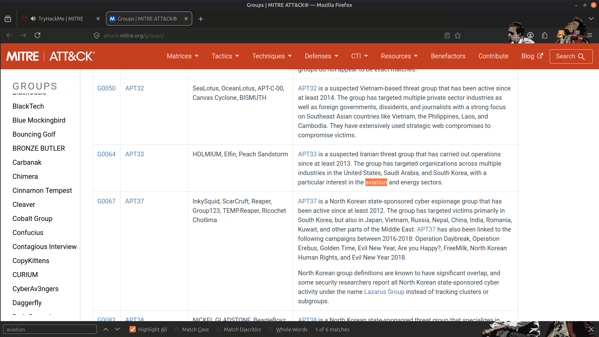
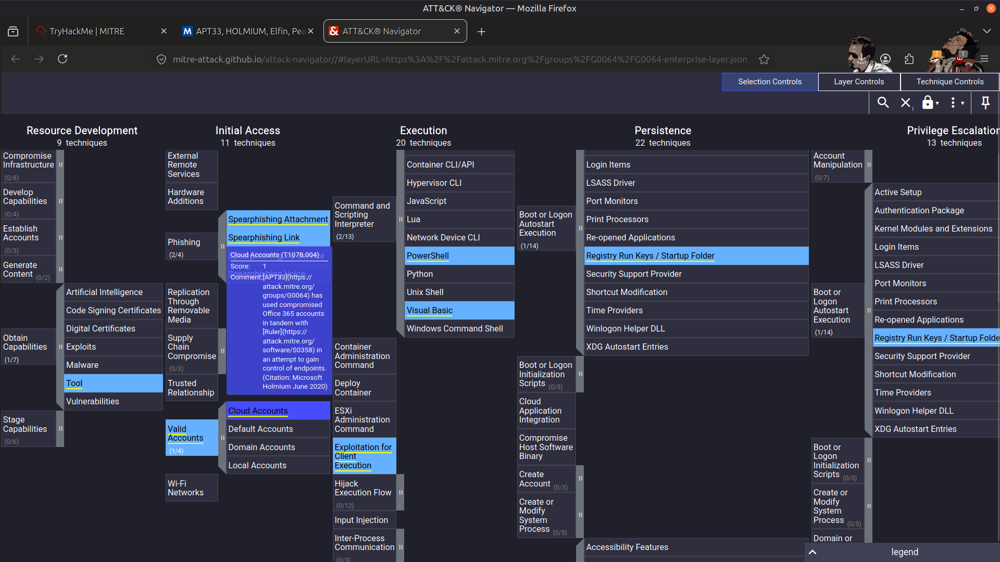
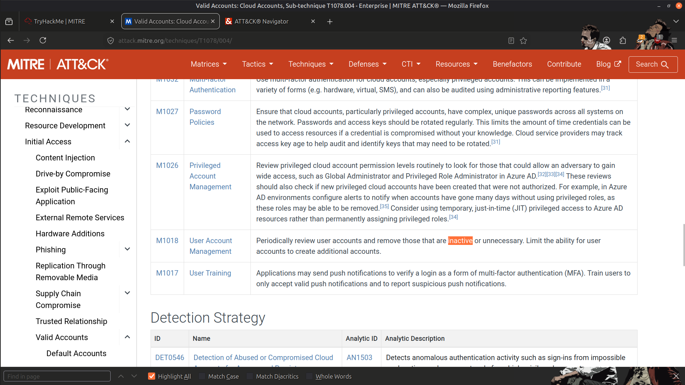
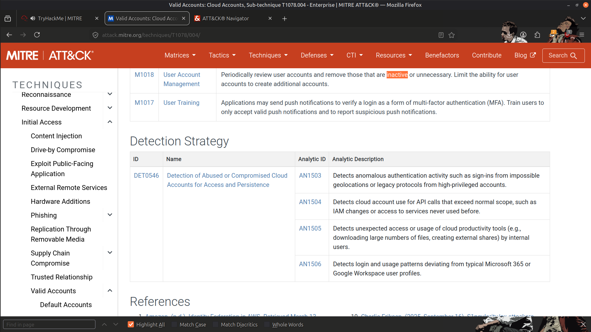
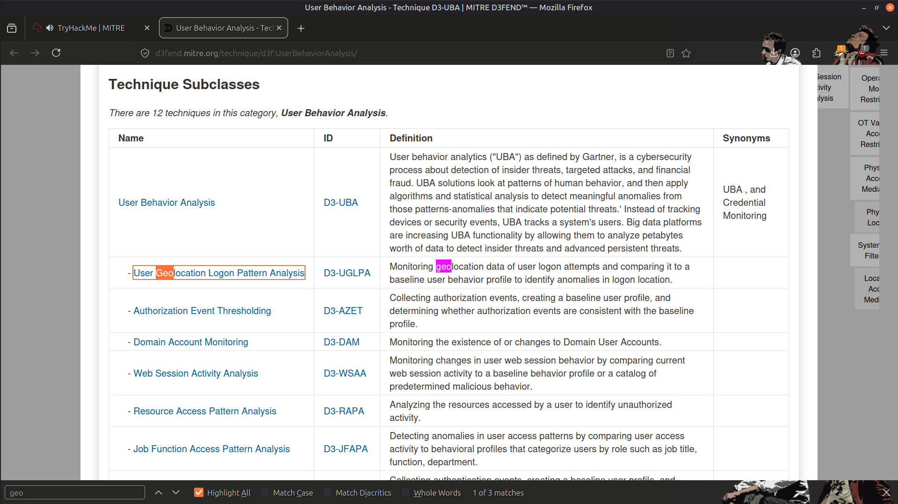
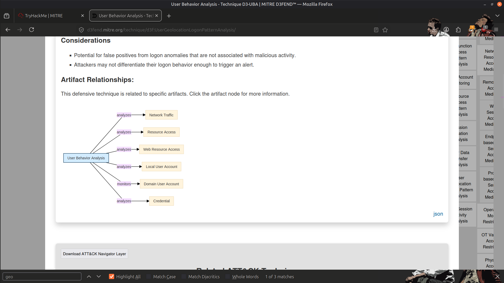
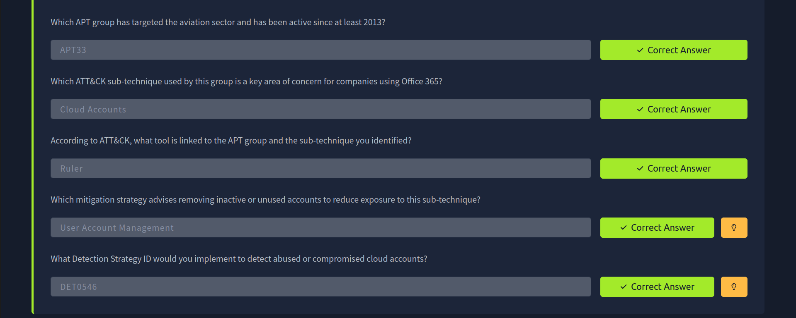
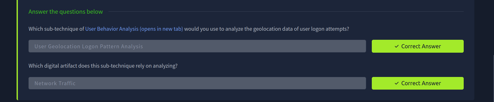

# 🛡️ MITRE ATT&CK & D3FEND – Practical Lab

## 📖 Overview

In this lab, I explored how the **MITRE ATT&CK** and **MITRE D3FEND** frameworks can be used together to understand adversary behavior and map defensive countermeasures.

The exercises focused on identifying attacker techniques, understanding threat actor behavior, and selecting appropriate detection and mitigation strategies commonly used by Security Operations Center (SOC) analysts and Blue Teams.

---

## 🎯 Objectives

- Understand the structure of the MITRE ATT&CK framework.
- Identify adversary tactics and techniques used during an attack.
- Map defensive countermeasures using the MITRE D3FEND framework.
- Explore detection strategies for common attack techniques.
- Strengthen understanding of threat-informed defense.

---

## 🛠️ Frameworks Used

- 🛡️ **MITRE ATT&CK**
- 🛡️ **MITRE D3FEND**

---

## 🔍 Practical Activities

During this lab, I completed the following activities:

- Identified an Advanced Persistent Threat (APT) group targeting the aviation sector.
- Investigated cloud account abuse techniques documented in the ATT&CK framework.
- Mapped defensive techniques using MITRE D3FEND.
- Explored mitigation strategies for compromised user accounts.
- Investigated user geolocation logon patterns as a detection technique.
- Reviewed network traffic analysis techniques used to identify malicious activity.

---

## 📚 Key Learnings

This lab demonstrated how ATT&CK and D3FEND complement each other by linking attacker techniques with defensive strategies.

Rather than simply identifying malicious activity, the frameworks help analysts understand:

- How adversaries achieve their objectives.
- Which detections are most effective.
- Which mitigations reduce attack success.
- How threat intelligence supports SOC investigations.

The exercises reinforced the importance of using standardized security frameworks to improve detection engineering, threat hunting, and incident response.

---

## 📸 Screenshots

### APT Group Targeting the Aviation Sector

---

### Cloud Account Abuse Technique

---

### User Account Management Mitigation

---

### Detection Strategy for Compromised Cloud Accounts

---

### User Geolocation Logon Pattern Analysis

---

### Network Traffic Analysis

---

### Result

---

## 🧠 Skills Demonstrated

- MITRE ATT&CK Framework
- MITRE D3FEND Framework
- Threat Intelligence
- Threat Modeling
- Adversary Emulation Concepts
- Detection Strategy Mapping
- Defensive Security Concepts
- SOC Investigation Methodology

---

## ✅ Conclusion

This lab strengthened my understanding of how industry-standard security frameworks support real-world SOC operations. By correlating attacker techniques with defensive measures, I gained practical experience in threat-informed defense, detection planning, and security analysis using the MITRE ATT&CK and D3FEND frameworks.

---

> QXV0aG9yOiBodHRwczovL2dpdGh1Yi5jb20vSEctNzU=