# 🧪 LOL Attack Analysis

## 🕵️ Shadow Trace

---

## 📖 Overview

In this lab, I investigated a suspicious binary and correlated its indicators of compromise (IOCs) with Endpoint Detection and Response (EDR) alerts to determine the scope of malicious activity.

The investigation combined static malware analysis, threat intelligence, and SOC alert triage to reconstruct attacker behavior and validate suspicious network indicators.

---

## 🎯 Objectives

- 🔍 Extract indicators of compromise (IOCs) from a suspicious binary.
- 🧩 Correlate EDR alerts with malicious activity.
- 🛡️ Perform SOC triage to determine the scope and impact of the attack.
- 🌐 Validate malicious infrastructure using threat intelligence sources.

---

## 🧰 Tools Used

- 🧪 PEStudio
- 🌐 VirusTotal
- 🔎 Robtex
- 🍳 CyberChef
- 💻 Windows VM
- 📊 EDR Console

---

## 🔍 Investigation Summary

### 🦠 Static Malware Analysis

Performed static analysis of the suspicious executable by:

- Identifying the binary architecture.
- Generating and reviewing the SHA-256 file hash.
- Extracting embedded URLs and domains as indicators of compromise (IOCs).
- Reviewing imported libraries associated with networking and socket communication.
- Decoding embedded strings and artifacts using CyberChef.
- Validating extracted domains and URLs using VirusTotal and Robtex.

---

### 🚨 EDR Alert Investigation

Performed SOC alert triage by:

- Investigating EDR alerts involving `powershell.exe` and `chrome.exe`.
- Identifying malicious URLs referenced by PowerShell scripts.
- Decoding and analyzing suspicious script content.
- Correlating endpoint alerts with IOCs extracted during malware analysis.
- Validating attacker infrastructure using external threat intelligence.

---

## 📚 Key Learnings

- Practiced static malware analysis using PEStudio.
- Extracted and validated indicators of compromise from a suspicious executable.
- Correlated endpoint alerts with malware artifacts to reconstruct attacker activity.
- Applied threat intelligence to validate malicious infrastructure.
- Improved understanding of SOC investigation workflows involving malware analysis and EDR triage.

---

## 📸 Screenshots

### Suspicious File Metadata

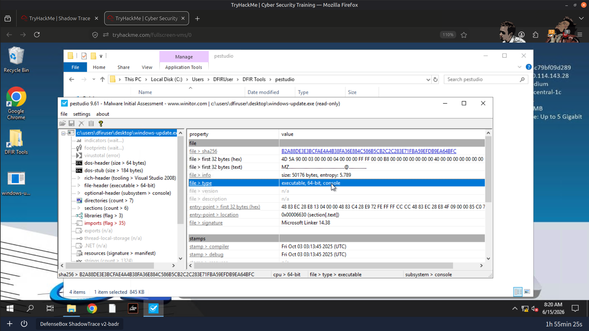

---

### Extracted Strings & Indicators of Compromise

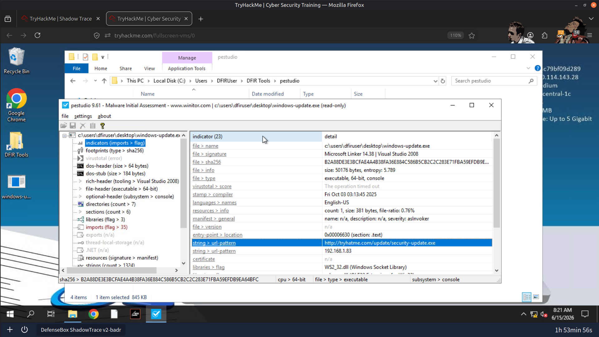

---

### Imported Network Libraries

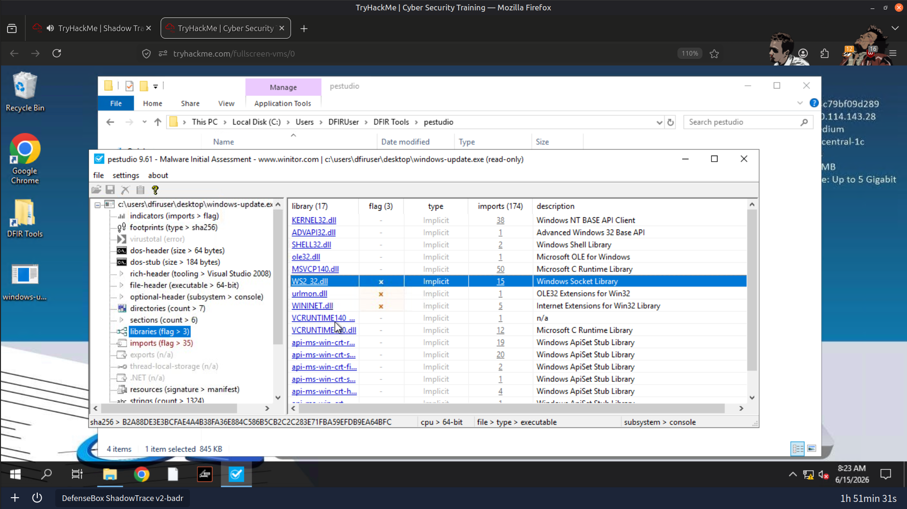

---

### Malicious Domain Extracted from Binary

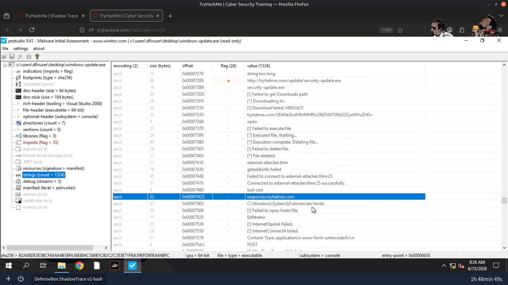

---

### Decoded Flag

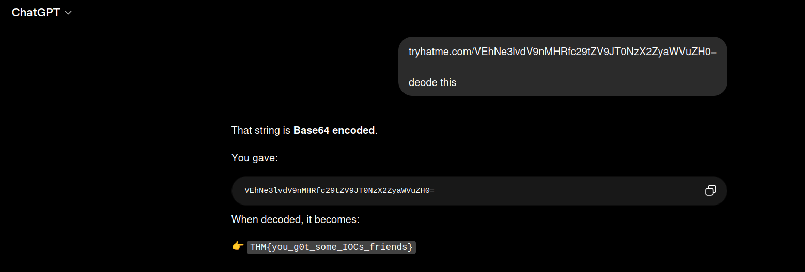

---

### PowerShell EDR Alert

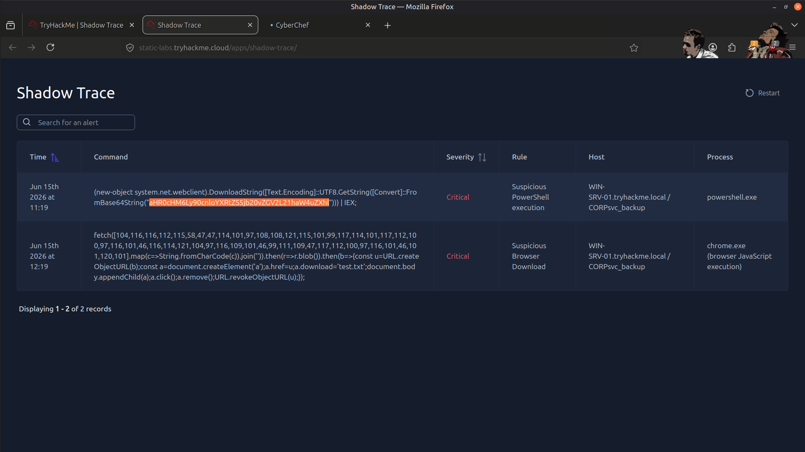

---

### Malicious URL Extracted from PowerShell Script

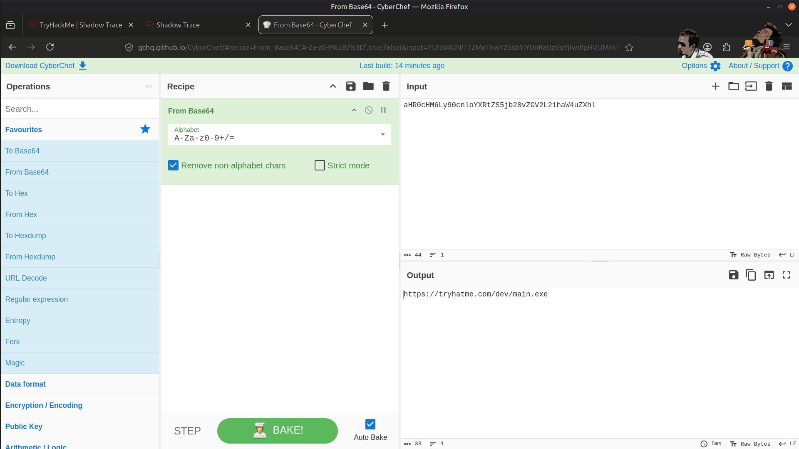

---

### Chrome EDR Alert

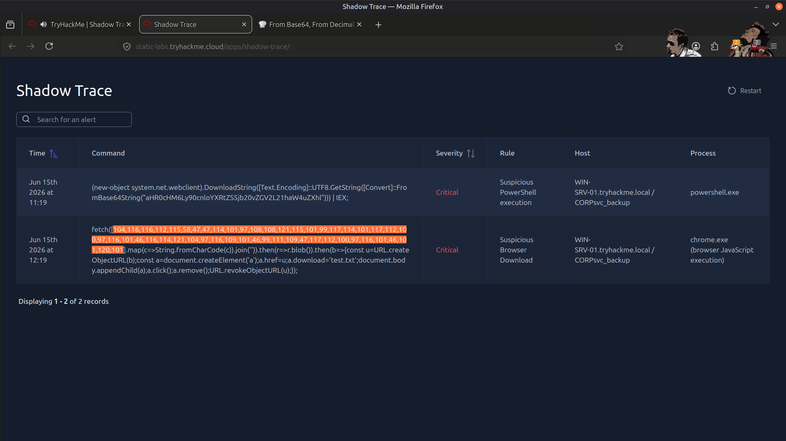

---

### CyberChef Script Decoding

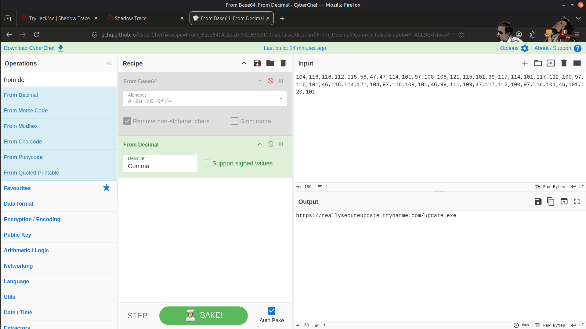

---

### Result

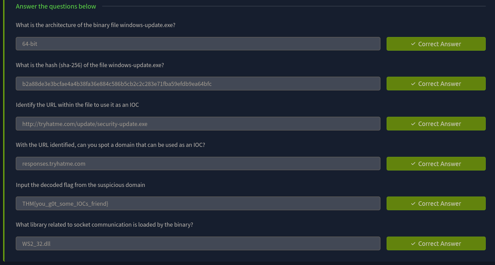

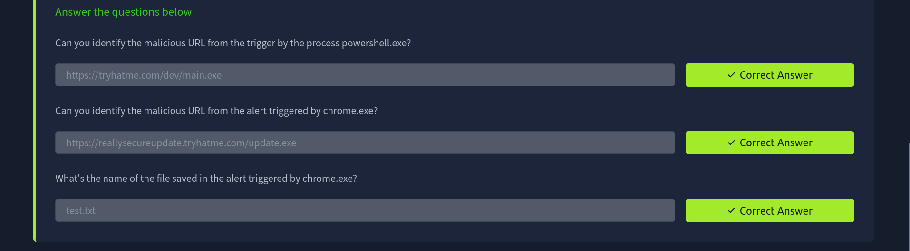

---

## 🧠 Skills Demonstrated

- Static Malware Analysis
- IOC Extraction
- Threat Intelligence
- PEStudio Analysis
- VirusTotal Investigation
- Robtex Analysis
- CyberChef Decoding
- EDR Alert Triage
- SOC Investigation
- Threat Hunting

---

## ✅ Conclusion

This investigation provided practical experience in combining malware analysis, endpoint detection, and threat intelligence to investigate suspicious activity. By correlating binary artifacts with EDR alerts and external intelligence, I was able to identify malicious infrastructure, validate indicators of compromise, and reconstruct attacker behavior using a structured SOC investigation methodology.

---

> QXV0aG9yOiBodHRwczovL2dpdGh1Yi5jb20vSEctNzU=