# 🦠 Malware Analysis – Redline

## 📖 Overview

In this lab, I performed both static and sandbox-assisted dynamic analysis of a suspicious Redline malware sample to determine its characteristics, behavior, and potential impact.

The investigation focused on safely identifying malware indicators without executing the sample locally, using industry-standard malware analysis tools and threat intelligence platforms.

---

## 🎯 Objectives

- 🔍 Determine whether a suspicious file exhibits malicious characteristics.
- 📄 Perform static analysis to identify file properties without execution.
- 🧪 Analyze sandbox-generated behavioral reports to understand runtime activity.
- 🌐 Validate malware indicators using threat intelligence platforms.
- 🔒 Apply safe malware handling practices within an isolated environment.

---

## 🛠️ Tools Used

- 🐧 REMnux VM
- 💻 Linux Command-Line Utilities
  - `file`
  - `strings`
  - `md5sum`
  - `sha1sum`
  - `sha256sum`
- 📋 PEcheck
- 🌳 PE-Tree
- 🛡️ VirusTotal
- 🔬 Hybrid Analysis

---

## 🔍 Investigation Summary

During this investigation, I performed the following activities:

- Identified the true file type of suspicious samples using file inspection utilities.
- Extracted readable strings to identify APIs, imported libraries, and embedded indicators of compromise (IOCs).
- Generated MD5, SHA1, and SHA256 hashes for malware identification.
- Validated malware hashes using VirusTotal to review detection results and reputation.
- Inspected Portable Executable (PE) headers, section layout, entropy values, and imported functions using PEcheck.
- Visualized the executable structure and imported APIs using PE-Tree.
- Reviewed Hybrid Analysis sandbox reports to safely examine runtime behavior.
- Investigated process creation, network activity, and behavioral indicators reported by the sandbox.
- Identified indicators of packing, obfuscation, and potential sandbox evasion techniques.

---

## 📚 Key Learnings

This investigation demonstrated the importance of combining static analysis with sandbox-assisted behavioral analysis to understand suspicious executables safely.

By correlating file metadata, executable structure, imported APIs, threat intelligence, and sandbox observations, it was possible to build a comprehensive understanding of the malware without executing it locally.

The exercise strengthened practical skills in malware triage, indicator extraction, PE analysis, and threat intelligence validation.

---

## 📸 Screenshots

### Suspicious File Metadata

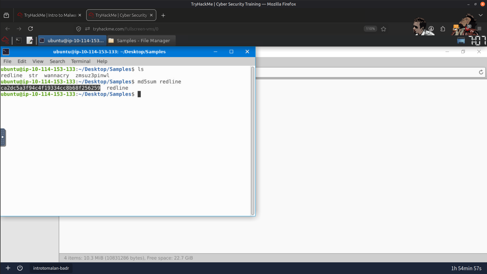

---

### PEcheck Analysis

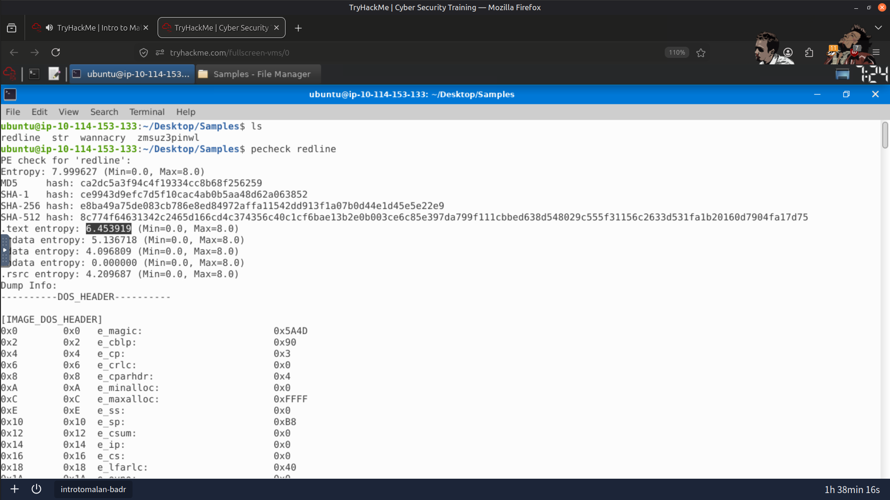

---

### PE-Tree Structure Analysis

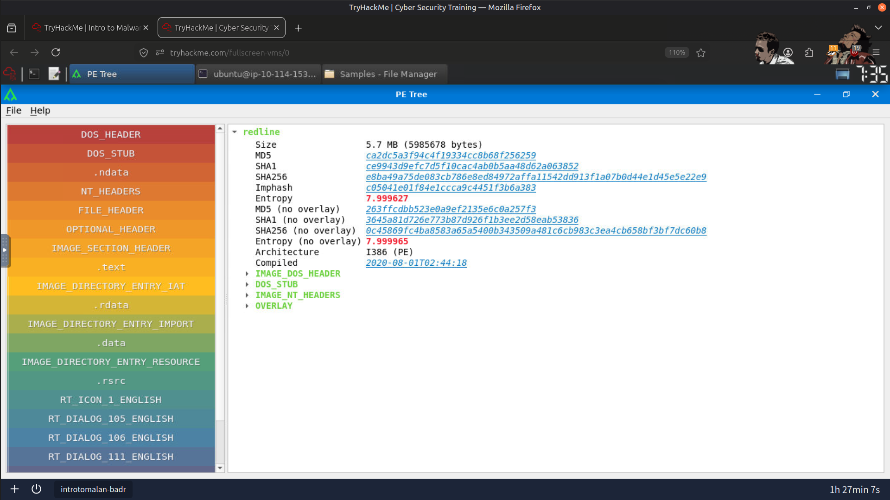

---

### VirusTotal Detection Results

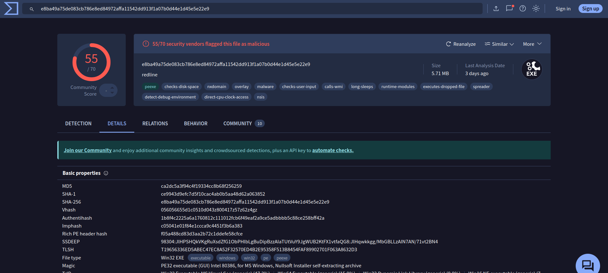

---

### Hybrid Analysis Behavioral Reports

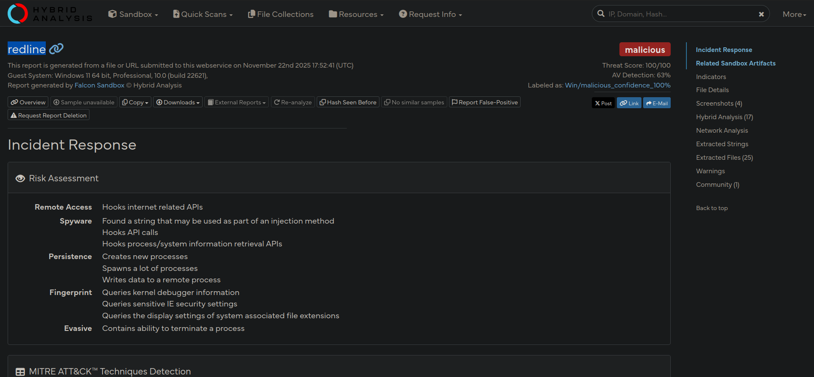

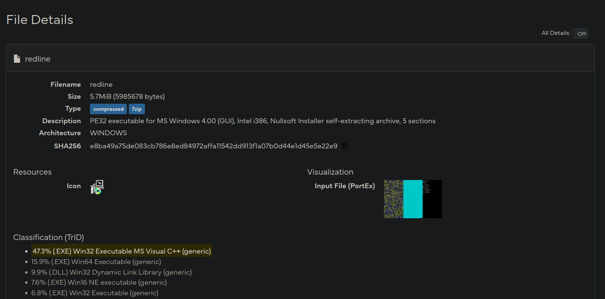

---

### Process Tree Analysis

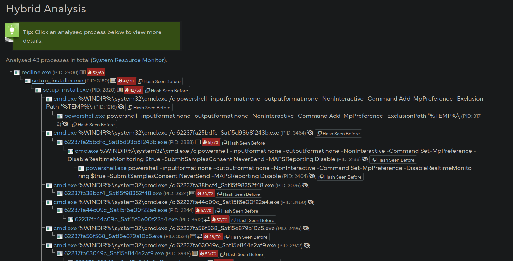

---

### Network Activity

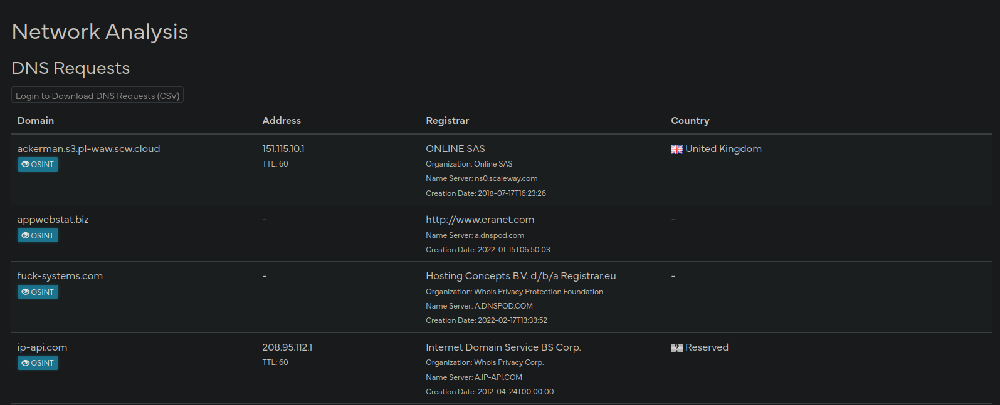

---

### Network Infrastructure

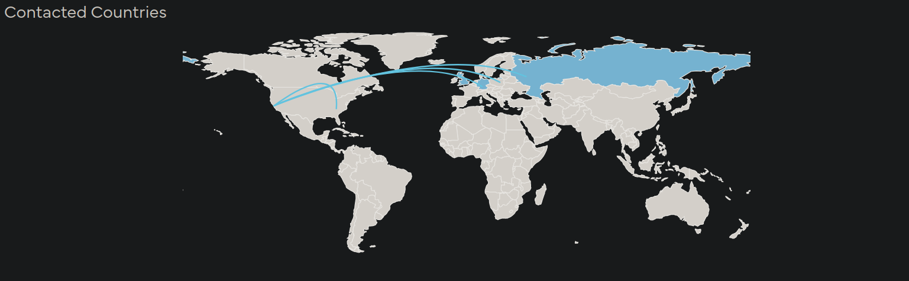

---

### Result

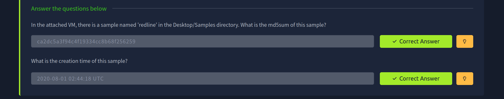

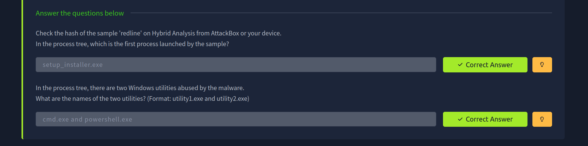

---

## 🧠 Skills Demonstrated

- Static Malware Analysis
- Portable Executable (PE) Analysis
- Malware Triage
- Threat Intelligence
- VirusTotal Investigation
- Hybrid Analysis
- IOC Extraction
- Sandbox Report Analysis
- Network Behavior Analysis
- SOC Investigation Methodology

---

## ✅ Conclusion

This investigation provided practical experience in safely analyzing suspicious malware samples using a structured SOC-oriented workflow. By combining static analysis, sandbox behavioral reports, and threat intelligence, I was able to identify malware characteristics, extract indicators of compromise, and assess potential malicious behavior without exposing the analysis environment to unnecessary risk.

---

> QXV0aG9yOiBodHRwczovL2dpdGh1Yi5jb20vSEctNzU=