# 🔥 Multiple Endpoints Compromise Investigation

## 🎯 Objectives

- 🖥️ Investigate the initial compromise of the CEO's workstation through a malicious ISO attachment.
- 🔍 Trace the Stage 1 payload execution chain, including file implantation, persistence, and command-and-control (C2) communication.
- 🔐 Identify the User Account Control (UAC) bypass technique and credential dumping tool used for privilege escalation.
- 🌐 Analyze lateral movement across multiple hosts using harvested credentials and remote file shares.
- 💥 Investigate the final stage of the attack involving domain controller compromise, DCSync, and ransomware deployment.

---

## 🛠️ Tools & Resources

- 📊 **Elastic Stack (SIEM)** — Used to query, correlate, and investigate endpoint telemetry across all stages of the attack.

---

## 🔍 Investigation Summary

This investigation followed a multi-stage intrusion targeting the CEO of **Quick Logistics LLC** (simulated), beginning with a phishing email containing a malicious ISO attachment.

The investigation included:

- Identifying the Stage 1 payload, the initiating process ID (PID), and the complete execution chain used to implant and execute the malware.
- Investigating the scheduled task created for persistence and identifying the attacker-controlled C2 IP address and communication port.
- Identifying the UAC bypass technique used after local administrator privileges were obtained and tracing the GitHub-hosted credential dumping tool.
- Recovering dumped credentials from the compromised workstation and identifying remote files accessed during network share enumeration.
- Investigating lateral movement by identifying newly discovered credentials, the target workstation, and the malicious commands executed remotely.
- Analyzing credential dumping activity on the second compromised host.
- Investigating the DCSync attack targeting the domain controller and identifying the ransomware payload downloaded during the final attack stage.

---

## 📚 Key Learnings

This investigation demonstrated how modern attackers progress through multiple stages of an intrusion, beginning with initial access and ending with domain-wide compromise.

By correlating endpoint telemetry in Elastic Stack, it was possible to reconstruct the complete attack timeline, including malware execution, persistence, privilege escalation, credential dumping, lateral movement, Active Directory compromise, and ransomware deployment.

The exercise strengthened practical skills in endpoint investigation, process correlation, threat hunting, and enterprise incident response.

---

## 📸 Screenshots

### Stage 1 Payload Execution & Persistence

#### Initial Payload

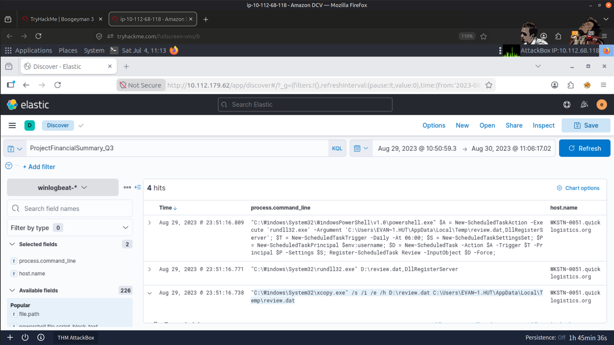

---

#### Payload Execution

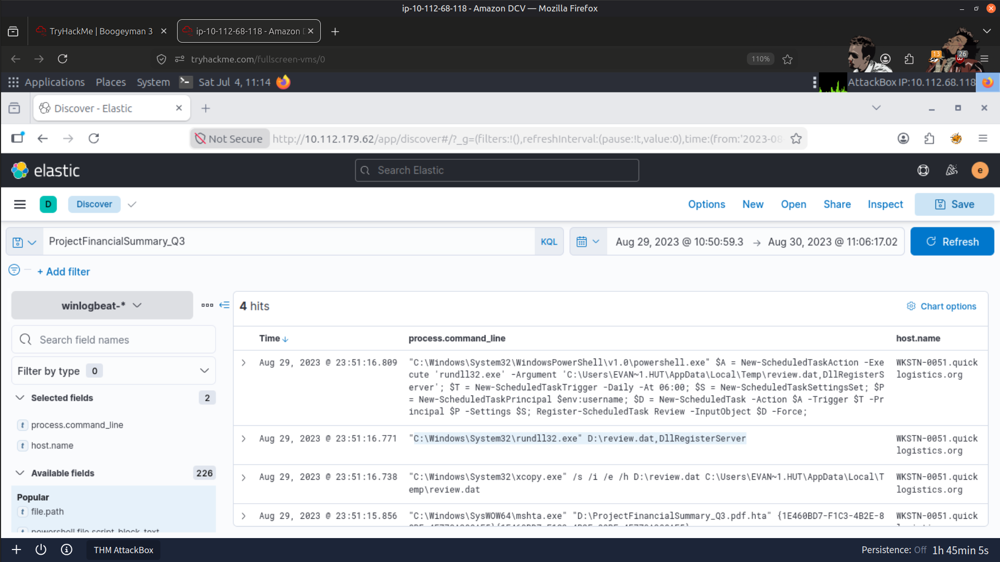

---

#### Scheduled Task Persistence

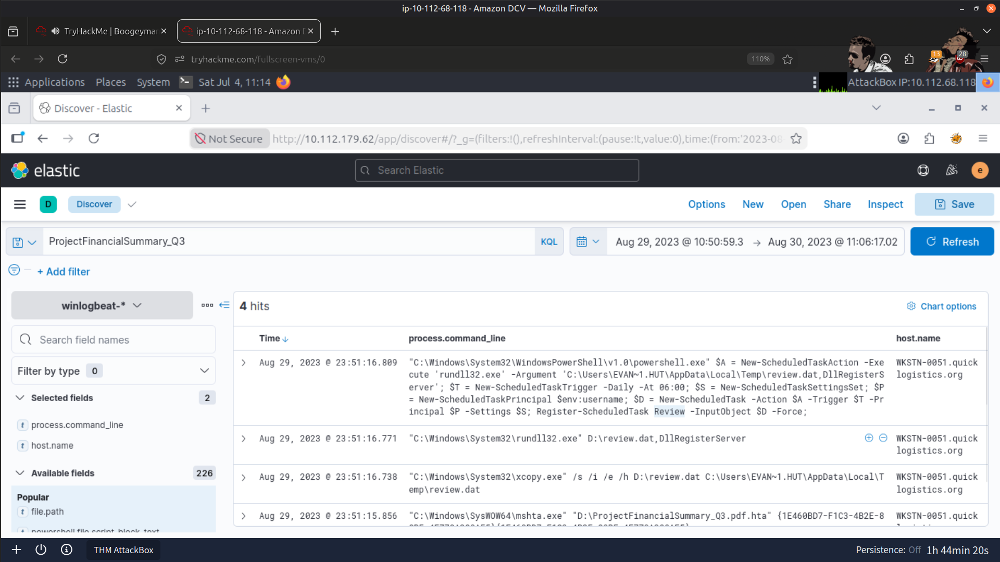

---

### Command-and-Control (C2) Connection

#### C2 IP Address

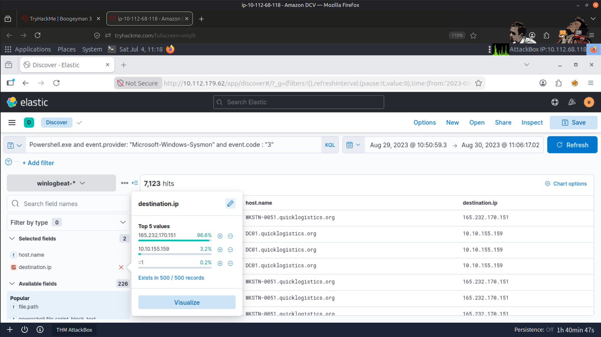

#### C2 Port

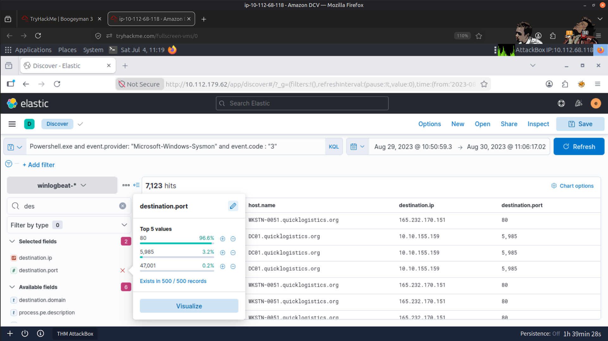

---

### User Account Control (UAC) Bypass

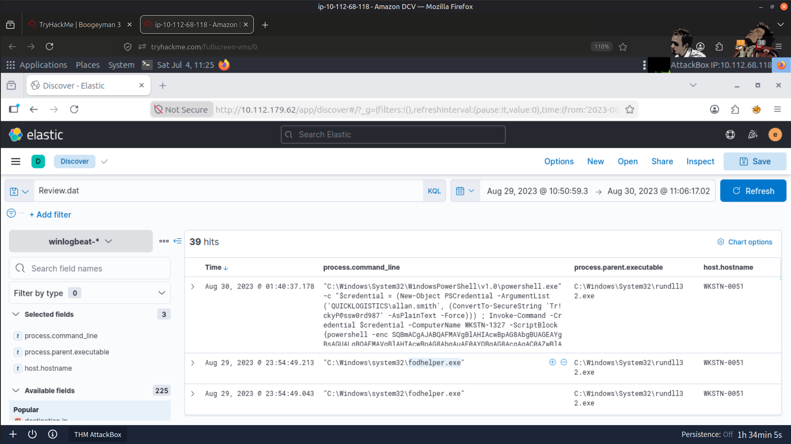

---

### Credential Dumping Tool

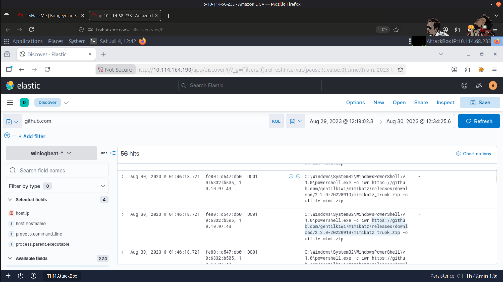

---

### Compromised User Credentials

#### Username

#### NTLM Hash

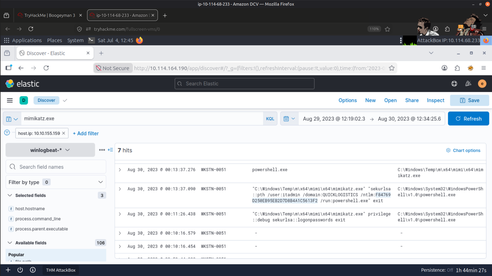

---

### Remote File Share Access

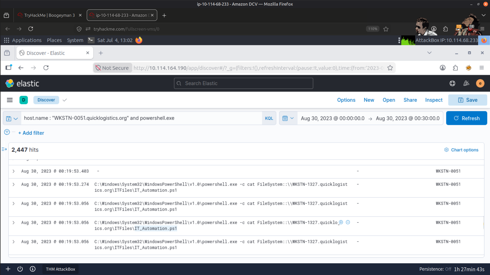

---

### Credentials Retrieved from Remote Share

#### Username

#### Password

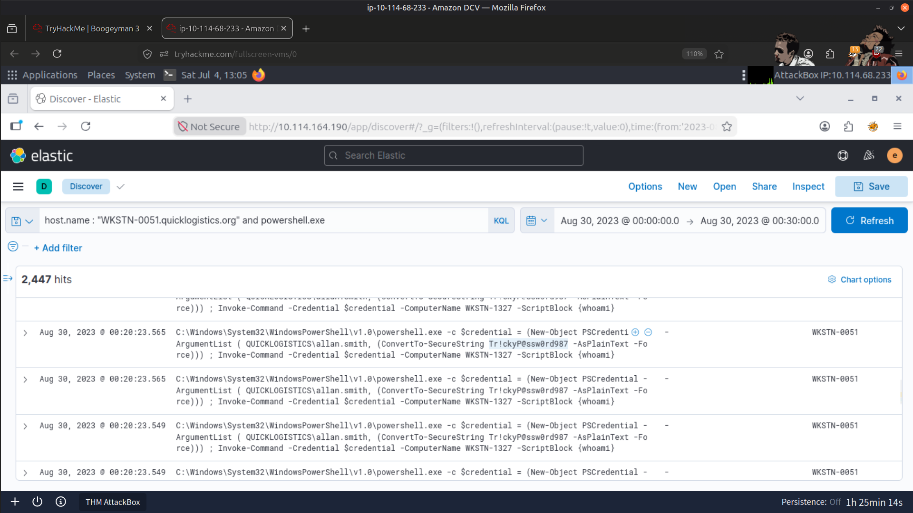

---

### Lateral Movement

#### Target Workstation

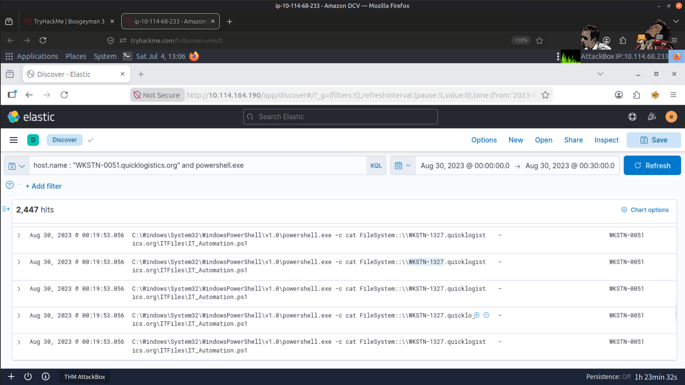

#### Remote Command Execution

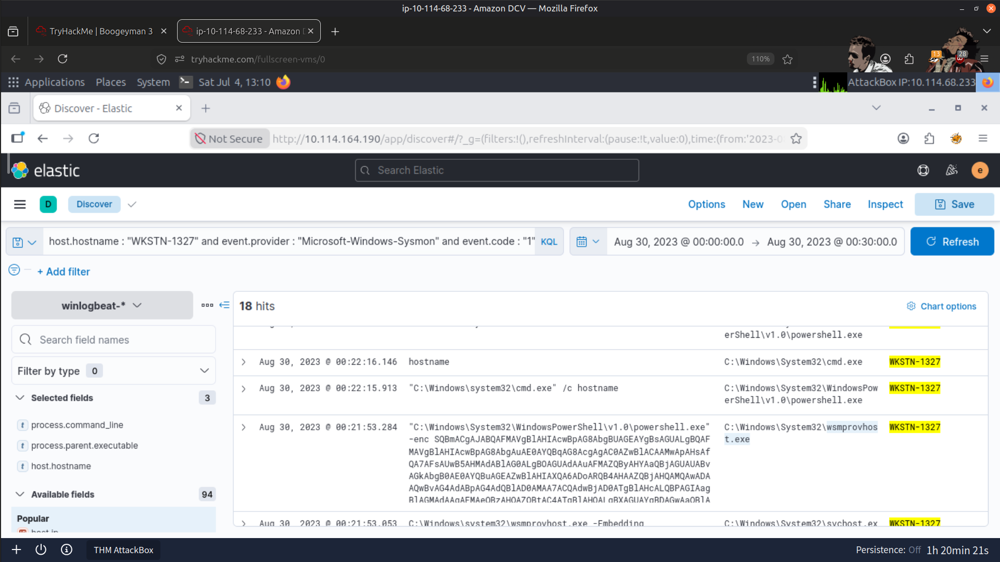

---

### Credential Dumping on Second Host

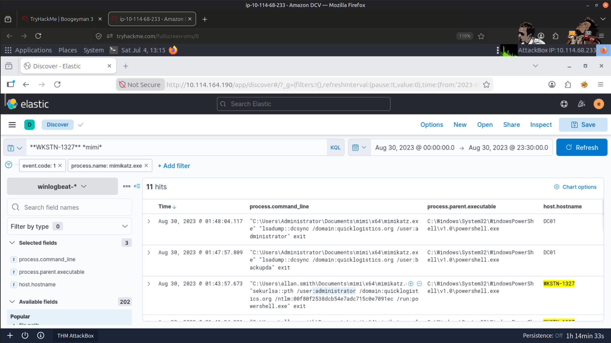

---

### DCSync / Final Payload Stage

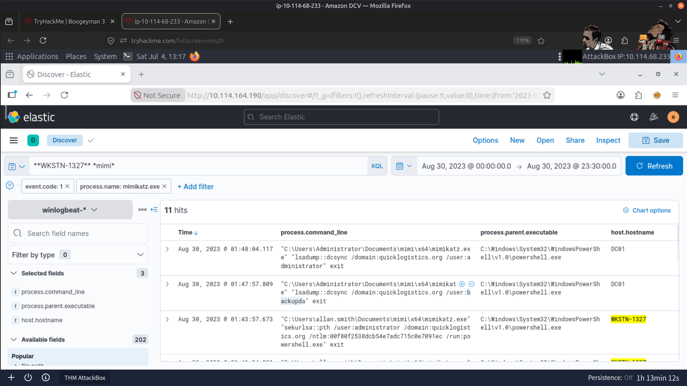

---

### Ransomware Download

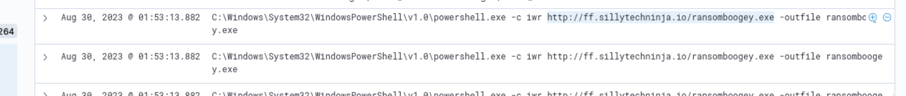

---

### Result

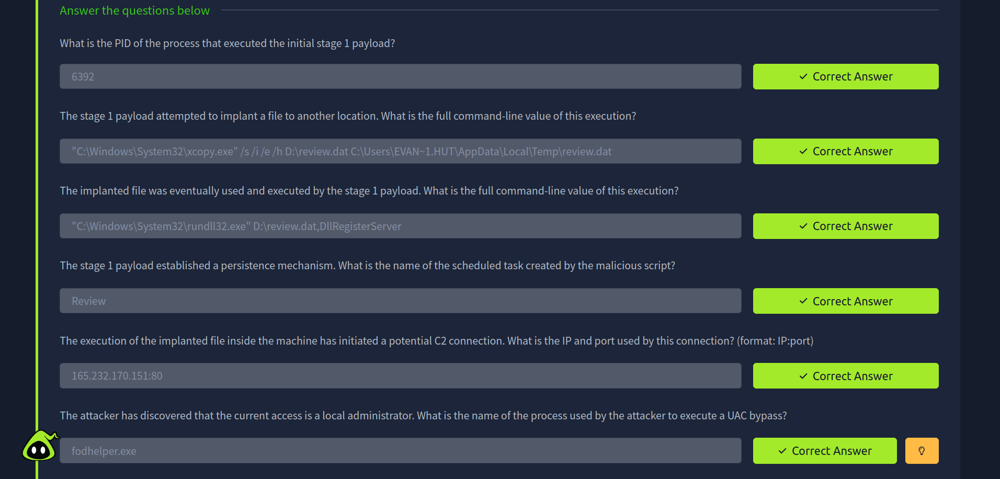

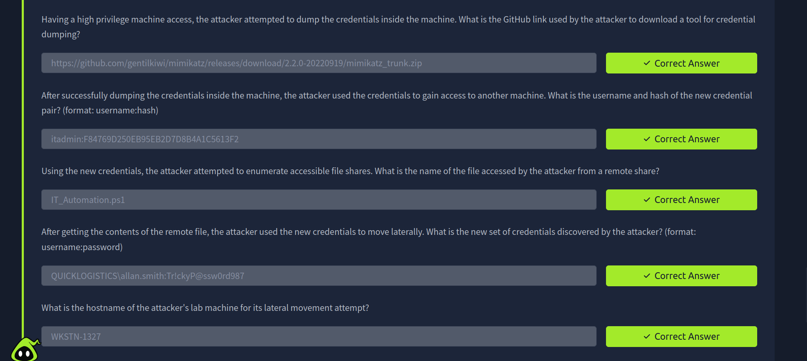

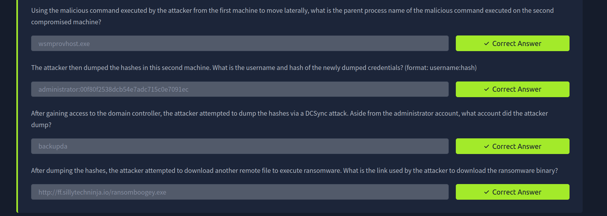

---

## 🧠 Skills Demonstrated

- Elastic Stack (SIEM)
- Endpoint Investigation
- Process Tree Analysis
- Persistence Detection
- Command-and-Control (C2) Analysis
- UAC Bypass Investigation
- Credential Dumping Analysis
- Lateral Movement Investigation
- Active Directory Investigation
- DCSync Analysis
- Incident Response
- Threat Hunting

---

## ✅ Conclusion

This investigation provided hands-on experience reconstructing a complete enterprise intrusion, from the initial phishing compromise through ransomware deployment.

By correlating endpoint events across multiple systems, I was able to trace attacker activity through persistence, privilege escalation, credential theft, lateral movement, Active Directory compromise, and the final ransomware stage, reinforcing practical SOC investigation and incident response skills.

---

> QXV0aG9yOiBodHRwczovL2dpdGh1Yi5jb20vSEctNzU=