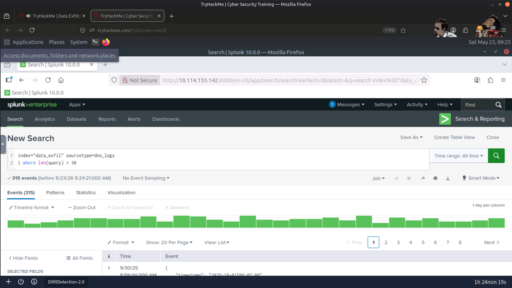
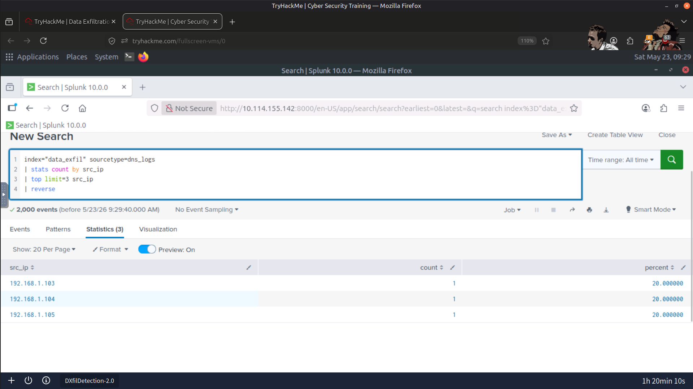
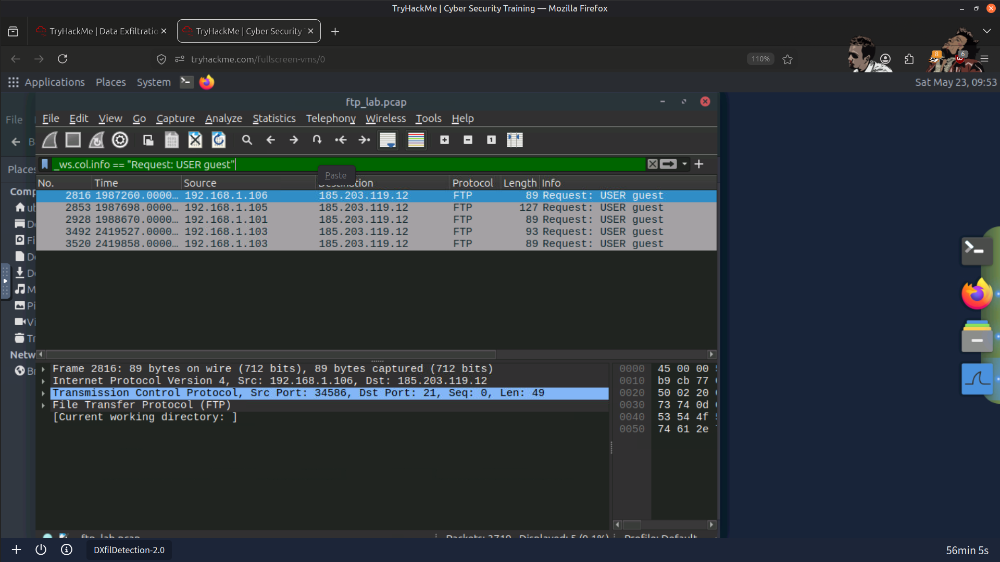
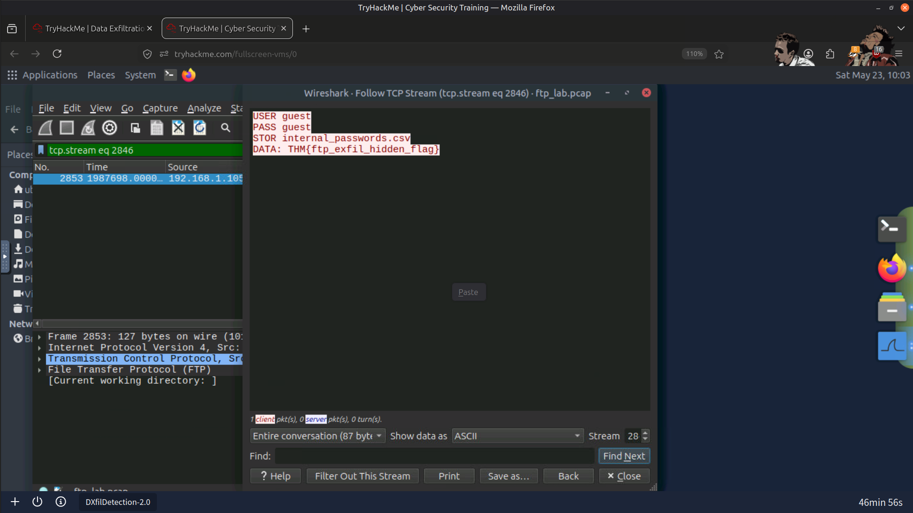
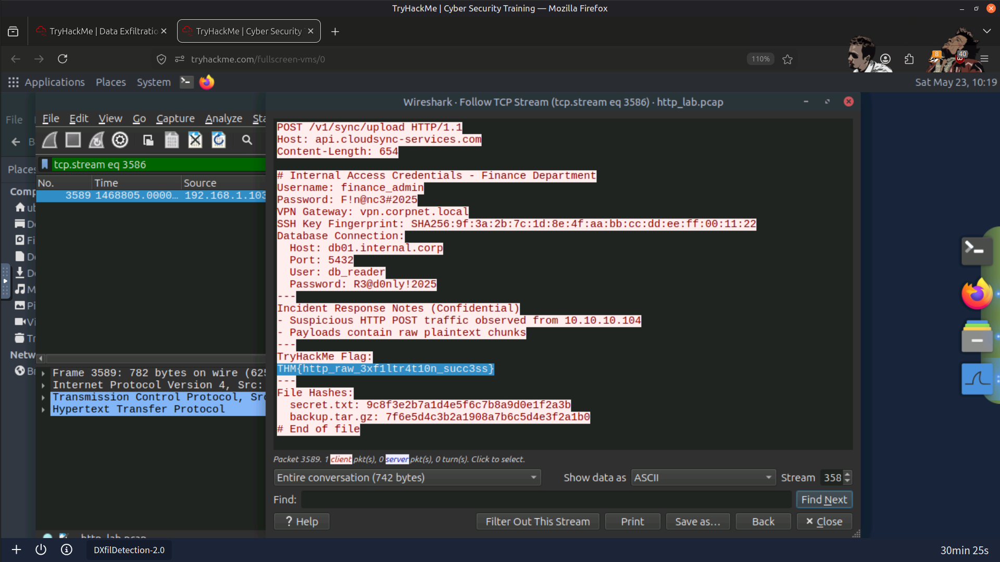
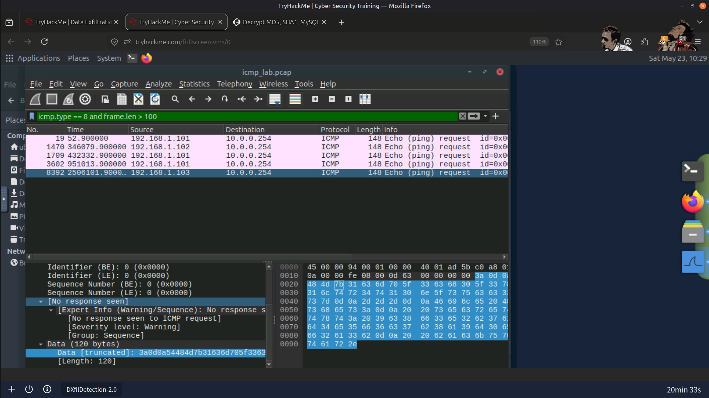
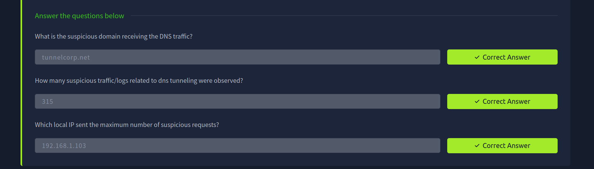
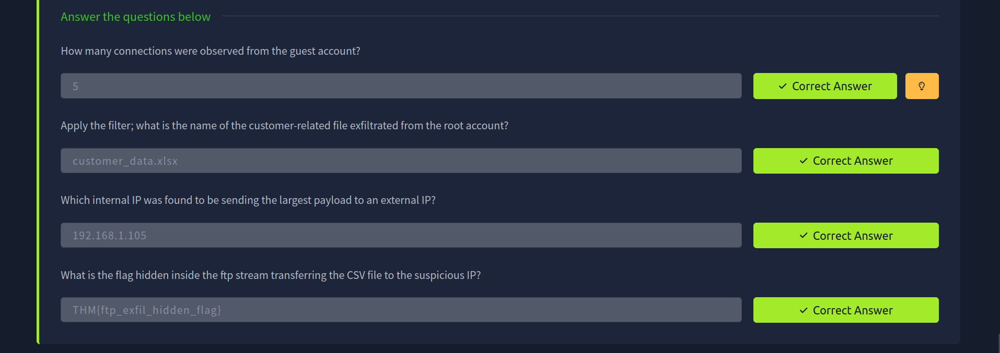
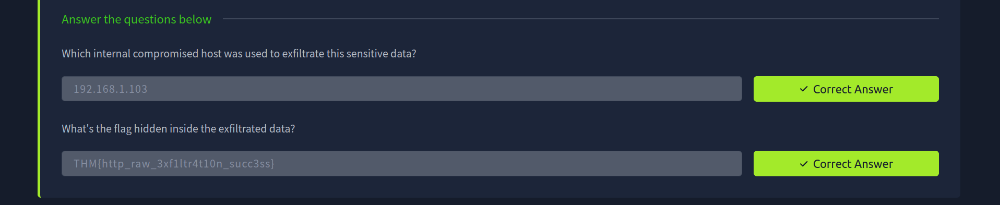

# 🔐 Data Exfiltration Detection

## 📝 Overview

In this investigation, I analyzed multiple data exfiltration techniques using **Splunk** and **Wireshark**. The objective was to identify suspicious outbound communications, investigate attacker behavior across multiple protocols, and detect indicators of data theft using network traffic and log analysis.

The investigation focused on detecting data exfiltration over DNS, FTP, HTTP, and ICMP while correlating network evidence with security logs to validate malicious activity.

---

## 🎯 Objectives

- Detect DNS tunneling and abnormal DNS activity
- Investigate FTP-based file exfiltration
- Identify HTTP uploads used for data theft
- Detect covert ICMP tunneling activity
- Correlate Splunk logs with packet captures
- Identify compromised hosts and attacker infrastructure

---

## 🛠️ Tools Used

- **Splunk** – Log analysis and threat investigation
- **Wireshark** – Packet capture analysis and protocol inspection

---

## 🔍 Investigation Summary

### 🌐 1. DNS Data Exfiltration

Performed the following activities:

- Investigated abnormal DNS queries
- Identified long, high-entropy query names
- Detected excessive DNS requests to a single external domain
- Correlated DNS logs with packet captures

Confirmed:

- DNS tunneling activity
- External exfiltration domain
- Most active compromised internal host

---

### DNS Tunneling Detection

---

### Compromised Host Performing DNS Exfiltration

---

### 📁 2. FTP Data Exfiltration

Performed the following activities:

- Investigated FTP control and data channels
- Recovered cleartext credentials
- Identified file upload operations
- Followed TCP streams to inspect transferred files

Confirmed:

- Unauthorized FTP uploads
- Compromised internal host
- Exfiltrated sensitive file
- Hidden flag recovered from FTP traffic

---

### FTP Exfiltration Using Guest Account

---

### Credentials Captured During FTP Session

---

### 🌍 3. HTTP Data Exfiltration

Performed the following activities:

- Investigated HTTP POST requests
- Identified unusually large uploads
- Correlated Splunk events with PCAP traffic
- Inspected transferred HTTP payloads

Confirmed:

- HTTP-based data exfiltration
- Compromised host
- Hidden flag recovered from HTTP traffic

---

### HTTP Data Exfiltration Source

---

### HTTP Payload Analysis

---

### 📡 4. ICMP Data Exfiltration

Performed the following activities:

- Investigated abnormal ICMP Echo Requests
- Identified oversized ICMP payloads
- Analyzed covert data transfer patterns

Confirmed:

- ICMP tunneling
- Hidden data recovered from ICMP payload

---

### ICMP Tunneling Detection

---

## 📚 Key Learnings

- Data exfiltration often hides within legitimate protocols.
- Behavioral analysis is more effective than relying solely on signatures.
- DNS, FTP, HTTP, and ICMP each present unique detection challenges.
- Correlating network traffic with SIEM data significantly improves investigations.
- Large outbound transfers, unusual destinations, and protocol misuse are valuable indicators of compromise (IOCs).

---

## 🧠 Skills Demonstrated

- 🌐 Network Traffic Analysis
- 📡 Packet Analysis (Wireshark)
- 📊 SIEM Investigation (Splunk)
- 🔐 Data Exfiltration Detection
- 🕵️ Threat Hunting
- 🔍 IOC Analysis
- 📁 Protocol Analysis (DNS, FTP, HTTP, ICMP)
- 📝 Incident Investigation & Documentation

---

## 📸 Result

---

## 🚀 Conclusion

This investigation strengthened my understanding of detecting data exfiltration across multiple network protocols. By correlating SIEM logs with packet captures, I was able to identify covert communication channels, investigate attacker behavior, recover evidence of data theft, and document findings using a structured incident investigation methodology.

---

> QXV0aG9yOiBodHRwczovL2dpdGh1Yi5jb20vSEctNzU=