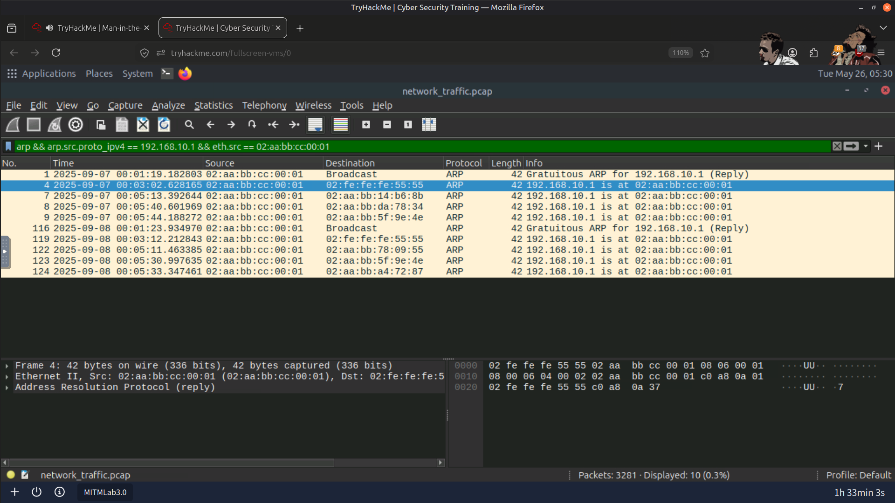
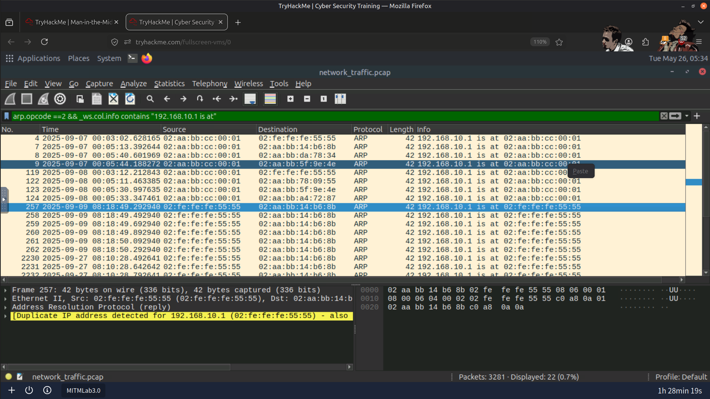
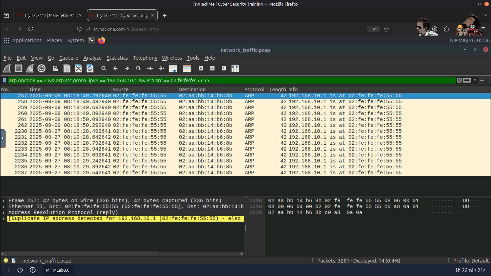
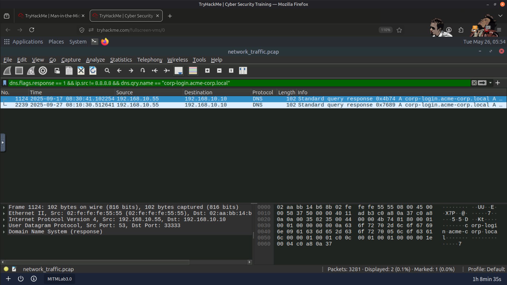
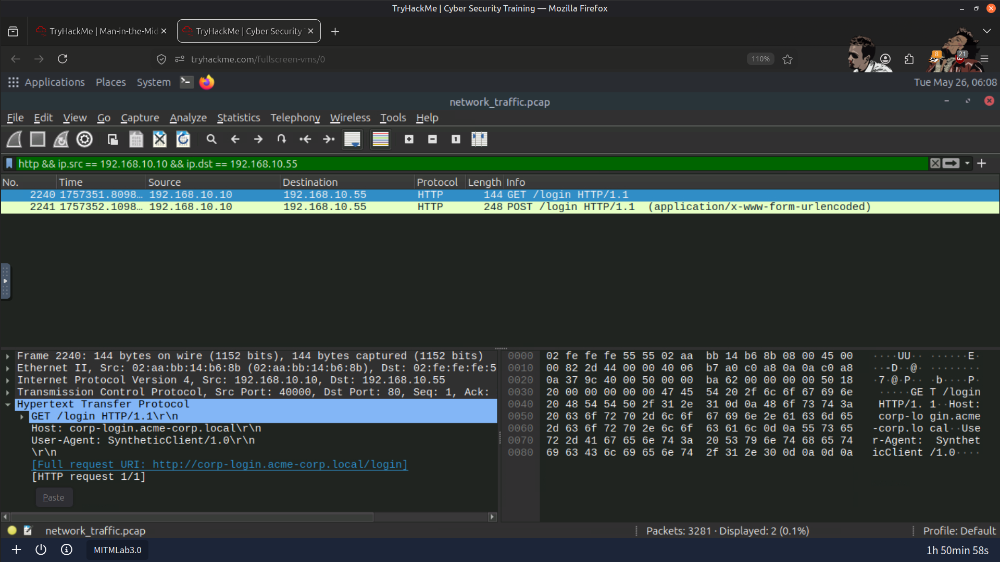
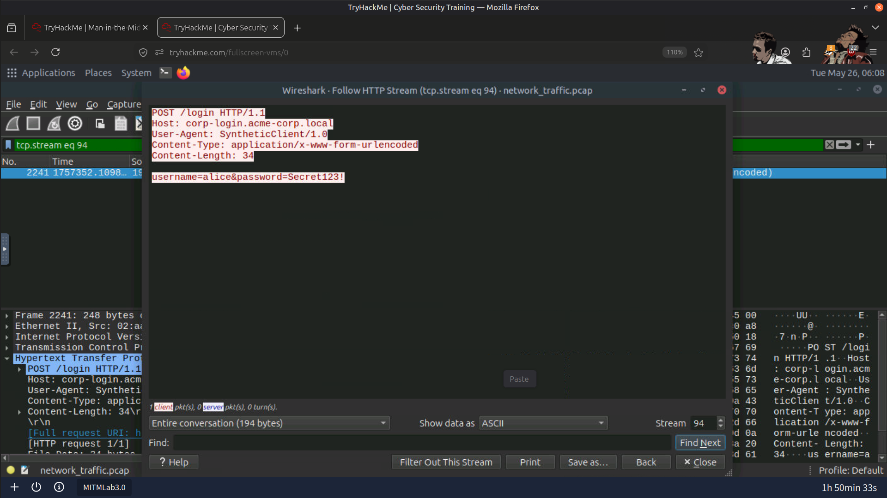

# 🛡️ Man-in-the-Middle (MITM) Attack Analysis

## 📖 Overview

In this investigation, I analyzed network traffic to detect and investigate multiple Man-in-the-Middle (MITM) attack techniques using Wireshark.

The objective was to understand how attackers intercept network communications and how these attacks can be identified through packet analysis and network investigation techniques.

The investigation successfully identified:

- 🧪 ARP Spoofing
- 🌐 DNS Spoofing
- 🔓 SSL Stripping

---

## 🎯 Objectives

- Detect ARP spoofing through packet analysis
- Identify forged DNS responses and DNS spoofing attacks
- Detect SSL stripping by analyzing HTTP and HTTPS traffic
- Investigate attacker behavior through network evidence
- Strengthen packet analysis and network forensics skills

---

## 🛠️ Tools Used

- 🦈 Wireshark
- 💻 Linux Terminal
- 🌐 Network Protocol Analysis

---

## 🔍 Investigation Summary

### 🧪 1. ARP Spoofing Investigation

Performed the following activities:

- Investigated ARP traffic for abnormal behavior
- Identified duplicate MAC addresses mapped to different IP addresses
- Examined suspicious ARP reply packets
- Verified ARP cache entries using:

```bash
arp -a
```

Confirmed:

- ARP cache poisoning
- Attacker MAC address impersonation
- Network traffic redirection through the attacker's system

---

### 🌐 2. DNS Spoofing Investigation

Performed the following activities:

- Investigated DNS request and response traffic
- Compared legitimate and forged DNS responses
- Identified conflicting IP address resolutions
- Detected spoofed DNS replies

Confirmed:

- DNS spoofing activity
- Redirection of victims toward malicious infrastructure

---

### 🔓 3. SSL Stripping Investigation

Performed the following activities:

- Inspected HTTP and HTTPS traffic
- Identified plaintext credential transmission
- Verified the absence of encrypted HTTPS communication
- Investigated attacker interception of sensitive data

Confirmed:

- SSL stripping attack
- Exposure of sensitive credentials over HTTP

---

## 📚 Key Learnings

- ARP spoofing enables attackers to position themselves between communicating hosts through ARP cache poisoning.
- DNS spoofing redirects victims by providing forged DNS responses before legitimate responses arrive.
- SSL stripping downgrades encrypted HTTPS sessions into plaintext HTTP communications.
- Packet analysis provides valuable evidence for detecting network-based attacks.
- Correlating multiple network protocols improves investigation accuracy during incident response.

---

## 📸 Screenshots

### Attacker MAC Address Impersonation



---

### Duplicate MAC Address Detection



---

### ARP Spoofing Evidence



---

### Suspicious DNS Request Analysis



---

### Forged DNS Response Detection



---

### Credential Exposure During SSL Stripping



---

## 🧠 Skills Demonstrated

- 🦈 Wireshark Packet Analysis
- 🌐 Network Traffic Analysis
- 🔐 MITM Attack Detection
- 🧪 ARP Investigation
- 🌍 DNS Analysis
- 🔓 HTTP/HTTPS Traffic Analysis
- 🔍 Threat Hunting
- 📝 Incident Investigation & Documentation

---

## 🚀 Conclusion

This investigation strengthened my understanding of detecting and analyzing Man-in-the-Middle attacks using Wireshark. By examining ARP, DNS, and HTTP traffic, I was able to identify attacker techniques, validate network-based indicators of compromise, and document the attack using a structured incident investigation methodology.

---

> QXV0aG9yOiBodHRwczovL2dpdGh1Yi5jb20vSEctNzU=