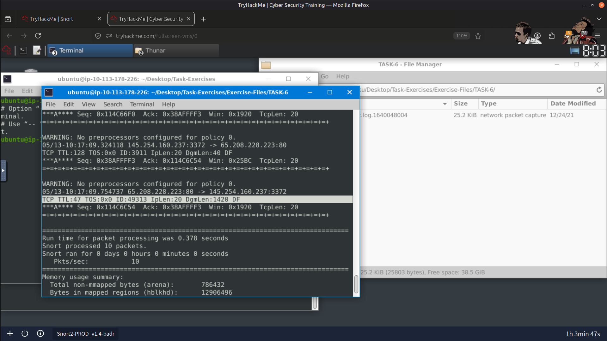
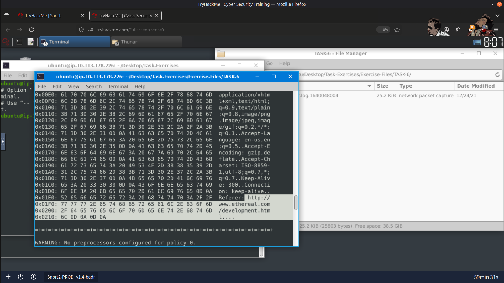
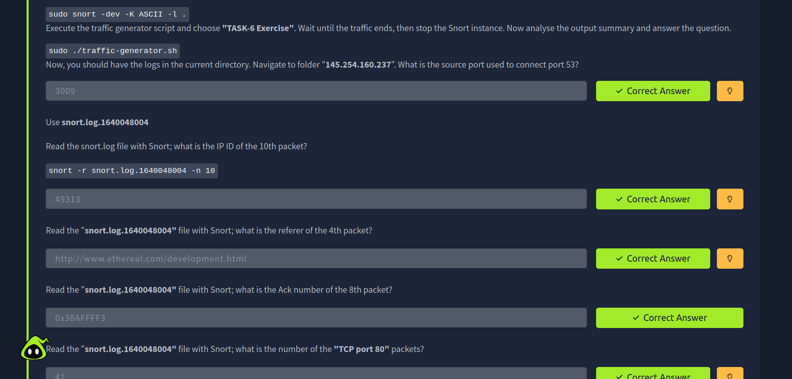
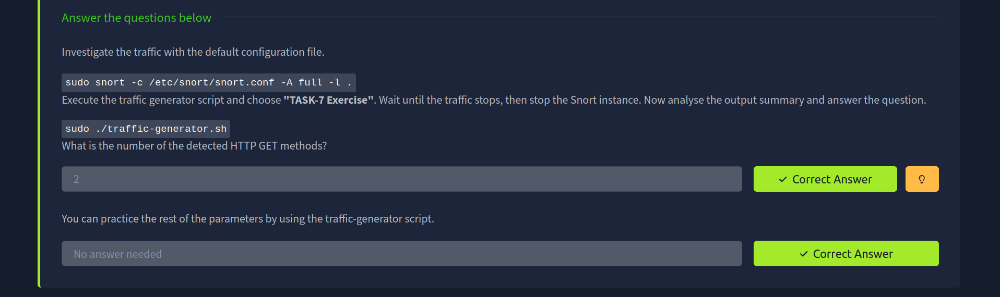
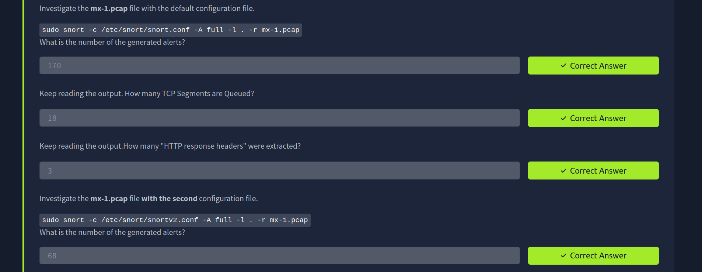
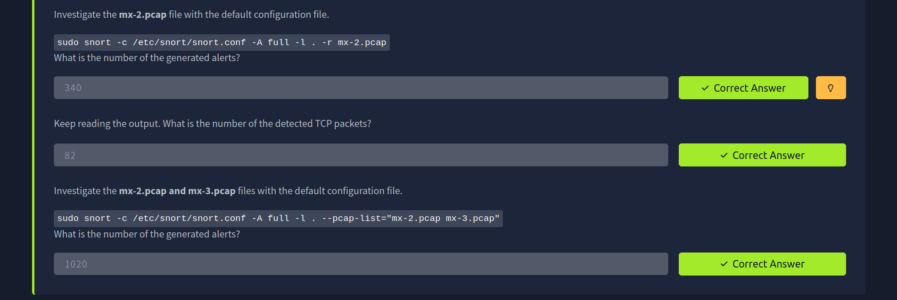
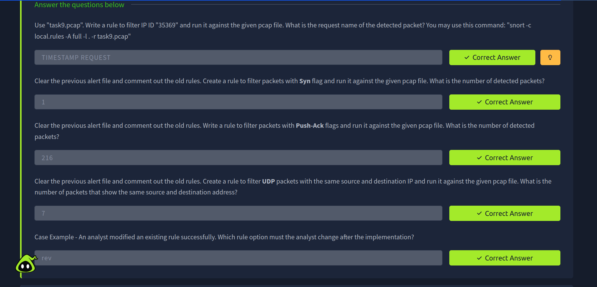

# 🛡️ Snort Intrusion Detection & PCAP Analysis

## 📌 Overview

In this investigation, I analyzed network traffic using **Snort IDS/IPS** across multiple operating modes and offline packet captures. The objective was to understand how Snort detects suspicious network activity, generates alerts, and applies custom detection rules to identify malicious traffic.

---

## 🎯 Objectives

- Analyze network traffic using Snort
- Investigate packet captures (PCAPs) for suspicious activity
- Understand Snort operating modes and alert generation
- Develop and test custom Snort detection rules
- Validate signature-based detections using offline packet analysis

---

## 🛠️ Tools Used

- 🧰 Snort IDS/IPS
- 📁 PCAP Files
- 💻 Linux Terminal

---

## 🔍 Investigation Summary

### 👃 1. Sniffer Mode Analysis

Performed the following activities:

- Captured live network traffic
- Inspected packet headers and protocol information
- Observed packets in real time using Snort's sniffer mode

Confirmed:

- Successful packet capture
- Visibility into live network traffic

---

### 📝 2. Packet Logger Analysis

Performed the following activities:

- Logged captured packets to disk
- Reviewed generated log files
- Examined packet metadata for offline investigation

Confirmed:

- Successful packet logging
- Offline packet analysis capability

---

### 📂 3. Offline PCAP Analysis

Performed the following activities:

- Analyzed multiple PCAP files
- Compared alert counts across captures
- Reviewed:

  - TCP Segments
  - HTTP Response Headers
  - TCP Packet Statistics
  - Generated Alerts

Confirmed:

- Successful identification of suspicious network activity
- Accurate alert generation across multiple packet captures

---

### ⚙️ 4. Custom Rule Development

Created and tested custom Snort rules to detect:

- Specific IP ID values
- SYN packets
- PUSH-ACK packets
- UDP packets with identical source and destination IP addresses
- Custom alert signatures

Confirmed:

- Successful detection using custom Snort rules
- Accurate signature matching against packet captures

---

## 📚 Key Learnings

- Snort supports multiple operating modes for traffic inspection and analysis.
- Offline PCAP analysis enables efficient investigation without requiring live traffic.
- Custom detection rules enhance visibility into protocol-specific behavior.
- Signature-based detection can identify suspicious activity when rules are properly designed.
- Validating detection rules against packet captures improves confidence in IDS deployments.

---

## 📸 Screenshots

### TCP Segment Analysis

---

### HTTP Response Header Analysis

---

### Result

---

## 🧠 Skills Demonstrated

- 🧰 Snort IDS/IPS
- 📡 Network Traffic Analysis
- 📁 PCAP Analysis
- 📝 Signature-Based Detection
- ⚙️ Snort Rule Development
- 🔍 Protocol Analysis
- 🛡️ Intrusion Detection
- 📝 Security Investigation & Documentation

---

## 🚀 Conclusion

This investigation strengthened my understanding of network intrusion detection using Snort by providing practical experience with live traffic analysis, offline PCAP investigations, and custom rule development. It reinforced how signature-based detection can be used to identify suspicious network activity and validate alerts through structured packet analysis.

---

> QXV0aG9yOiBodHRwczovL2dpdGh1Yi5jb20vSEctNzU=