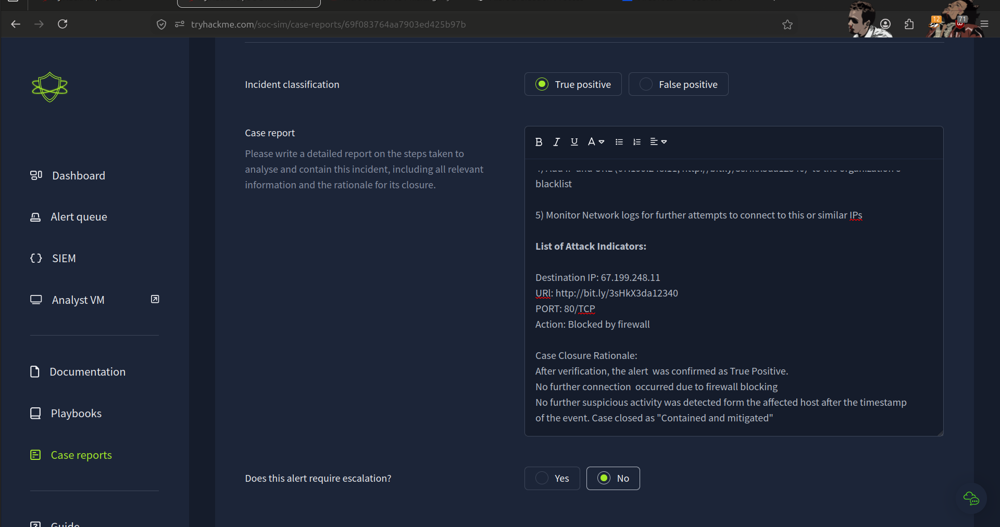
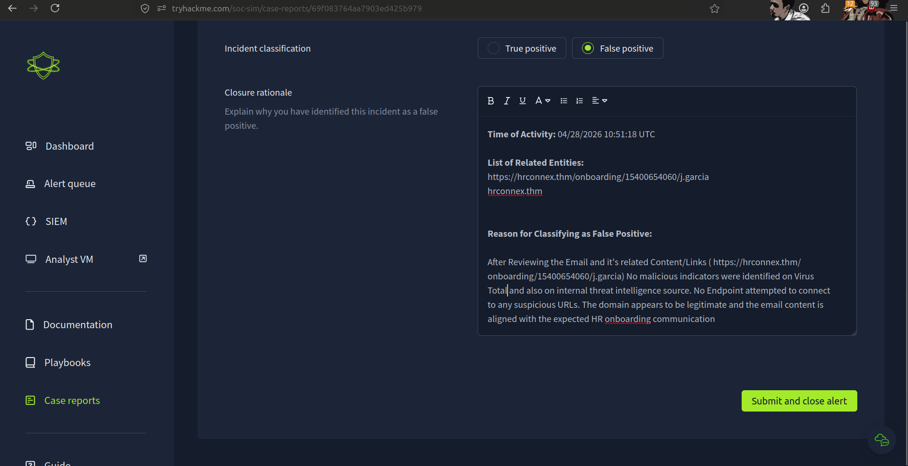
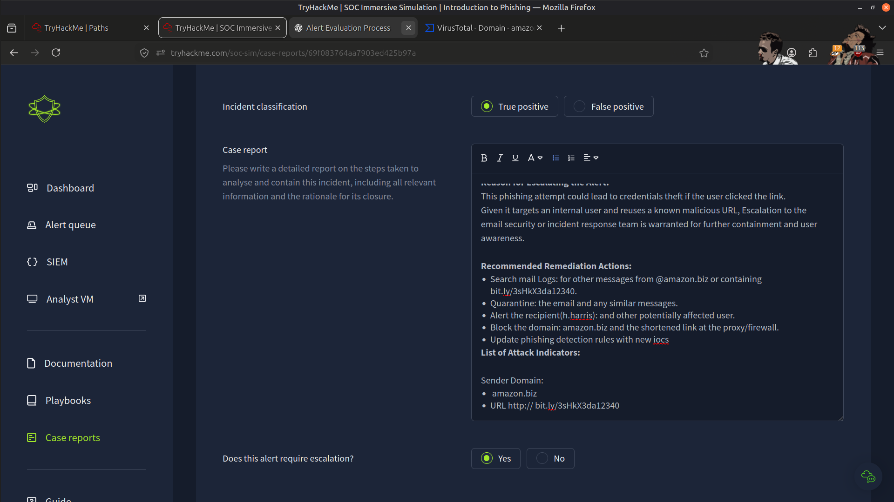
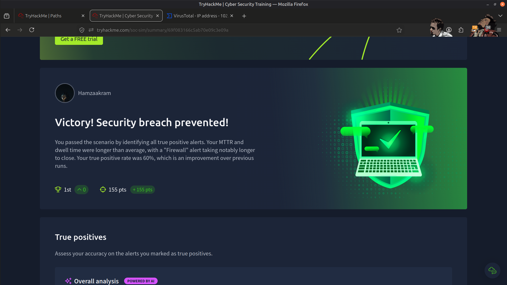

# 🛡️ Introduction to Phishing – SOC Simulator (Splunk)

---

## 📌 Overview

In this project, I completed a phishing investigation scenario using a SOC Simulator integrated with Splunk.

The investigation provided hands-on experience with the workflow of a Security Operations Center (SOC), including alert monitoring, phishing investigation, threat validation, and evidence-based incident response.

---

## 🎯 Objectives

- Monitor and analyze security alerts using a SIEM
- Identify phishing emails and malicious indicators
- Investigate suspicious URLs and email attachments
- Validate indicators of compromise (IOCs) using threat intelligence
- Document investigation findings following SOC analyst practices

---

## 🧰 Tools Used

- **Splunk** – Security Information and Event Management (SIEM)
- **VirusTotal** – IOC validation and threat intelligence
- **SOC Simulator**

---

## 🔬 Investigation Summary

During this simulation, I performed tasks similar to those of an L1 SOC Analyst by:

- Monitoring security alerts generated within Splunk
- Investigating phishing-related security events
- Analyzing:
  - Email content
  - Embedded URLs
  - File attachments
- Validating suspicious URLs and files using VirusTotal
- Correlating available evidence to determine whether alerts represented real threats or false positives
- Successfully identifying and classifying five phishing incidents
- Closing alerts with documented investigation notes and appropriate justifications

---

## 🔄 Mapping to SOC Operations

### 🔍 Alert Monitoring

Security events were monitored through Splunk, simulating the continuous monitoring performed in a Security Operations Center.

---

### 🧠 Alert Triage

Each alert was reviewed and classified based on available evidence to determine whether it represented malicious activity or a false positive.

---

### 📧 Phishing Investigation

Performed analysis of:

- Email content
- Suspicious URLs
- File attachments

to determine the legitimacy of each phishing alert.

---

### 🌐 Threat Intelligence Validation

Validated indicators of compromise using VirusTotal to verify the reputation of URLs and files across multiple security vendors.

---

### 📝 Incident Documentation

Recorded investigation outcomes and alert disposition using clear, evidence-based reasoning similar to standard SOC documentation practices.

---

## 🧠 Skills Demonstrated

- SIEM Monitoring (Splunk)
- Alert Triage
- Phishing Detection & Analysis
- Threat Intelligence Validation
- IOC Analysis
- Incident Investigation
- Security Documentation
- Analytical Thinking

---

## 📂 Evidence (Screenshots)

### True Positive Alert Investigation

---

### False Positive Alert Investigation

---

### Escalated Security Alert

---

### Final Assessment

---

## 📊 Outcome

- ✅ Successfully investigated and classified **5/5 phishing alerts**
- ✅ Performed alert monitoring and investigation using Splunk
- ✅ Validated indicators using VirusTotal
- ✅ Applied SOC analyst methodologies throughout the investigation
- ✅ Strengthened practical experience with phishing detection and alert triage

---

## 💡 Key Learnings

- Effective SOC investigations combine technical analysis with evidence-based decision making.
- Threat intelligence platforms such as VirusTotal provide valuable context for validating indicators of compromise.
- Not every alert represents malicious activity, making accurate triage essential.
- Phishing investigations require careful examination of emails, URLs, attachments, and supporting evidence.
- Clear documentation and justification are fundamental components of professional incident response.

---

## 🚀 Conclusion

This investigation strengthened my understanding of Security Operations Center (SOC) workflows by providing practical experience with security monitoring, alert triage, phishing investigation, threat validation, and incident documentation.

It reinforced the importance of combining technical analysis, threat intelligence, and evidence-based decision making to effectively investigate phishing incidents.

---

> QXV0aG9yOiBodHRwczovL2dpdGh1Yi5jb20vSEctNzU=