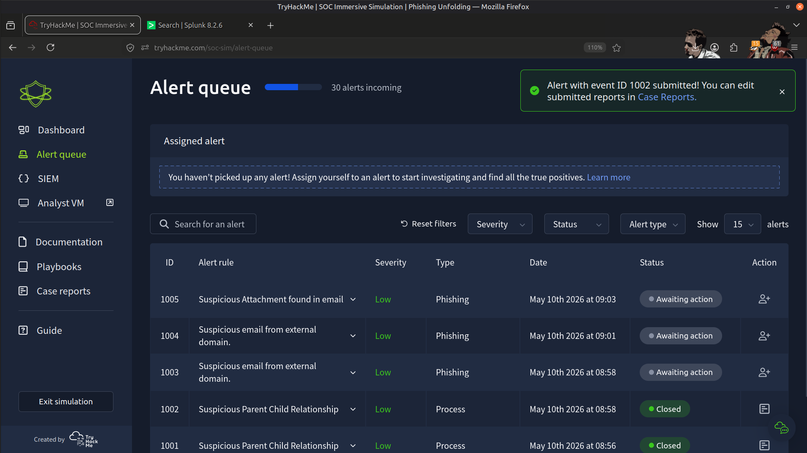
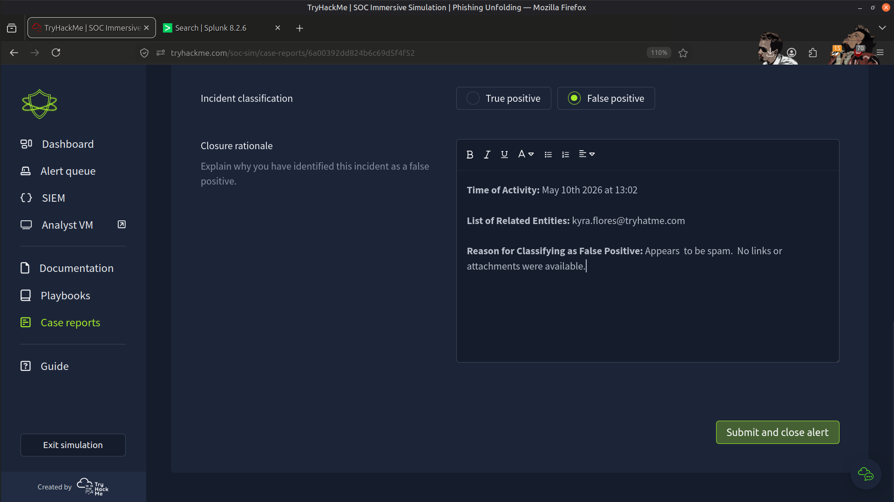
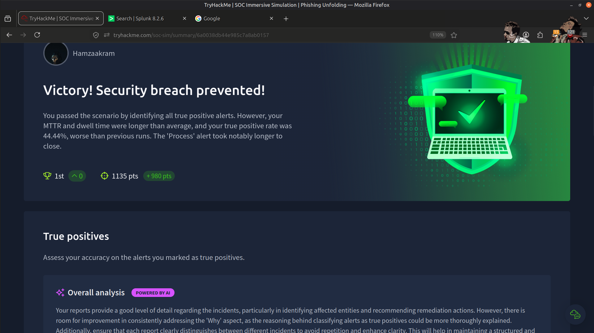
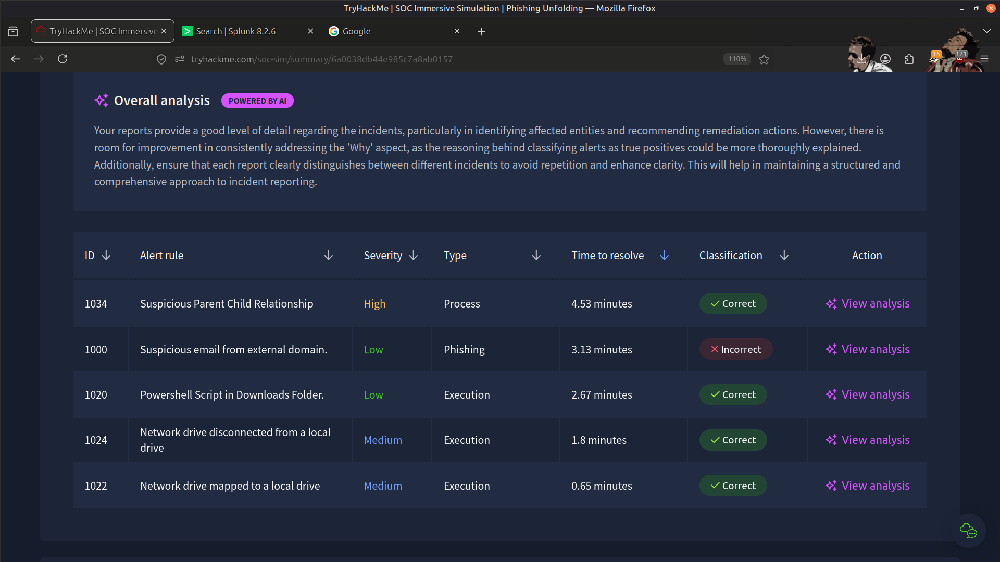

# 🚨 Phishing Unfolding Investigation

---

## 📖 Overview

This project documents the investigation of a live phishing attack scenario in which multiple malicious activities were monitored and analyzed in real time.

The investigation focused on reconstructing the attack chain, analyzing malicious behaviors, validating security alerts, and documenting the incident from initial compromise through attacker activity.

---

## 🎯 Objectives

- Monitor and analyze real-time security alerts
- Investigate malicious PowerShell execution
- Detect reverse shell connections and suspicious DNS activity
- Correlate security events to reconstruct the attack timeline
- Document investigation findings following SOC incident response practices

---

## 🛠️ Tools Used

- **Splunk** – Security Information and Event Management (SIEM)

---

## 🔬 Investigation Summary

During this investigation, I performed tasks similar to those of an L1 SOC Analyst by:

- Monitoring real-time security alerts within Splunk
- Investigating malicious PowerShell execution events
- Identifying reverse shell activity and attacker communications
- Analyzing suspicious DNS requests generated during the attack
- Correlating multiple security events to reconstruct the attack timeline
- Distinguishing malicious activity from false positive alerts
- Documenting findings through an incident investigation report

---

## 🔄 Mapping to SOC Operations

### 🔍 Alert Monitoring

Monitored live security events through Splunk to identify suspicious activity requiring investigation.

---

### 🧠 Alert Triage

Reviewed alerts to determine whether they represented genuine threats or false positives based on available evidence.

---

### 💻 Endpoint Investigation

Analyzed PowerShell activity and process execution to understand attacker behavior on the compromised host.

---

### 🌐 Network Investigation

Investigated reverse shell communications and suspicious DNS activity to identify attacker infrastructure and indicators of compromise (IOCs).

---

### 📝 Incident Documentation

Recorded investigation findings and documented the attack timeline using evidence gathered throughout the investigation.

---

## 🧠 Skills Demonstrated

- SIEM Monitoring (Splunk)
- Alert Triage
- Incident Investigation
- PowerShell Analysis
- Network Traffic Analysis
- DNS Investigation
- Threat Detection
- IOC Analysis
- Security Documentation
- Analytical Thinking

---

## 📂 Evidence (Screenshots)

### Splunk Monitoring Dashboard

---

### False Positive Alert Investigation

---

### Final Assessment

---

## 📊 Outcome

- ✅ Investigated a simulated phishing attack using Splunk
- ✅ Identified malicious PowerShell execution and reverse shell activity
- ✅ Investigated suspicious DNS communications
- ✅ Distinguished malicious events from false positives
- ✅ Reconstructed the attack timeline through event correlation
- ✅ Documented the complete investigation following SOC analyst practices

---

## 💡 Key Learnings

- Effective incident response requires correlating endpoint and network evidence.
- PowerShell execution can provide valuable indicators of attacker activity.
- DNS traffic often reveals command-and-control infrastructure and malicious communications.
- Accurate alert triage helps prioritize genuine security incidents.
- Event correlation is essential for reconstructing attacker activity and understanding the full attack lifecycle.
- Clear documentation is fundamental to effective incident response and knowledge sharing.

---

## 🚀 Conclusion

This investigation strengthened my understanding of Security Operations Center (SOC) workflows by providing practical experience with security monitoring, alert triage, PowerShell analysis, network investigation, and incident documentation.

It reinforced the importance of correlating multiple sources of evidence to accurately reconstruct attacker activity and support effective incident response.

---

> QXV0aG9yOiBodHRwczovL2dpdGh1Yi5jb20vSEctNzU=