# 🎣 Phishing Kit & Credential Access Investigation

## 📝 Overview

In this lab, I investigated a phishing campaign targeting employees at SwiftSpend Financial. Multiple employees received suspicious phishing emails, and some users had already submitted their credentials, resulting in account access issues. The investigation focused on analyzing phishing emails, uncovering the phishing infrastructure, identifying credential collection mechanisms, and examining the attacker's phishing kit.

---

## 🎯 Objectives

- 📧 Analyze phishing email samples
- 🔍 Identify malicious artifacts and indicators
- 🌐 Investigate phishing URLs and redirections
- 📂 Retrieve and analyze the phishing kit
- 🧪 Investigate the phishing archive using VirusTotal
- 🔐 Identify exposed credential logs
- 📄 Analyze phishing kit source code
- 🍳 Decode hidden attacker information using CyberChef

---

## 🛠️ Tools Used

- 📧 Email Viewer
- 🌐 Web Browser
- 🔎 VirusTotal
- 🍳 CyberChef
- 💻 Linux Terminal
  - `sha256sum`
  - `unzip`
  - `cat`
  - `grep`

---

## 🔬 Investigation Summary

### 📩 1. Email Analysis

Reviewed phishing email samples to identify:

- Recipient information
- Sender email address
- Suspicious attachments
- Social engineering techniques

---

### 📎 2. Attachment Investigation

Analyzed the attachment delivered to Zoe Duncan and identified:

- Malicious redirection URL
- Root domain of the phishing infrastructure
- Fake Microsoft login portal

---

### 🌐 3. Phishing Website Analysis

Investigated the phishing website to:

- Observe URL redirections
- Identify the impersonated organization
- Examine publicly exposed directories

---

### 📂 4. Phishing Kit Discovery

Located the exposed phishing kit archive by browsing the server directories.

Performed the following actions:

- Downloaded the archive
- Generated its SHA256 hash
- Submitted the archive to VirusTotal for analysis

#### 💻 Command Used

```bash
sha256sum filename.zip
```

---

### 🦠 5. VirusTotal Analysis

Reviewed:

- Threat classifications
- Detection results
- Archive contents
- Number of files contained within the phishing kit

---

### 🔐 6. Credential Access Investigation

Reviewed exposed log files located within:

```text
/data/Update365/
```

to identify:

- Captured credentials
- Users submitting credentials multiple times

---

### 📄 7. Phishing Kit Source Code Analysis

Extracted the phishing kit and analyzed the `submit.php` file to identify:

- Credential collection functionality
- Attacker-controlled email address used to receive stolen credentials

#### 💻 Commands Used

```bash
unzip archive.zip
```

```bash
cat submit.php
```

---

### 🍳 8. Flag Decoding

Located the `flag.txt` file and decoded the hidden value using CyberChef to recover the final flag.

---

## 🚨 Findings

The investigation identified a fully operational phishing infrastructure designed to impersonate a Microsoft login portal and harvest user credentials.

Evidence collected during the investigation revealed:

- 🎯 Targeted phishing emails delivered to employees
- 🔐 Credential collection through a fake login page
- 📂 Exposed credential log files accessible on the web server
- 📧 Stolen credentials forwarded to an attacker-controlled email address
- 🌐 Publicly accessible phishing kit resources

Several operational security mistakes by the attacker exposed valuable intelligence, including:

- Exposed phishing kit archive
- Public credential log files
- Accessible source code
- Hidden encoded flag data

---

## 📸 Screenshots

### Phishing Email Analysis & Website Impersonation

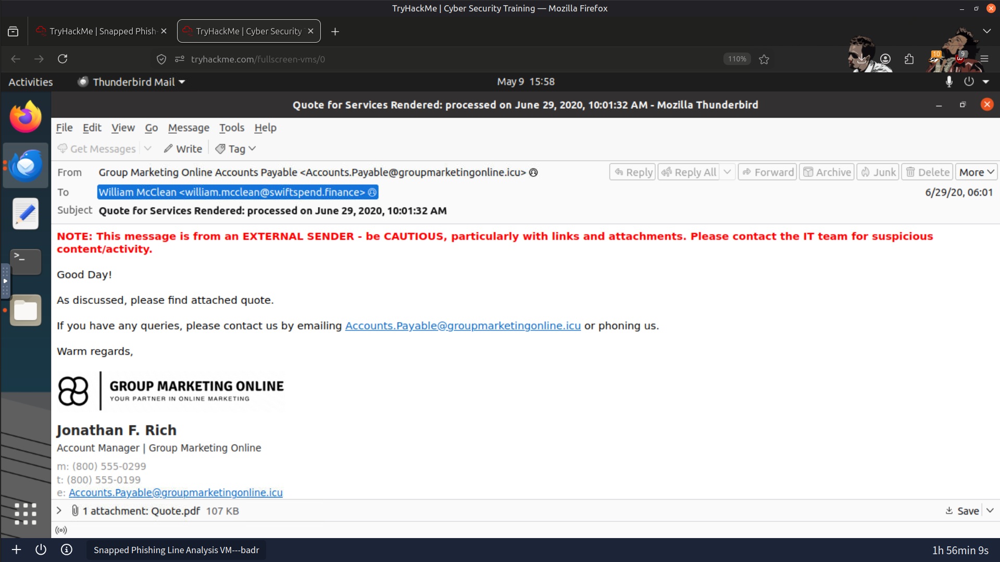

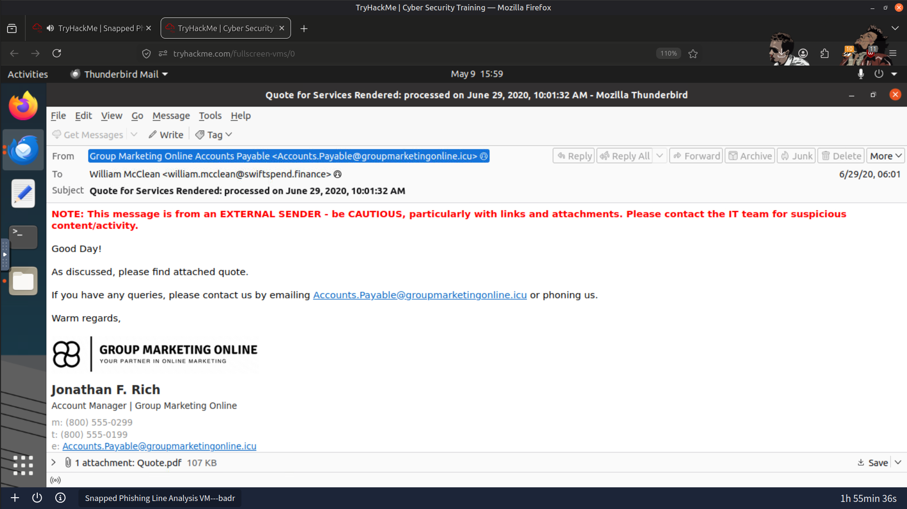

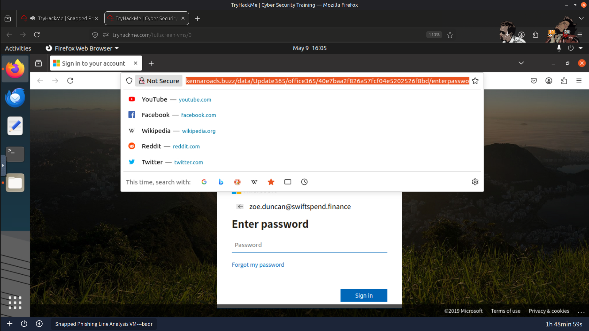

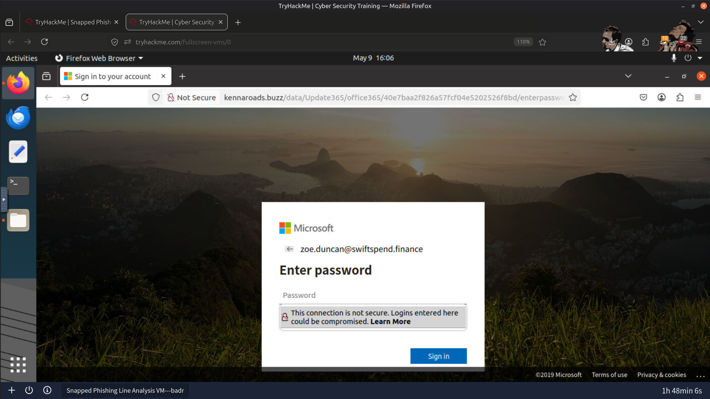

---

### Phishing Kit Archive & VirusTotal Analysis

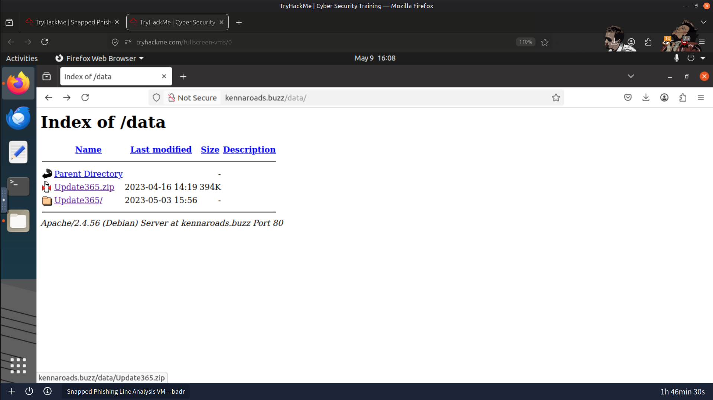

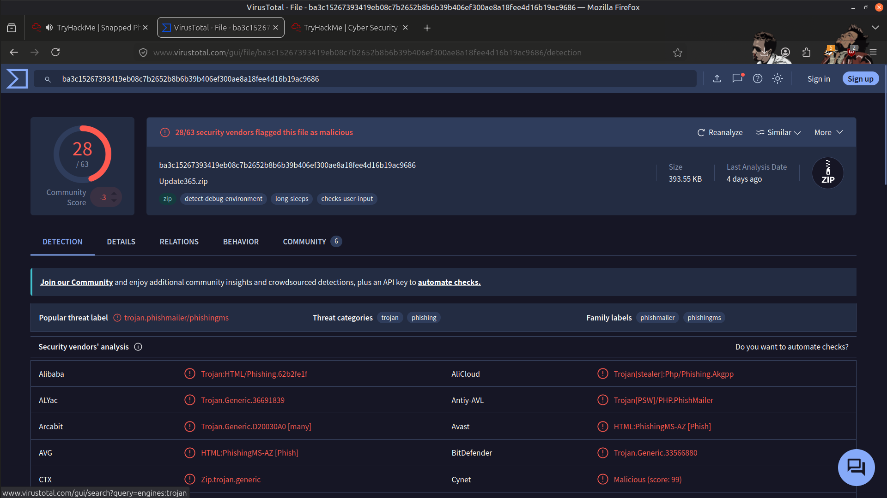

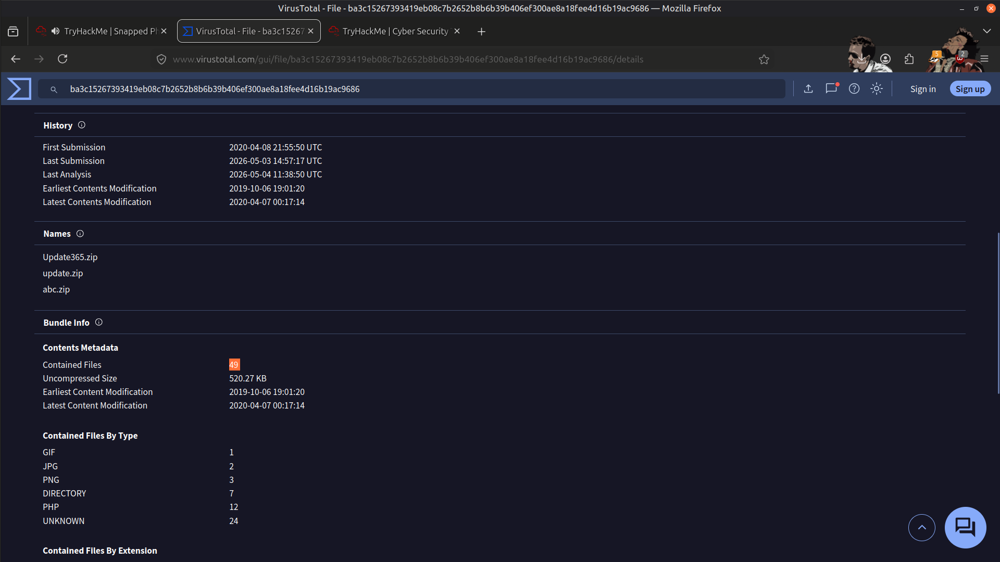

---

### Attacker Email Address Used for Credential Collection

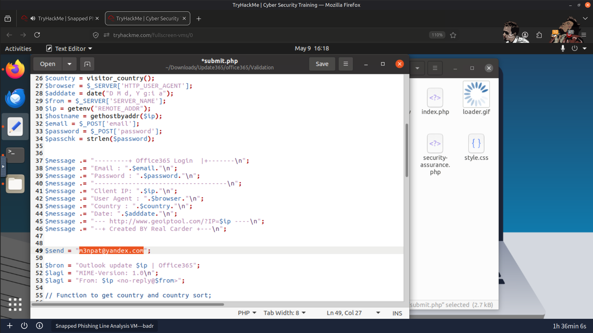

---

### Result

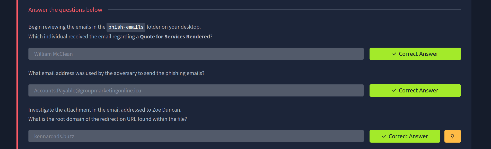

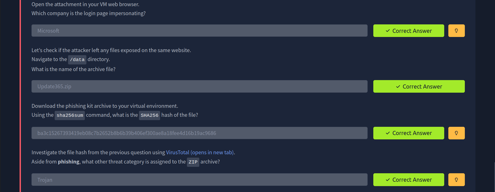

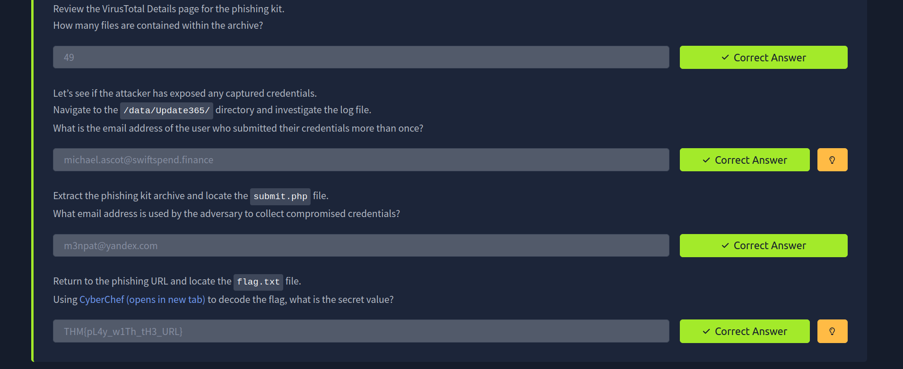

---

## 📚 Key Learnings

- Phishing campaigns often rely on convincing social engineering combined with credential collection infrastructure.
- Publicly exposed server directories can reveal valuable attacker artifacts during investigations.
- Correlating email evidence, phishing websites, source code, and threat intelligence provides a complete understanding of attacker operations.
- Threat intelligence platforms such as VirusTotal assist in validating malicious files and infrastructure.
- Source code analysis can uncover credential collection mechanisms and attacker-controlled infrastructure.

---

## 📚 Skills Gained

- 📧 Phishing Email Analysis
- 🌐 URL & Redirection Investigation
- 🔐 Credential Access Investigation
- 🧪 Phishing Kit Analysis
- 🦠 VirusTotal Threat Intelligence
- 🕵️ OSINT Techniques
- 💻 Linux File & Hash Analysis
- 🍳 CyberChef Decoding
- 🔎 Web Infrastructure Investigation

---

> QXV0aG9yOiBodHRwczovL2dpdGh1Yi5jb20vSEctNzU=