# 📧 Phishing Email Analysis & Investigation

## 📝 Overview

In this lab, I investigated a suspicious email reported by a sales executive at Greenholt. The email raised several red flags, including a generic greeting, an unusual money transfer request, and a suspicious attachment.

The investigation focused on analyzing the email, identifying suspicious artifacts, validating sender authenticity, examining email authentication records, and determining whether the message represented a phishing attempt.

---

## 🎯 Objectives

- 🔍 Analyze the email headers and message source
- 📨 Identify sender and Reply-To information
- 🌐 Trace the originating IP address
- 🛡️ Perform SPF and DMARC analysis
- 🧪 Investigate the attachment hash using VirusTotal
- 📂 Determine the actual file type of the attachment

---

## 🛠️ Tools Used

- 📧 Email Header Analyzer
- 🌐 WHOIS Lookup
- 🛡️ SPF Record Lookup
- 📜 DMARC Lookup
- 🔎 VirusTotal
- 💻 Linux Terminal
  - `sha256sum`
  - `file`

---

## 🔬 Investigation Summary

### 📩 1. Email Inspection

Reviewed the provided `.eml` file to identify:

- Subject line
- Sender information
- Reply-To address
- Attachment details

---

### 🧾 2. Header Analysis

Analyzed the email headers to identify:

- Sender email address
- Reply-To email address
- Originating IP address
- Suspicious routing activity

---

### 🌍 3. IP Address Investigation

Performed a WHOIS lookup to determine:

- IP ownership
- Hosting provider
- Potentially suspicious infrastructure

---

### 🛡️ 4. SPF & DMARC Validation

Validated email authentication by performing:

- SPF record lookup on the Return-Path domain
- DMARC record lookup

This helped determine whether the sender was authorized to send emails on behalf of the domain.

---

### 📎 5. Attachment Analysis

Downloaded the attachment and performed:

- SHA256 hash generation
- VirusTotal reputation analysis
- File type identification

#### 💻 Commands Used

```bash
sha256sum filename
```

```bash
file filename
```

---

## 🚨 Findings

The investigation revealed several indicators commonly associated with phishing attacks, including:

- ⚠️ Suspicious sender behavior
- 💸 Unusual money transfer request
- 🔄 Mismatch between the sender and Reply-To addresses
- 📎 Potentially malicious attachment
- ❌ Email authentication inconsistencies

Based on the collected evidence, the email was confirmed to be a phishing attempt.

---

## 📸 Screenshots

### Email Metadata & Sender Information

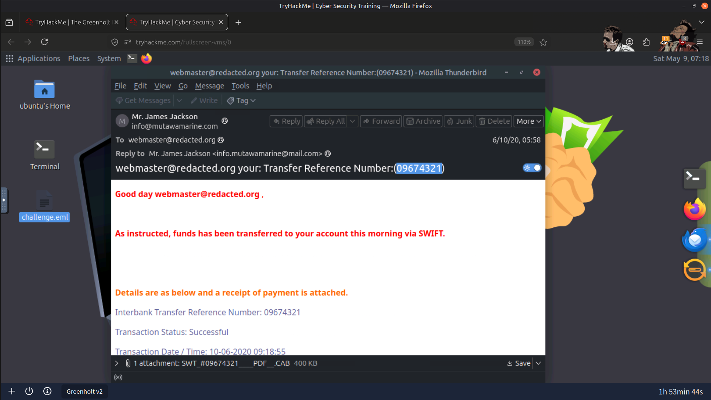

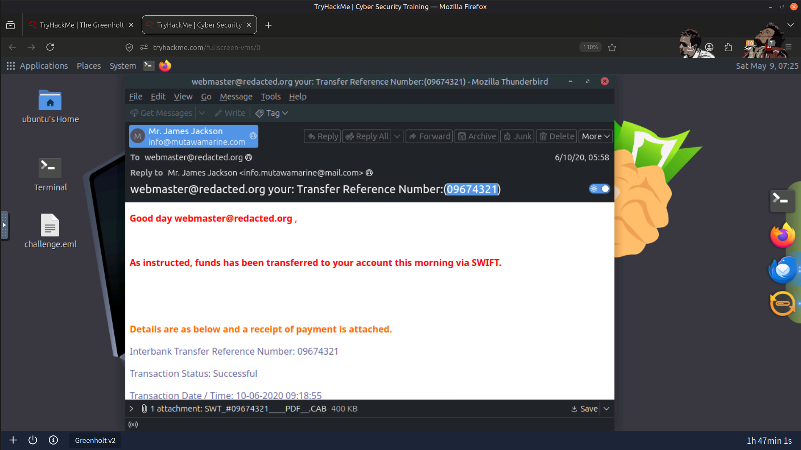

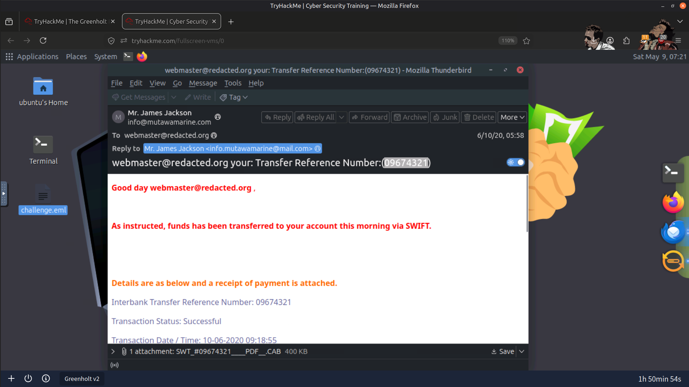

---

### Email Infrastructure & SPF Validation

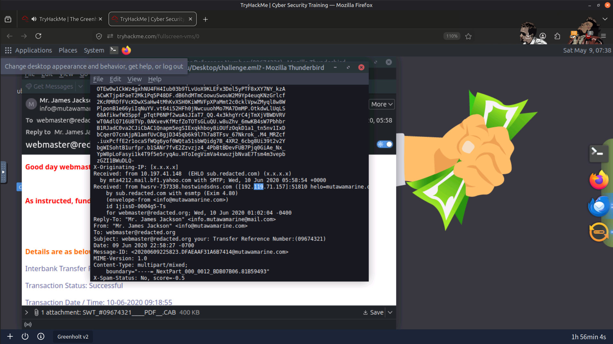

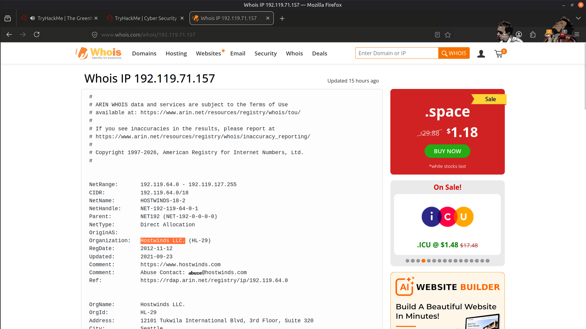

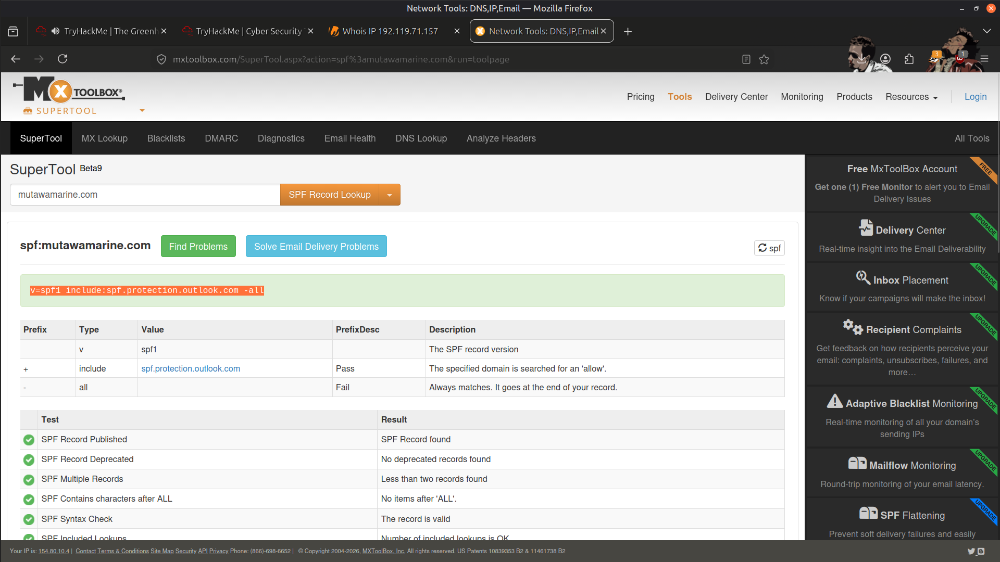

---

### DMARC Validation & Attachment Analysis

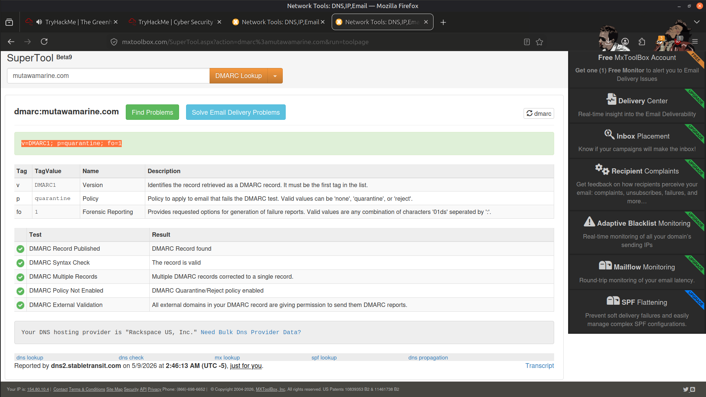

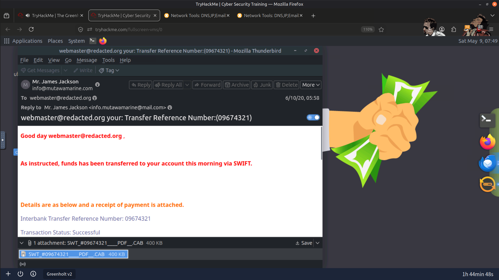

---

### Result

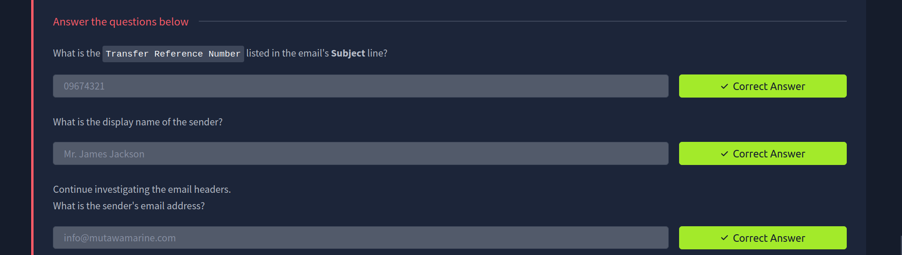

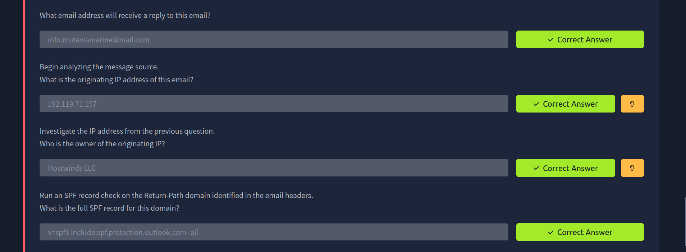

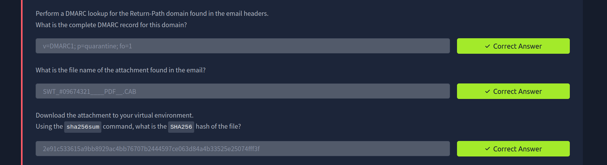

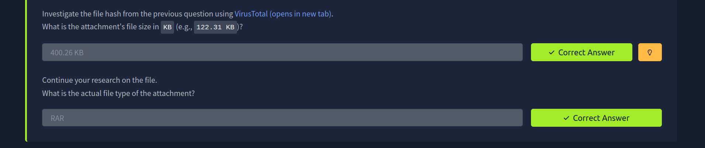

---

## 📚 Key Learnings

- Email headers provide valuable evidence for identifying sender spoofing and tracing message origins.
- SPF and DMARC records help validate sender authenticity but should always be interpreted alongside other indicators.
- Hash-based reputation services such as VirusTotal assist in determining whether email attachments are known to be malicious.
- Correlating email headers, infrastructure information, authentication records, and attachment analysis provides a comprehensive phishing investigation.
- Even seemingly simple phishing emails can reveal valuable indicators of compromise (IOCs) useful for future detections.

---

## 📚 Skills Gained

- 📧 Email Header Analysis
- 🎣 Phishing Detection
- 🕵️ Threat Investigation
- 🛡️ SPF & DMARC Validation
- 🔐 File Hash Analysis
- 🦠 Malware Attachment Investigation
- 🌐 WHOIS & Infrastructure Analysis
- 🔎 VirusTotal Threat Intelligence

---

> QXV0aG9yOiBodHRwczovL2dpdGh1Yi5jb20vSEctNzU=