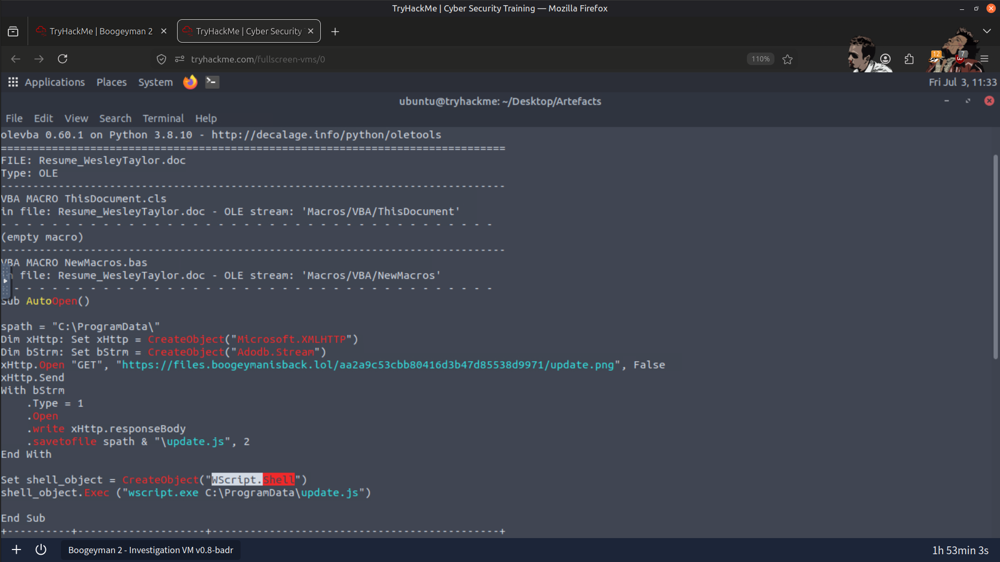
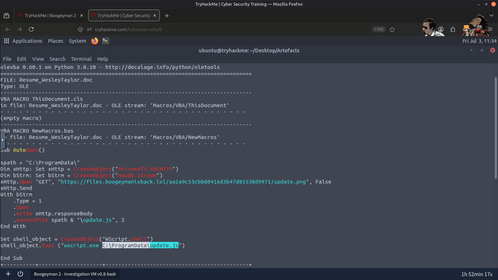
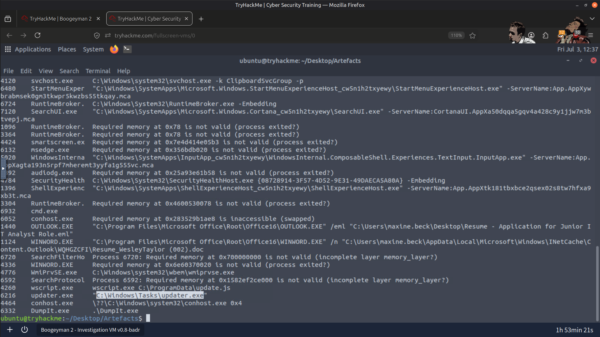
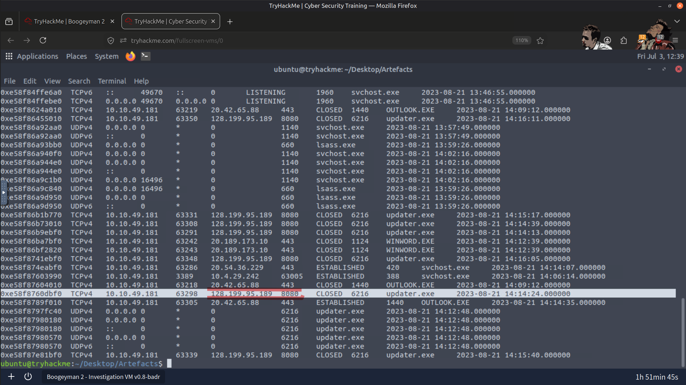
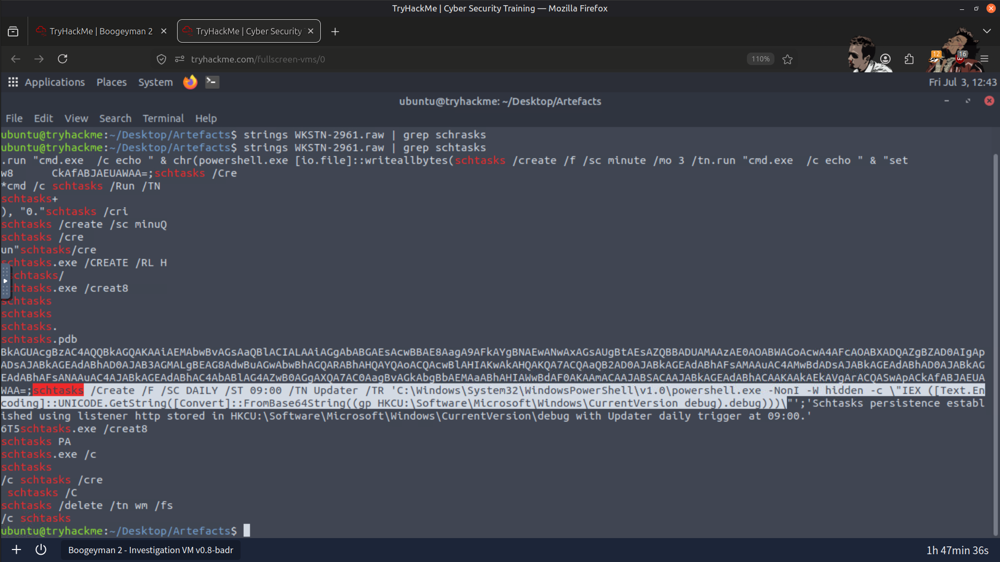
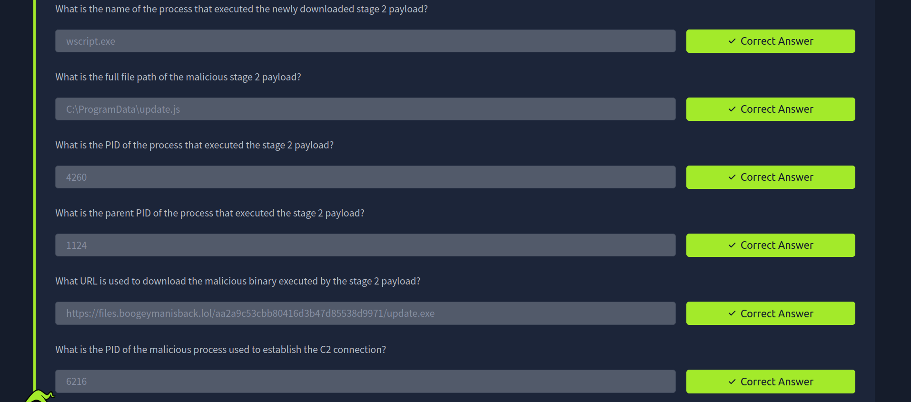

# 🧠 Ramdump & Macros Analysis

## 📖 Overview

In this lab, I investigated a phishing attack that delivered a malicious Microsoft Office document containing an embedded VBA macro. Using **Olevba** and **Volatility**, I combined static malware analysis with memory forensics to reconstruct the complete attack chain—from the initial phishing email and macro execution to payload delivery, Command-and-Control (C2) communication, and persistence.

The investigation focused on recovering forensic evidence directly from memory to understand the threat actor's techniques and map the attack lifecycle.

---

## 🎯 Objectives

- 📧 Analyze a phishing email containing a malicious Office document.
- 📝 Extract and inspect embedded VBA macros.
- 💾 Perform memory forensics using Volatility.
- 🌐 Identify payload download activity and C2 communication.
- ⏰ Recover persistence mechanisms from memory.
- 🛡️ Understand attacker TTPs across the attack lifecycle.

---

## 🛠️ Tools Used

- 📝 **Olevba** – VBA macro extraction and analysis
- 💾 **Volatility** – Memory forensics
- 💻 **Linux Terminal**

---

## 🔍 Investigation Performed

### 📧 1. Phishing Email Analysis

- Identified the attacker and victim email addresses.
- Determined the malicious attachment delivered via phishing.
- Calculated the attachment's MD5 hash for identification.

---

### 📝 2. VBA Macro Analysis

- Extracted embedded VBA macros using Olevba.
- Recovered the URL used to download the second-stage payload.
- Identified the process responsible for launching the payload.

---

### 💾 3. Memory Forensics

- Enumerated running processes.
- Identified the PID and parent PID of the malicious process.
- Recovered the complete file path of the downloaded payload.
- Reconstructed the execution chain from memory artifacts.

---

### 🌐 4. Command-and-Control (C2) Investigation

- Identified the process responsible for network communication.
- Recovered the C2 server IP address and port.
- Confirmed outbound communication established by the malware.

---

### ⏰ 5. Persistence Analysis

- Extracted the scheduled task created by the attacker.
- Identified the command used to establish persistence.
- Verified persistence artifacts directly from the memory dump.

---

## 📚 Key Learnings

- VBA macros remain a common technique for malware delivery through phishing documents.
- Memory forensics reveals attacker activity that may not exist in traditional logs.
- Process tree reconstruction is essential for tracing malware execution.
- Network artifacts in memory help confirm active C2 communication.
- Combining static analysis with memory forensics provides a complete view of an attack lifecycle.

---

## 📸 Screenshots

### Phishing Email Analysis

---

### Stage 2 Payload Download & Execution

---

### Stage 2 Payload Execution & File Path

---

### Command-and-Control (C2) Process

---

### Recovered C2 IP Address & Port

---

### Scheduled Task Persistence Created by Malware

---

### Result

---

## 🧠 Skills Gained

- Memory Forensics
- VBA Macro Analysis
- Malware Investigation
- Process Tree Analysis
- Command-and-Control Detection
- Persistence Analysis
- Incident Investigation
- Threat Hunting
- Volatility Framework
- SOC Investigation Workflow

---

## ✅ Conclusion

This lab provided practical experience investigating a phishing-based malware infection using both static analysis and memory forensics. By combining Olevba and Volatility, I reconstructed the complete attack chain, identified payload execution, confirmed C2 communication, and recovered persistence mechanisms directly from memory. The exercise strengthened my understanding of forensic investigation techniques commonly used during real-world SOC and incident response engagements.

---

> QXV0aG9yOiBodHRwczovL2dpdGh1Yi5jb20vSEctNzU=

