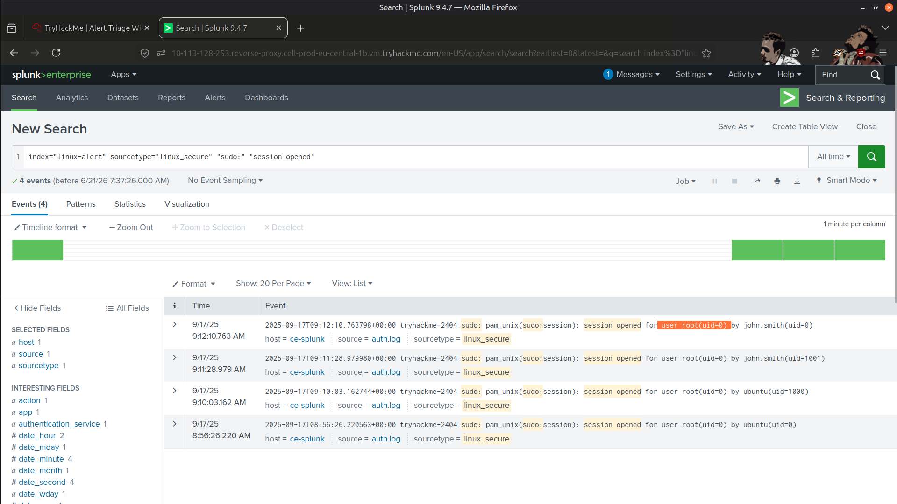
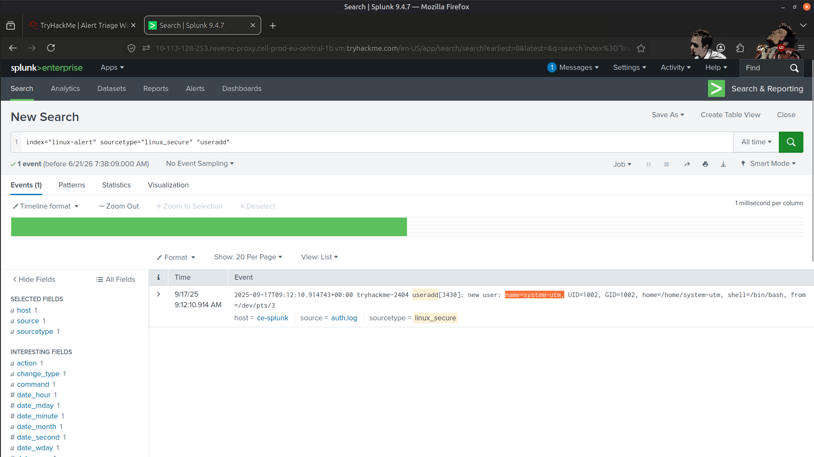
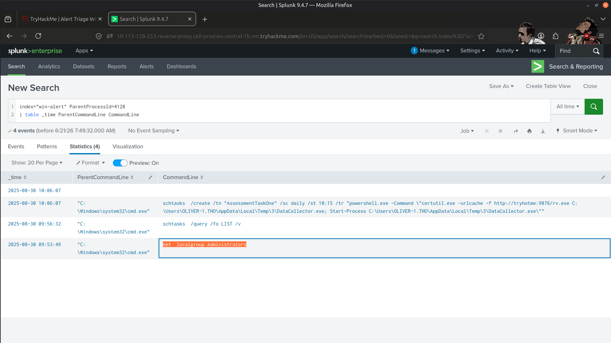
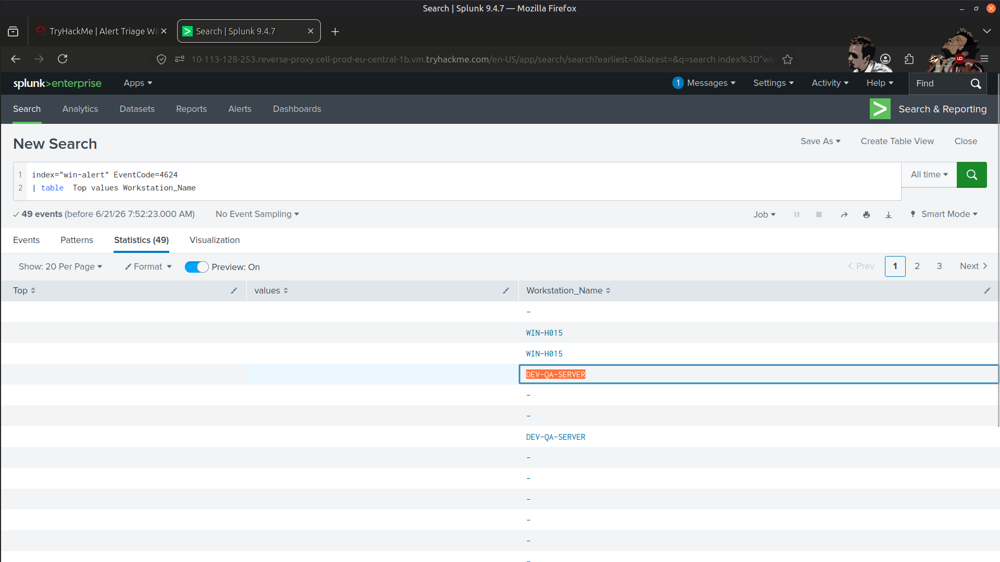
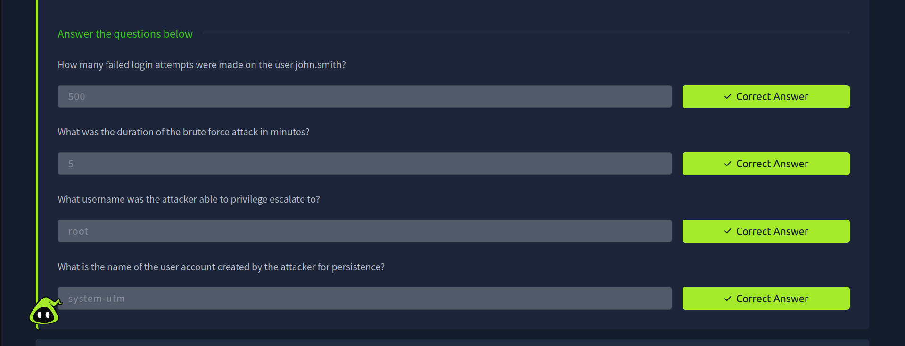
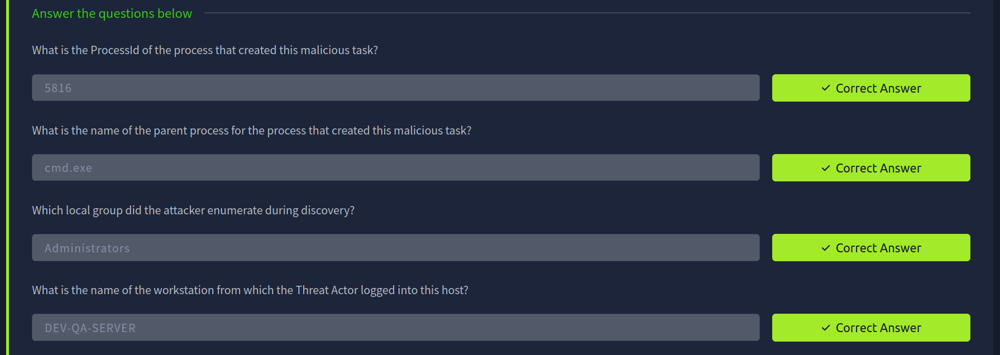
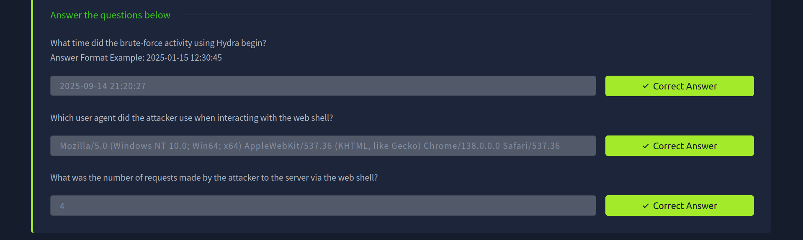

# 🚨 SOC Alert Investigation with Splunk SIEM

## 📖 Overview

In this project, I stepped into the role of a SOC Analyst and investigated multiple types of suspicious activities across different assets in a simulated environment. The focus was on understanding how alerts are generated, how to analyze them, and how to identify malicious behavior using Splunk SIEM.

This hands-on exercise helped me develop practical investigation skills that are essential for Security Operations Center (SOC) environments.

---

## 🎯 Objectives

- 🔍 Learn how to properly investigate alerts in a SOC environment.
- 🐧 Understand how to investigate brute-force attacks on Linux systems.
- 🪟 Discover persistence mechanisms on Windows systems.
- 🌐 Analyze web shell activity on a vulnerable web server.
- 📊 Investigate different attack scenarios using Splunk SIEM.

---

## 🛠️ Tools Used

- 🔎 **Splunk SIEM**
- 💻 Windows Logs
- 🐧 Linux Logs
- 🌐 Web Server Logs
- 📝 SPL (Search Processing Language) Queries

---

## 🔍 Investigation Performed

### 🔑 Initial Access Investigation

- Investigated suspicious authentication activities.
- Identified signs of unauthorized access attempts.

---

### 🔄 Persistence Investigation

- Analyzed persistence mechanisms on Windows systems.
- Investigated activities that allowed attackers to maintain access.

---

### 🌐 Web Shell Investigation

- Examined malicious web shell behavior.
- Identified traces left by attackers on the web server.

---

### 🐧 Linux Investigation

- Analyzed brute-force attempts and authentication anomalies.
- Investigated suspicious login patterns and attacker activity.

---

### 📊 Splunk Investigation

Using **Splunk SIEM**, I:

- Correlated events from multiple log sources.
- Utilized SPL queries to search and analyze logs.
- Identified Indicators of Compromise (IOCs).
- Traced attacker behavior across multiple attack stages.
- Investigated alerts and validated suspicious activity.

---

## 📚 Key Learnings

- Gained practical experience investigating alerts using Splunk SIEM.
- Improved log correlation skills across Windows, Linux, and web environments.
- Learned how persistence mechanisms appear within endpoint and authentication logs.
- Strengthened understanding of web shell investigations and attacker behavior.
- Practiced identifying Indicators of Compromise (IOCs) through log analysis.

---

## 📸 Screenshots

### Privilege Escalation

---

### Backdoor User Account Created for Persistence

---

### Local Group Enumeration

---

### Attacker Source Workstation

---

### Result

---

## 🧠 Skills Gained

- Splunk SIEM
- SPL Queries
- Alert Investigation
- Log Analysis
- Threat Hunting
- Windows Security Monitoring
- Linux Security Monitoring
- Web Shell Detection
- IOC Identification
- Incident Investigation

---

## ✅ Conclusion

This project provided valuable hands-on experience investigating security alerts using Splunk SIEM. By analyzing Windows, Linux, and web server logs, I correlated events, identified malicious behavior, and investigated multiple attack scenarios. The exercise strengthened my SOC investigation workflow and improved my ability to detect and analyze threats using SIEM technologies.

---

> QXV0aG9yOiBodHRwczovL2dpdGh1Yi5jb20vSEctNzU=

