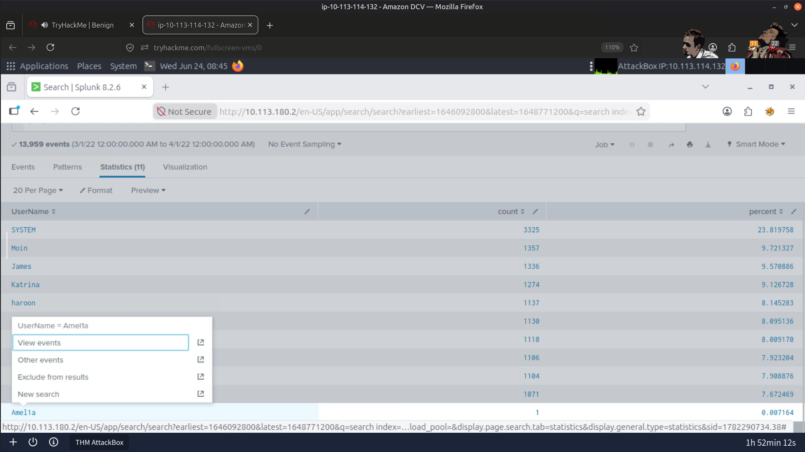
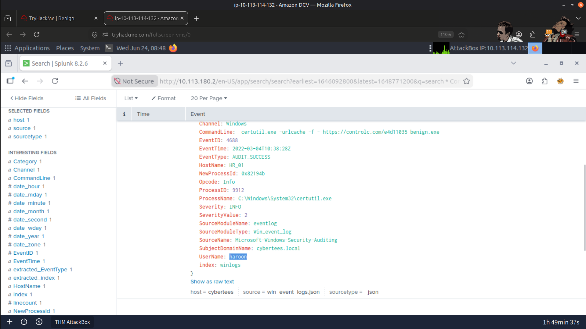
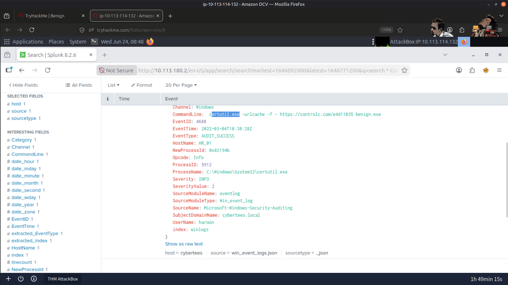
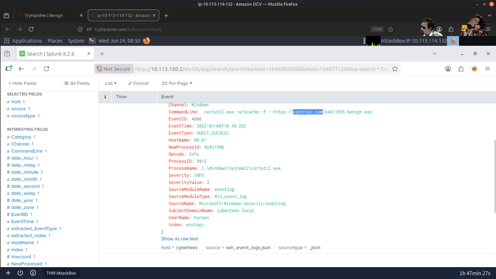
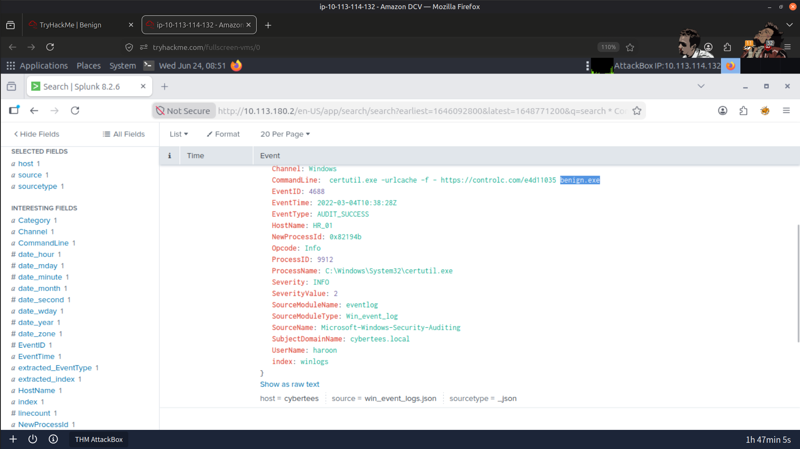
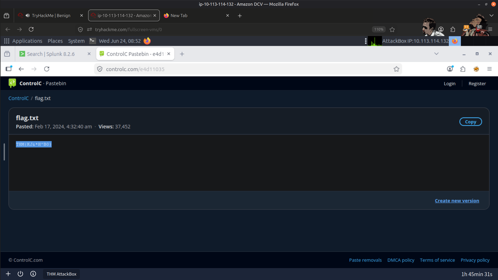
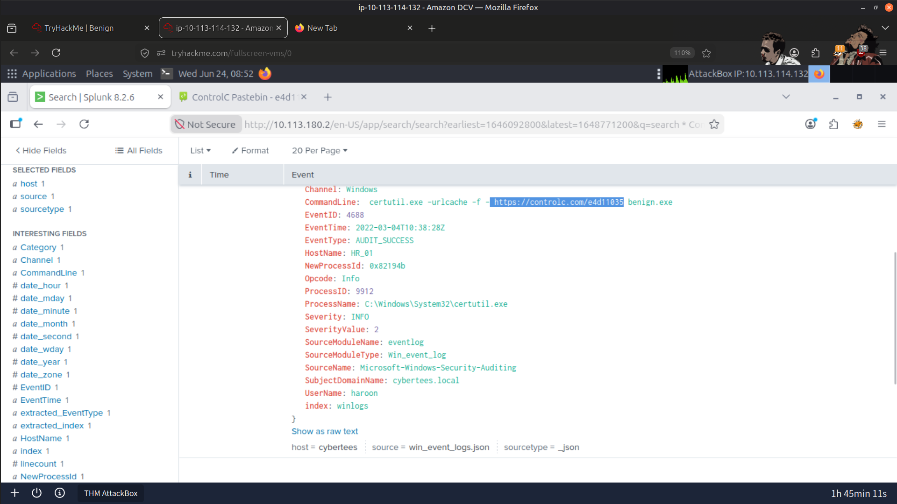
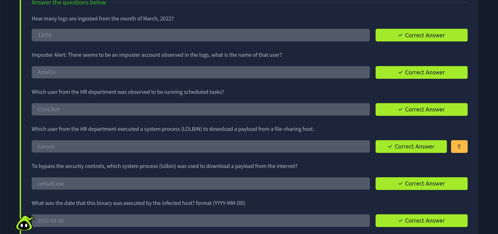
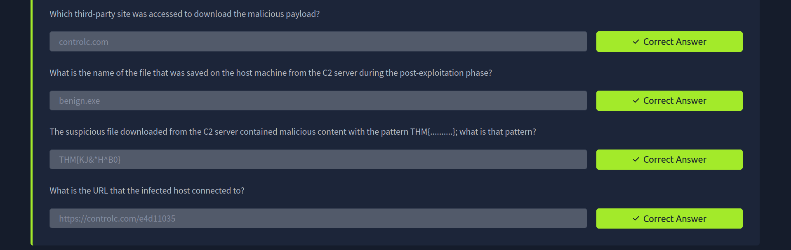

# 🔎 Splunk - Malicious Download Investigation

## 🎯 Objectives

* Investigate suspicious process execution on a host from the HR department.
* Identify malicious activity using Windows Logs.
* Correlate process execution with network behavior to detect adversary activity.
* Understand techniques like LOLBINS for payload delivery and post-exploitation activities.

## 🛠️ Tools Used

* 📊 Splunk (SIEM solution)
* 🖥️ Windows Event Logs

## 🚀 Steps Performed

* 📋 I reviewed event logs ingested into the `win_eventlogs` index.
* 🔢 I counted the total logs for March 2022 to assess the scale of activity.
* 👤 I identified potential imposter accounts based on unusual log entries.
* 🎯 I filtered logs to focus on HR department users.
* 🖥️ I tracked the execution of scheduled tasks to pinpoint the compromised host.
* ⚙️ I investigated the usage of system processes (LOLBINs) to download payloads.
* 🌐 I extracted payload download details, including the date, file name, source site, and C2 server URL.
* 🔍 I examined downloaded files for malicious patterns.

## 📚 Key Learnings

* 📝 Event logs are crucial for tracking process execution and detecting suspicious activity.
* 🕵️ Adversaries often use legitimate system processes (LOLBINs) to evade detection.
* 🔗 Correlating user activity across network segments helps identify the source and scope of compromise.
* 🎯 Post-exploitation analysis can reveal the payload origin, file artifacts, and malicious patterns for threat hunting.

## 📸 Screenshots

### Imposter User

---

### Infected User

---

### Tool to download Payload

---

### 3rd Part Site to Access Payload

---

### C2 Server

---

### Malicious Content

---

### Infected URL

---

### Result

---

> QXV0aG9yOiBodHRwczovL2dpdGh1Yi5jb20vSEctNzU=
