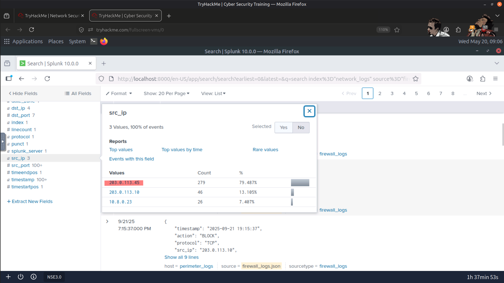
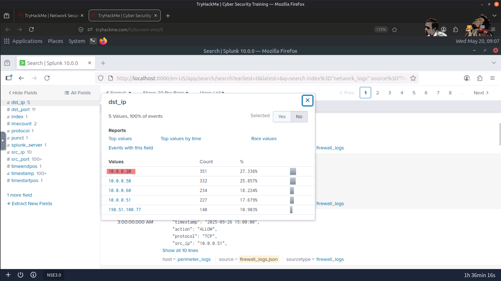
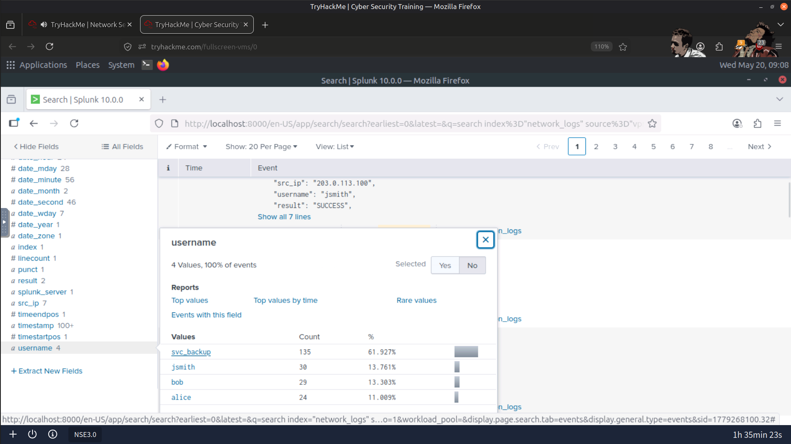
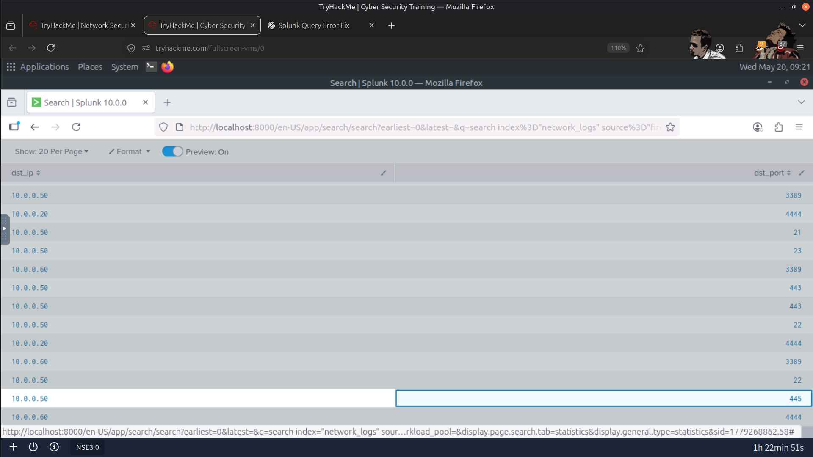
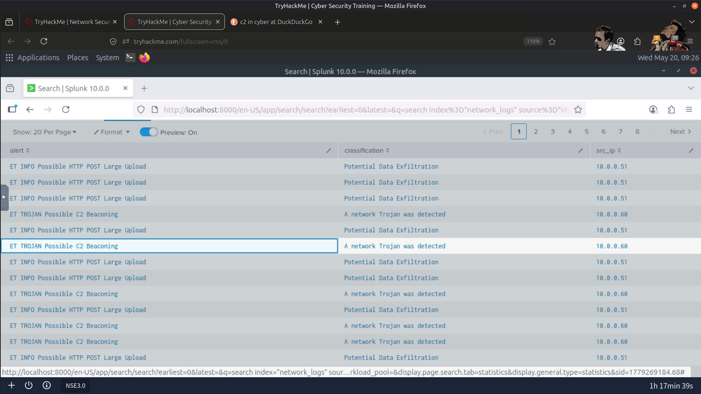
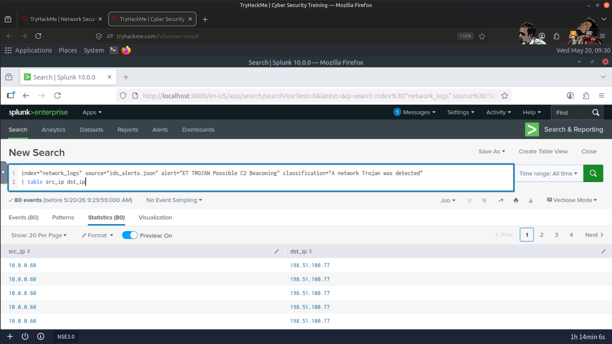
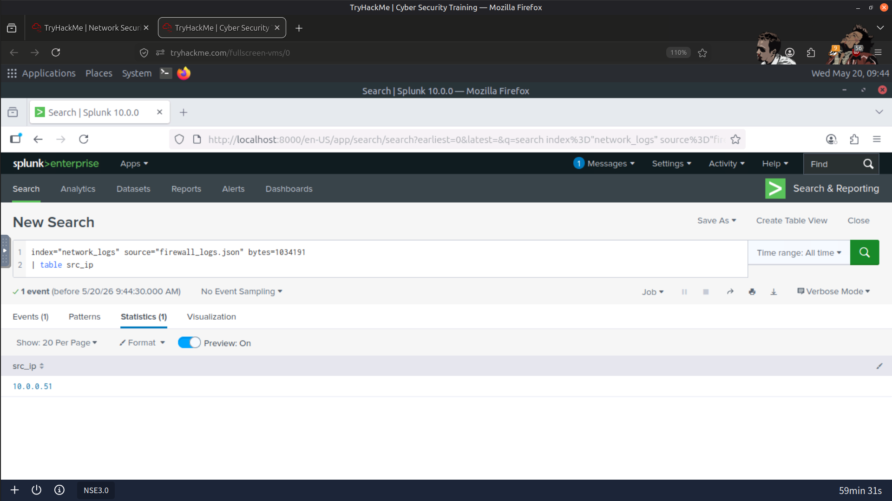
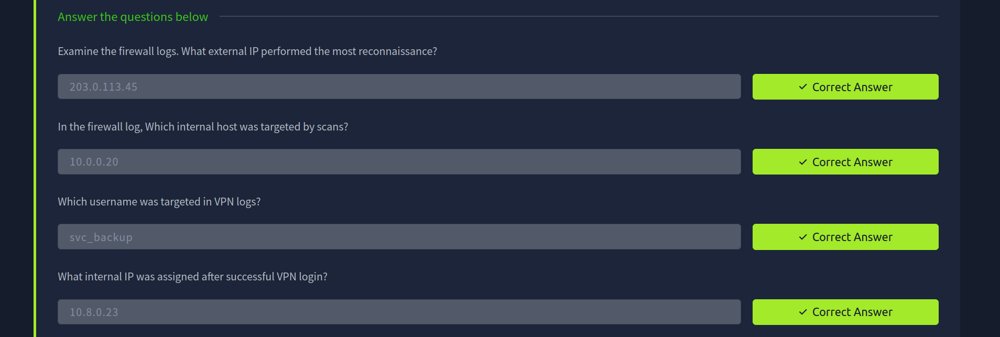
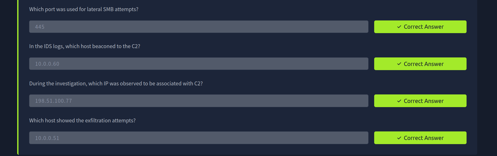

# 🧱 Perimeter Log Analysis Challenge

---

## 📌 Overview

In this challenge, I analyzed one month of perimeter security logs from Nitech Corp, a financial services company.

The goal was to identify suspicious activity, understand the attacker’s techniques, and determine whether the perimeter defenses were breached.

The logs provided included:

- 🧱 Firewall Logs (`firewall.log`)
- 🚨 IDS/WAF Logs (`ids_alerts.log`)
- 🔑 VPN Authentication Logs (`vpn_auth.log`)

I used Splunk to investigate the logs, search for indicators of compromise (IOCs), analyze suspicious traffic patterns, and answer the challenge questions.

---

## 🛠️ Skills Practiced

- Splunk searching & filtering
- Log correlation
- Firewall log analysis
- IDS alert investigation
- VPN authentication monitoring
- Identifying suspicious IP activity
- Investigating possible lateral movement
- Investigating possible data exfiltration
- Threat detection & analysis

---

## 🔎 Investigation Process

During the investigation, I performed the following tasks:

- Identified suspicious source IPs.
- Investigated denied and allowed firewall actions.
- Checked IDS alerts for attack signatures.
- Monitored unusual VPN login attempts.
- Investigated SMB traffic associated with lateral movement.
- Identified potential C2 beaconing activity.
- Used the **`bytes`** field to identify hosts generating unusually large outbound transfers and investigated potential data exfiltration.
- Correlated events across firewall, IDS, and VPN logs to reconstruct attacker activity.

---

## 🧰 Tools Used

- 🖥️ Splunk
- 📝 Linux CLI
- 📂 Log files

---

## 📸 Screenshots

### Reconnaissance Source IP

---

### Internal Host Targeted by Reconnaissance Scans

---

### Targeted Username in VPN Logs

---

### SMB Port Used for Lateral Movement

---

### C2 Beaconing Host

---

### C2 Server IP Address

---

### Host Exhibiting Data Exfiltration Activity

---

### Result

---

## ✅ Conclusion

This challenge helped me improve my practical SOC investigation skills by analyzing perimeter security logs with Splunk to identify reconnaissance, lateral movement, C2 communication, and potential data exfiltration. It also strengthened my ability to correlate firewall, IDS, and VPN events while using network traffic characteristics, such as transfer size, to identify suspicious behavior during a simulated incident investigation.

---

> QXV0aG9yOiBodHRwczovL2dpdGh1Yi5jb20vSEctNzU=