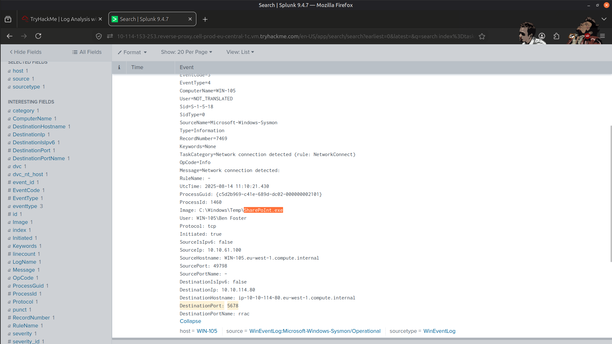
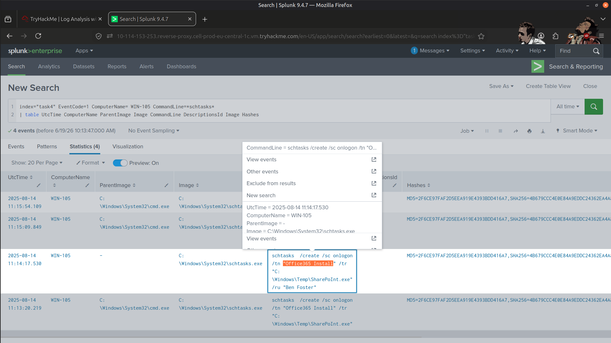
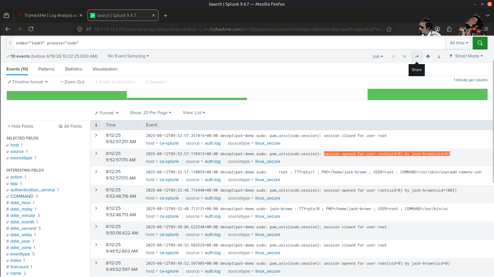
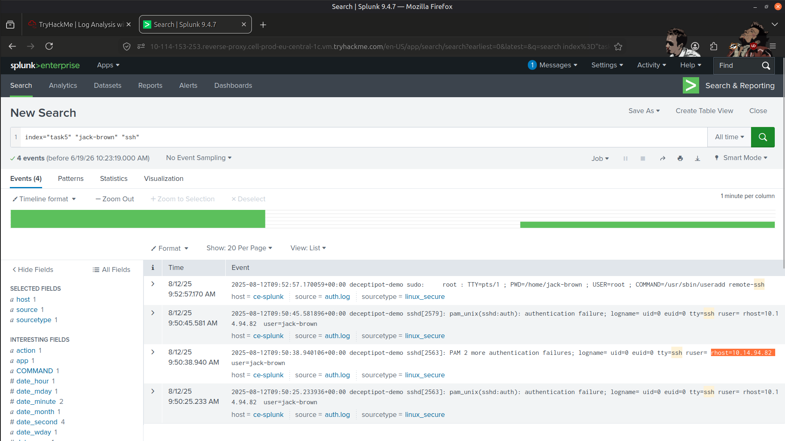
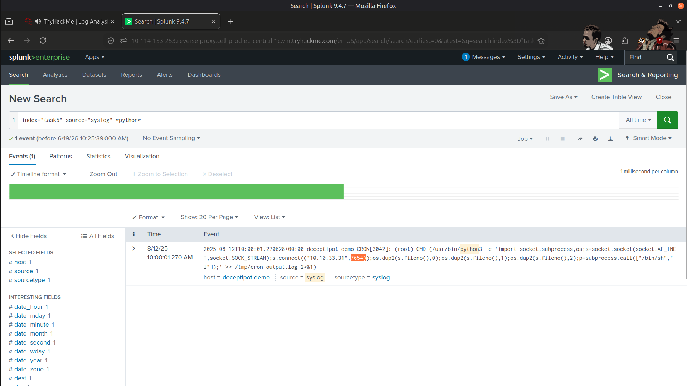
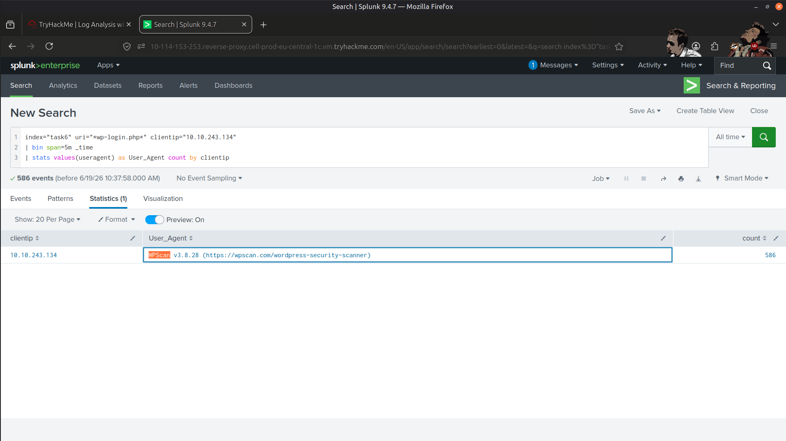
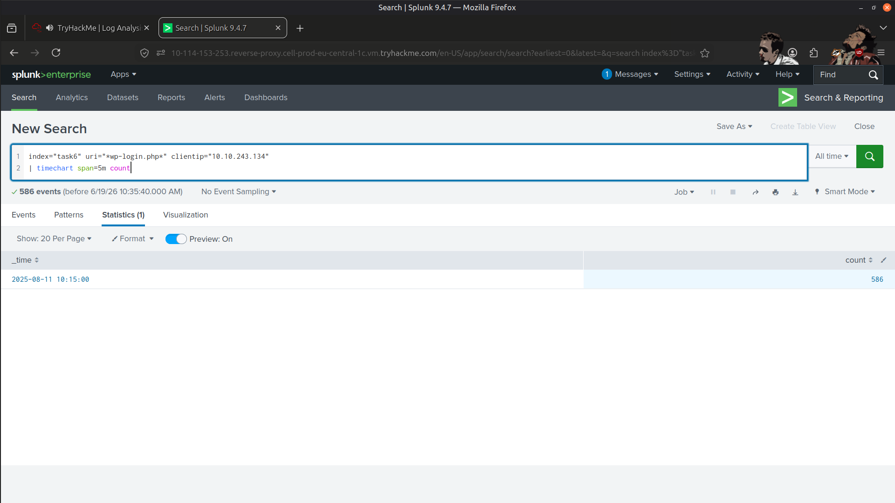
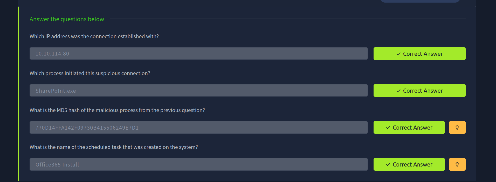
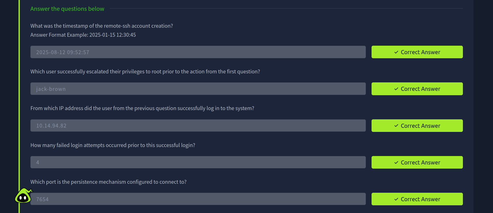
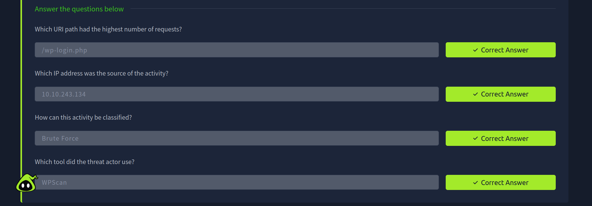

# 🔍 SIEM Log Analysis & Correlation

## 📖 Overview

In this lab, I explored how Security Information and Event Management (SIEM) platforms help SOC analysts collect, normalize, and correlate events from multiple log sources to identify malicious activity and compromised assets.

Using Splunk SIEM and SPL queries, I investigated events across Windows, Linux, web, and network logs to understand how log correlation improves threat detection and incident investigations.

---

## 🎯 Learning Objectives

- 📥 Discover various data sources that are ingested into a SIEM.
- 🔗 Understand the importance of log correlation.
- 🖥️ Learn the value of Windows, Linux, Web, and Network logs during investigations.
- 🕵️ Practice investigating malicious activity through log correlation.

---

## 🛠️ Tools Used

- 🔎 **Splunk SIEM**
- 📝 **Splunk Search Processing Language (SPL) Queries**

---

## 📂 Log Sources Explored

### 🪟 Windows Logs

- Windows Event Logs
- Sysmon Logs
- Useful for detecting process creation, network connections, and suspicious activity.

### 🐧 Linux Logs

- System and authentication logs
- Helpful for identifying unauthorized access and suspicious commands.

### 🌐 Web Logs

- HTTP requests and responses
- Useful for investigating web attacks and malicious traffic.

### 🌐 Network Logs

- Network activity and communication data
- Valuable for tracing connections and identifying suspicious behavior.

---

## 📚 Key Learnings

- Explored the role of SIEM platforms in security monitoring and investigations.
- Used SPL queries to identify malicious behavior across multiple log sources.
- Gained practical experience with log correlation and normalization.
- Understood how combining Windows, Linux, web, and network logs provides greater investigative context.
- Strengthened analytical skills by investigating security events across multiple data sources.

---

## 🚀 Skills Gained

- SIEM Fundamentals
- Splunk SPL Queries
- Log Analysis
- Event Correlation
- Log Normalization
- Windows Log Analysis
- Sysmon Analysis
- Linux Log Analysis
- Web Log Analysis
- Network Log Analysis
- Threat Investigation

---

## 📸 Screenshots

### Process Initiating a Suspicious Connection

---

### Scheduled Task Name

---

### Privilege Escalation

---

### Attacker IP Address

---

### Persistence Mechanism Connection Port

---

### Tool Used by the Attacker

---

### Brute Force

---

### Result

---

## ✅ Conclusion

This lab strengthened my understanding of SIEM operations and demonstrated how correlating Windows, Linux, web, and network logs enables SOC analysts to detect, investigate, and respond to security incidents more effectively.

---

> QXV0aG9yOiBodHRwczovL2dpdGh1Yi5jb20vSEctNzU=