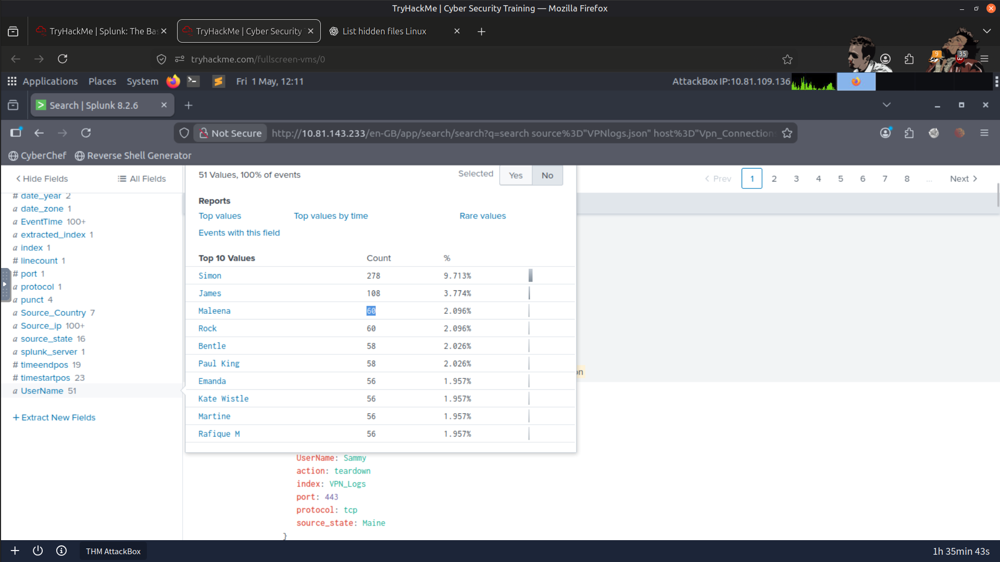
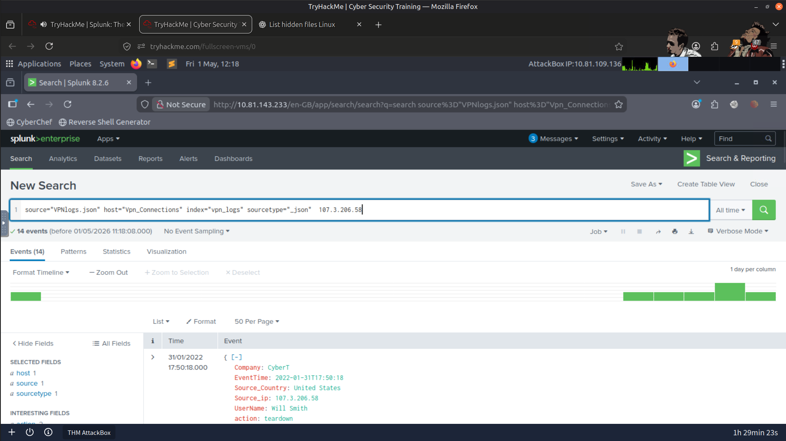
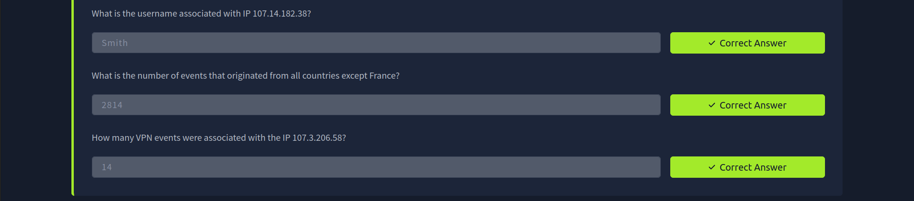

# 🔐 Splunk VPN Log Analysis (SOC Simulation)

---

## 📌 Overview

In this lab, I analyzed VPN authentication logs using Splunk to simulate how a SOC analyst investigates user activity and extracts actionable insights from security logs.

Using Splunk and SPL queries, I explored VPN events, filtered log data, and answered investigation questions based on user accounts, IP addresses, and geographic information.

📸 Refer to the screenshots for the investigation workflow and query results.

---

## 🎯 Objectives

- 📥 Import VPN log data into Splunk.
- 🔎 Search and filter events using SPL queries.
- 👤 Investigate user-specific VPN activity.
- 🌐 Analyze IP address and geolocation information.
- 📊 Practice log analysis techniques used in SOC environments.

---

## 🛠️ Tools Used

- 🔎 **Splunk SIEM**
- 📝 **Splunk Search Processing Language (SPL)**

---

## 🚀 Investigation Process

During this exercise, I:

- Uploaded the provided VPN log dataset into Splunk.
- Created a custom index named **VPN_Logs**.
- Queried VPN authentication events using SPL.
- Filtered events based on usernames, IP addresses, and countries.
- Investigated user and network activity to answer challenge questions.

---

## 📚 Key Learnings

- Gained practical experience searching and filtering VPN logs with SPL.
- Learned how to investigate user authentication activity.
- Improved my understanding of IP-based and geolocation-based investigations.
- Strengthened my ability to extract meaningful information from raw log data.
- Practiced the investigation workflow commonly used by SOC analysts.

---

## 🚀 Skills Gained

- Splunk Log Analysis
- SPL Query Development
- VPN Authentication Analysis
- User Activity Investigation
- IP Address Analysis
- Geolocation Filtering
- Security Event Investigation
- SOC Investigation Workflow

---

## 📂 Screenshots

### User-Specific VPN Activity

---

### VPN Logs Associated with a Specific IP Address

---

### Result

---

## ✅ Conclusion

This exercise provided hands-on experience investigating VPN authentication logs using Splunk. By writing SPL queries and analyzing user, IP address, and geolocation data, I strengthened my understanding of the log analysis techniques and investigative workflow commonly used by SOC analysts during security monitoring and incident investigations.

---

> QXV0aG9yOiBodHRwczovL2dpdGh1Yi5jb20vSEctNzU=