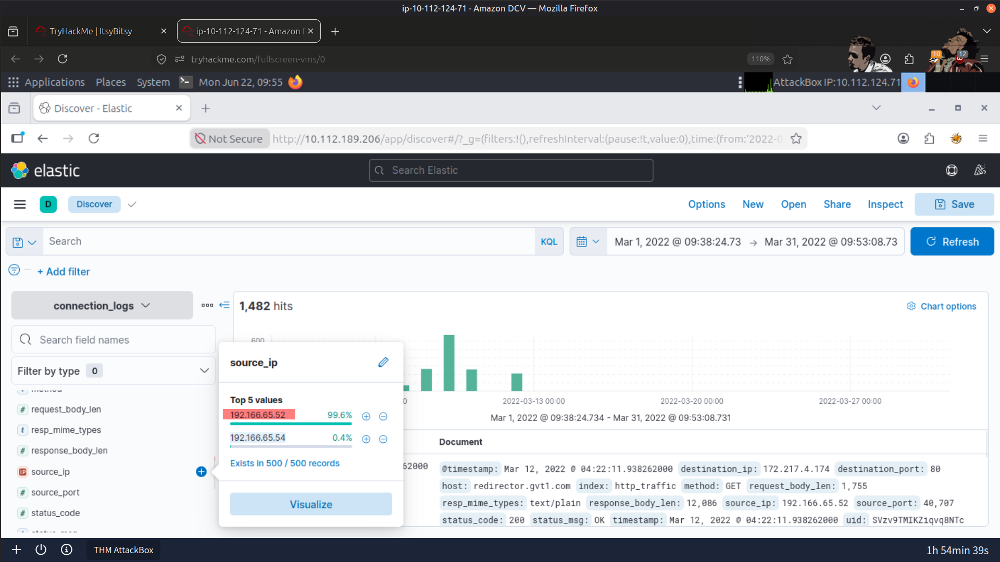
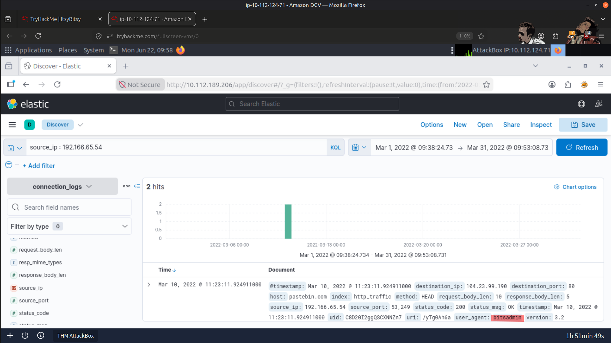
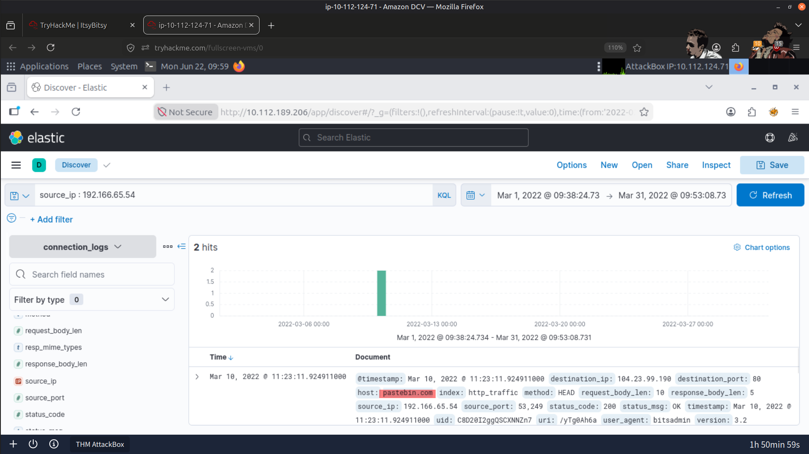
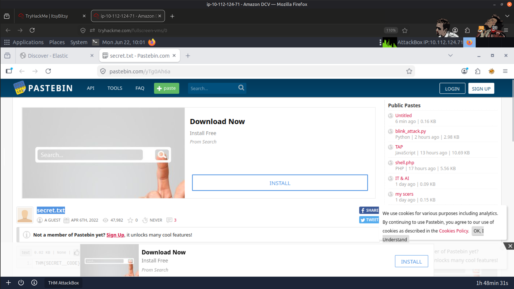
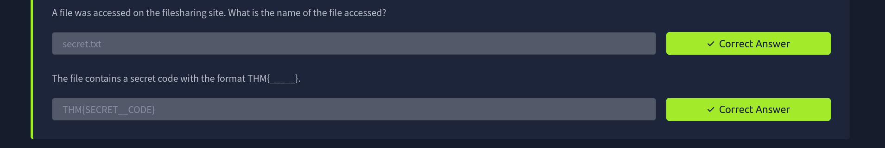

# 🚨 C2 Communication Detection – ELK

## 🕷️ Itsy Bitsy Challenge

## 📌 Overview

In this lab, I investigated an IDS alert indicating potential Command-and-Control (C2) communication originating from an internal HR user. Using Kibana and the Elastic Stack, I analyzed HTTP connection logs to identify suspicious outbound traffic, investigate malicious artifacts, and correlate network events associated with C2 activity.

---

## 🎯 Objectives

- 🔍 Investigate IDS logs indicating potential Command-and-Control (C2) communication from an internal HR user.
- 📊 Analyze HTTP connection logs ingested into Kibana.
- 🌐 Identify suspicious outbound connections, accessed URLs, and malicious file content.
- 🧩 Extract and confirm the malicious pattern contained within the accessed file.
- 🛡️ Build experience in log querying, pattern extraction, and network behavior analysis using Kibana and the Elastic Stack.

---

## 🛠️ Tools Used

- 📈 **ELK Stack (Kibana):** Primary platform for log ingestion, searching, correlation, and visualization.
- 🦠 **VirusTotal:** Threat intelligence platform for investigating malicious artifacts.
- 🌍 **Browserling:** Browser sandbox for safely accessing suspicious URLs.

---

## 📝 Investigation Process

1. 🔎 Reviewed the IDS alert indicating potential C2 communication originating from an HR user.
2. 📂 Queried HTTP logs to isolate traffic generated by the affected user.
3. 🚩 Identified suspicious outbound HTTP connections inconsistent with normal HR activity.
4. 🌐 Traced outbound connections to a remote endpoint suspected of hosting malicious content.
5. 📄 Identified the exact URL responsible for triggering the IDS alert.
6. 🧩 Extracted the file contents and confirmed the embedded malicious pattern.
7. ⏱️ Reviewed the timeline and frequency of requests to distinguish malicious behavior from legitimate activity.
8. 🔗 Correlated IDS alerts with HTTP log data to confirm C2 beaconing behavior.

---

## 📚 Key Learnings

- Strengthened skills in analyzing HTTP network logs using Kibana.
- Improved understanding of C2 traffic indicators and behavioral anomalies.
- Practiced filtering traffic by user identity to isolate suspicious activity.
- Learned how malicious artifacts embedded within downloaded files can trigger IDS alerts.
- Enhanced my ability to correlate IDS alerts with network logs to validate malicious activity.

---

## 📸 Screenshots

### Attacker IP Address

---

### Malicious Binary

---

### C2 Server

---

### Malicious File

---

### Result

---

## ✅ Conclusion

This lab provided practical experience investigating Command-and-Control activity using the Elastic Stack. By correlating IDS alerts with HTTP connection logs, I identified suspicious outbound communication, analyzed malicious artifacts, and strengthened my understanding of network-based threat detection and SOC investigation workflows.

---

> QXV0aG9yOiBodHRwczovL2dpdGh1Yi5jb20vSEctNzU=