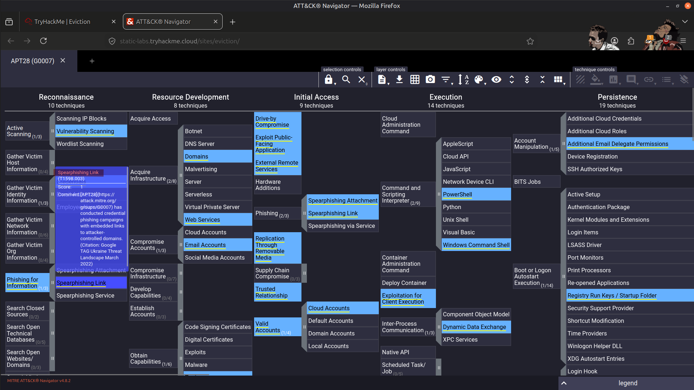
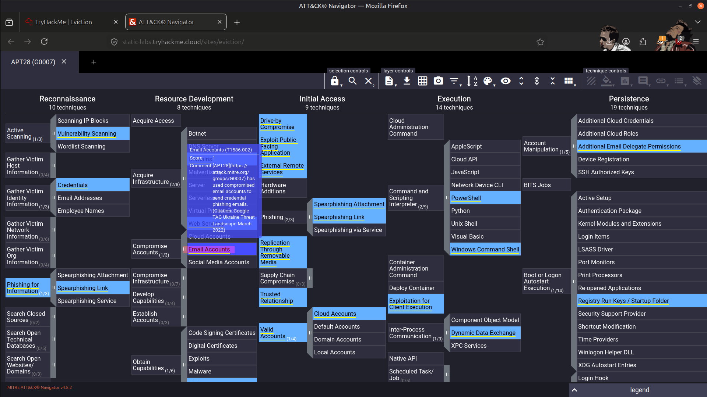
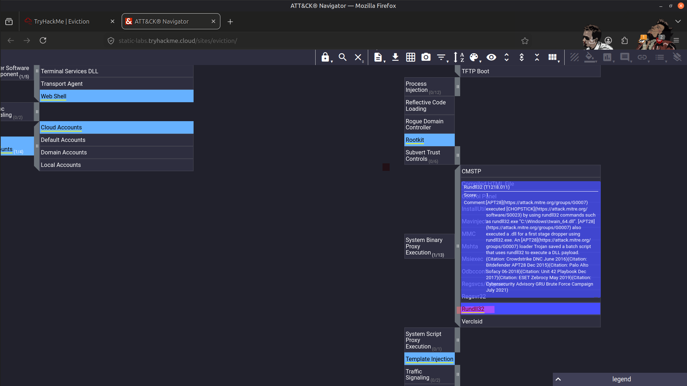
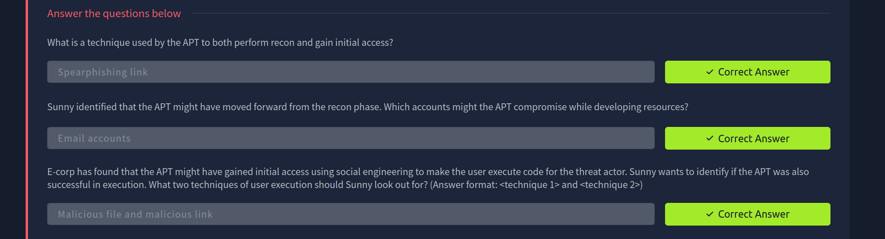
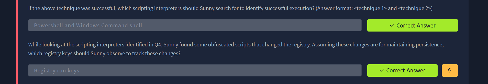
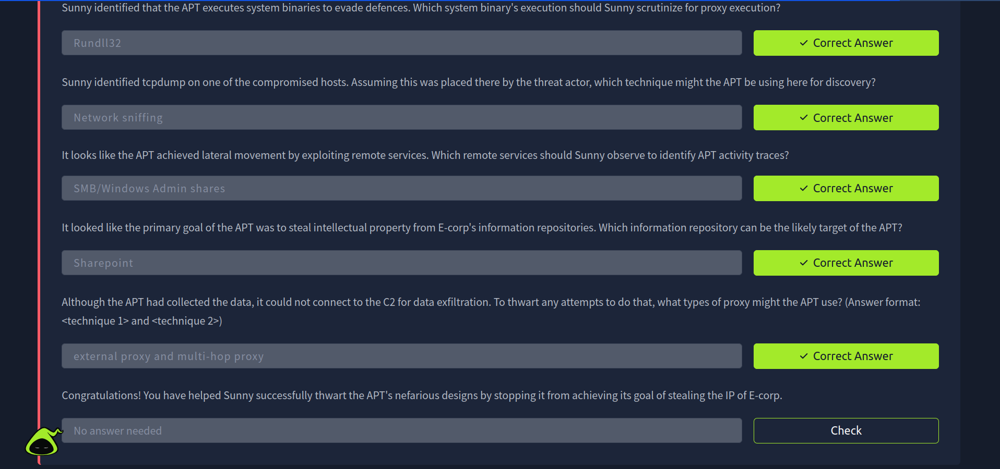

# 🧠 MITRE ATT&CK Navigator – Threat Intelligence Analysis (APT28)

## 📌 Overview

In this lab, I used the MITRE ATT&CK Navigator to analyze the tactics, techniques, and procedures (TTPs) associated with the APT28 threat group. The objective was to assess how these techniques could be used against E-corp and to understand how threat intelligence supports proactive threat hunting, detection engineering, and incident response.

---

## 🎯 Objectives

- 🕵️ Analyze the tactics, techniques, and procedures (TTPs) used by APT28.
- 🗺️ Map adversary behavior to the MITRE ATT&CK framework.
- 🔍 Identify attack techniques that could indicate compromise within the environment.
- 🛡️ Support proactive threat hunting and detection planning.
- 📊 Improve understanding of intelligence-driven security operations.

---

## 🛠️ Tools Used

- 🧭 **MITRE ATT&CK Navigator**
- 📚 **MITRE ATT&CK Framework**

---

## 📝 Investigation Process

Using the MITRE ATT&CK Navigator layer provided for APT28, I:

- Analyzed the threat group's known TTPs.
- Mapped attacker behavior to the MITRE ATT&CK framework.
- Identified attack techniques relevant to E-corp's environment.
- Assessed whether observed techniques could indicate an existing compromise.
- Evaluated opportunities to improve threat hunting and detection coverage.

---

## 🔍 ATT&CK Tactics Analyzed

During the investigation, I analyzed techniques associated with the following ATT&CK tactics:

- Initial Access
- Execution
- Persistence
- Privilege Escalation
- Defense Evasion
- Credential Access
- Discovery
- Lateral Movement
- Command and Control

This provided a comprehensive understanding of APT28's attack lifecycle and how its techniques could be detected within an enterprise environment.

---

## 📚 Key Learnings

- Improved understanding of intelligence-driven threat analysis.
- Learned how to map adversary behavior using the MITRE ATT&CK framework.
- Identified techniques that can support proactive threat hunting.
- Gained experience using ATT&CK Navigator to visualize adversary TTPs.
- Strengthened knowledge of detection engineering and ATT&CK-based investigations.

---

## 📸 Screenshots

### Initial Access and Reconnaissance Techniques

---

### Compromised Account Activity

---

### System Binary Proxy Execution

---

### Result

---

## 🚀 Skills Gained

- MITRE ATT&CK Navigator
- Threat Intelligence Analysis
- APT28 TTP Analysis
- ATT&CK Technique Mapping
- Threat Hunting
- Detection Engineering
- Adversary Emulation Concepts

---

## ✅ Conclusion

This lab strengthened my ability to analyze advanced threat groups using the MITRE ATT&CK framework. By mapping APT28's tactics and techniques to the ATT&CK knowledge base, I gained practical experience in applying threat intelligence to improve threat hunting, detection engineering, and incident response readiness.

---

> QXV0aG9yOiBodHRwczovL2dpdGh1Yi5jb20vSEctNzU=