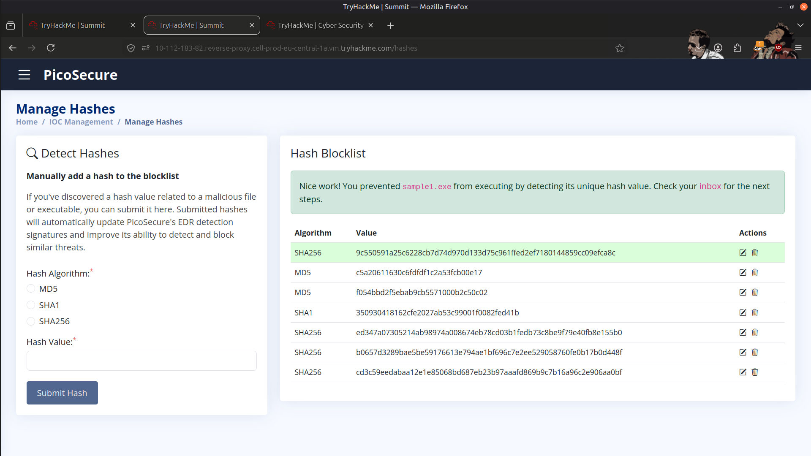
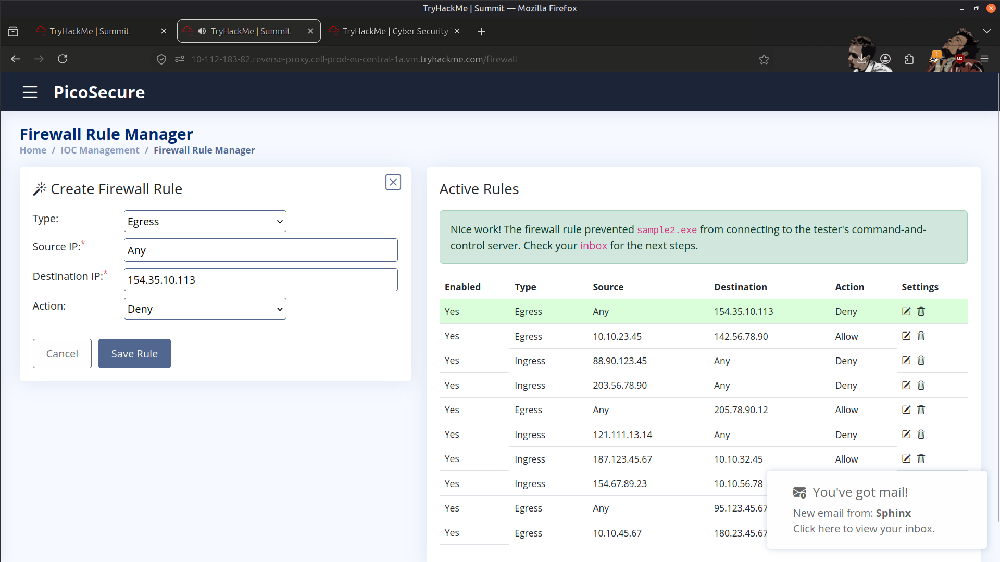
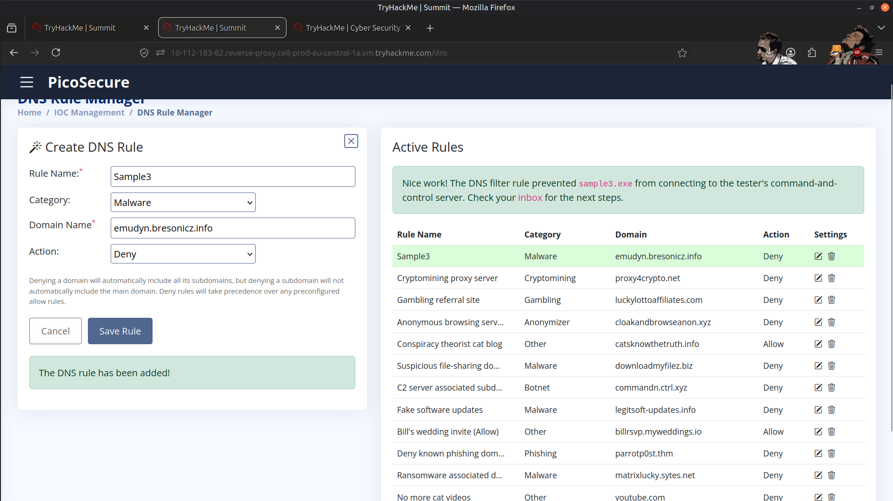
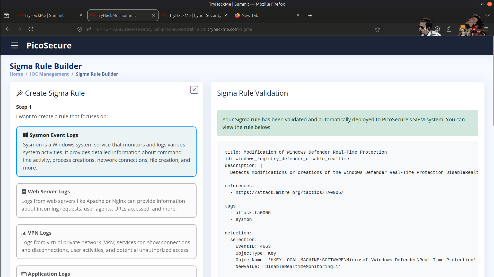
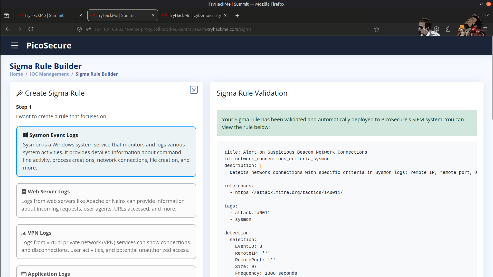
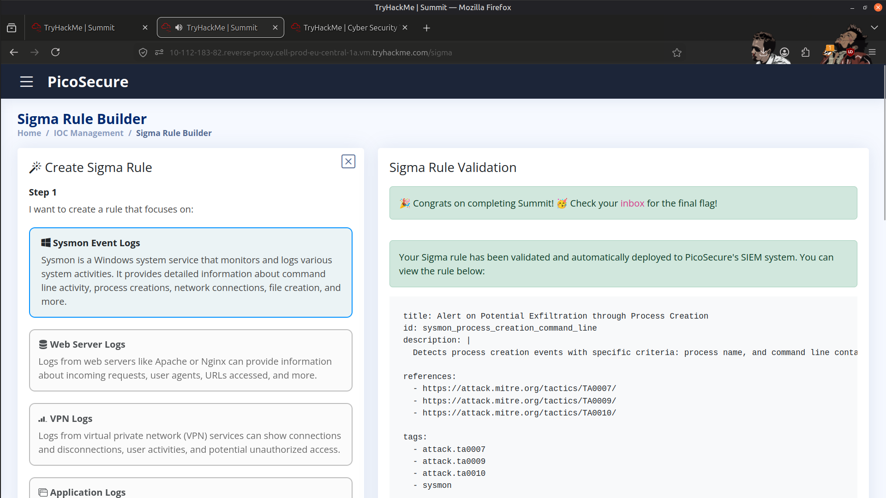

# 🛡️ Threat Simulation & Detection Engineering

---

## 📌 Overview

In this lab, I participated in a purple-team exercise focused on improving malware detection and prevention capabilities through threat simulation and detection engineering. An external penetration tester simulated malware execution against a workstation while defensive controls were developed and refined to detect and block malicious activity.

The exercise followed the **Pyramid of Pain** methodology, emphasizing higher-value detections that increase an adversary's operational cost through layered defensive controls.

---

## 🎯 Objectives

- 🦠 Analyze simulated malware samples.
- 🚫 Prevent malware execution using IOC-based detections.
- 🌐 Block communication with malicious infrastructure.
- 📜 Develop Sigma rules for behavior-based detection.
- 🛡️ Strengthen detection engineering capabilities using layered security controls.

---

## 🛠️ Tools Used

- 🛡️ Windows Defender
- 📜 Sigma Rules
- 🌐 DNS Monitoring
- 🔥 Firewall Rules
- 💻 Windows Event Logs

---

## 📝 Detection Engineering Process

### 🧪 Sample 1 – File Hash Blocking

#### 📌 Overview

The first malware sample was detected and prevented using its file hash.

#### 🔍 Detection Activity

- Identified the malicious file hash.
- Configured a hash-based blocking rule.
- Prevented execution of the malware sample.

#### 🎯 Detection Goal

- Detect known malicious files.
- Prevent malware execution.
- Block reuse of known malware samples.

---

### 🌐 Sample 2 – Malicious Infrastructure Blocking

#### 📌 Overview

The second malware sample relied on communication with malicious infrastructure.

#### 🔍 Detection Activity

- Identified the malicious destination.
- Configured a firewall rule to block outbound communication.
- Prevented Command-and-Control (C2) communication.

#### 🎯 Detection Goal

- Block communication with malicious infrastructure.
- Prevent outbound C2 traffic.
- Disrupt malware execution.

---

### 🧠 Sample 3 – Detection Engineering

#### 📌 Overview

For the final sample, I created multiple behavior-based detection rules to identify malicious activity throughout the attack lifecycle.

The detections focused on:

- 🌐 DNS activity
- 📡 Network communication
- 🗂️ Registry modifications
- ⚠️ Malware execution indicators

---

### 🌐 DNS Detection

Created DNS detection rules to identify suspicious domain resolution activity.

**Purpose**

- Detect malicious DNS queries.
- Identify potential C2 communication.
- Monitor DNS-based indicators of compromise (IOCs).

---

### 📡 Sigma Rule – Network Detection

Created a Sigma rule to detect suspicious outbound network connections generated by the malware.

**Purpose**

- Detect outbound beaconing.
- Identify communication with malicious infrastructure.
- Monitor suspicious network activity.

---

### 🗂️ Sigma Rule – Registry Detection

Created a Sigma rule to detect malicious registry modifications associated with persistence.

**Purpose**

- Detect persistence mechanisms.
- Monitor unauthorized registry changes.
- Identify attempts to maintain long-term access.

---

## 📚 Key Learnings

- Applied the Pyramid of Pain methodology to detection engineering.
- Developed practical experience creating IOC-based and behavior-based detections.
- Learned how layered defensive controls improve malware detection.
- Strengthened understanding of Sigma rule development.
- Improved visibility into malware behavior across multiple stages of the attack lifecycle.

---

## 📸 Screenshots

### Sample 1 – Malicious File Hash

---

### Sample 2 – Firewall Rule Blocking Malicious Infrastructure

---

### Sample 3 – DNS Detection Rule

---

### Sample 4 – Windows Defender Sigma Rule

---

### Sample 5 – Beacon Network Connection Detection

---

### Sample 6 – Potential Data Exfiltration Detection

---

## 🚀 Skills Gained

- Threat Simulation
- Detection Engineering
- Sigma Rule Development
- IOC-Based Detection
- DNS Monitoring
- Registry Monitoring
- Network Traffic Analysis
- Malware Behavior Analysis
- Windows Defender
- Defense-in-Depth

---

## ✅ Conclusion

This purple-team exercise strengthened my understanding of both offensive simulation and defensive detection engineering. By implementing hash-based blocking, infrastructure blocking, DNS monitoring, registry monitoring, and Sigma rules, I gained practical experience building layered detections that improve an organization's ability to detect and disrupt modern malware campaigns.

---

> QXV0aG9yOiBodHRwczovL2dpdGh1Yi5jb20vSEctNzU=