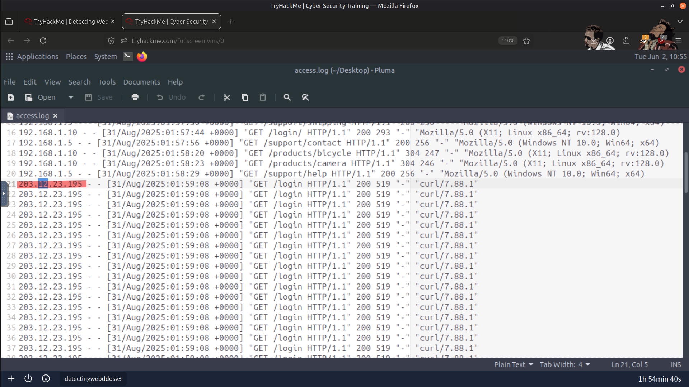
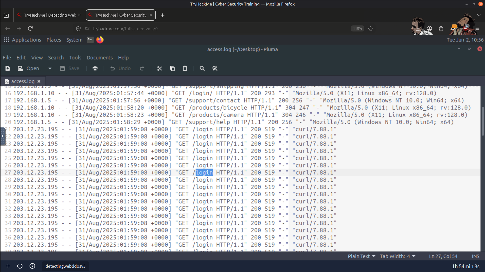
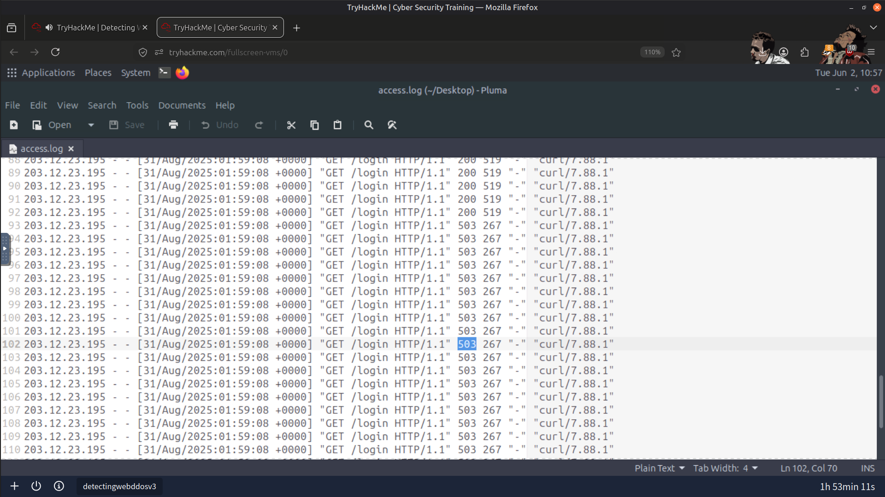
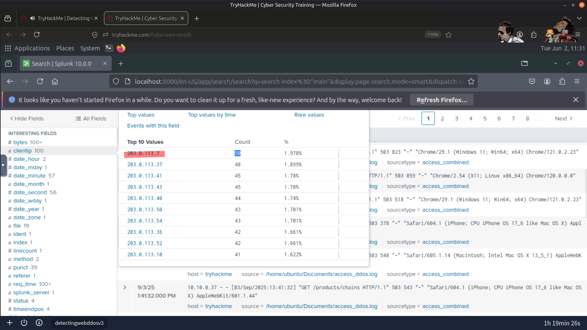
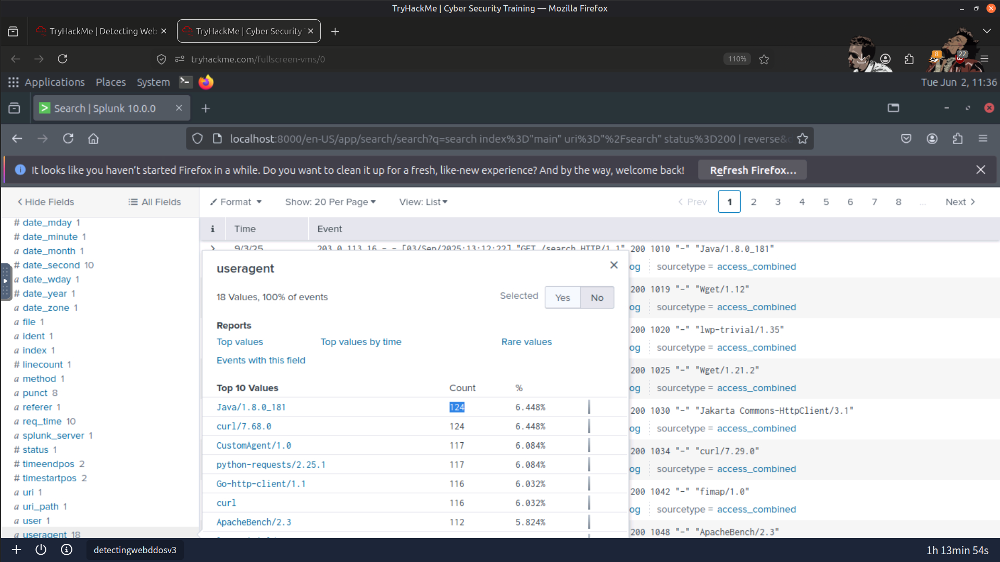
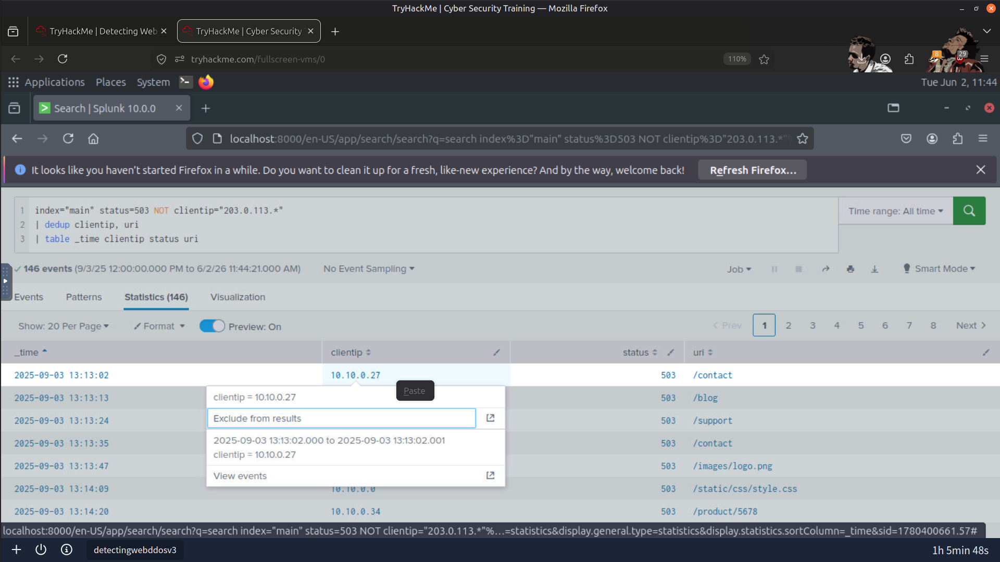
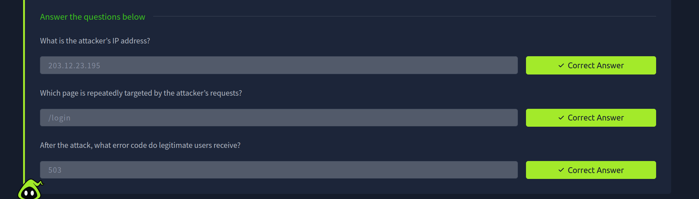
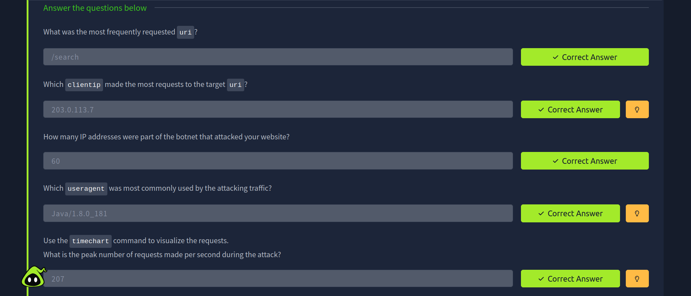

# 🛡️ Detecting Web DDoS Attacks using Splunk

## 👨‍💻 About This Project

I worked on this project to understand and detect **Web DDoS (Distributed Denial of Service) attacks** using **Splunk** by analyzing real-time and historical logs.

My main focus was to learn how attackers exploit web systems and how defenders can identify and mitigate such attacks using security tools and best practices.

---

## 🧰 Tools & Technologies Used

- 🔍 **Splunk** – For log analysis and detection
- 🌐 Web Server Logs – For monitoring incoming traffic patterns
- 📊 Dashboard Analysis – For visualizing traffic spikes and anomalies
- 🖥️ Linux Environment – For running and testing logs

---

## 🎯 Objectives

- Detect abnormal traffic patterns.
- Identify indicators of a Web DDoS attack.
- Analyze web server logs using Splunk.
- Understand how attackers overwhelm web applications.
- Explore defensive strategies used to mitigate DDoS attacks.

---

## ⚔️ What I Learned (Attack vs Defense)

Attackers constantly search for weak points to exploit, while defenders rely on multiple layers of protection to maintain service availability.

### 🧱 Application-Level Defense

#### 🔐 Secure Development Practices

- Learned how secure coding practices reduce attack surfaces.
- Understood the importance of input validation in preventing abuse of application functionality.

---

#### 🤖 CAPTCHA & JavaScript Challenges

- CAPTCHA helps distinguish legitimate users from automated bots.
- JavaScript challenges identify suspicious automated traffic.
- Both techniques help reduce automated attack traffic.

---

### 🌐 Network & Infrastructure Defense

#### 🚀 Content Delivery Networks (CDNs)

- Distribute traffic across multiple edge servers.
- Reduce load on origin servers.
- Absorb high traffic volumes during DDoS attacks.
- Improve availability through caching and load balancing.

---

#### 🧯 Web Application Firewalls (WAFs)

- Inspect incoming HTTP requests.
- Block malicious requests before they reach the application.
- Apply rate limiting to reduce abuse such as login flooding.

---

### 🌍 Large-Scale Mitigation

Cloud providers such as Cloudflare and Google mitigate large-scale DDoS attacks by distributing and filtering malicious traffic before it reaches the protected infrastructure.

---

### 🧨 Common DDoS Evasion Techniques

During the lab, I also learned how attackers attempt to bypass defensive controls by:

- Using randomized query parameters
- Rotating User-Agent strings
- Spoofing HTTP referrers
- Distributing traffic across multiple geographic locations

---

## 📸 Screenshots

### Attacker IP Address

---

### Targeted Web Resource

---

### HTTP Error Code Returned to Clients

---

### Client IP Generating the Highest Request Volume

---

### Most Common User-Agent Used During the Attack

---

### Legitimate Client Receiving HTTP 503 Responses

---

### Result

---

## 📊 Splunk Investigation

Using Splunk, I:

- 📥 Ingested and analyzed web server logs.
- 📈 Identified traffic spikes associated with abnormal activity.
- 🔍 Filtered requests originating from suspicious clients.
- 🚨 Detected patterns consistent with Web DDoS attacks.
- 📊 Correlated log data to better understand attacker behavior.

---

## 🧠 Key Learnings

- DDoS attacks aim to exhaust application or infrastructure resources rather than exploit software vulnerabilities.
- Effective mitigation requires multiple defensive layers across applications, networks, and infrastructure.
- Splunk enables rapid identification of abnormal traffic patterns through log analysis and correlation.
- CDNs and WAFs play a critical role in modern DDoS mitigation strategies.

---

## ✅ Conclusion

This project strengthened my understanding of Web DDoS detection by combining log analysis with defensive concepts. Using Splunk, I investigated abnormal traffic patterns, identified attacker behavior, and explored how layered defenses such as CDNs and WAFs help organizations maintain service availability during denial-of-service attacks.

---

> QXV0aG9yOiBodHRwczovL2dpdGh1Yi5jb20vSEctNzU=