# 🛡️ Windows Sysmon & Security Analysis

## 🎯 Objectives

* 🔍 Understand how to locate and interpret key Windows Event Logs.
* 🚨 Analyze Security logs for authentication-based attacks such as brute force and RDP abuse.
* 👤 Investigate user account manipulation using Windows event IDs.
* ⚙️ Leverage Sysmon logs for process, network, and persistence analysis.
* 💻 Examine PowerShell history to uncover attacker activity not visible in standard logs.

---

## 🛠️ Tools & Resources

* 📋 **Event Viewer**: Analysis of Security and Sysmon EVTX logs.
* 🔎 **Sysmon**: Process creation, network, file, and registry monitoring.
* 🔐 **Windows Security Logs**: Authentication and user management investigation.
* 💻 **PowerShell**: Command tracking for post-compromise activity.
* 🔗 **Manual Log Correlation**: Logon ID and Process ID cross-referencing with other malicious activity.

---

## 📌 Steps Performed

* 📂 Reviewed EVTX logs in Event Viewer.
* 🔍 Filtered Security logs for:

  * ❌ Failed Logon events to detect brute-force attempts.
  * ✅ Successful Logon events to identify malicious RDP access (Logon Type 10).
* 🌐 Identified the attacker IP responsible for brute-force activity.
* 👤 Determined the compromised user account.
* 🔗 Correlated the Logon ID from Event ID 4624 for session tracking.
* 👥 Reviewed user management events:

  * ➕ User creation
  * 🔑 Added to privileged group
* 🚪 Identified backdoor account creation and privilege escalation activity.
* ✔️ Verified Logon ID consistency across login and account modification events.
* 📋 Analyzed **Sysmon.evtx** to investigate:

  * ⚙️ Process Creation for browser usage and malware execution.
  * 🌍 Network connections and DNS resolution.
  * 📁 File creation and registry persistence mechanisms.
* 🎯 Identified:

  * 🌐 Web browser used by the compromised user.
  * 🦠 Malicious file downloaded.
  * 🔗 Download URL.
  * 📂 Persistence file dropped on the host.
  * 📡 Command-and-Control (C2) server IP and port.
  * 🌍 Associated malicious domain.
* 💻 Reviewed PowerShell history:

  * 📝 Identified the first executed command.
  * 📅 Retrieved the execution date.
  * 🚩 Located the hidden flag in the user's PowerShell history.

---

## 📚 Key Learnings

This activity demonstrated how critical Windows logging is for SOC operations and incident response. Authentication logs (**Event IDs 4624/4625**) are essential for detecting brute-force and RDP-based compromises, while user management events reveal persistence and privilege escalation attempts.

**Sysmon** significantly enhances visibility into process execution, malware behavior, persistence mechanisms, and Command-and-Control (C2) communication.

Finally, **PowerShell history** provides valuable insight into attacker activity that may not be visible through traditional process logs, helping analysts reconstruct post-compromise actions.

---

## 📸 Screenshots

### Source IP of Brute-Force Attack

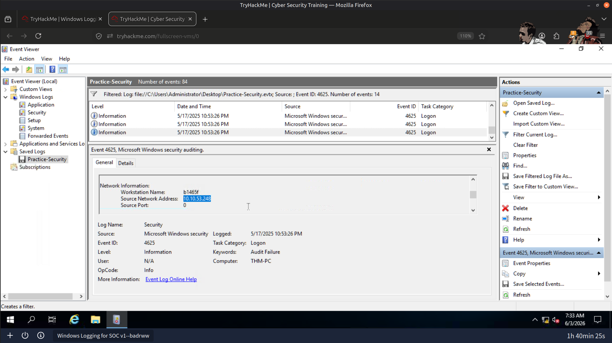

---

### Compromised User Account

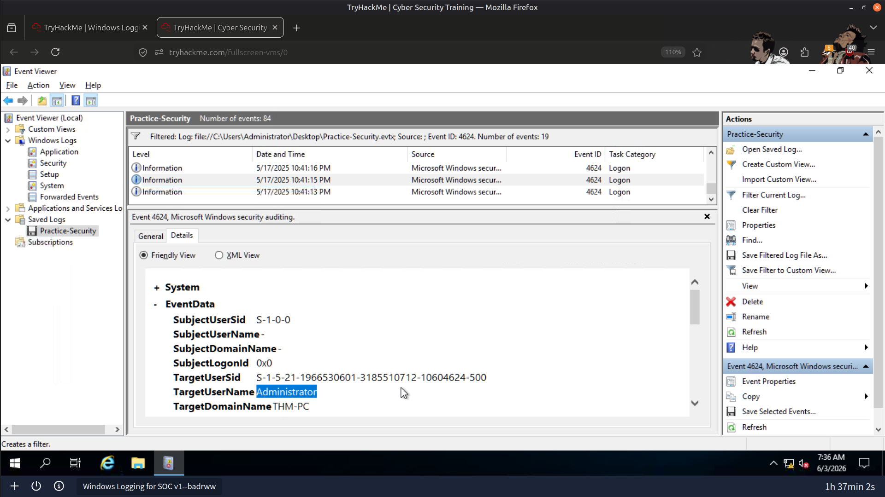

---

### Successful RDP Logon

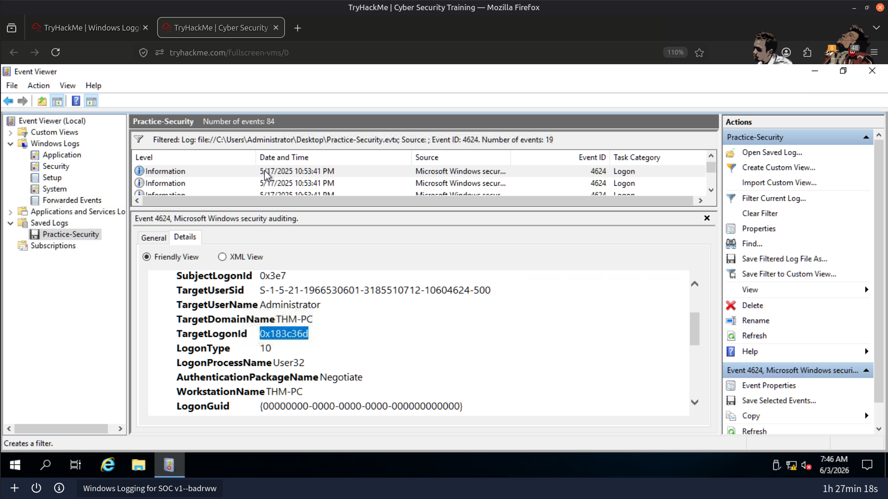

---

### Downloaded Malicious File

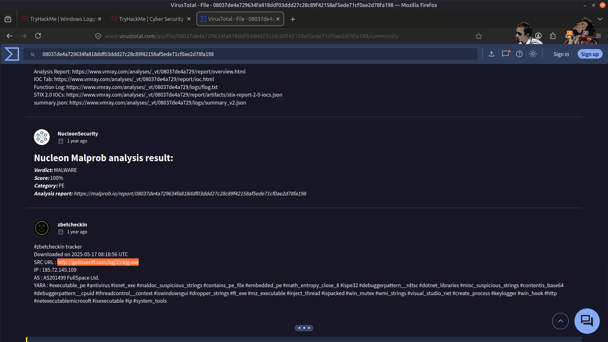

---

### Persistence Payload Download

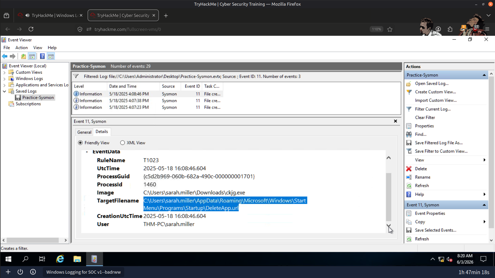

---

### Command-and-Control (C2) Connection

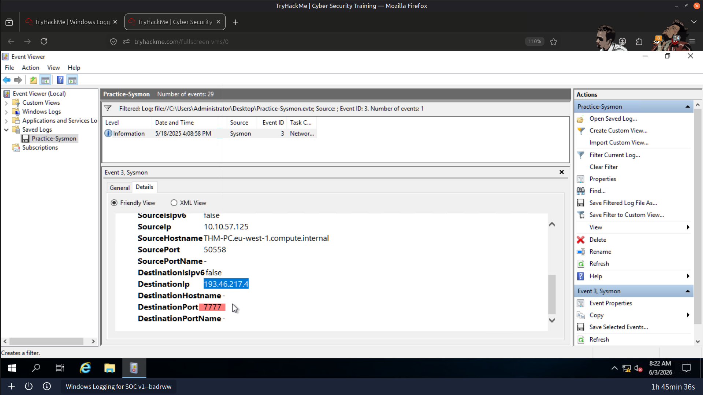

---

### First PowerShell Command Executed After Compromise

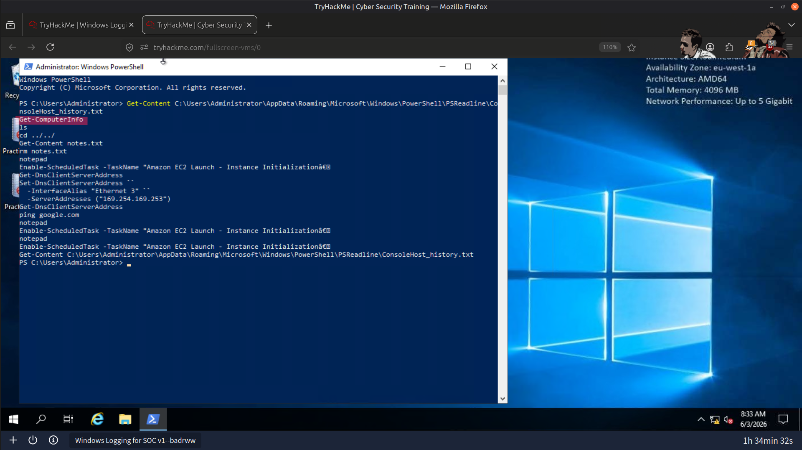

---

### Result

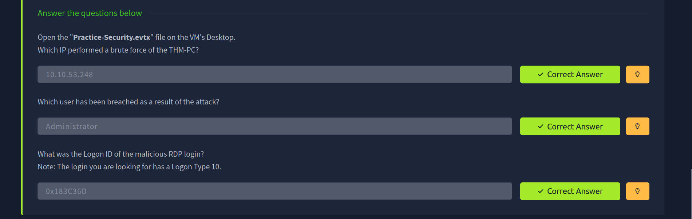

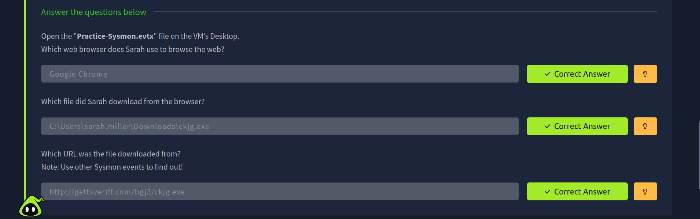

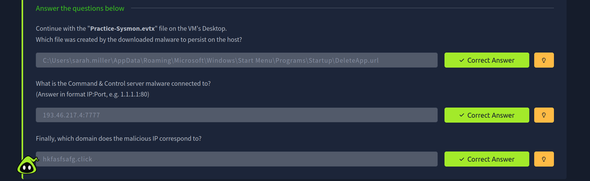

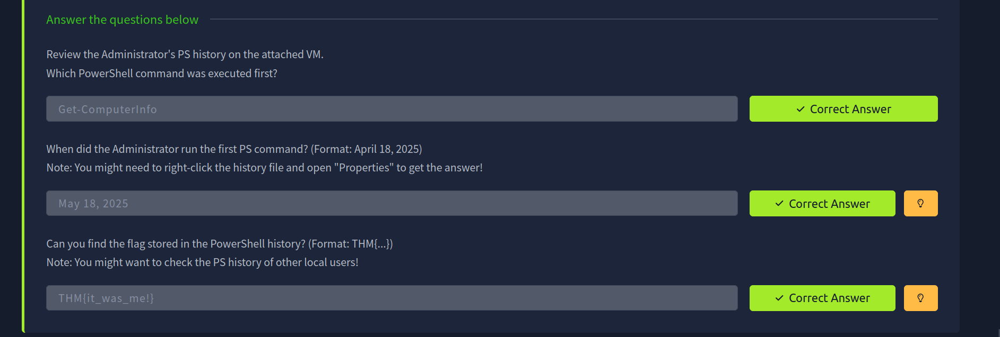

---

> QXV0aG9yOiBodHRwczovL2dpdGh1Yi5jb20vSEctNzU=