# 🛡️ Windows C2 Detection & Persistence Analysis

## 🎯 Objectives

This lab focused on investigating Command and Control (C2) activity and identifying persistence mechanisms used by attackers within a Windows environment. The main objectives were:

* 🔍 Investigate C2 infrastructure and identify attacker-controlled servers using Sysmon logs.
* 👤 Detect persistence through backdoored user accounts using Windows Security logs.
* ⚙️ Uncover malware persistence via Windows Services and Scheduled Tasks.
* 📂 Identify Startup Folder persistence techniques.
* 📝 Detect Run Key registry persistence through Sysmon Registry Events.
* 🌳 Build process trees to understand malware execution chains.
* 🗺️ Map attacker activities to the MITRE ATT&CK framework, focusing on:

  * Command & Control (C2)
  * Persistence
  * Impact

---

## 🛠️ Tools & Resources

### 📊 Event Viewer

Primary tool used to analyze:

* Security.evtx
* Sysmon.evtx

### 🔬 Sysmon

Provided telemetry for:

* Process Creation Events
* Network Connections
* File Creation Events
* Registry Modification Events

### 🔐 Windows Security Logs

Used to investigate:

* Failed Login Attempts
* User Account Creation
* Privilege Escalation
* Group Membership Changes

---

## 🚀 Steps Performed

### 1️⃣ C2 Infrastructure Investigation

* Analyzed **Sysmon.evtx** to identify a suspicious archive downloaded by the victim.
* Traced the malware drop location using file creation and process execution events.
* Identified the attacker-controlled C2 domain through Sysmon network connection logs.

### 2️⃣ User Account Persistence

* Filtered **Security.evtx** to identify failed Administrator login attempts preceding the compromise.
* Located the backdoor user account created by the attacker.
* Verified privileged group membership assigned to the malicious account.

### 3️⃣ Service-Based Persistence

* Investigated Sysmon and Security logs to detect a malicious Windows Service created for persistence.

### 4️⃣ Scheduled Task Persistence

* Identified a malicious Scheduled Task configured to execute a secondary malware payload.

### 5️⃣ Startup Folder Persistence

* Monitored Sysmon file creation events to detect malware dropped into the Windows Startup folder.

### 6️⃣ Run Key Persistence

* Detected registry modifications targeting:

```text
HKCU\Software\Microsoft\Windows\CurrentVersion\Run
```

* Confirmed persistence through Sysmon Registry Events.

### 7️⃣ Process Tree Analysis

* Built process trees using ParentProcessId correlations.
* Verified malware execution through:

  * explorer.exe
  * Startup Folder execution
  * Run Key execution

---

## 🧠 Key Learnings

Persistence is the stage where attackers move from opportunistic access to long-term control. Attackers leverage multiple mechanisms to survive:

* 🔄 System Reboots
* 🔑 Password Changes
* 🚨 Initial Detection Attempts

Windows provides rich telemetry through Sysmon and Security Logs, allowing defenders to detect these techniques effectively.

### 📌 Important Takeaways

* Correlation is critical for successful investigations.
* Process trees provide valuable execution context.
* Registry monitoring helps uncover stealthy persistence.
* Service and Scheduled Task creation events should always be monitored.
* Combining multiple log sources significantly improves detection accuracy.

---

## 🗺️ MITRE ATT&CK Techniques Observed

| Tactic               | Examples                                                  |
| -------------------- | --------------------------------------------------------- |
| 🎯 Command & Control | Network connections to attacker-controlled infrastructure |
| 🔒 Persistence       | Backdoor user accounts                                    |
| ⚙️ Persistence       | Malicious Windows Services                                |
| 📅 Persistence       | Scheduled Tasks                                           |
| 📂 Persistence       | Startup Folder Malware                                    |
| 📝 Persistence       | Registry Run Keys                                         |
| 💥 Impact            | Long-term system compromise and attacker access           |

---

## 📸 Screenshots

### Malicious Zip file (Ground Zero)
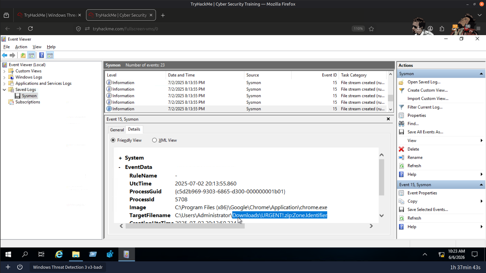
---
### Hiding the Malware
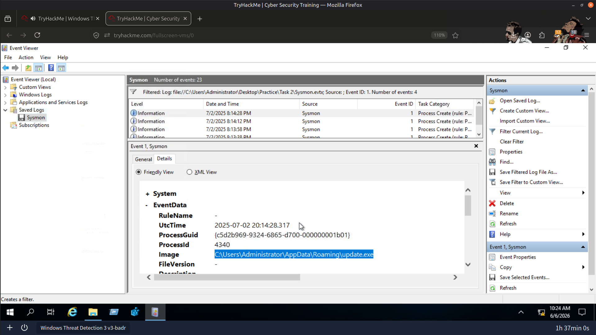
---
### Malicious Domain
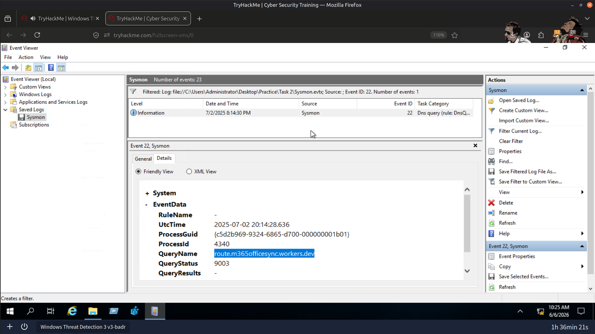
---
### Failed Login Attempts (6)
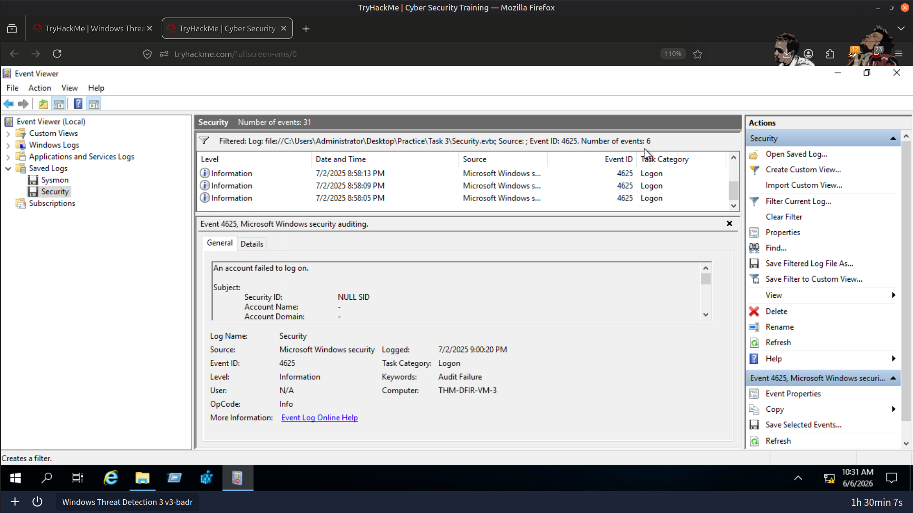
---
### Attacker's User Account
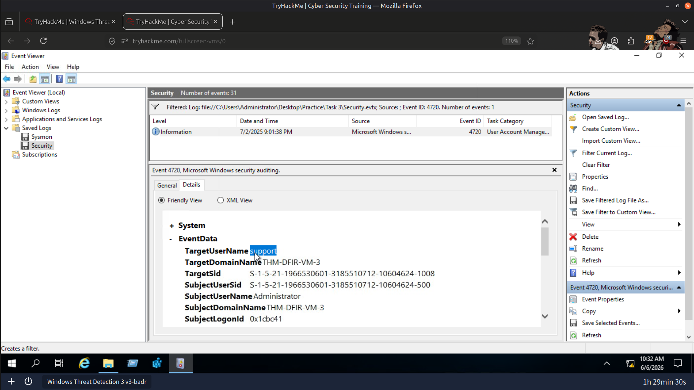
---
### Adding User To Privilaged Group
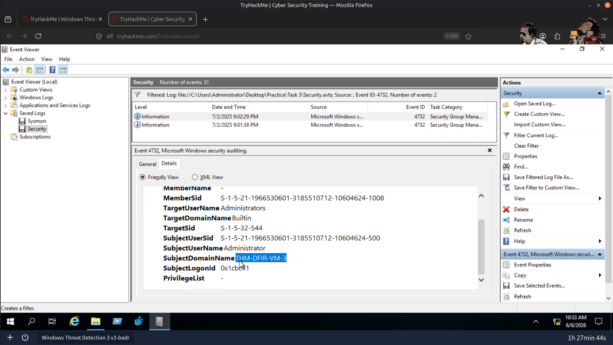
---
### Service to Persist Nessie Malware
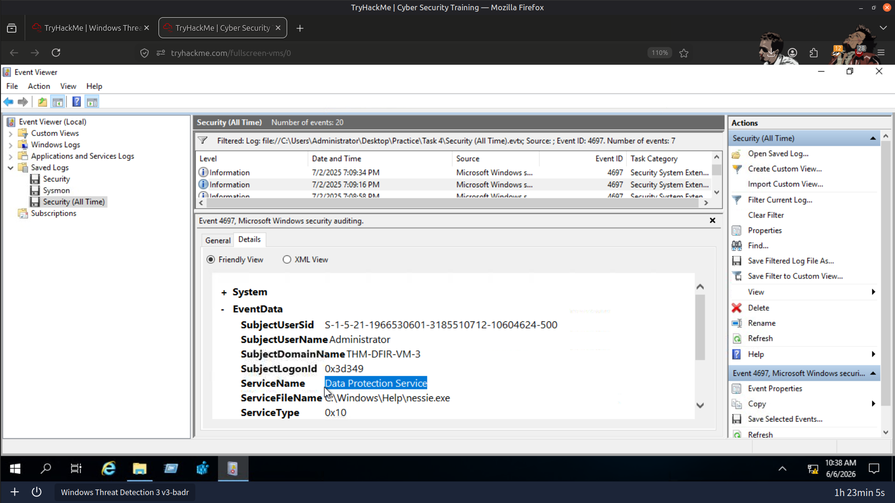
---
### Troy Malware Detection
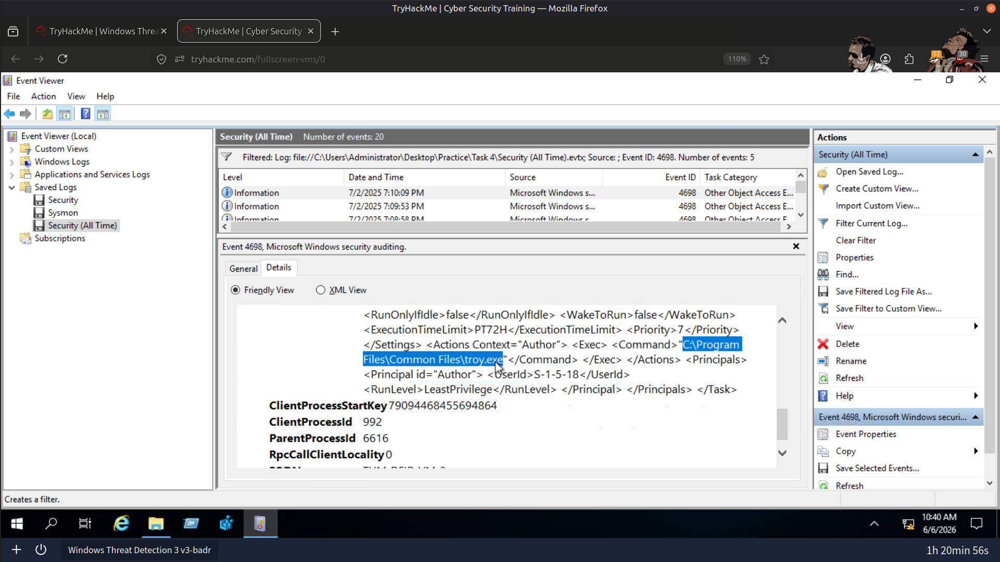
---
### Kitten.exe Detection
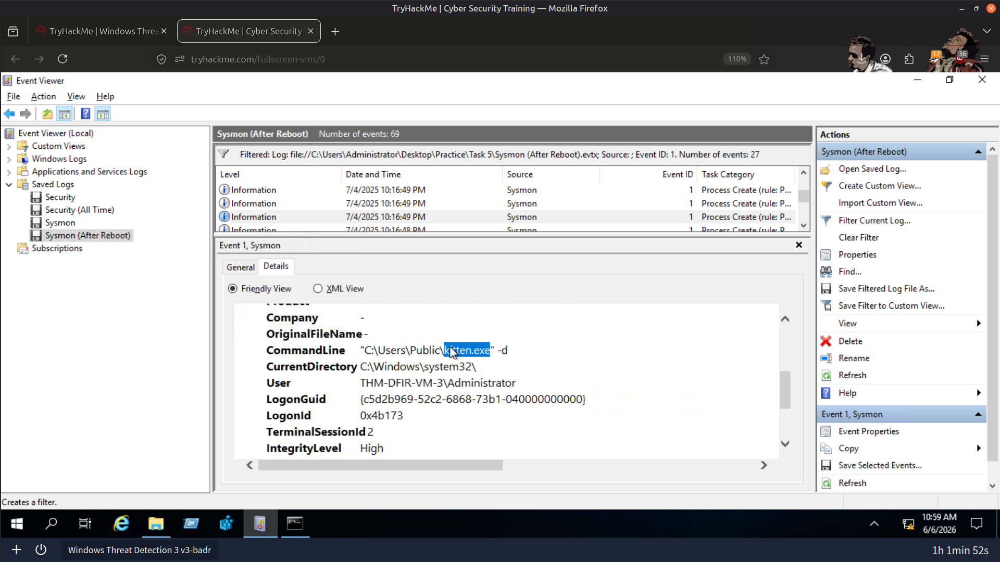

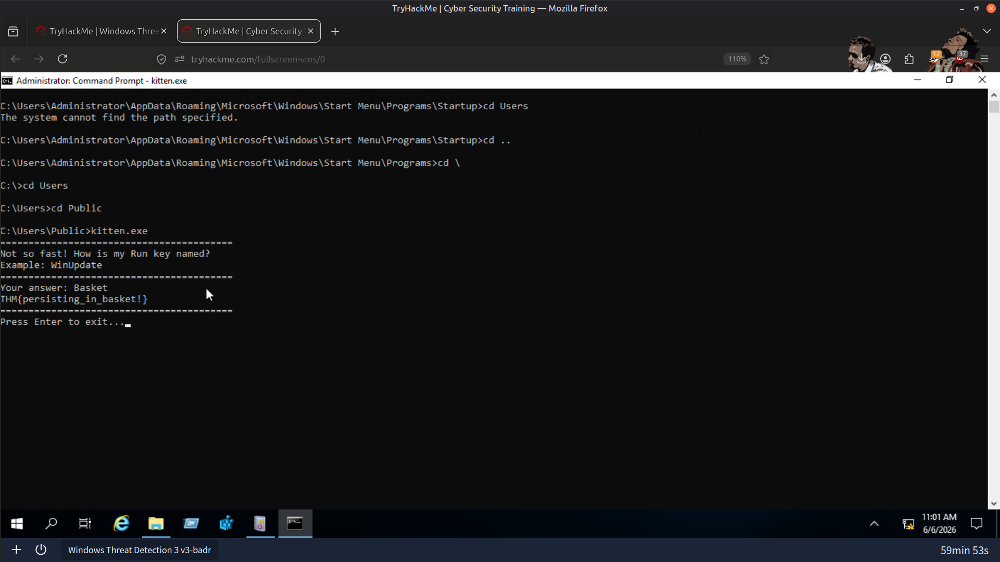
---
### Odin.exe Detection
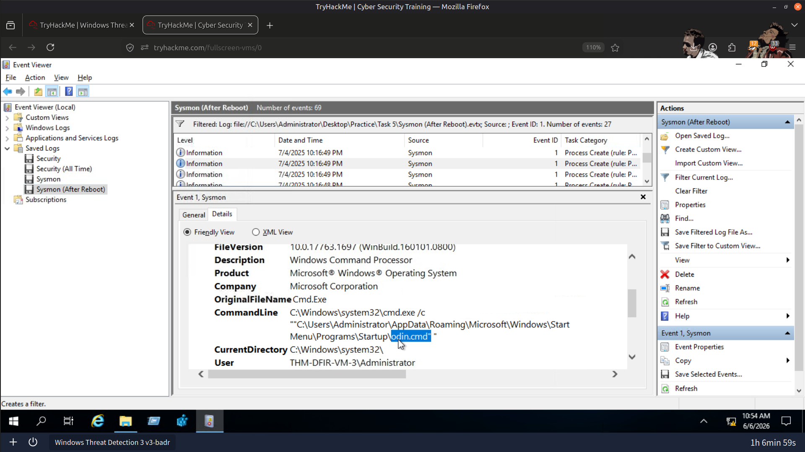

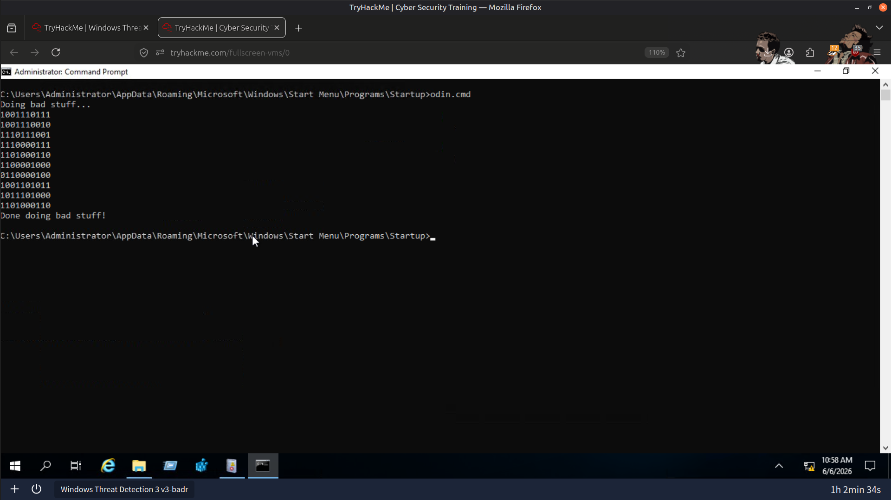
---

### Results
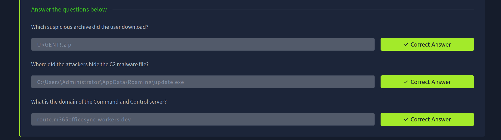

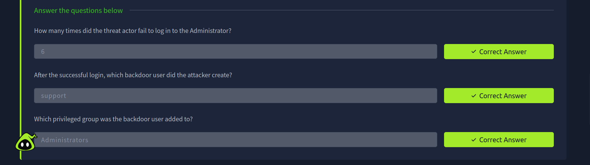

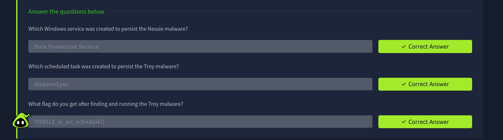

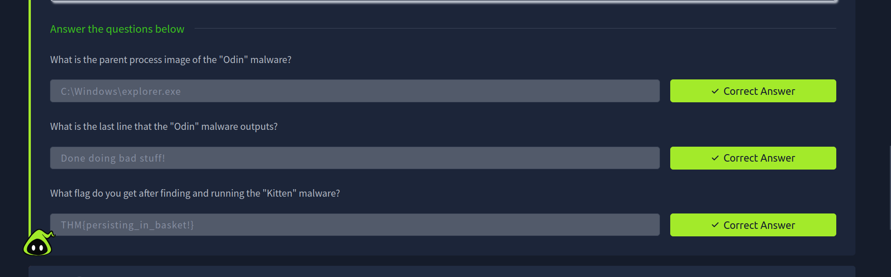


---

## ✅ Conclusion

This investigation demonstrated how attackers establish Command & Control channels and implement multiple persistence mechanisms to maintain access within a compromised Windows environment. By leveraging Sysmon and Windows Security logs, it is possible to uncover attacker activity, reconstruct execution chains, and map observed behavior to the MITRE ATT&CK framework.

---

> QXV0aG9yOiBodHRwczovL2dpdGh1Yi5jb20vSEctNzU=