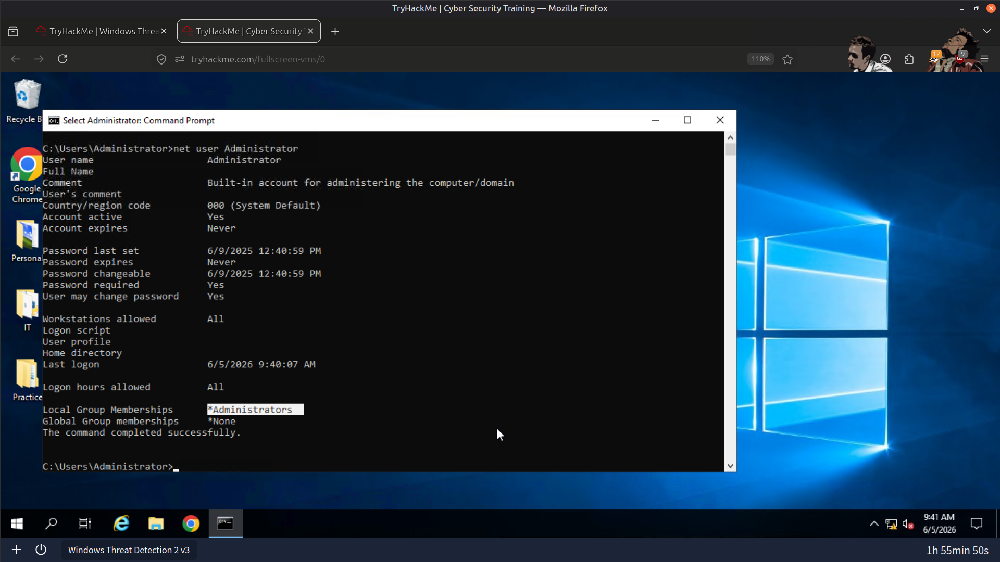
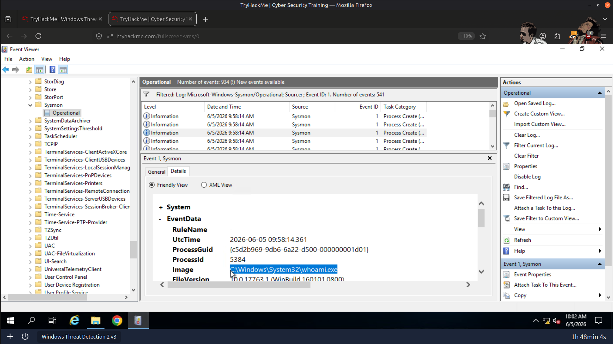
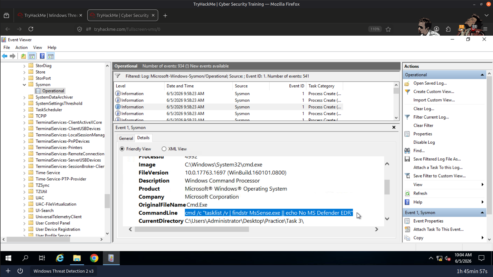
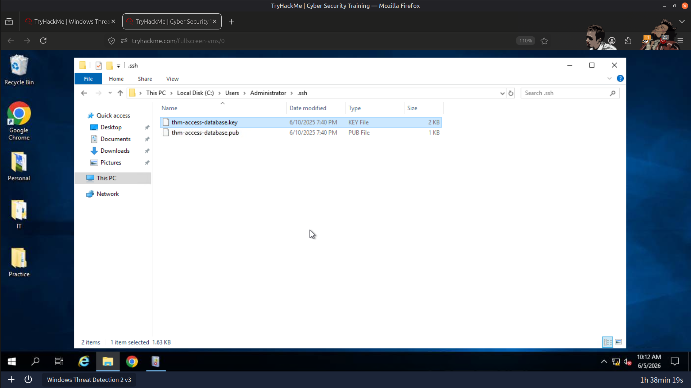
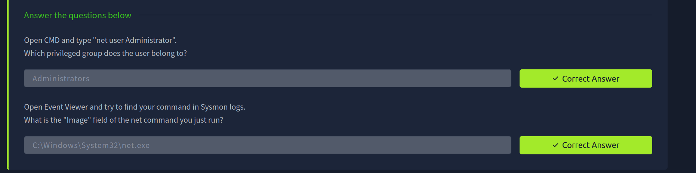
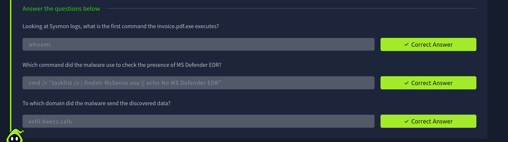
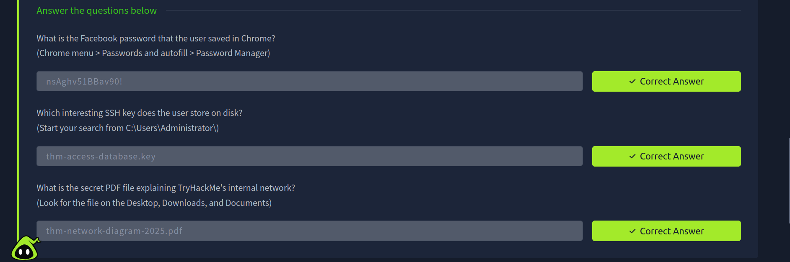

# 🕵️ Windows Post-Breach Behavioral Analysis

## 🎯 Objectives

* 🔍 Investigate post-access attacker behavior mapped to MITRE ATT&CK Discovery, Collection, and Exfiltration tactics.
* 💻 Detect Discovery commands executed through CMD and PowerShell following system compromise.
* 🌳 Build process trees using Sysmon logs by correlating ProcessId and ParentProcessId fields.
* 📂 Identify Collection targets such as saved credentials, SSH keys, and sensitive documents.
* 🌐 Analyze data stealer malware behavior and trace exfiltration to attacker-controlled infrastructure.

---

## 🛠️ Tools & Resources

### 📋 Event Viewer

Primary tool used to analyze Sysmon `.evtx` logs across Discovery, Collection, and Exfiltration scenarios.

### ⚙️ Sysmon

Provided detailed telemetry for:

* Process Creation Events
* Parent-Child Process Relationships
* Command Execution Monitoring
* Network Connections
* Malware Activity Tracking

### 🗺️ MITRE ATT&CK Framework

Used to map observed attacker behavior to:

* **T1082** – System Information Discovery
* **T1033** – System Owner/User Discovery
* **T1016** – System Network Configuration Discovery
* **T1005** – Data from Local System
* **T1041** – Exfiltration Over C2 Channel

---

## 🔎 Steps Performed

### 1️⃣ Discovery Command Investigation

* Detected Discovery commands executed through **CMD**.
* Identified `net user` execution within Sysmon Process Creation events.
* Confirmed the executable image responsible for launching the command.
* Investigated privileged group memberships associated with the Administrator account.

### 2️⃣ Malware-Based Discovery Analysis

* Executed the phishing sample **invoice.pdf.exe**.
* Monitored Sysmon logs to identify the first Discovery command spawned by the malware.
* Determined how the malware performed initial host reconnaissance immediately after execution.

### 3️⃣ Process Tree Reconstruction

* Rebuilt the complete execution chain using ProcessId and ParentProcessId correlations.

```text
explorer.exe
      ↓
invoice.pdf.exe
      ↓
cmd.exe
      ↓
powershell.exe
```

* Traced process relationships from the user-launched executable to child processes.
* Distinguished malicious activity from normal administrative behavior.

### 4️⃣ EDR Detection Checks

* Identified the PowerShell command executed by the malware.
* Determined how the malware checked for the presence of Microsoft Defender EDR and other security tooling.

### 5️⃣ Command & Control (C2) Communication

* Investigated outbound network connections generated by the malware.
* Identified the Command-and-Control (C2) domain receiving discovered host information.

### 6️⃣ GUI-Based Discovery Investigation

* Examined Discovery activities that did not rely on CMD or PowerShell.
* Identified GUI-based processes leveraged to gather system information.

### 7️⃣ Credential & Sensitive Data Collection

* Investigated browser-stored credentials accessible through interactive user sessions.
* Examined Chrome Password Manager entries available to an attacker.
* Located SSH keys stored under:

```text
C:\Users\Administrator\
```

* Identified sensitive PDF documents located across:

  * 📂 Desktop
  * 📂 Downloads
  * 📂 Documents

### 8️⃣ Data Stealer Malware Analysis

* Executed the sample **stealer.exe**.
* Used Sysmon telemetry to identify the malware staging directory.
* Investigated how collected files were prepared prior to exfiltration.

### 9️⃣ File Collection Behavior

* Identified targeted file extensions:

```text
.docx
.pdf
.xlsx
```

* Determined that the malware harvested clipboard contents using:

```powershell
Get-Clipboard
```

* Analyzed how collected information was aggregated before transmission.

### 🔟 Exfiltration Investigation

* Traced outbound connections generated by the stealer malware.
* Identified the attacker-controlled domain used for data exfiltration.
* Correlated file collection activity with network telemetry to reconstruct the complete attack chain.

---

## 📚 Key Learnings

Post-compromise attacker activity generally follows a predictable sequence:

```text
Discovery
    ↓
Collection
    ↓
Exfiltration
```

Each stage leaves unique forensic artifacts within Sysmon logs.

Key takeaways from this investigation:

* 🔍 Discovery commands reveal attacker objectives and reconnaissance efforts.
* 🌳 Process trees built from ProcessId and ParentProcessId relationships provide critical visibility into malware execution chains.
* 📂 Collection activity frequently targets credentials, documents, SSH keys, and clipboard data.
* 🌐 Network telemetry is essential for identifying Command-and-Control (C2) and Exfiltration channels.
* 🛡️ Data stealers are often harder to detect because they may avoid obvious CMD or PowerShell execution, making file activity and network telemetry key sources of evidence.

Understanding how attackers transition from Discovery to Collection and finally Exfiltration enables defenders to detect and disrupt malicious activity before sensitive data leaves the environment.

---

## 📸 Screenshots

### Privileged Group Membership



---

### First Discovery Command Executed by Malware



---

### Microsoft Defender EDR Detection Check



---

### SSH Keys Stored on Disk



---

### Result







---

> QXV0aG9yOiBodHRwczovL2dpdGh1Yi5jb20vSEctNzU=