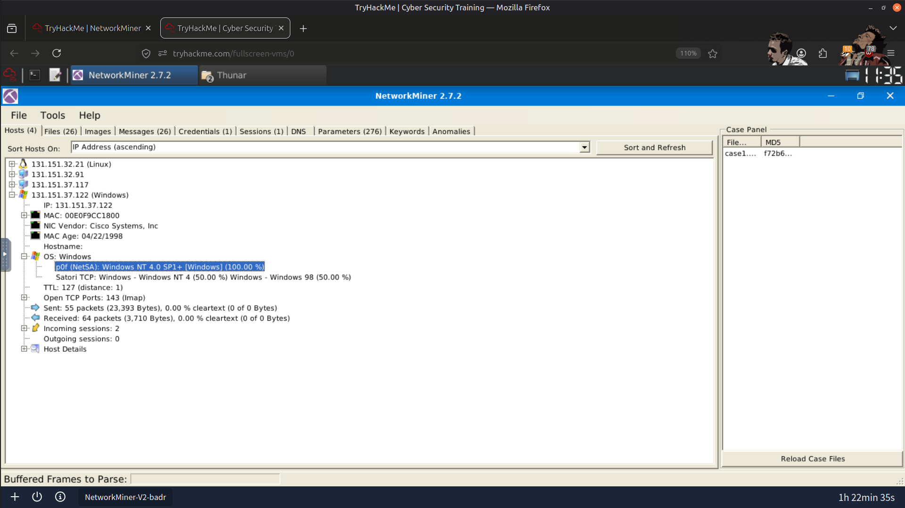
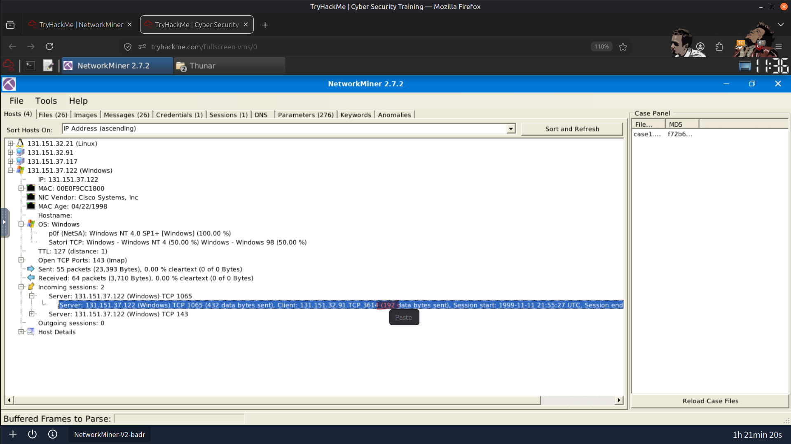
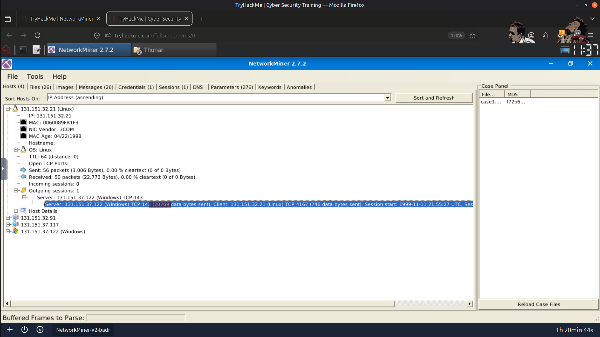
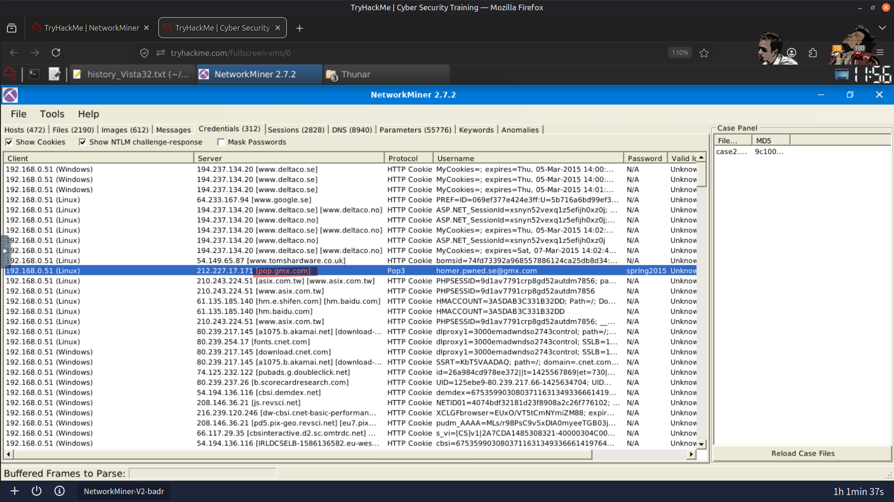
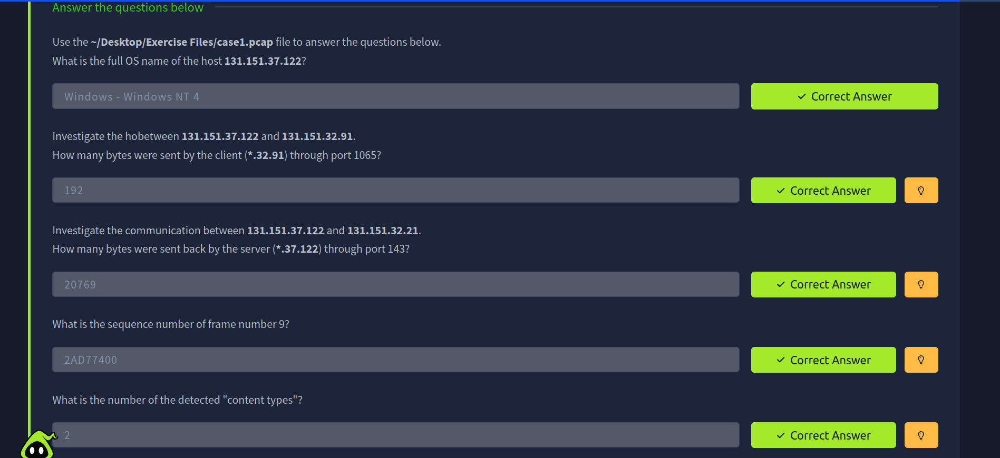
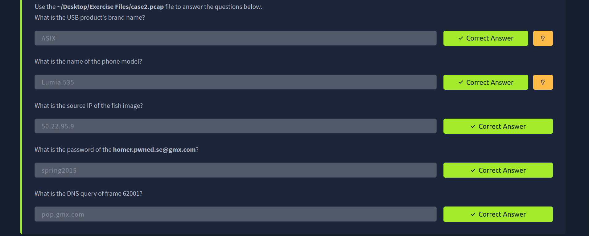

# 🔍 NetworkMiner Practice

Practiced using NetworkMiner for basic network traffic analysis and artifact extraction from captured packets.

## 📸 Screenshots

### Discovered Host Name

---

### Traffic Statistics (Client ↔ Server)

---

### DNS Query Analysis

---

### Result

---

> QXV0aG9yOiBodHRwczovL2dpdGh1Yi5jb20vSEctNzU=