# 🌐 Network Traffic Analysis with Wireshark

## 📌 Overview

In this room, I explored different network analysis techniques using Wireshark and related tools. The primary focus was understanding network traffic, identifying anomalies, analyzing protocols, and investigating suspicious activities commonly encountered during security investigations.

---

# 🔎 Investigation Areas

## 1️⃣ Nmap Scanning

- Performed network scans using Nmap
- Identified live hosts and open ports
- Gathered information about services running on devices

---

## 2️⃣ ARP Poisoning & Man-in-the-Middle

- Learned how ARP poisoning works
- Observed Man-in-the-Middle (MITM) attacks in action
- Analyzed manipulated traffic between devices

---

## 3️⃣ Host Identification

Investigated host-related protocols including:

- DHCP
- NetBIOS
- Kerberos

Learned how devices communicate and identify themselves on a network.

---

## 4️⃣ Tunneling Traffic

Explored covert communication techniques including:

- ICMP Tunneling
- DNS Tunneling

Analyzed how tunneling can bypass traditional network monitoring.

---

## 5️⃣ Cleartext Protocol Analysis — FTP

- Inspected FTP traffic
- Observed usernames and passwords transmitted in plaintext

---

## 6️⃣ Cleartext Protocol Analysis — HTTP

- Analyzed HTTP requests and responses
- Observed unencrypted web traffic and transferred data

---

## 7️⃣ Encrypted Protocol Analysis — HTTPS

- Investigated HTTPS traffic
- Learned how encryption protects communications
- Compared encrypted traffic with cleartext protocols

---

## 8️⃣ Bonus Hunt — Cleartext Credentials

- Learned how Wireshark detects cleartext credentials
- Explored **Tools → Credentials**
- Investigated protocols exposing usernames and passwords
- Understood why analysts should not rely solely on automated detections

### 📚 Supported Protocols

- FTP
- HTTP
- IMAP
- POP
- SMTP

---

## 9️⃣ Bonus Hunt — Actionable Results

- Learned how Wireshark generates security rules
- Explored **Tools → Rules**
- Generated rules for blocking suspicious traffic

### 🧩 Supported Rule Formats

- Netfilter (iptables)
- Cisco IOS
- IPFilter
- IPFirewall
- Packet Filter (pf)
- Windows netsh

---

# 📸 Screenshots

### TCP Connect Scan Detection

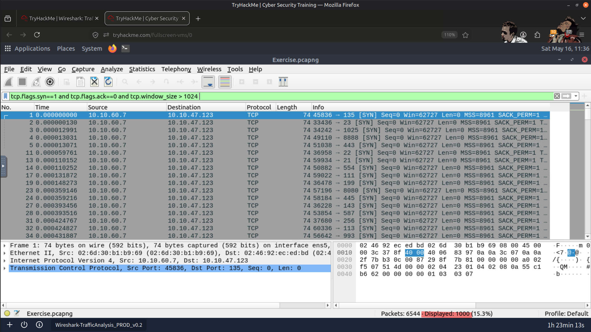

---

### ARP Poisoning Activity

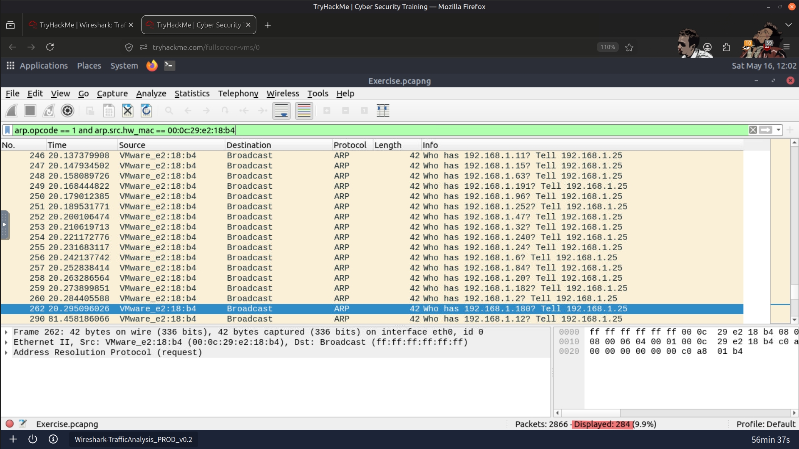

---

### Captured HTTP Traffic

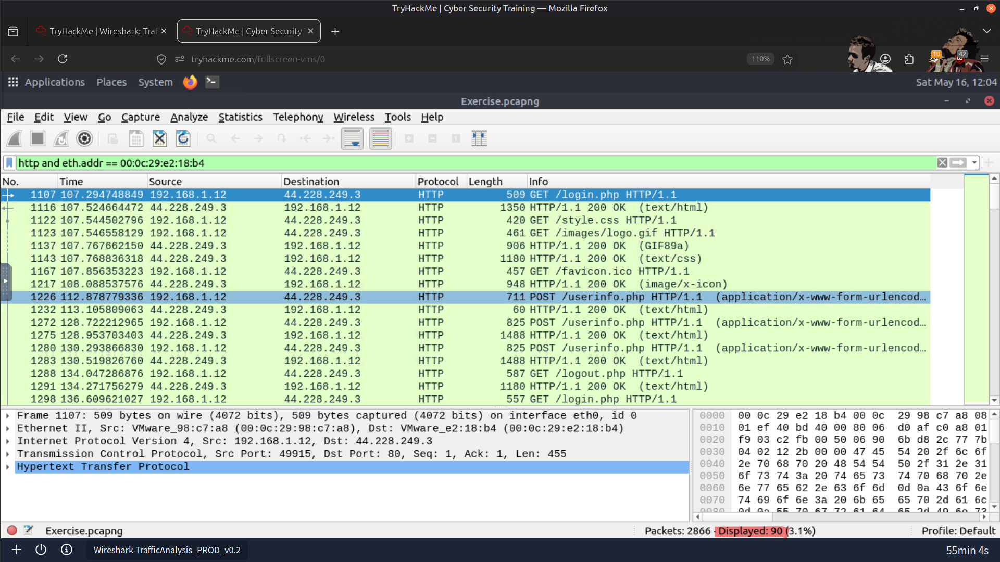

---

### Captured Cleartext Credentials

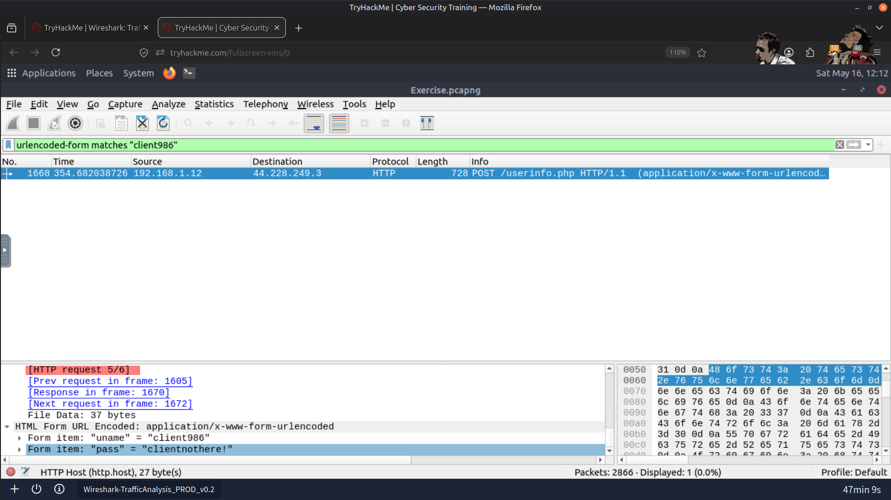

---

### Failed FTP Login Attempts

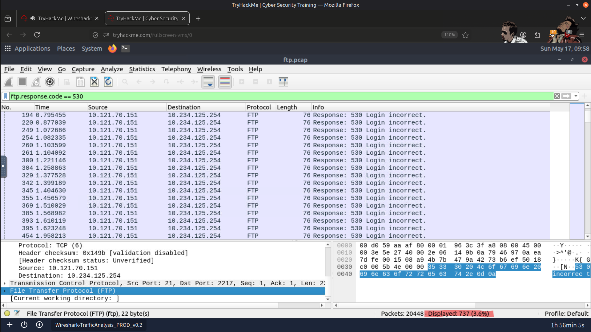

---

### File Uploaded via FTP

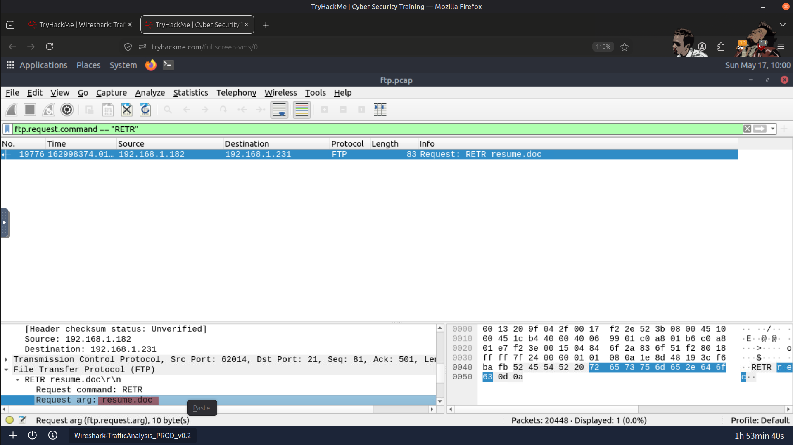

---

### Permission Modification Command

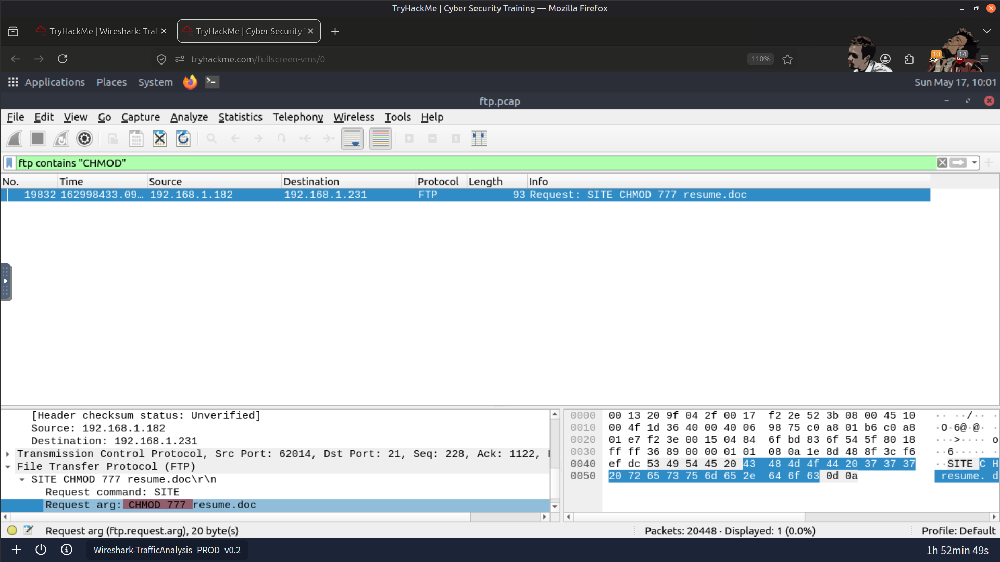

---

### Result

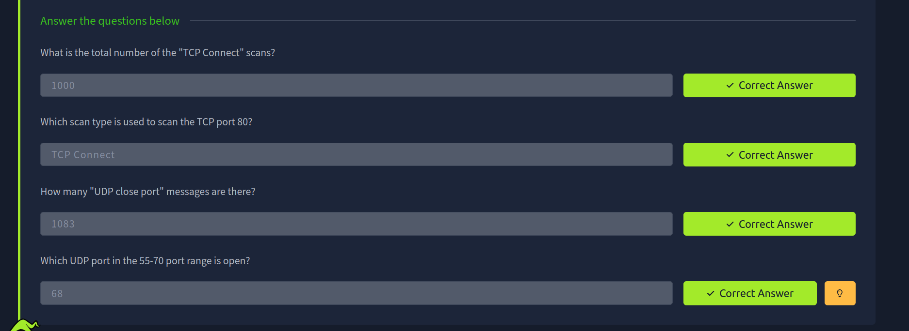

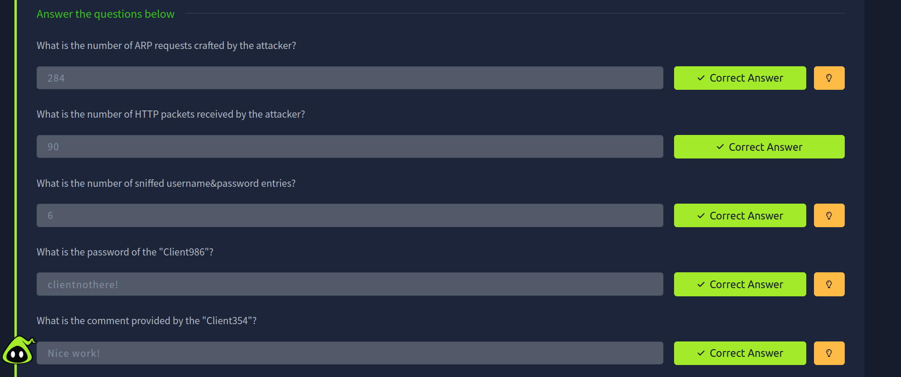

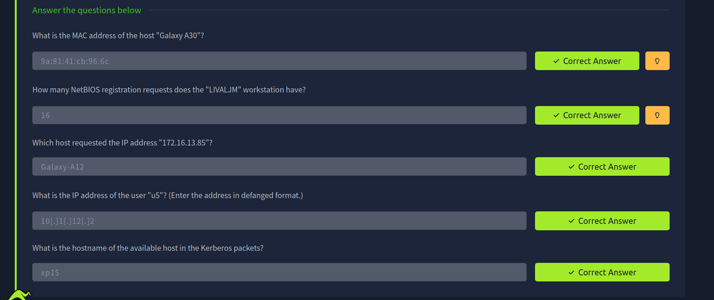

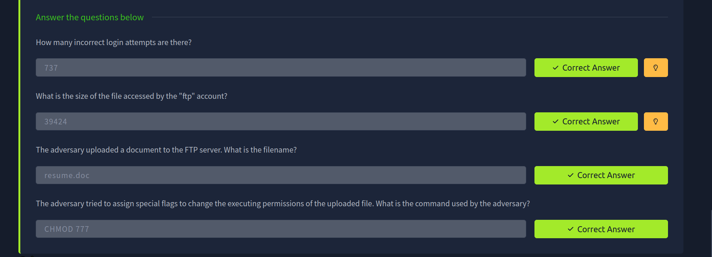

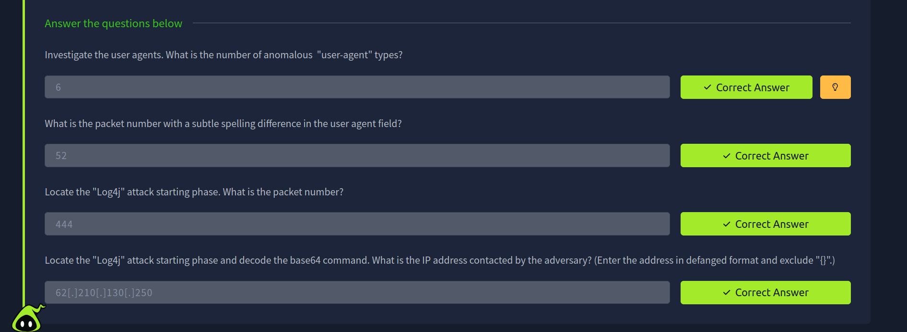

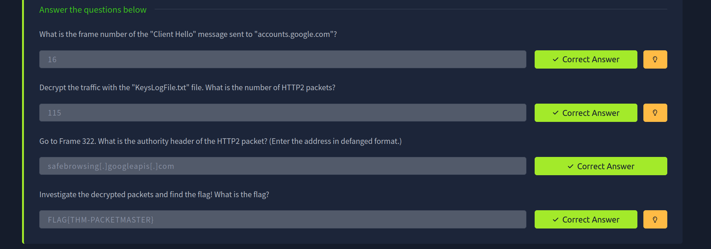

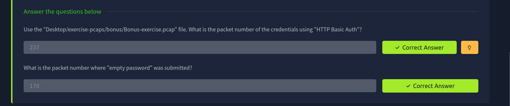

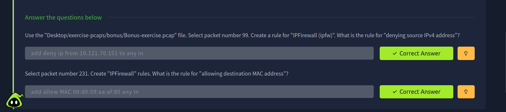

---

# 🎯 Skills Practiced

- ✅ Packet Analysis
- ✅ Traffic Filtering
- ✅ Protocol Investigation
- ✅ Threat Detection
- ✅ Credential Hunting
- ✅ Network Enumeration
- ✅ Rule Generation
- ✅ Traffic Inspection
- ✅ Network Forensics

---

# 🚀 Tools Used

- Wireshark
- Nmap
- Built-in Wireshark Analysis Tools

---

# 🧠 What I Learned

This room strengthened my understanding of network traffic analysis, protocol behavior, and attack detection while improving my ability to investigate suspicious network activity using Wireshark.

---

> QXV0aG9yOiBodHRwczovL2dpdGh1Yi5jb20vSEctNzU=