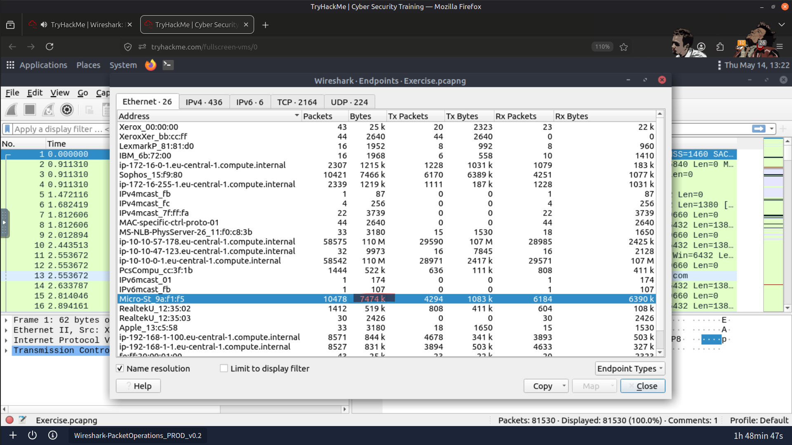
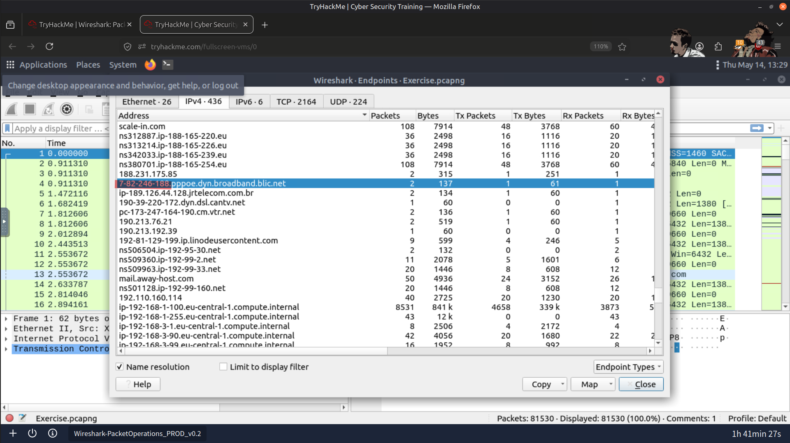
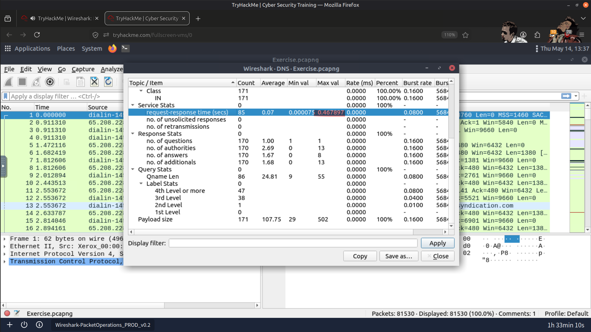
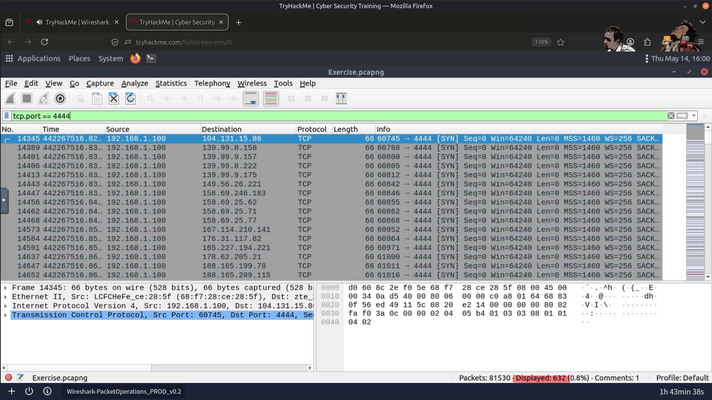
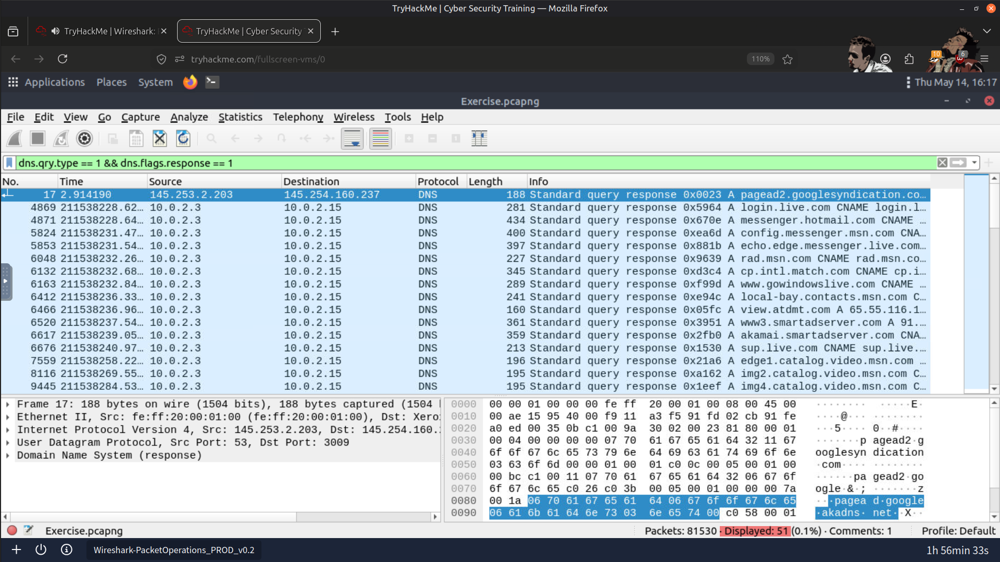
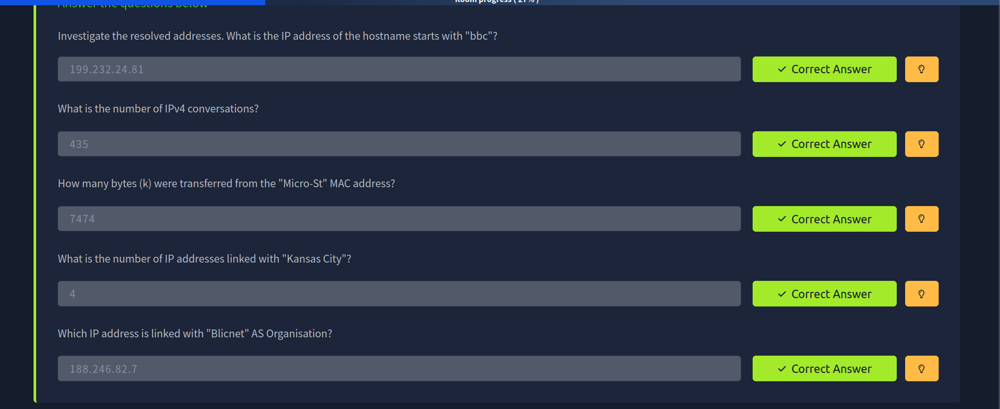
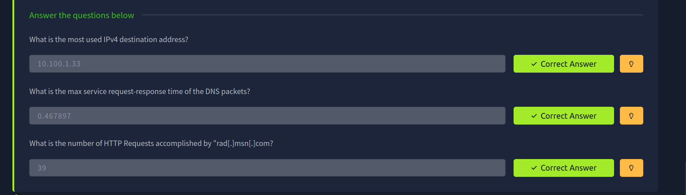
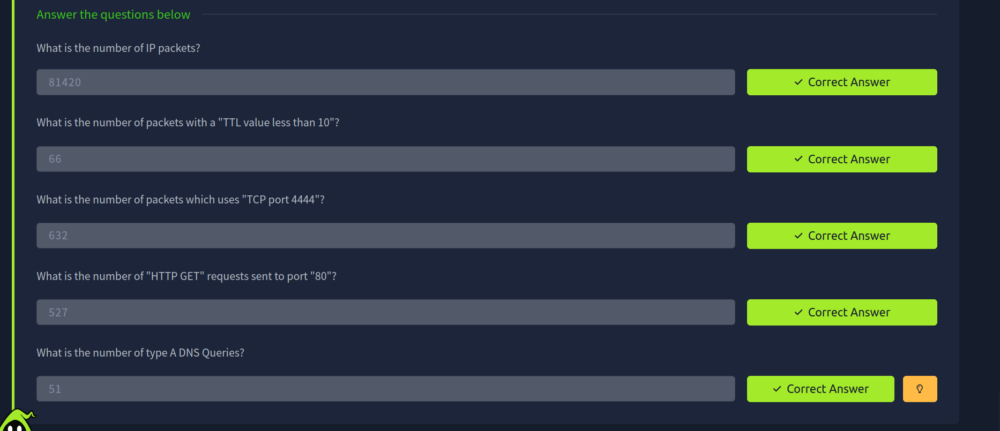
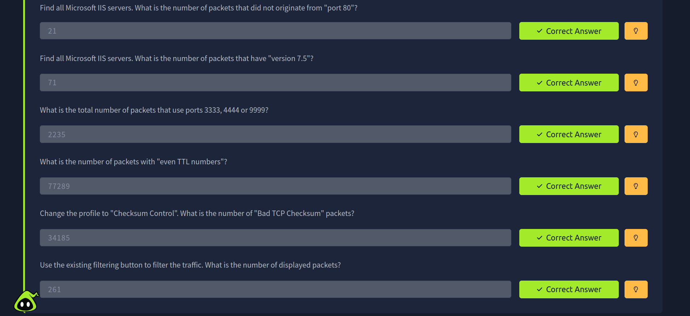

# 🧪 Wireshark Packet Filtering

Completed a Wireshark room focused on packet filtering and network traffic analysis. This exercise helped me understand how to use display filters to quickly locate specific packets and efficiently investigate captured network traffic.

---

## 🔍 What I Practiced

- Packet filtering
- Traffic inspection
- Using display filters
- Finding specific packets
- Basic network analysis

---

## 🛠️ Tool Used

- Wireshark

---

## 📸 Screenshots

### Bytes Sent to Micro-Star MAC Address

---

### Blicnet IP Address

---

### Maximum DNS Request-Response Time

---

### Packets Using TCP Port 4444

---

### Type A DNS Queries

---

### Result

---

## 🎯 Outcome

This room strengthened my understanding of packet filtering and network traffic analysis while improving my practical Wireshark investigation skills.

---

> QXV0aG9yOiBodHRwczovL2dpdGh1Yi5jb20vSEctNzU=