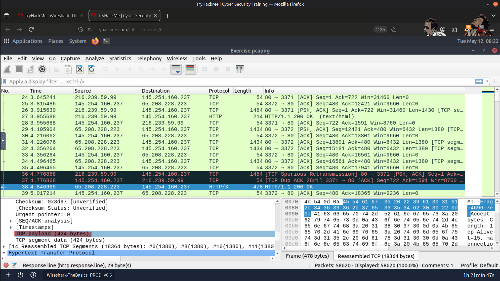
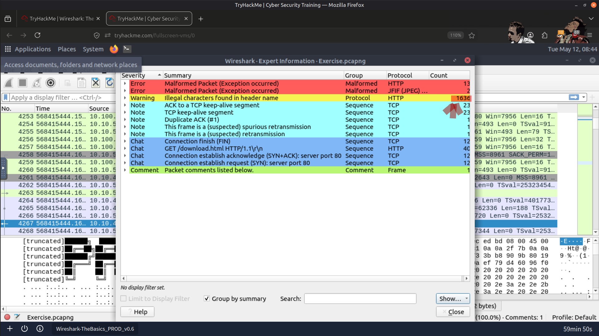
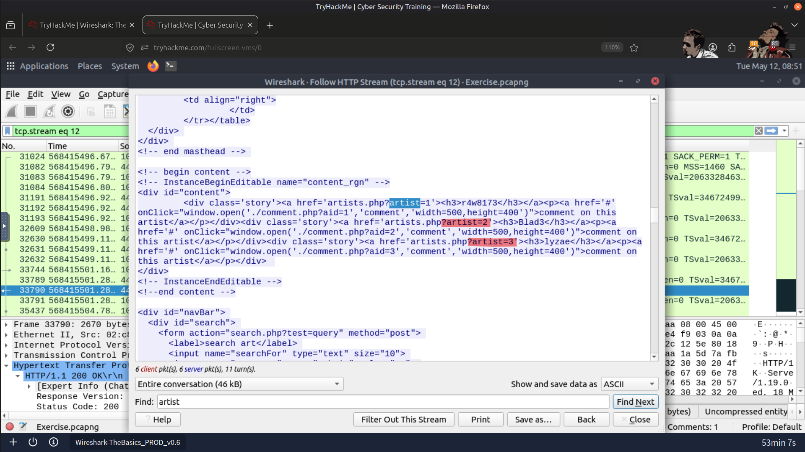
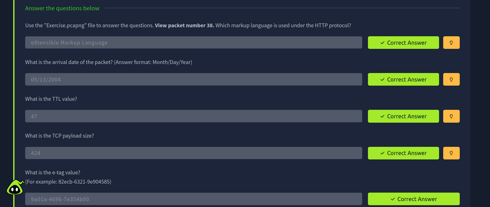
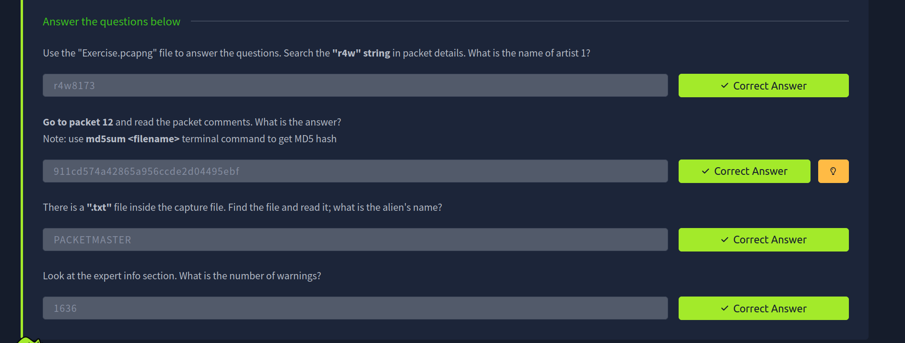
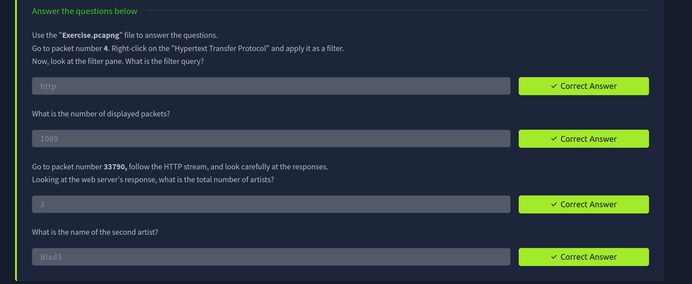

# 📡 Wireshark Packet Analysis & Filtering

## 📖 Overview

This project showcases my hands-on experience with **Wireshark** for analyzing network traffic and understanding packet-level communication.

The focus was on packet dissection, navigation, and filtering techniques used during network traffic analysis.

📸 Screenshots of the completed tasks and analysis process are included throughout this repository.

---

## 🛠️ Tools Used

- Wireshark

---

## 🔍 Tasks Performed

### 📦 Packet Dissection

- Analyzed captured network packets
- Explored protocol layers and packet details
- Investigated source and destination communication
- Examined protocol behavior within network traffic

---

### 🧭 Navigation in Wireshark

- Navigated through captured packets efficiently
- Explored packet details and protocol hierarchy
- Followed communication streams
- Reviewed packet timing and traffic flow

---

### 🎯 Packet Filtering

- Applied display filters to isolate specific network traffic
- Investigated targeted packets using filtering techniques
- Improved traffic analysis by narrowing down packet results
- Practiced efficient packet investigation methods

---

## 📚 Learning Outcomes

- Improved understanding of network traffic analysis
- Gained practical experience with packet inspection
- Developed skills in traffic filtering and investigation
- Enhanced understanding of network protocols and communication flow
- Strengthened foundational cybersecurity and SOC analysis skills

---

## 📸 Screenshots

### TCP Payload Size

---

### Expert Analysis Warnings

---

### Artists Identified in HTTP Stream

---

### Result

---

## ✅ Conclusion

This hands-on practice with **Wireshark** strengthened my understanding of packet analysis, protocol inspection, and network traffic investigation while improving my practical cybersecurity and SOC analysis skills.

---

> QXV0aG9yOiBodHRwczovL2dpdGh1Yi5jb20vSEctNzU=